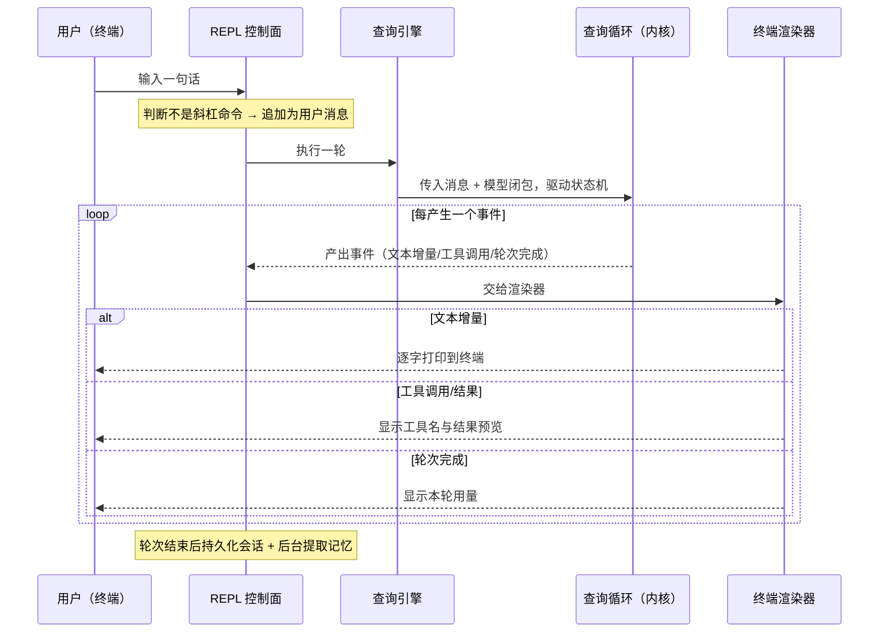

# 对外服务层与消息通道

## 读前思考

- 其他三个项目都在回答"怎么把 Agent 暴露给进程外的调用方"——有的做成 HTTP 门面，有的做成控制面服务器，有的干脆把 30 个平台收进同一个进程。claudecode 对这个问题的回答是：不回答。一个只跑在终端里的 Agent，凭什么认为自己不需要常驻服务层？
- 反过来问：如果明天要求把这个内核接入飞书或 Slack，需要动多少东西？"不需要服务层"和"永远接不进 IM"之间的距离有多远？

## 核心问题

本主题在 claudecode 中的定义是：**没有 Gateway，也没有消息通道——纯终端 REPL 内核，进程形态决定了常驻服务层要解决的问题（谁能接入、事件发给谁、并发怎么隔离）在这里全部不存在。** 这不是缺失，是一个可以论证的立场；而它的主循环以事件迭代器输出，给"将来换一个控制面"留了结构上的口。

| 维度 | claudecode 的选择 |
|------|------------------|
| 服务形态 | 无常驻服务：终端 REPL + 管道模式，进程退出即终止 |
| 连接级认证 | 无（单终端用户即全部信任域） |
| 事件扇出 | 无扇出：终端渲染器直接消费事件迭代器 |
| 消息通道 | 无 IM 集成；事件协议是通道无关的 |
| 与内核的接口 | 异步事件迭代器：谁来消费是控制面问题，不是内核问题 |
| 配置治理 | 分散加载、无集中配置、无热重载（仅运行时模型切换） |

## 方案展示

### 设计选择一：不需要服务层——进程形态决定的，不是欠账

**设计选择**。claudecode 的唯一调用方是坐在终端前的那一个人：输入来自标准输入，输出经终端渲染器写到标准输出。交互是同步的——输入一条、执行完、再输入下一条，不存在并发会话、不存在多客户端、不存在需要推送的旁观者。在这个形态下，服务层要回答的每个问题都没有需求对象：认证防的是陌生人，而信任域就是"能碰到这台机器的人"；事件扇出解决的是"发给哪个订阅者"，而订阅者恒为一个；并发隔离防的是多个会话互相写坏，而同时只有一个会话。加一个服务层只会凭空引入这些没有对象的复杂度。配置侧是同一立场的延伸：没有集中的配置管理器，各模块自行加载各自的来源（环境变量与本地环境文件合并、扩展与钩子配置、指令文件层级发现），因为配置项总共只有五六个，集中管理的收益不存在。指令文件的层级发现与注入属上下文组装，见 05-context；运行时的模型切换命令属模型接入，见 02-model。

**为什么这么选**。本地命令行工具的生命周期就是用户会话的生命周期——用户关掉终端，进程退出，不需要排空、缩零、关停取证这些常驻服务才有的生命周期工程。需求对象不存在的机制，做了就是维护负担。

**牺牲了什么**（即当前的边界，诚实标注）：没有多用户支持、没有认证、没有并发会话、没有跨请求的常驻状态。这些不是设计失误，是进程形态此刻不需要的东西——但这也意味着一旦形态改变（要接入 IM、要服务多人），下面要讲的事件协议留的口就是起点。

### 设计选择二：事件协议是天然可替换的控制面接口

**设计选择**。主循环（查询循环）以异步事件迭代器的形式输出执行过程——文本增量、工具调用起止、轮次完成，全部是结构化的查询事件。"谁来消费这些事件"从一开始就是控制面的问题而不是内核的问题：终端 REPL 只是当前挂载的那个消费者，它用终端渲染器把文本增量渲染成逐字打印；子代理是另一个消费者，只取需要的事件、丢弃文本增量。换成任何能消费异步迭代器的代码——一个监听 IM 消息的服务、一个 webhook 适配器——驱动的都是同一个内核，内核一行不改。引擎的三个入口（提交文本、执行一轮、提交消息列表）已经覆盖不同驱动方式。

**为什么这么选**。把"输出给谁"从内核剥离出来，成本只是输出端用迭代器而非直接打印；收益是将来接入任何新通道时，改动被压缩到控制面两端：入口把外部消息转成用户消息，出口把事件流翻译成目标平台的回复。

**牺牲了什么**。终端之外当前什么都没有——没有现成的会话路由、没有并发隔离、没有认证，这些都要由未来的控制面自己建。事件协议只保证了"内核不用改"，不保证"接进来是免费的"。

### 设计选择三：唯一假设"有人在场"的阻塞点

**设计选择**。当前架构中唯一假设"有终端用户在场"的组件是交互式提问工具——它需要用户在终端里输入回答。权限系统的交互确认也假设有人能按键应答，非交互模式下直接拒绝需要确认的决策。这两处是将来接入 IM 时必须适配的阻塞点：要么把提问翻译成一条平台消息并异步等待回复，要么在没有人在场的执行路径（如子代理）里直接排除这类工具——子代理的工具过滤已经在这么做了。动作级的权限审批机制本身归 09-guardrails。

**为什么这么选**。把"需要人应答"的假设收敛到个别工具上，而不是散落在整个循环里，换控制面时要改的面就小。

**牺牲了什么**。这些工具在非终端场景要么降级要么被排除，能力不完整。

## 核心机制执行流：一次终端输入-输出的全链路

以用户在终端输入一句话为例，看清哪些环节与"终端"绑定、哪些是通道无关的内核：

这条链路里只有首尾两端与"终端"这个通道绑定：入口读标准输入、出口经渲染器写标准输出。中间的引擎与查询循环完全不知道自己在为终端服务——它们只吞用户消息、吐事件流。斜杠命令在入口被分流（模型切换等控制动作不进入内核），轮次结束后会话持久化到磁盘——这个持久化是为"崩溃后恢复单用户会话"设计的，不是为"多用户并发会话"设计的，会话状态的存取机制归 04-state。换成 IM 通道，改的就是首尾两端：入口把平台消息转成用户消息，出口把事件流累积到轮次完成再一次性发送——长响应场景下也可以按节流窗口分段投递，类似其他项目对"流式编辑"的降级处理。

## 工程优化

**渲染与内核完全解耦**。终端渲染器是查询事件的唯一终端消费方，它接收事件并输出到终端界面；一个 IM 渲染器可以实现相同的消费方式但输出到平台接口，替换渲染器不影响内核。

**无集中配置的边界**。各配置来源之间大多是并列而非覆盖关系，唯一显式的优先级只存在于环境变量与本地环境文件的合并那一步。好处是新增一类配置不牵动中心声明，坏处是没有任何一处能回答"当前完整生效配置是什么、来自哪"——这在当前五六个配置项的规模下可以接受，规模增长后的集中化迁移方向是引入统一的配置声明对象。

## 面试要点

**1. 为什么 claudecode 不做服务层？什么信号出现时这个立场会翻转为"必须做"？**

不做服务层的根据是需求对象不存在：单用户、同步交互、单会话，认证、扇出、并发隔离都没有可服务的目标，做了就是凭空引入复杂度。翻转信号有三个：出现第二个调用方（另一个用户或另一个进程），"谁能接入"从不言自明变成需要裁决；出现并发会话，消息归属和状态隔离需要路由机制；出现需要异步推送的旁观者（执行期间用户不在终端前），事件扇出从恒为一个订阅者变成多订阅者。判断标准：**取决于调用方数量 × 交互的同步性**——只要两者还是"一个"和"同步"，进程内直连就是正确答案；任何一项变化，事件迭代器留的口就变成施工入口。

**2. 如果要把 claudecode 接入一个 IM 平台，最小改动方案是什么？最大的障碍在哪？**

最小改动只涉及控制面两端：写一个新的控制面替代终端循环——监听平台消息，调用引擎的提交入口拿到事件流，累积文本增量到轮次完成后再发送完整回复；交互式提问工具改为发送平台消息并异步等待；权限模式设为不需要交互确认的档位（IM 场景无法弹出终端式确认，审批机制见 09-guardrails）。内核零改动。最大的障碍不在内核而在会话状态：当前消息列表存活在进程内存中，会话存取是为"恢复崩溃会话"设计的单用户机制，而 IM 场景需要按用户和频道维护独立的会话、在请求之间持久化和恢复——也就是说，接 IM 的真正成本是要补一个多用户会话管理器，这部分归 04-state 主场。判断标准：**取决于内核与通道之间的耦合点数量 × 会话状态的持久化现状**——耦合点只有首尾两端时替换通道是廉价的，会话状态是否支持跨请求多实例才决定工程量的下限。
