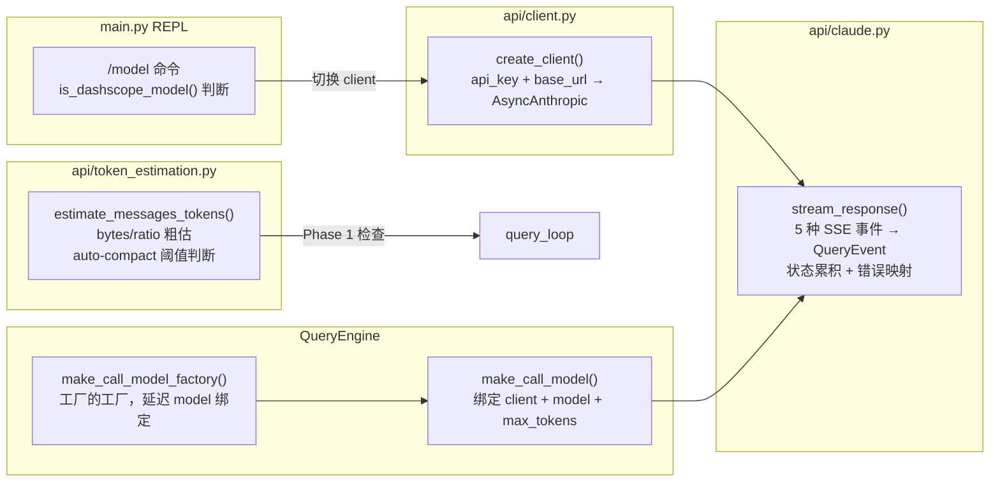
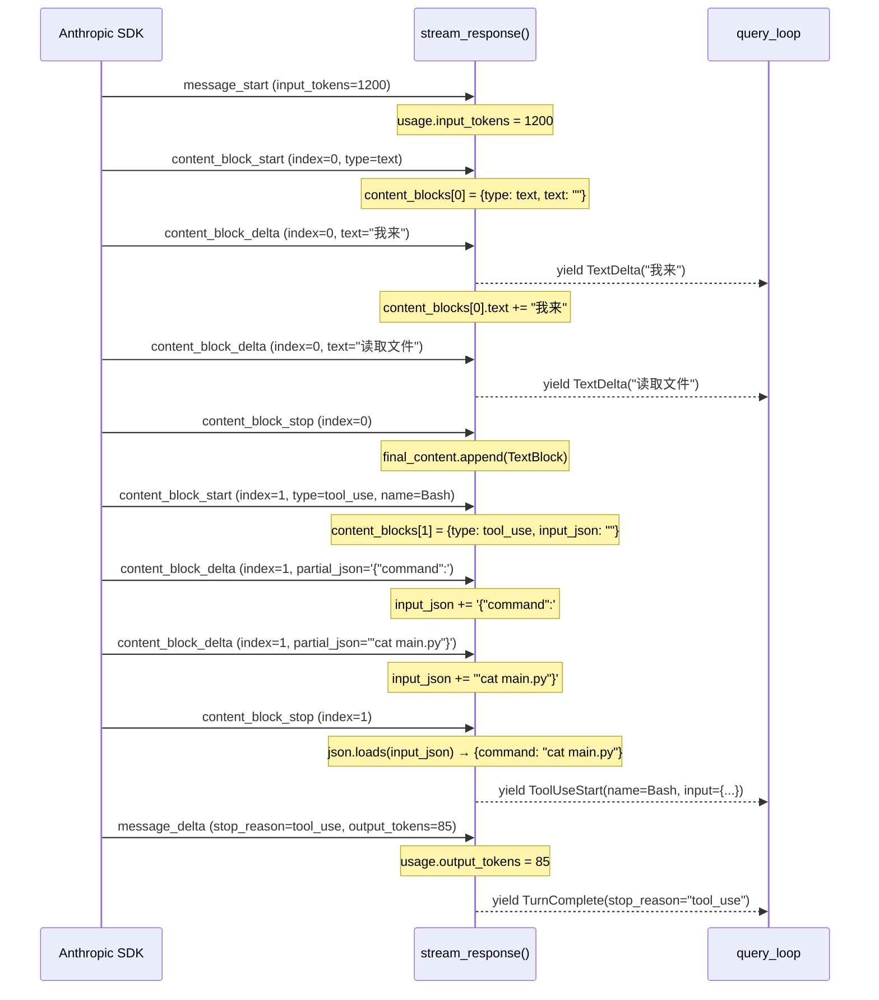

# LLM 接入层

## 读前思考

如果你要给一个 Agent 系统接入 LLM API，最直觉的做法是写一个 class 封装 SDK 调用，暴露一个 chat() 方法。问题是 Agent 场景下的 API 调用和普通 chatbot 有三个本质区别：响应是流式的（SSE 逐 token 到达）、工具调用参数是增量拼接的（JSON 片段分多次到达）、错误恢复需要区分"可重试"和"不可恢复"。你的封装层要在哪里做状态累积，在哪里做协议转换，才能让上层循环完全不关心 SSE 细节？

另一个问题：claudecode 号称支持多个模型（Claude 系列 + 阿里云百炼的 qwen3-max、glm-5、kimi-k2.5），但它没有写一个 Provider 抽象接口。它是怎么做到模型切换的？这种"不抽象"的选择牺牲了什么？

## 核心问题

LLM 接入层解决的是「如何将 Anthropic SDK 的流式 SSE 响应转换为内部事件协议，同时管理客户端配置、token 预算估算和错误分类」。claudecode 没有设计多 Provider 抽象接口，而是用三层闭包（stream_response → make_call_model → make_call_model_factory）实现依赖注入，模型切换通过运行时替换 client 实例完成。整个接入层只有三个文件：api/claude.py 做协议转换，api/client.py 做客户端工厂，api/token_estimation.py 做预算估算。

## 方案展示

### 设计选择 1：SSE 状态机 + 增量拼接

stream_response() 是整个接入层的核心，它是一个 async generator，接收 Anthropic SDK 的流式 SSE 事件并转换为内部 QueryEvent。Anthropic 的流式响应由 5 种 SSE 事件组成，每种触发不同处理：message_start 提取 input_tokens 和 cache 统计，content_block_start 初始化内容块状态，content_block_delta 增量拼接内容，content_block_stop 完成一个内容块并 yield 事件，message_delta 提取 stop_reason 和 output_tokens。

关键设计是 content_blocks 用 dict[int, dict] 以 SSE index 为 key 做状态累积。text 类型的块每次 delta 直接追加字符串并立即 yield TextDelta 供 UI 逐字打印。tool_use 类型的块则不同——它的 input 以 JSON 片段形式增量到达（input_json_delta），不能每次 delta 都 json.loads（会失败），只能用 input_json 字符串累积，到 content_block_stop 时才做一次完整解析。这就是为什么 ToolUseStart 在 stop 时才 yield 而非 start 时——必须等 JSON 完整。

JSON 解析失败时静默降级为空 dict（与 TypeScript 原版行为一致），记录诊断日志但不中断流。这个选择基于一个假设：即使工具参数解析失败，模型看到空的 input 后会在下一轮自行修正，比直接中断对话体验更好。

代价是 stream_response 内部维护了一个隐式状态机（content_blocks dict 的生命周期），如果 SSE 事件乱序到达（虽然 HTTP/2 保证不会），状态会错乱。另外 getattr 而非直接属性访问的写法（因为 SDK 事件类型是 Union，不同事件有不同属性）牺牲了 IDE 自动补全和类型安全。

### 设计选择 2：三层闭包注入而非 Provider 接口

claudecode 没有定义 Provider 抽象基类或接口。它的"抽象"完全通过闭包实现：最底层 stream_response(client, model=..., ...) 直接调 Anthropic SDK；中间层 make_call_model() 返回一个绑定了 client + model + max_tokens 的闭包，签名是 (**kwargs) -> AsyncIterator[QueryEvent]；最外层 make_call_model_factory() 是工厂的工厂，延迟 model 绑定时机供 AgentTool 在运行时动态选择。

query_loop 只认识中间层签名——一个接收 kwargs 返回 AsyncIterator[QueryEvent] 的 callable。它不关心底层是 Anthropic SDK 还是其他任何东西。测试时注入一个返回预设事件序列的 mock 闭包即可，不需要 mock 任何 class 或实现任何接口。

模型切换不用多 Provider 路由，而是在 REPL 层直接替换 client 实例。/model 命令触发时，is_dashscope_model() 判断目标模型是否属于百炼兼容集合（qwen3-max、glm-5、kimi-k2.5），如果是则用 DASHSCOPE_API_KEY + 百炼 base_url 创建新 client 替换 engine._client，否则用 ANTHROPIC_API_KEY 创建原生 client。同时重建 system_prompt（因为不同模型的 prompt 策略可能不同）。

这个选择的代价很明确：没有编译期的多 Provider 约束。如果未来要接入一个 SSE 协议不同的 Provider（比如 OpenAI 的流式格式），需要重写 stream_response 而非实现一个新 Provider class。但对于 claudecode 的定位——还原 Claude Code 内核——这不是问题，因为它本来就只面向 Anthropic 兼容 API。百炼支持之所以能工作，恰恰是因为百炼实现了 Anthropic API 兼容接口，SSE 事件格式完全相同。

### 设计选择 3：双精度 token 估算

token 预算管理提供两种精度：estimate_tokens() 做 O(n) 粗估（len(utf8_bytes) / ratio），count_tokens_api() 调 Anthropic API 获取精确值。粗估用于 query_loop Phase 1 的高频阈值检查（每轮循环都调用），精确计数用于计费展示等低频场景。

粗估的策略区分了两种内容类型：纯文本用 BYTES_PER_TOKEN = 4（英文 BPE 平均值），结构化数据（tool_result 等）序列化为 JSON 后用 JSON_BYTES_PER_TOKEN = 2（标点和短 key 占比高，token 更密集）。中文文本实际约 2-3 bytes/token，用 4 会低估 token 数，但对 compact 阈值来说偏保守——宁可早压缩也不要触发 prompt_too_long 错误。

estimate_messages_tokens() 不计算 system prompt 和 tool schemas 的 token，实际 input_tokens 会比估算值高。但 auto-compact 阈值设为 context_window 的 70%，这个余量足以覆盖低估。代价是如果 system prompt 极长（比如注入了大量 CLAUDE.md 内容），实际可用空间比估算的少，可能在 70% 阈值之前就触发 413。

## 工程优化

**错误映射的分类策略。** stream_response 的 except 块将 SDK 异常分为两类：APIStatusError 中 429（限流）和 529（过载）标记为 is_recoverable=True，其他状态码标记为 False；APIConnectionError（DNS、超时、TLS）一律标记为 True。判断 529 时还检查 response body 中的 error.type 是否为 "overloaded_error"——因为某些代理层可能用 500 包装过载错误。query_loop Phase 3 根据这个标记决定是退避重试还是直接终止。

**thinking 模式与 temperature 互斥处理。** 启用 extended thinking 时 API 不允许设置 temperature，否则报错。stream_response 通过 if thinking: params["thinking"] = thinking else: params["temperature"] = 1.0 做互斥分支，而非让调用方自己处理这个约束。

**usage 统计的分离采集。** input_tokens 和 cache_* 只从 message_start 获取，output_tokens 只从 message_delta 获取。这两处分离是 Anthropic API 的设计——混用会导致重复计数。stop_reason 初始化为 None，只在 message_delta 中非 None 时赋值，流中断未收到 message_delta 时 fallback 为 "end_turn" 防止对话卡住。

**客户端配置优先级。** create_client 的 key 解析顺序是显式参数 > 环境变量 > 报错（而非 SDK 的模糊报错）。base_url 优先级是显式参数 > ANTHROPIC_BASE_URL 环境变量 > SDK 默认值。.env 文件加载时环境变量覆盖文件内容，确保部署环境能覆盖开发配置。

## 面试要点

**追问 1：为什么不做 Provider 抽象接口？如果未来要接入 OpenAI 格式怎么办？** 这是一个 YAGNI 判断。claudecode 的定位是还原 Claude Code 内核，它面对的所有目标模型（Claude 系列 + 百炼兼容模型）都走 Anthropic SSE 协议。写一个 Provider ABC 意味着要抽象出"流式响应"的公共接口，但 Anthropic 和 OpenAI 的 SSE 事件结构差异很大（OpenAI 用 choices[0].delta，Anthropic 用 content_block_delta），抽象层要么太薄（只是重命名）要么太厚（丢失各自特性）。当前方案用闭包做依赖注入，query_loop 只认识 AsyncIterator[QueryEvent] 签名——如果真要接 OpenAI，写一个新的 stream_response_openai() 返回同样的 QueryEvent 即可，不需要改 query_loop 一行代码。代价是没有编译期约束确保新 Provider 实现了所有必要行为。

**追问 2：tool_use 的 JSON 增量拼接为什么不在每个 delta 时尝试解析？解析失败降级为空 dict 会不会导致工具执行错误？** 不在每个 delta 时解析是因为 JSON 片段在传输过程中不是合法 JSON——'{"command":' 单独 json.loads 会抛异常。理论上可以在每次 delta 后尝试解析，成功就用、失败就继续等，但这增加了 O(n²) 的解析开销（n 是 delta 数量），且对大参数（如文件内容）会显著拖慢流式处理。降级为空 dict 确实会导致工具收到错误参数，但模型在下一轮看到工具报错后会自行修正——这比中断整个对话的体验好。TypeScript 原版也是同样的 ?? {} 降级策略。

**追问 3：token 估算用 bytes/ratio 而不是加载 tokenizer，精度够用吗？什么场景下会出问题？** 对 auto-compact 的阈值判断来说够用，因为 70% 的阈值本身留了 30% 余量，即使估算偏差 20% 也不会误判。出问题的场景是 system prompt 极长（比如 CLAUDE.md 有几千行）且 tool schemas 很多（22+ 工具的 JSON schema）——这两部分不计入估算，实际 token 可能比估算值高出 10-15K。极端情况下可能在估算未达 70% 时就触发 413，此时 Phase 3 的 reactive compact 会兜底。如果要更精确，可以在首次 API 调用后用返回的 input_tokens 校准 ratio，但这增加了一次 API 调用的复杂度。
