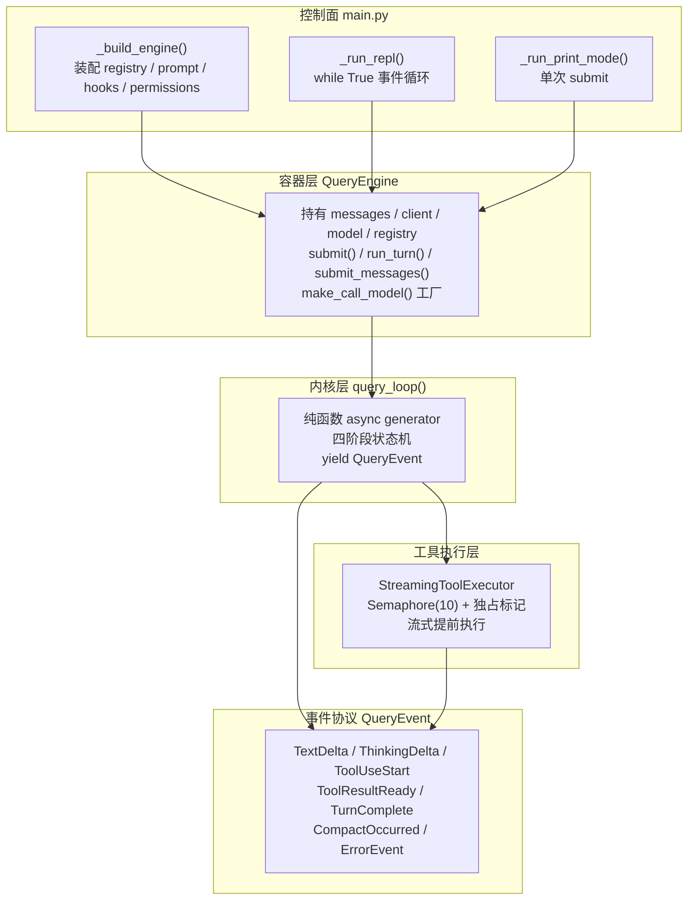
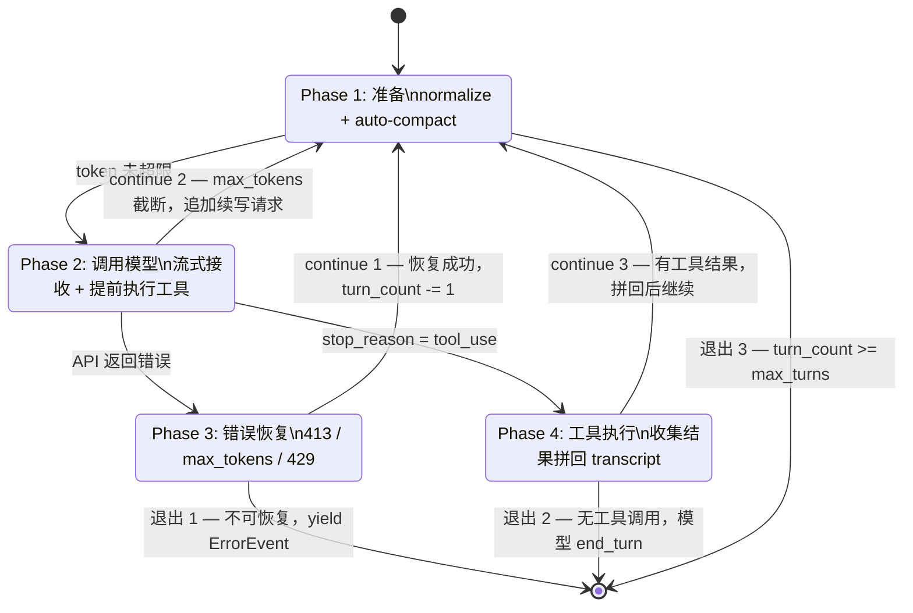
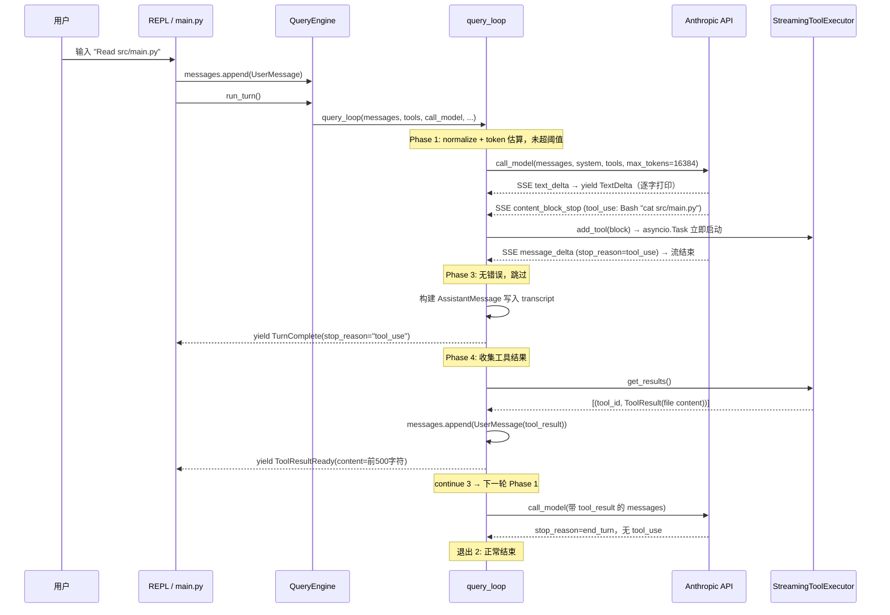
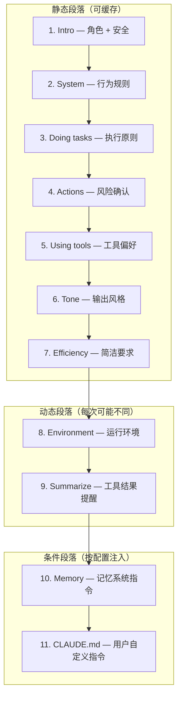

# Agent 主循环

## 读前思考

一个 Agent 主循环的最小实现就是 while True 加四行代码：调模型、解析响应、执行工具、拼回结果。问题是当你把错误恢复、token 预算、并发控制、流式输出全塞进这个循环之后，它会在 200 行以内变成一团没人敢碰的逻辑。你怎么拆，才能让每一块职责独立，同时不破坏循环的连续性？

另一个值得想的问题：这个循环至少要被四种场景驱动——REPL 交互式、CLI 一次性管道、子 agent 内部调用、单元测试 mock。你是写四个循环，还是一个循环加四个适配器？如果选后者，循环本身应该持有什么状态，又把什么留给外部？

## 核心问题

Agent 主循环解决的是「如何在一个循环中反复迭代 调用模型 → 解析响应 → 执行工具 → 拼回结果，直到模型主动结束或轮次耗尽」。claudecode 把这个循环拆成三层：控制面 main.py 负责装配所有运行时依赖，容器层 QueryEngine 持有可变状态并提供三个入口方法，内核层 query_loop 是一个纯函数 async generator 状态机。内核不持有任何长期状态，所有依赖通过参数注入，所有输出通过 yield 事件传递。

## 方案展示

### 设计选择 1：纯函数状态机 + 容器分离

query_loop 不是一个 class，而是一个顶层 async generator 函数。它的签名接收 messages（可变列表）、system_prompt、tools（ToolRegistry）、call_model（闭包）、auto_compact_fn（闭包或 None）等全部依赖作为参数，函数内部的状态变量（turn_count、retry_count、max_output_recovery_count）是局部变量，每次调用独立。它不 import 任何 UI 模块，不写 stdout，不保存文件——只 yield 事件。

这个选择最直接的收益是复用。同一个 query_loop 被 QueryEngine 的三条入口驱动：submit() 自动包装用户文本为 UserMessage 用于 print 一次性模式，run_turn() 不追加消息直接在现有 transcript 上运行用于 REPL（REPL 主循环已经手动 append 了用户输入），submit_messages() 接收预构建的 Message 列表用于 AgentTool 子 agent。子 agent 创建时只需要传入一个新的 messages 列表和不同的 call_model 闭包，不需要复制任何引擎状态。测试时注入一个 mock call_model（返回预设的 QueryEvent 序列）即可完全避免真实 API 调用。

代价是接线复杂度转移到了上层。main.py 的 _build_engine() 需要处理循环依赖：call_model_factory 需要 engine 实例，但 engine 构造又需要 factory。解法是 engine_ref: list[QueryEngine] = [] 模式——先创建空列表，factory 闭包捕获列表引用，engine 创建后 append 进去。这层接线不理解整条依赖链的人改起来容易漏掉某个注册步骤。此外事件驱动的输出方式要求所有调用方实现事件消费循环，对简单场景（如 CLI 一次性模式）额外增加了一层架构成本。

### 设计选择 2：四阶段状态机 + 三级错误恢复

每轮循环拆成四个阶段，阶段之间通过三个 continue 路径形成循环，通过三个退出条件跳出循环。

Phase 1 做两件事：normalize_messages_for_api() 将内部 Message 转为 API 格式（确保 user/assistant 交替、以 user 开头、tool_use/tool_result 配对），然后估算 token 量——不调 API 精确计数，而是按字节折算（纯文本约 4 字节/token，JSON 结构化内容约 2 字节/token），零成本、每轮都能算。估算值达到"上下文窗口减去约 13K token 固定缓冲区"的阈值时触发 auto-compact：用低配的模型调用（输出上限 4096）生成摘要替换旧消息，保留最近 4 轮原文；消息不足约 10 条时放弃压缩。估算不含 system prompt 和工具 schema、系统性偏低，靠固定缓冲区吸收误差。连续压缩失败超过 3 次后不再触发，避免死循环浪费 API 调用。

Phase 2 通过 call_model 闭包发起流式 API 调用。关键优化是 StreamingToolExecutor 的「流式提前执行」：当 API 还在输出后续 token 时，已完整解析的 tool_use block 通过 executor.add_tool() 立即在后台 asyncio.Task 中启动执行。TextDelta 立即 yield 供 UI 逐字打印，ToolUseStart 触发工具启动，TurnComplete 携带 stop_reason 决定下一阶段走向。

Phase 3 按错误类型分派三种恢复策略。prompt_too_long（413）触发响应式压缩，has_attempted_reactive_compact 标记确保只尝试一次防止压缩-重试-压缩死循环。max_output_tokens 截断分两步：第一次仅 escalate current_max_tokens 从 16384 到 65536，后续追加"Please continue from where you left off."消息让模型接续（最多 MAX_OUTPUT_TOKENS_RECOVERY = 3 次）。429/529 等瞬时错误做线性退避重试，等待时间 min(2.0 * retry_count, 10.0) 秒，上限 max_retry = 5 次。核心设计是可恢复错误不消耗轮次预算：恢复成功时执行 turn_count -= 1 撤销本次自增，配合独立的 retry_count 防止无限重试。三个计数器（turn_count、retry_count、max_output_recovery_count）相互独立，各有阈值。

Phase 4 收集 executor.get_results() 的工具结果，构建 ToolResultBlock 列表，作为 UserMessage 追加到 transcript（Anthropic API 要求 tool_result 在 user role 中）。工具返回富内容（如图片）时尝试解析为 ToolResultContent，解析失败降级为纯文本，不因单个工具的内容格式问题阻塞整个循环。

以用户输入 "Read src/main.py" 为例 trace 完整一轮：

### 设计选择 3：事件驱动的通信协议

query_loop 的返回类型是 AsyncIterator[QueryEvent]，QueryEvent 是 7 种 dataclass 的 Union 类型：TextDelta、ThinkingDelta、ToolUseStart、ToolResultReady、CompactOccurred、TurnComplete、ErrorEvent。循环内部不写 stdout、不保存文件、不更新 UI——它只 yield 事件，消费方用 isinstance 分派处理。

Union 类型而非基类继承的选择有三个理由：事件种类有限且封闭（不需要外部扩展），isinstance 分派比 visitor 模式更 Pythonic，mypy 能对 Union 做穷举检查——漏处理某个事件类型报编译错误而非运行时错误。ThinkingDelta 与 TextDelta 分开是因为 thinking 内容在 UI 中渲染方式不同（灰色/折叠），且 thinking 不写入最终 assistant message 的 text 部分。ToolResultReady 的 content 被截断到 500 字符仅供 UI 预览，完整结果写入 transcript。

好处是内核和渲染完全解耦。同一个 query_loop 在 REPL 模式下驱动逐字打印，在子 agent 场景下可以直接丢弃所有 TextDelta 仅保留 TurnComplete——消费者决定怎么处理每个事件，不需要修改循环逻辑。代价是新增事件类型需要改所有消费方的 match 分支，且跨阶段的状态（如累计 token 用量）需要消费者自己从 TurnComplete.usage 中聚合，无法像同步代码那样用返回值携带额外信息。

### 设计选择 4：流式提前执行与并发控制

StreamingToolExecutor 是 query_loop 与工具层之间的桥梁。传统实现需要等 API 响应完整返回后才开始执行工具，而 StreamingToolExecutor 在 API 流式返回过程中，一旦某个 tool_use block 完整解析出来（content_block_stop 事件），就通过 asyncio.create_task 在后台启动执行。假设模型返回 3 个工具调用，第 1 个在第 2 个还在传输时就已经开始执行了。

并发控制分两层。底层是 asyncio.Semaphore(10) 限制全局最大并发数。上层是独占标记 _has_exclusive_running：每个工具通过 is_concurrency_safe(input) 声明自己是否并发安全（如 Read 是安全的，Edit 和 Bash 不是），非并发安全工具执行期间设独占标记，即使是并发安全的工具也必须排队——防止读到写了一半的文件。get_results() 在 API 流结束后调用，先通过 _process_queue() 按序处理排队的非并发安全工具（等待所有已启动任务完成 → 设独占 → 执行 → 等完成 → 清除独占），再按到达顺序收集所有结果。

代价是并发正确性依赖工具正确实现 is_concurrency_safe()。如果一个有副作用的工具错误地声明自己是并发安全的，就可能出现竞态条件。框架层没有额外的运行时校验来兜底这个声明。

# 系统提示词结构

query_loop 每次调用模型时传入的 system_prompt 由 prompts/builder.py 的 build_system_prompt() 按固定顺序拼装而成。拼装顺序的设计意图是：前面的静态段落内容固定不变，API 层可利用 prompt caching 避免重复计算 token；后面的动态段落（环境信息、memory、CLAUDE.md）每次请求可能不同。整个 system prompt 由十一个段落组成（九个始终存在 + 两个条件注入），按顺序如下：

| 序号 | 段落名 | 来源函数 | 类型 | 核心内容 |
|------|--------|---------|------|----------|
| 1 | Intro | get_intro_section() | 静态 | 角色定义（"交互式软件工程助手"）+ 网络安全指令（允许合法安全测试，拒绝恶意用途）+ URL 生成限制 |
| 2 | System | get_system_section() | 静态 | 系统行为规则：工具权限模式、system-reminder 标签处理、prompt injection 防御、hooks 反馈视为用户来源、上下文自动压缩声明 |
| 3 | Doing tasks | get_doing_tasks_section() | 静态 | 任务执行原则：先读再改、不过度工程、不添加未被要求的功能、安全优先（OWASP top 10）、失败后先诊断再换策略 |
| 4 | Actions | get_actions_section() | 静态 | 操作风险评估：区分可逆/不可逆操作，高风险操作（删除、force push、发消息）执行前征求确认，授权范围不扩展 |
| 5 | Using tools | get_using_tools_section() | 静态 | 工具使用偏好：Read 优先于 cat、Edit 优先于 sed、Glob 优先于 find；无依赖的工具调用并行发出 |
| 6 | Tone/Style | get_tone_style_section() | 静态 | 输出风格：不用 emoji、简洁、引用代码附带 file_path:line_number、工具调用前不加冒号 |
| 7 | Output efficiency | get_output_efficiency_section() | 静态 | 输出效率：先结论后推理、跳过寒暄和过渡语、一句能说清不用三句 |
| 8 | Environment | compute_env_info() | 动态 | 运行环境：工作目录、是否 git 仓库、平台、shell 类型、OS 版本、模型名、当前日期 |
| 9 | Summarize | SUMMARIZE_TOOL_RESULTS 常量 | 动态 | 一句话提醒：工具结果中的关键信息要记录在回复中，因为原始结果可能被上下文压缩清除 |
| 10 | Memory | build_memory_prompt() | 条件 | 记忆系统行为指令：四种记忆类型定义、保存规则、访问时机、验证要求、MEMORY.md 索引内容（仅 memory_dir 存在时注入） |
| 11 | CLAUDE.md | load_claude_md() | 条件 | 用户自定义指令：从目录层级搜索的 CLAUDE.md 内容，放在最后确保优先级最高（仅文件存在时注入） |

段落 1-7 是静态的行为定义，内容来自 prompts/sections.py 中从 TypeScript 原版直接复制的文本，不因运行环境或用户配置而改变。段落 8-9 是动态的运行时信息，每次构建 system prompt 时重新生成。段落 10-11 是条件注入——只有当 memory 目录存在或找到 CLAUDE.md 文件时才会出现在最终的 system prompt 中。

build_system_prompt() 返回的是 list[str] 而非拼接后的单个字符串，因为 API 层需要将它们作为独立的 cache_control 段传入 Anthropic API，以最大化 prompt caching 命中率——静态段落（1-7）在多次请求间保持不变，可以被缓存，避免重复计费。

除主 system prompt 外，系统还有两种特殊角色的 prompt：Coordinator prompt（coordinator_prompt.py，将主 agent 转变为协调者角色，定义任务分解和 worker 管理规则）和 Teammate prompt addendum（teammate_prompt.py，追加到 teammate 的 system prompt 后，定义通信规则和任务生命周期）。这两者不在 build_system_prompt() 的拼装链中，而是在 swarm 模式下由 InProcessTeammate 或 Coordinator 单独注入。

## 工程优化

**二次布线解决循环依赖。** _build_registry() 先注册所有工具的骨架版（不含运行时依赖），_build_engine() 创建 TaskRegistry、TeamContext 等运行时组件后再用完整版覆盖注册。engine_ref 列表闭包解决 call_model_factory 需要 engine 但 engine 构造又需要 factory 的鸡生蛋问题。工具注册分三层：Tier 1 文件操作工具随 main.py 启动绑定，Tier 2 扩展工具 lazy import 减少启动时间，Tier 3 协作工具（Agent/Team/SendMessage）需要 call_model_factory 运行时注入。

**token 预算分级管理。** auto-compact 在 Phase 1 主动检查（估算值达到"窗口 − 固定缓冲"即触发），reactive compact 在 Phase 3 收到 413 后被动触发（只尝试一次）。current_max_tokens 从 16384 起步，首次 max_output_tokens 截断后 escalate 到 65536——短对话不需要为长输出场景买单。压缩用的摘要调用是同一个模型调用闭包的低配版（输出上限 4096），递归复用同一个函数子集，没有额外适配层。压缩机制与其他项目的横向对比见 comparisons/13-context-compaction。

**call_model 的三层抽象。** 最内层 stream_response()（原始 SSE → QueryEvent 转换），中间 make_call_model() 闭包（绑定 client + model），最外层 make_call_model_factory()（工厂的工厂，延迟 model 绑定时机供 AgentTool 运行时选择）。测试时注入任一层即可，最方便的是直接注入 mock call_model 闭包。

**防御性编程多层兜底。** 工具异常在 _execute_one 的 try/except 中转为 ToolResult(is_error=True)，不中断循环。get_results() 对每个 task 的 await 再做一次 try/except 防止 CancelledError 逃逸。富内容解析失败降级为纯文本。normalize_messages_for_api() 的三步修复确保即使 transcript 因压缩或中断损坏也能自我修复为 API 兼容格式。空 tool_result content 补充占位文本避免 API 拒绝请求。未知工具名返回 ToolResult(content=f"Error: Unknown tool '{name}'", is_error=True) 让模型自行处理。

## 面试要点

**追问 1：为什么选纯函数状态机而不是把状态放在循环类的成员变量里？** 两种方案针对不同约束。直接持有状态更简单，接线成本低，适合单场景 Agent（如 hermes-agent 的 run_agent.py 就是一个 12k 行的单文件循环）。claudecode 拆分的主要驱动力是 AgentTool——子 agent 需要创建一个独立循环，如果状态和循环耦合，每次创建子 agent 都要复制整套环境。拆开后只需传入新的 messages 列表和不同的 call_model 闭包。这个设计的代价是接线复杂度：main.py 的 _build_engine() 需要 100+ 行完成依赖装配和循环依赖解除。如果业务中没有子 agent 或测试 mock 的需求，这层抽象可以砍掉。判断标准是：你的循环是否需要在运行时被多个不同配置的调用方驱动？如果是，拆；如果只有一个入口，不拆。

**追问 2：三个 continue 路径能不能合并成一个？** 三条路径对应三种性质不同的"回到起点"。continue 1 是错误恢复后的重试，需要回退 turn_count（这轮不算）并重新进入 Phase 1 做 normalize。continue 2 是 max_tokens 截断，需要保留当前轮的模型输出并追加续写消息，不回退任何计数器。continue 3 是工具执行后的下一轮，需要把工具结果写入 messages 再运行。合并意味着每次回到起点前都要判断"这次是哪种恢复"，条件分支不会减少，反而让状态机语义更模糊——读者无法从 continue 的位置直接推断当前处于哪种恢复路径。代价是代码阅读者需要追踪每个 continue 之前的消息状态和计数器状态。

**追问 3：流式提前执行的并发安全靠什么保证？如果工具错误声明了自己是并发安全的会怎样？** 并发安全依赖工具正确实现 is_concurrency_safe(input) 这个声明式接口。框架层用 Semaphore(10) 限制并发数上限，用独占标记确保非并发安全工具执行期间没有其他工具并行。但框架不会在运行时校验声明的正确性——如果一个有副作用的工具（比如某个会写文件的 MCP 工具）错误返回 True，就可能出现两个写操作交叉执行导致文件损坏。这是一个有意的信任边界选择：框架信任工具作者的声明，换取更简单的调度逻辑。如果要加运行时校验，就需要引入工具沙箱或事务性文件操作，复杂度会显著上升。
