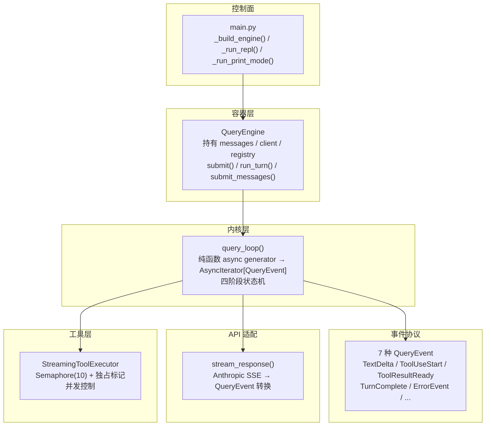
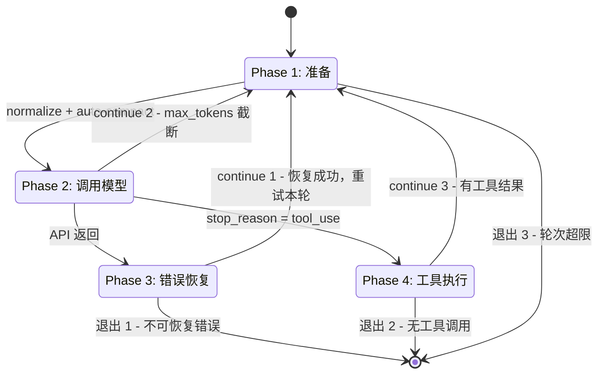

# Agent 主循环

## 读前思考

Agent 主循环的直觉实现就是一个 `while True`：调模型 → 解析响应 → 执行工具 → 拼回结果 → 继续调。问题在于一旦你把状态管理、错误恢复、token 预算、并发控制全塞进这个循环，它很快会变成一团没人敢改的逻辑。你怎么拆才能让每一块职责独立，同时还不破坏循环的连续性？

另一个有意思的问题：如果一个循环要被四种不同场景驱动——REPL 交互式、CLI 一次性、子 agent 内部、单元测试——你是写四个循环还是一个循环加四个适配器？

## 核心问题

Agent 主循环解决的是「如何在一个循环中反复迭代 调用模型 → 解析响应 → 执行工具 → 拼回结果，直到对话结束或轮次耗尽」。claudecode 把这个循环拆成了三层：控制面（main.py）负责装配，容器层（QueryEngine）持有可变状态，内核层（query_loop）是纯函数状态机。每层只做一件事，内核不持有任何状态，所有依赖通过参数注入。



## 方案展示

### 设计选择 1：纯函数状态机 + 容器分离

claudecode 没有把 Agent 主循环实现成一个 class，而是写成了顶层 async generator 函数 `query_loop()`。它不持有任何成员变量——messages（可变列表）、system_prompt、tools（ToolRegistry）、call_model（闭包）、auto_compact_fn（闭包或 None），全部通过参数注入。循环内的状态变量（turn_count、retry_count）是函数局部变量，每次调用独立。

这个选择最直接的收益是复用。同一个 `query_loop()` 函数被 QueryEngine 的三条入口驱动：`submit()` 自动包装用户输入用于 print 一次性模式，`run_turn()` 不追加消息直接在现有 transcript 上运行用于 REPL，`submit_messages()` 接收预构建消息列表用于子 agent。测试时注入 mock call_model 即可避免真实 API 调用，不需要 mock 任何 class。auto_compact_fn 本身就是同一个 call_model 的低配版（max_tokens=4096）——递归调用同一个函数子集，没有额外的适配层。

代价是接线复杂度转移到了上层。`main.py` 的 `_build_engine()` 需要 100+ 行来完成依赖装配和循环依赖解除。其中 `engine_ref: list[QueryEngine] = []` 模式最典型——call_model_factory 需要 engine，但 engine 构造又需要 factory。解法是先创建空列表，factory 闭包捕获列表引用，engine 创建后才 append 进去。这层接线不理解整条依赖链，改起来容易漏掉某个注册步骤。此外，事件驱动的输出方式（yield QueryEvent）要求所有调用方实现事件消费循环，对简单场景（如 CLI 一次性模式）额外增加了一轮架构成本。

### 设计选择 2：四阶段状态机 + 三级错误恢复

每轮循环拆成四个阶段。阶段之间通过三个 continue 路径形成循环，通过三个退出条件跳出循环。核心思路是每个阶段只做一类事情，不在错误处理的地方掺入消息格式转换的逻辑。



Phase 1 做两件事：`normalize_messages_for_api()` 将内部 Message 转换为 Anthropic API 格式（三步修复——确保 user/assistant 交替、以 user 开头、tool_use/tool_result 配对），同时检查 token 是否超过 context window 的 70%，超过则触发 auto-compact（用 max_tokens=4096 的低配模型生成摘要替换旧消息，保留最近 4 轮）。连续压缩失败超过 3 次后放弃（`MAX_CONSECUTIVE_FAILURES = 3`），避免死循环浪费 API 调用。

Phase 2 通过 call_model 闭包发起 API 调用。`stream_response()` 将 Anthropic SDK 的 5 种 SSE 事件逐条转换为内部 QueryEvent——TextDelta 立即 yield 供 UI 逐字打印，ToolUseStart 触发 StreamingToolExecutor 在后台启动工具执行（P1b 提前执行模式），TurnComplete 携带 stop_reason 决定下一阶段走向。

Phase 3 按错误类型分派恢复策略。prompt_too_long（413）触发响应式压缩（只尝试一次，`has_attempted_reactive_compact` 防循环）。max_tokens 截断时先 escalate `current_max_tokens` 从 16K 到 64K，再追加"请继续"消息（最多 3 次）。429/529 等瞬时错误做退避重试——退避时间取 `min(2.0 * retry_count, 10.0)` 线性增长，上限 10 秒。关键设计是可恢复错误不消耗轮次预算：`turn_count` 在 Phase 3 成功恢复时执行 `turn_count -= 1`「撤销」这次自增，配合独立的 `retry_count` 防止无限重试。三个计数器（turn_count、retry_count、max_output_recovery_count）相互独立，各自有各自的阈值。

Phase 4 收集工具结果拼回 transcript。工具异常由 StreamingToolExecutor 内部的 try/except 兜底，转为 `ToolResult(is_error=True)` 返回给模型而不是中断循环。如果工具返回了富内容（如图片）但解析失败，降级为文本表示，不因为单个工具的错误内容阻塞整个循环。

下面以一个用户输入 "Read src/main.py" 为例，trace 完整一轮的执行流：

```mermaid
sequenceDiagram
    participant User as 用户
    participant REPL as REPL 主循环
    participant Engine as QueryEngine
    participant Loop as query_loop
    participant API as Anthropic API
    participant Tool as BashTool

    User->>REPL: 输入 "Read src/main.py"
    REPL->>Engine: messages.append(UserMessage)
    REPL->>Engine: run_turn()
    Engine->>Loop: query_loop(messages, tools, call_model, ...)

    Note over Loop: Phase 1: normalize + token 估算，未超阈值
    Loop->>API: call_model(messages, system, tools)
    API-->>Loop: SSE: message_start → content_block_delta
    Loop-->>REPL: yield TextDelta（逐字打印）
    API-->>Loop: SSE: content_block_stop (tool_use: Bash "cat src/main.py")
    Loop->>Tool: add_tool → 后台 asyncio.task 立即执行
    API-->>Loop: SSE: message_delta (stop_reason=tool_use) → 流结束

    Note over Loop: Phase 3 无错误跳过
    Loop->>Loop: 构建 AssistantMessage 写入 transcript
    Loop-->>REPL: yield TurnComplete

    Note over Loop: Phase 4: 收集工具结果
    Loop->>Tool: get_results()
    Tool-->>Loop: ToolResult (file content)
    Loop->>Loop: messages.append(UserMessage(tool_result))

    Note over Loop: continue 3 → 下一轮，API 返回 end_turn → 退出 2
```

这个 trace 可以延伸到多个边界情况。如果 Phase 2 API 返回 stop_reason=end_turn 且无 tool_use，Phase 4 不走，直接退出 2 结束对话。如果流中途被 max_tokens 截断，走 continue 2 追加"请继续"消息而非报错。如果 Phase 2 流中断了没收到 message_delta（stop_reason 为 None），fallback 为 "end_turn" 防止对话卡住。如果 Phase 4 中某个工具抛异常，try/except 兜底转为 ToolResult(is_error=True)，模型看到错误信息决定下一步。如果 API 返回了未注册的工具名（如 MCP 工具被移除），返回 `ToolResult(content=f"Error: Unknown tool '{name}'", is_error=True)`，模型自行处理。

### 设计选择 3：事件驱动的通信协议

`query_loop` 不写 stdout、不保存文件、不更新 UI——它只 yield 事件。7 种 QueryEvent 类型通过 Union 组合（非基类继承），消费方用 isinstance 分派：TextDelta 渲染逐字打印，ToolUseStart 触发 UI 的工具调用提示，ToolResultReady 展示工具执行结果，TurnComplete 触发 token 统计和 transcript 持久化，CompactOccurred 通知 UI 压缩发生，ErrorEvent 携带 is_recoverable 标记供消费方决定是否停止。`stream_response()` 也在同样的协议下工作——它把 SDK 的 5 种 SSE 事件转为同样的 TextDelta / ToolUseStart / TurnComplete / ErrorEvent，所以 query_loop 不需要区分事件来自 API 还是来自工具层。

这么做的好处是内核和渲染完全解耦。同一个 query_loop 可以在 REPL 模式下驱动逐字打印，也可以在子 agent 场景下直接丢弃所有 TextDelta 仅保留 TurnComplete——消费者只需要决定怎么处理每个事件，不需要修改循环逻辑。Union 类型而非基类继承的好处是编译期穷举检查：mypy 能确保所有事件类型都被处理，漏掉某个类型报编译错误而非运行时错误。

代价是新增事件类型需要改所有消费方的 match 分支。对于 Agent 这种事件类型相对稳定的场景这不是大问题，但如果你的系统事件类型频繁变动，这种模式就不合适。另一个代价是状态必须塞进事件中传递，无法像同步代码那样用返回值携带额外信息——每个事件只能携带自身的数据，跨阶段的状态（如累计 token 用量）需要消费者自己聚合。

## 工程优化

重型优化已经在设计选择中讨论过（状态机拆分的复用性、错误恢复的计数隔离、事件协议的穷举检查），这里说几个更贴近工程实践的细节。

**二次布线**是解决 tool 注册循环依赖的核心模式。`_build_registry()` 先注册所有工具的骨架版（不含运行时依赖），`_build_engine()` 创建 TaskRegistry、TeamContext、BackgroundAgentManager 等运行时组件后再用完整版覆盖注册。`engine_ref` 列表闭包则解决了 call_model_factory 需要 engine 但 engine 构造又需要 factory 的鸡生蛋问题。

**token 预算采用分级管理策略**。auto-compact 在 Phase 1 主动检查，token 超过 context_window 的 70% 时触发压缩（用 max_tokens=4096 的低配模型生成摘要，保留最近 4 轮）。reactive compact 在 Phase 3 收到 413 后被动触发，只尝试一次防止死循环。`current_max_tokens` 从 16K 起步，首次 max_output_tokens 截断后 escalate 到 64K——短对话不需要为长输出场景买单。

**call_model 的三层抽象**提供了灵活的测试接口。最内层是 `stream_response()`（原始 SSE → QueryEvent 转换），中间是 call_model 闭包（绑定 client + model 名称），最外层是 call_model_factory（绑定 engine 的运行时上下文）。测试时可以注入任一层——最方便的是直接注入一个 mock call_model 闭包，完全避免真实 API 调用。AgentTool 创建子 agent 时只需要传入新的 call_model 和新的 messages，不需要复制引擎。

**并发控制有两层**。StreamingToolExecutor 用 `asyncio.Semaphore(10)` 限制全局并发数。在 Semaphore 之上还有独占标记——非并发安全工具（如 Edit、Bash）执行期间设 `_has_exclusive_running = True`，即使是并发安全的工具（如 Read）也必须排队，防止读到写了一半的文件。

**防御性编程有多个兜底层**。工具异常转 ToolResult(is_error=True) 不中断循环。SSE JSON 解析失败时降级为空 dict。`normalize_messages_for_api()` 的三步修复确保即使 transcript 因压缩或中断损坏，也能自我修复为 API 兼容格式——尤其是 `_ensure_tool_result_pairing` 会为孤立的 tool_use 自动补充合成错误结果（对话以 tool_use 结尾崩溃后的恢复路径）。空 tool_result content 补充占位文本 `"(no content)"` 避免 API 拒绝请求。

## 面试要点

**追问 1：为什么选纯函数状态机 + 容器分离，而不是把状态直接放在循环里？** 两种方案针对不同场景。直接持有状态（如 hermes-agent 的 run_agent.py）更简单，接线成本低，适合单场景 Agent。claudecode 拆分的主要驱动力是 AgentTool——子 agent 需要创建一个新的独立循环，如果状态和循环耦合在一起，每次创建子 agent 都要复制整套环境。拆开后只需要传入新的 messages 列表和不同的 call_model，QueryEngine 不需要做任何初始化工作。这个设计的代价是接线复杂度，如果业务中没有子 agent 或测试 mock 的需求，这层可以砍掉。

**追问 2：三个 continue 路径为什么需要三个，能不能合并？** 三条路径分别对应三种性质不同的"回到起点"。continue 1 是错误恢复后的重试，要求恢复本轮的初始状态（回退 turn_count、还原 messages 到调用前）。continue 2 是 max_tokens 截断，需要保留当前轮的模型输出并追加"请继续"消息，不需要回退任何计数器。continue 3 是工具执行后的下一轮，需要把工具结果写入 messages 再运行。合并成一个路径意味着每次回到起点前都要判断"这次是哪种恢复"，条件分支不会减少，反而让状态机的语义更模糊。三条路径的代价是函数内多了三处 continue 点，代码阅读者需要追踪每个 continue 之前的消息状态和计数器状态才能理解当前发生了什么事。

**追问 3：这个系统怎么保证单个工具的异常不拖垮整个对话？** 三层兜底。最内层是 StreamingToolExecutor 的每个工具 execute 用 try/except 包裹，任何异常转为 `ToolResult(is_error=True)` 返回给模型，模型看到错误信息决定下一步——不中断循环，不抛异常到外层。中间层是 Phase 4 的 `get_results()` 对每个 task 的 await 再做一次 try/except，防止 CancelledError 等协程级别的异常逃逸。最外层是 Phase 3 的错误恢复——API 本身的 429/529 等瞬时错误做退避重试，413 触发响应式压缩。整个设计的思路是循环本身是健壮的，所有异常都转成模型可理解的消息，由模型决定下一步怎么走。代价是模型可能做出错误决策（比如反复重试同一个失败的工 具），需要一个额外的轮次预算来兜底。
