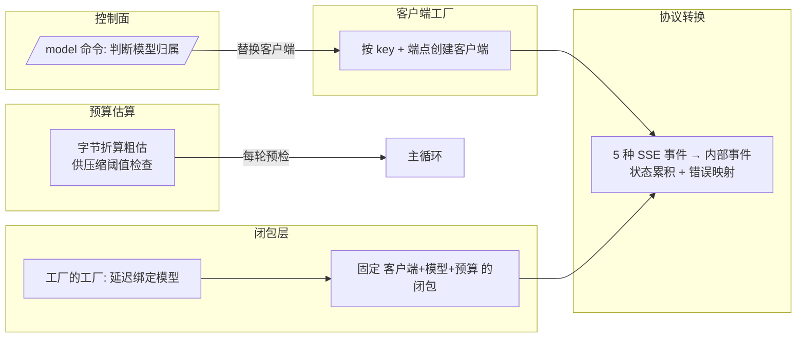
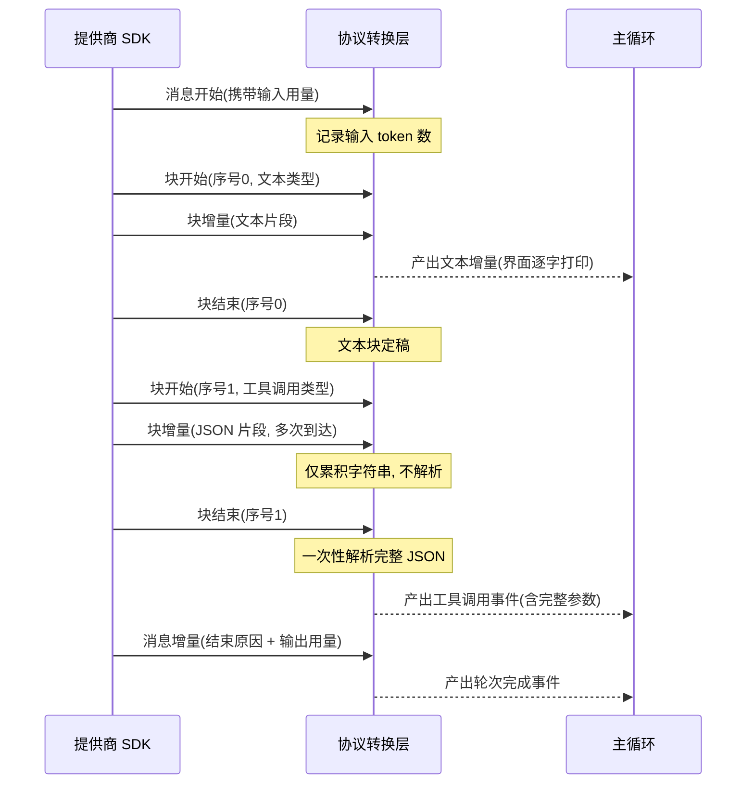
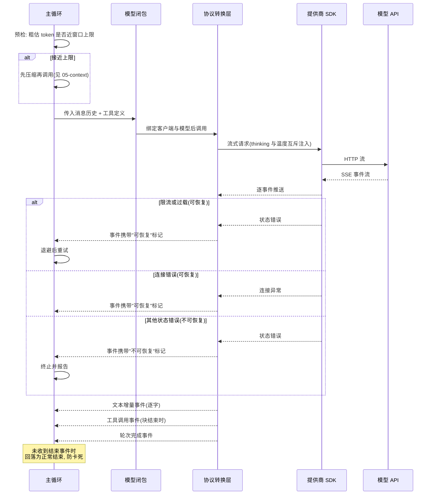

# 模型接入层

## 读前思考

- 如果你要给一个 Agent 系统接入 LLM API，最直觉的做法是写一个类封装 SDK 调用、暴露一个对话方法。但 Agent 场景下的 API 调用和普通聊天机器人有三个本质区别：响应是流式的（逐 token 到达）、工具调用参数是增量拼接的（JSON 片段分多次到达）、错误恢复需要区分"可重试"和"不可恢复"。你的封装层要在哪里做状态累积，在哪里做协议转换，才能让上层循环完全不关心流式细节？
- claudecode 支持多个模型（Claude 系列 + 阿里云百炼的几个兼容模型），但它没有写一个 Provider 抽象接口，甚至支持在对话进行中切换模型。这种"不抽象"的选择是怎么做到的，又牺牲了什么？

## 核心问题

模型接入层解决的是**将提供商 SDK 的流式 SSE 响应转换为内部事件协议，同时管理客户端配置、token 预算估算、运行时模型切换和错误分类**。claudecode 没有设计多 Provider 抽象接口，而是用三层闭包实现依赖注入，模型切换通过运行时替换客户端实例完成。整个接入层只有三个文件：协议转换、客户端工厂、预算估算。

| 维度 | claudecode 的选择 |
|------|------------------|
| Provider 覆盖 | 2 个（Anthropic 原生 + 百炼兼容端点），同一 SSE 协议 |
| 抽象模式 | 无接口，三层闭包注入 |
| 流式处理 | SSE 状态机 + 按块累积，块结束才解析工具参数 |
| 错误恢复 | 二分法（可恢复/不可恢复） |
| 结构化输出 | 无独立通道，工具参数累积解析是唯一结构化面 |
| 运行时切换 | /model 命令热切换客户端 + 重建系统提示词 |
| Token 计数 | 双精度：字节折算粗估 + API 精确计数 |

## 方案展示

### 设计选择 1：SSE 状态机 + 增量拼接

协议转换函数（源码：api/claude.py 的 stream_response）是整个接入层的核心：它是一个异步生成器，接收 SDK 的流式 SSE 事件并转换为内部事件。Anthropic 的流式响应由 5 种 SSE 事件组成，每种触发不同处理：消息开始事件提取输入用量和缓存统计，内容块开始事件初始化块状态，内容块增量事件做增量拼接，内容块结束事件完成一个块并产出内部事件，消息增量事件提取结束原因和输出用量。

关键设计是以 SSE 分片序号为 key 的块状态表。文本类型的块每次增量直接追加字符串并立即产出文本增量事件，供界面逐字打印。工具调用类型的块则不同——它的参数以 JSON 片段形式增量到达，每个片段都不是合法 JSON，不能逐段解析，只能以字符串累积，到内容块结束事件时才做一次完整解析。这就是为什么工具调用事件在"块结束"而非"块开始"时产出——必须等 JSON 完整。

JSON 解析失败时静默降级为空参数（与 TypeScript 原版行为一致），记录诊断日志但不中断流。这个选择基于一个假设：工具收到空参数会报错，模型在下一轮看到报错后会自行修正，比直接中断对话的体验更好。claudecode 没有任何独立的结构化输出通道（JSON 模式、响应格式参数都不存在），工具参数累积解析是唯一的结构化解析面——这在协议单一的前提下是成立的。

代价是协议转换层内部维护了一个隐式状态机（块状态表的生命周期），事件乱序到达会导致状态错乱。另外对 SDK 事件的属性访问全部走容错取值（因为事件是联合类型，不同事件有不同属性），牺牲了类型检查的严密性。

### 设计选择 2：三层闭包注入而非 Provider 接口

claudecode 没有定义 Provider 抽象基类或接口。它的"抽象"完全通过闭包实现：最底层的协议转换函数直接调用 SDK；中间层把客户端、模型名、最大 token 数固定进一个闭包，签名是"接收任意参数、返回内部事件迭代器"（源码：make_call_model）；最外层是工厂的工厂，延迟模型绑定时机，供子代理工具在运行时动态选择模型（源码：make_call_model_factory）。

主循环只认识中间层签名——一个接收参数返回事件迭代器的可调用对象，它不关心底层是哪个 SDK。测试时注入一个返回预设事件序列的假闭包即可，不需要模拟任何类或实现任何接口。

**为什么这么选**：claudecode 的定位是还原 Claude Code 内核，所有目标模型都走同一 SSE 协议，写抽象接口是过度设计。闭包注入把可替换性建立在"统一的事件协议"上而非"统一的类接口"上。

**牺牲了什么**：没有编译期的多 Provider 约束。如果未来要接入流式协议不同的提供商，需要重写协议转换层而非实现一个新类。

### 设计选择 3：/model 运行时模型切换

/model 命令支持在对话进行中切换模型，无需重启。切换逻辑在交互层：解析目标模型名 → 判断目标属于原生集合还是百炼兼容集合（源码：is_dashscope_model）→ 用对应的 API key 和端点创建新客户端 → 替换引擎持有的客户端实例 → 重建系统提示词（不同模型的提示词策略可能不同）。

这不是一个通用的"配置热重载"机制——claudecode 里只有模型切换支持运行时变更，hooks、MCP 配置、权限模式的变更都需要重启。模型切换之所以能热变更，是因为它只影响客户端实例和系统提示词，不触碰工具注册表或权限上下文。可用模型列表是硬编码的（3 个 Claude 模型 + 3 个百炼模型），不从 API 动态获取——当前支持的模型数量有限，动态获取增加的复杂度不划算。

**为什么这么选**：本地交互工具的用户期望"换个模型试试"是零成本操作，重启会打断工作现场（对话历史、工具状态）。

**牺牲了什么**：切换逻辑与交互层耦合，无法通过配置文件声明式表达；硬编码模型列表意味着新增模型要改代码。

### 设计选择 4：双精度 token 估算

token 预算管理提供两种精度：字节折算粗估（纯文本按英文 BPE 平均值、结构化数据按更密集的比率折算）和 API 精确计数（调提供商接口拿真值）。粗估用于主循环预检阶段的高频阈值检查（每轮循环都调用），精确计数用于计费展示等低频场景。中文文本实际字节/token 比更低，粗估会低估 token 数，但对压缩阈值来说偏保守更安全——宁可早压缩也不要触发窗口超限错误。

估算不计入系统提示词和工具 schema 的 token，实际输入量会比估算值高，但自动压缩阈值留的余量足以覆盖这部分低估。用量数字如何参与压缩阈值与响应式兜底，见 [05-context](./05-context.md)。

**为什么这么选**：加载完整分词器做精确计算的成本（依赖、内存、每轮耗时）与收益不成比例；阈值判断本身有容错空间。

**牺牲了什么**：极端场景（系统提示词极长 + 工具 schema 极多）下估算偏差可能让实际窗口在估算未达阈值时就超限，只能靠响应式压缩兜底。

## 核心机制执行流：一次流式响应的全链路

以用户输入触发一次工具调用为例，从请求发出到轮次完成：

逐阶段讲解：

1. **预检**：主循环先用字节折算粗估当前消息历史的 token 量，接近窗口上限就先压缩——这是事前防线的唯一位置。
2. **参数互斥注入**：启用扩展思考时 API 不允许设置温度，协议转换层在请求参数里做互斥分支，调用方不需要自己处理这个约束。
3. **用量分离采集**：输入用量与缓存统计只从消息开始事件取，输出用量只从消息增量事件取——两处分离是 API 的设计，混用会导致重复计数。
4. **工具参数等待完整性**：工具调用的 JSON 片段逐段到达，只有块结束事件触发一次性解析；解析失败走空参数降级，工具报错后模型下一轮自行修正。
5. **边界路径一（错误二分）**：异常被分为可恢复（限流、过载、连接错误）与不可恢复（其他状态码）两类。判断过载时还要检查响应体中的错误类型字段——某些代理层会用其他状态码包装过载错误。主循环根据标记决定退避重试还是直接终止。
6. **边界路径二（流中断）**：结束原因初始化为空，只在消息增量事件中出现非空值时赋值；流中断未收到消息增量事件时回落为"正常结束"，防止对话卡死在等待状态。

## 工程优化

**错误映射的分类策略**。协议转换层的异常处理把 SDK 异常分为两类：状态错误中限流与过载标记为可恢复，其他状态码标记为不可恢复；连接类错误（DNS、超时、TLS）一律标记为可恢复。分类只在此处做一次，主循环不再碰错误细节。

**thinking 模式与温度互斥**。启用扩展思考时 API 不允许设置温度，协议转换层用互斥分支处理，而非把这个约束推给每个调用方。

**用量统计的分离采集**。输入侧与输出侧的用量从不同事件提取，避免重复计数；缓存读写统计只挂在消息开始事件上。

**客户端配置的显式优先级**。创建客户端时 API key 的解析顺序是显式参数 > 环境变量 > 报错（而非 SDK 的模糊报错）；端点地址同样是显式参数 > 环境变量 > SDK 默认值。环境文件加载时环境变量覆盖文件内容，确保部署环境能覆盖开发配置。

## 面试要点

**1. 为什么不做 Provider 抽象接口？如果未来要接入一个流式协议不同的提供商怎么办？**

这是一个 YAGNI 判断。claudecode 面对的所有目标模型都走同一 SSE 协议，抽象层要么太薄（只是重命名）要么太厚（丢失各自特性）。当前方案用闭包做依赖注入，主循环只认识"事件迭代器"签名——如果真要接异构协议，写一个新的流式转换函数返回同样的内部事件即可，主循环一行不改。代价是没有编译期约束确保新转换函数覆盖了所有事件类型。判断标准是"协议同质性 × 预期的提供商增长速度"。

**2. 工具参数的 JSON 增量拼接为什么不在每个片段到达时尝试解析？解析失败降级为空参数会不会导致工具执行错误？**

不在每个片段时解析，是因为片段在传输过程中不是合法 JSON，逐段尝试解析会带来平方级的开销，且对大参数（如文件内容）会显著拖慢流式处理。降级为空参数确实会导致工具收到错误参数，但模型在下一轮看到工具报错后会自行修正——这比中断整个对话的体验好。判断标准是"解析开销的增长曲线 × 失败的自愈成本"：工具报错的自愈成本是一次额外轮次，远低于对话中断。

**3. token 估算用字节折算而不是加载分词器，精度够用吗？什么场景下会出问题？**

对压缩阈值判断来说够用，因为阈值本身留了三成余量，即使估算偏差两成也不会误判。出问题的场景是系统提示词极长（比如注入了大量项目指令文件内容）且工具 schema 很多——这两部分不计入估算，极端情况下可能在估算未达阈值时就触发窗口超限，此时靠响应式压缩兜底。如果要更精确，可以在首次 API 调用后用回传的真实输入量校准折算比率。判断标准是"估算误差 × 阈值余量"的乘积是否小于兜底机制的覆盖范围。

**4. 为什么只有 /model 支持运行时切换，其他配置都要重启？这个边界是怎么划的？**

划分标准是"变更是否只影响无状态的请求构造"。模型切换只换客户端实例和系统提示词——工具注册表、权限上下文、hooks 链都不受影响，下一轮请求自然用新配置。而权限模式变更会影响进行中的审批状态，hooks 变更会影响已加载的拦截链，MCP 变更涉及连接生命周期，这些都有运行时状态，热切换会产生不一致。判断标准是"配置项是否携带运行时状态 × 切换瞬间是否有进行中的请求依赖旧值"。
