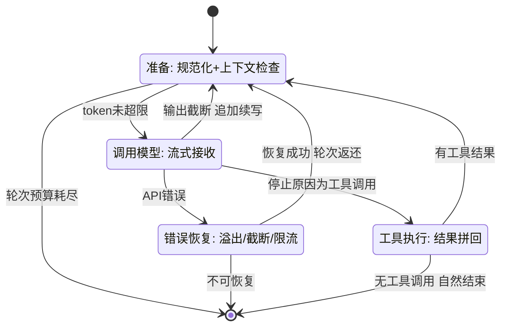
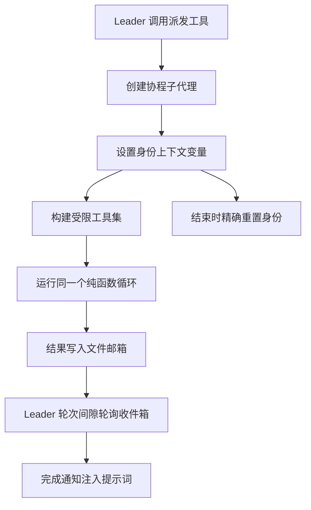
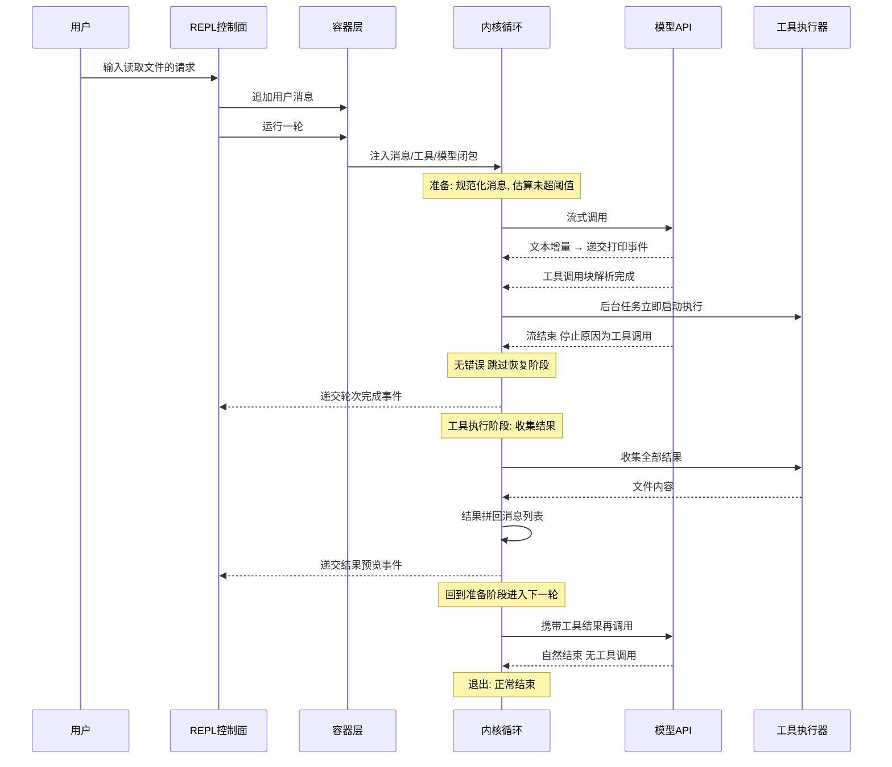

# 编排与主循环

## 读前思考

- 同一个主循环至少要被四种场景驱动：交互式 REPL、一次性命令行管道、子代理内部调用、单元测试的模拟注入。你是写四个循环，还是一个循环加四个适配器？如果选后者，循环本身应该持有什么状态，又把什么留给外部？
- 委派子任务时如果选择不 fork 新进程、让子代理和父代理共享同一个事件循环，你靠什么隔离它们的身份？子代理完成后，结果用什么方式送回父代理——阻塞等待，还是异步的消息机制？

## 核心问题

编排与主循环解决的核心问题是：**在一个循环中反复迭代"调用模型 → 解析响应 → 执行工具 → 拼回结果"，直到模型主动结束或预算耗尽，并让同一个循环被多种调用方复用、支持轻量的同进程委派。**

claudecode 的定位是把循环做成可复用的内核：控制面负责装配依赖，容器层持有可变状态，内核是一个不持有任何长期状态的纯函数状态机。调度侧同样走轻量路线——同进程协程隔离加文件邮箱，编排决策交给提示词。

| 维度 | claudecode 的选择 |
|------|------------------|
| 循环结构 | 纯函数异步生成器，四阶段状态机 |
| 分层 | 控制面装配 / 容器层持状态 / 内核纯函数 |
| 终止判断 | 轮次计数器 + 模型自然结束 |
| 错误恢复 | 三级分派（溢出/截断/限流）+ 轮次返还 |
| 调度 | 协程上下文变量隔离 + 文件邮箱 + 提示词协调 |
| 中断 | 循环不处理排队，外层 REPL 负责 |

## 方案展示

### 设计选择一：纯函数状态机 + 容器分离

循环分三层。控制面装配所有运行时依赖（工具注册表、提示词、钩子、权限）；容器层（源码：QueryEngine）持有消息列表、客户端、模型等可变状态，提供三个入口——一次性模式（自动包装用户文本）、REPL 模式（在现有对话上直接跑一轮）、子代理模式（接收预构建的消息列表）；内核（源码：query_loop）是一个顶层异步生成器纯函数，接收消息列表、系统提示、工具注册表、模型调用闭包等全部依赖作为参数，内部的轮次计数、重试计数是局部变量，每次调用独立。它不引用任何界面模块、不写标准输出、不保存文件——只向外递交事件。

这个选择最直接的收益是复用。子代理创建时只需传入新的消息列表和不同的模型调用闭包，不需要复制任何引擎状态；测试时注入一个返回预设事件序列的模拟闭包即可完全绕开真实 API 调用。

**为什么这么选**：如果状态与循环耦合，每次创建子代理都要复制整套环境；拆开后循环成了"只需传消息和闭包"的纯函数。**牺牲了什么**：装配复杂度转移到上层——引擎构建时要解决"模型调用工厂需要引擎实例、引擎构造又需要工厂"的循环依赖（用可变引用占位后回填解决），不理解整条依赖链的人容易漏掉注册步骤；事件驱动的输出方式要求所有调用方实现事件消费循环。事件协议作为可替换的控制面接口（外部界面如何消费事件）见 01-gateway。

### 设计选择二：四阶段循环 + 三级错误恢复

每轮循环分四个阶段：准备（消息规范化加上下文检查）、调用模型（流式接收）、错误恢复、工具执行。阶段之间通过三个回到起点的路径形成循环，通过三个退出条件跳出：模型自然结束、轮次预算耗尽、错误不可恢复。

错误恢复按类型三级分派。上下文过长（请求被拒）触发响应式压缩，只尝试一次防止"压缩-重试-压缩"死循环；输出被长度上限截断分两步走——先放大输出上限重试，仍截断则把已生成内容拼回对话并追加"请从上次停下的地方继续"，有独立的重试次数上限；限流等瞬时错误做线性退避重试。核心设计是**可恢复错误不消耗轮次预算**：恢复成功后撤销这一轮的计数，预算只统计有效的模型交互，另设独立的重试计数防止无限重试。三个计数器（轮次、重试、截断恢复）相互独立、各有阈值。

**为什么这么选**：三条回到起点的路径对应三种性质不同的恢复——错误重试要回退轮次计数，截断续写要保留已生成内容，工具结果拼回则两者都不动；分开表达让读者从路径位置就能推断当前处于哪种恢复。**牺牲了什么**：阅读者需要追踪每条路径之前的消息状态与计数器状态；压缩在准备阶段主动检查、在恢复阶段被动触发，估算不含系统提示与工具 schema、系统性偏低，靠固定缓冲区吸收误差（压缩的摘要形态与失败降级见 05-context）。

### 设计选择三：同进程轻量调度——协程隔离、文件邮箱、提示词协调

子代理（源码：InProcessTeammate）不 fork 进程，而是在同一事件循环中以独立协程运行。身份隔离靠协程上下文变量（源码机制：contextvars）：每个子代理在入口设置自己的身份变量，结束时精确重置，多个子代理以并发任务形式运行，各自持有独立的上下文副本和消息列表。子代理直接调用同一个纯函数循环，复用父代理的模型调用工厂。

工具集不是父代理的完整复制：排除"再生成子代理"的工具（物理防递归）、排除需要终端交互的提问工具、排除团队管理工具；消息发送工具被注入当前子代理的身份，发件人自动正确。权限上子代理采用自动允许编辑的非交互模式——后台运行不能打断用户要求确认，高危命令在非交互模式下直接拒绝（非交互权限的审批语义见 09-guardrails）。

通信用文件邮箱（源码：TeammateMailbox）：每个代理一个 JSON 收件箱文件，发送是"读取收件人文件 → 追加消息 → 写回"，接收是过滤未读并标记已读。leader 的消费方式是轮询——每轮开始前检查收件箱，把完成通知注入提示词，不是实时推送。编排决策完全由提示词驱动：协调器不做任何编排逻辑，只在系统提示前注入一段指令，告诉模型"你应该分解任务、派发协作者、收集结果后汇总"，实际决策由模型自主完成。

**为什么这么选**：同进程避免了进程间通信与进程管理的复杂度；文件邮箱虽然慢，但极其简单、可调试（直接查看文件就能看到消息历史），且天然支持未来跨进程扩展；编排决策需要智能（怎么分解、哪些可并行），硬编码的编排逻辑无法适应任意任务。**牺牲了什么**：隔离不彻底——共享进程内存，一个子代理的未捕获异常可能影响整个进程；文件邮箱没有锁，并发写入窗口期后写覆盖先写会丢消息；编排质量取决于模型的指令遵循能力，模型不遵循时系统退化为单代理（不出错，只是失去并行收益）。

### 设计选择四：流式提前执行与两层并发控制

传统实现等响应完整返回后才开始执行工具；claudecode 在流式接收过程中，一旦某个工具调用块完整解析出来，就立即在后台任务中启动执行——模型返回三个工具调用时，第一个在第二个还在传输时就已开始。并发控制分两层：全局信号量限制最大并发数；每个工具声明自己是否并发安全（只读工具安全，写文件和执行命令不安全），非并发安全工具执行期间设置独占标记，即使并发安全的工具也必须排队，防止读到写了一半的文件。工具执行的完整生命周期（结果预算、超时、注册）归 07-tools，本篇只讲循环侧的调度入口。

**为什么这么选**：提前执行把工具耗时从"响应完成后开始"提前到"流式接收中"，多工具批次的总耗时显著缩短。**牺牲了什么**：并发正确性依赖工具诚实声明自己并发安全——框架不做运行时校验，一个有副作用的工具错误声明安全就可能出现竞态；这是有意的信任边界选择，换取更简单的调度逻辑。

## 核心机制执行流：一轮完整的工具调用

以用户输入"读取主文件"为例：

**阶段一：准备。** 内部消息先规范化为 API 格式（保证角色交替、工具调用与结果配对），再按字节折算估算 token 量——零成本、每轮都能算；达到"窗口减固定缓冲"阈值时触发压缩（机制见 05-context）。

**阶段二：调用与提前执行。** 流式接收中，文本增量立即递交给消费方逐字打印；工具调用块一旦完整解析就在后台启动。停止原因决定下一阶段走向。

**阶段三：恢复（有错误时）。** 溢出错误触发一次性响应式压缩；截断走"放大上限 → 追加续写"两步；限流线性退避。恢复成功则返还轮次计数回到准备阶段。

**阶段四：拼回。** 收集工具结果，以用户角色消息追加到对话（API 要求工具结果挂在用户消息中）。富内容解析失败降级为纯文本，不因单个工具的格式问题阻塞循环。

**边界路径——压缩失败**：连续压缩失败超过阈值后不再触发，避免死循环浪费 API 调用；消息条数过少时直接放弃压缩。

**边界路径——子代理失败**：子代理的循环即使抛错，错误信息也会记录并通过邮箱送达 leader，leader 看到的是错误文本而非静默无响应，可据此决定重试或换策略。

## 子代理提示词结构

编排行为由两段提示词定义，都不在主提示词拼装链中，而是协作模式下单独注入：

| 部分 | 内容 |
|------|------|
| 协调器指令 | 角色定义（分解任务、派发协作者、综合结果）、可用工具、并发策略（读并行写串行）、四阶段工作流（研究→综合→实施→验证）、任务描述编写指南（自包含原则） |
| 协作者附加段 | 通信规则（必须用消息工具、纯文本回复队友不可见）、身份信息、任务生命周期（接收→执行→汇报→等待）、协作约束（不改他人编辑中的文件） |

子代理没有指定自定义指令时使用默认工作指令：完成任务不半途而废、不过度工程、简洁汇报。子代理的轮次预算比主代理小，且不开压缩——假设单个子任务的上下文够短（子代理压缩配置的取舍见 05-context）。

## 工程优化

**防御性多层兜底**：工具异常在单工具执行处转为错误结果，不中断循环；结果收集处再包一层异常捕获防止取消错误逃逸；空工具结果补充占位文本避免 API 拒绝请求；未知工具名返回错误结果让模型自行处理；消息规范化能把因压缩或中断损坏的对话自我修复为 API 兼容格式。

**身份变量的精确重置**：子代理结束时用令牌机制重置上下文变量而非直接清空，保证嵌套场景下的正确性——内层重置不会破坏外层身份。

**预算分级**：子代理轮次上限低于主代理；截断续写的输出上限从较小值起步、首次截断后才放大——短对话不为长输出场景买单。

**通信的简单性兜底**：文件邮箱丢消息的风险在当前规模（通常两五个子代理、完成时间错开）下极低；若规模扩大，加文件锁即可，不需要换架构。

## 面试要点

**1. 为什么选纯函数状态机而不是把状态放在循环类的成员变量里？什么情况下这层抽象可以砍掉？**

参考答案方向：直接持有状态更简单、接线成本低，适合单场景代理。claudecode 拆分的主要驱动力是子代理与测试——子代理需要独立循环，如果状态与循环耦合，每次创建都要复制整套环境；拆开后只需传入新的消息列表和模型调用闭包。代价是装配层的循环依赖解除成本。如果业务中没有子代理、没有多入口、没有模拟测试的需求，这层抽象可以砍掉。判断标准是"循环是否需要在运行时被多个不同配置的调用方驱动"：是就拆，单入口就不拆。

**2. 三个回到起点的路径能不能合并成一个？**

参考答案方向：三条路径对应三种性质不同的"回到起点"——错误重试要回退轮次计数并重新规范化消息，截断续写要保留已生成内容且不动计数器，工具结果拼回两者都不动。合并意味着每次回到起点前都要判断"这次是哪种恢复"，条件分支不会减少，状态机语义反而更模糊——读者无法从路径位置直接推断当前恢复类型。判断标准是"路径间是否共享前置操作"：不共享就分开表达，共享才合并。

**3. 文件邮箱在并发写入时会丢消息，为什么不用内存队列？**

参考答案方向：内存队列只能在同一事件循环内使用且不支持持久化。当前实现虽然主要是同进程，但架构预留了跨进程扩展；换成内存队列，跨进程场景就要完全重写通信层。文件方案天然支持跨进程、进程重启后消息仍在、可直接查看调试。丢消息风险在当前规模下极低（子代理数量少、完成时间错开），真要解决加一个文件锁即可，不需要换架构。判断标准是"通信频率 × 未来跨进程需求"：高频低延迟选内存队列，低频可扩展选文件。
