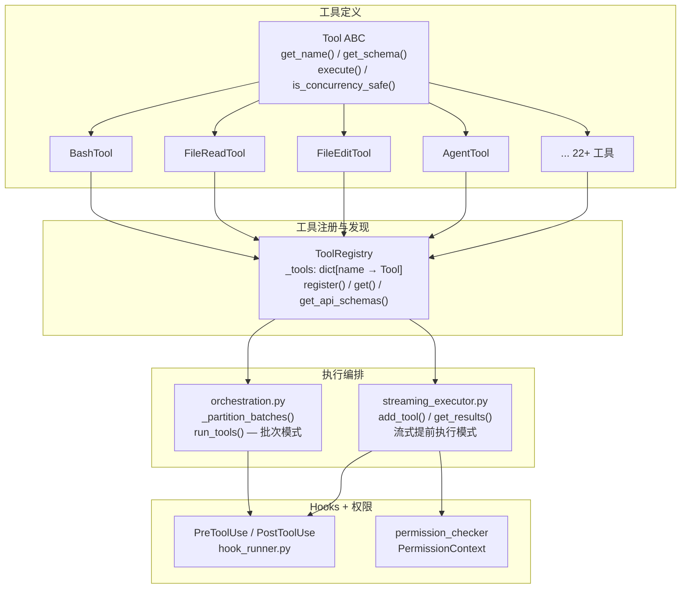
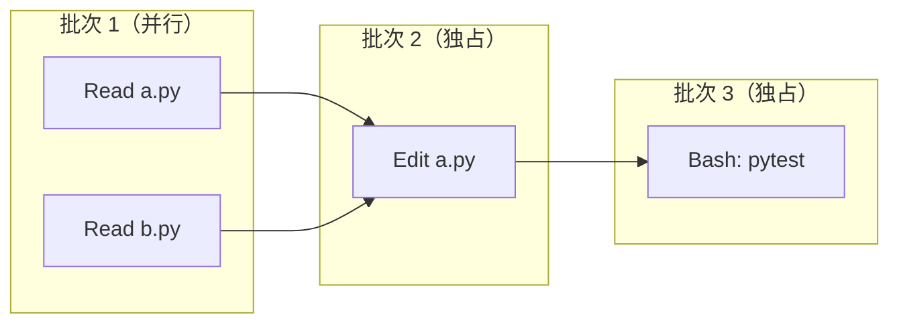
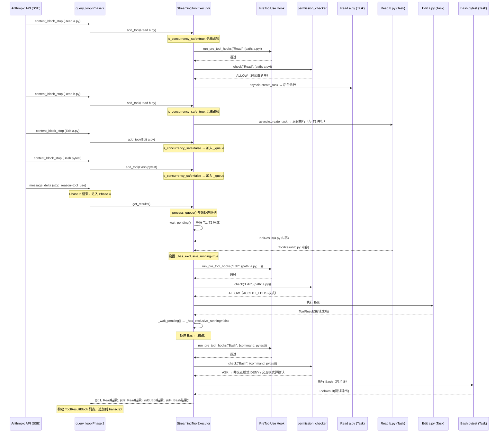

# 工具系统

## 读前思考

一个 Agent 的工具系统最直觉的实现就是一个 switch-case：模型说要调 Bash，你就跑 Bash；说要读文件，你就读文件。问题是当你有 22 个工具、每个工具有不同的并发安全特性、执行前后需要触发用户配置的 hooks、而且工具集在运行时可能动态变化（MCP 工具随时加入或移除）时，switch-case 就不够了。你怎么设计一个注册-发现机制，让编排层完全不需要知道具体有哪些工具？

另一个值得想的问题：模型一次返回 5 个工具调用，其中 3 个是 Read、1 个是 Edit、1 个是 Bash。你是全部串行执行（简单但慢），还是全部并行（快但可能读到写了一半的文件），还是有第三种策略？

## 核心问题

工具系统解决的是「如何定义、注册、发现、编排和执行 Agent 的工具调用，同时保证并发安全和错误隔离」。claudecode 用 ABC + Registry 模式做定义与发现，用批次分组算法做并发编排，用 error-as-value 模式做错误隔离。整个系统分两层：orchestration.py 做批次编排（API 响应完整返回后执行），streaming_executor.py 做流式执行（API 还在返回时就开始执行）。

## 方案展示

### 设计选择 1：ABC + Registry 的注册-发现模式

Tool 是一个抽象基类，定义了四个接口契约：get_name() 返回工具的唯一标识符（API 层面用于匹配 tool_use 响应），get_schema() 返回 JSON Schema 格式的工具描述（告诉模型这个工具能做什么、接受什么参数），execute() 执行工具并返回 ToolResult，is_concurrency_safe() 声明此工具是否可以与其他工具并发执行。新增工具只需继承 Tool 实现这四个方法，无需修改编排层任何代码。

ToolRegistry 是一个 dict[name → Tool] 的薄封装，提供 register()、get()、list_tools()、get_api_schemas() 四个操作。get() 返回 None 而非抛异常——因为 API 可能返回未注册的工具名（MCP 工具被移除、模型产生幻觉工具名），调用方将 None 转为 ToolResult(content="Error: Unknown tool", is_error=True) 让模型自行处理。register() 禁止重复注册同名工具，因为工具名是 API 层面的路由键。

这个模式的核心收益是工具集可以在运行时动态组装。子 agent 的 registry 排除 AgentTool（防止无限递归创建子 agent），后台 agent 的 registry 排除交互式工具（如 AskUser），MCP 工具在连接建立后动态注册、断开后移除。query_loop 通过 registry.get(name) 查找工具，完全不持有具体工具实例的引用。

代价是 is_concurrency_safe() 的正确性完全依赖工具作者的声明。框架层没有运行时校验——如果一个有副作用的工具错误返回 True，编排层会允许它并发执行，可能导致竞态条件。这是一个有意的信任边界选择：换取更简单的调度逻辑，代价是需要代码审查来保证声明正确。

### 设计选择 2：批次分组 + 并发/串行混合编排

当模型在单次响应中返回多个 tool_use 时，orchestration.py 的 _partition_batches() 将工具调用序列按并发安全性分组为多个批次。算法很简单：遍历工具列表，连续的并发安全工具合并为一个批次，遇到非并发安全工具时先刷出当前批次，然后将该工具作为独立的单元素批次。

例如输入 [Read, Read, Edit, Read, Bash] 分组为 [[Read, Read], [Edit], [Read], [Bash]]。执行时同一批次内用 asyncio.gather 并行（受 Semaphore(10) 限制最大并发数），不同批次之间严格顺序。这保证了 Edit 执行时没有其他工具在并行运行，避免了"读到写了一半的文件"。

以模型流式返回 [Read a.py, Read b.py, Edit a.py, Bash pytest] 为例，trace StreamingToolExecutor 的完整执行流：

这个 trace 展示了几个关键时序：Read 在 API 还在传输 Edit 参数时就已经开始执行（流式提前执行的收益）；Edit 到达时因为非并发安全被排队，直到 get_results() 时才执行；Edit 执行前必须等 T1、T2 全部完成（独占语义）；Bash 的权限检查在交互模式下会阻塞等待用户确认。

BashTool 的 is_concurrency_safe() 实现值得注意：它不是简单地返回 False，而是解析 command 参数，对只读命令（ls、cat、git status 等白名单）返回 True 允许并发，对写命令返回 False 要求独占。这让多个 git status 或 cat 可以并行执行，而 rm 或 sed 必须串行。

streaming_executor.py 是批次编排的流式演进版本。传统模式需要等 API 响应完整返回后才开始执行工具，而 StreamingToolExecutor 在 API 流式返回过程中，一旦某个 tool_use block 完整解析出来就通过 asyncio.create_task 在后台启动。并发控制分两层：底层 Semaphore(10) 限制全局并发数，上层 _has_exclusive_running 独占标记确保非并发安全工具执行期间所有其他工具（包括并发安全的）都排队。

代价是两套编排逻辑（orchestration.py 和 streaming_executor.py）有重复的 hooks 调用和错误处理代码。它们共享 _execute_one 的核心逻辑（查找 → PreHook → 执行 → PostHook），但调度策略不同。如果修改 hooks 语义，两处都要改。

### 设计选择 3：error-as-value 的错误隔离

工具执行失败时不抛异常到外层，而是返回 ToolResult(content="Error: ...", is_error=True)。这个设计贯穿整个工具系统：_execute_one 用 try/except 包裹 tool.execute()，任何未捕获异常转为错误 ToolResult；StreamingToolExecutor.get_results() 对每个 task 的 await 再做一次 try/except 防止 CancelledError 逃逸；工具未注册时返回错误 ToolResult 而非抛 KeyError。

模型看到 is_error=True 的结果后自行决定下一步——重试、换参数、或向用户解释。整个 query_loop 不会因为单个工具的崩溃而中断。代价是模型可能做出错误决策（比如反复重试同一个失败的工具），需要轮次预算（max_turns）来兜底。另外错误信息是字符串而非结构化类型，调用方无法程序化地区分"权限不足"和"文件不存在"——只能靠模型理解自然语言错误描述。

## 工程优化

**ToolResult 支持富内容。** content 字段是 str | list[dict] 联合类型，允许工具返回图片（base64）、MCP 结构化结果等富内容。text 属性提供统一的文本提取接口，无论 content 是哪种类型都能获取文本摘要——hooks 的 PostToolUse 回调和 UI 预览都用这个属性，不需要关心富内容格式。

**输出大小限制。** BashTool 限制子进程输出为 200KB（MAX_OUTPUT_BYTES），超时默认 2 分钟。这防止了 cat 一个巨大文件或无限循环命令撑爆内存和上下文窗口。超限输出被截断而非报错，模型看到截断标记后知道需要换策略。

**工具注册分三层。** main.py 的 _build_registry() 将工具分为 Tier 1（文件操作，随启动绑定）、Tier 2（扩展工具，lazy import 减少启动时间）、Tier 3（协作工具，需要 call_model_factory 运行时注入）。Tier 3 工具需要"二次布线"——先注册骨架版，_build_engine() 创建运行时组件后用完整版覆盖。

**Semaphore 防止资源耗尽。** 即使批次中有 20 个并发安全工具，Semaphore(10) 确保同时执行的不超过 10 个。这对文件系统操作尤为重要——过多的并发 I/O 可能导致文件描述符耗尽或磁盘 I/O 饱和。

## 面试要点

**追问 1：为什么用 ABC + Registry 而不是更简单的函数式注册（比如装饰器 + 全局字典）？** 两种方案都能工作。装饰器方案更 Pythonic，注册代码更简洁（@register_tool 一行搞定）。claudecode 选 ABC 的主要原因是工具需要携带状态（BashTool 持有 cwd，AgentTool 持有 call_model_factory 和 parent_registry），且需要多态的 is_concurrency_safe(input) 根据输入动态判断。纯函数方案需要额外闭包或全局状态来管理这些依赖。另外 ABC 让接口契约显式化——新工具的开发者看到抽象方法就知道必须实现什么，而装饰器方案的接口是隐式的。代价是每个工具都要写一个 class，对于简单工具（如 TodoWrite）显得冗长。

**追问 2：批次分组算法为什么不用更细粒度的依赖图（DAG）调度？** DAG 调度需要知道工具之间的数据依赖关系（比如 Read 的结果被 Edit 使用），但 claudecode 的工具调用是无状态的——每个工具只接收模型给的 input 参数，不直接消费其他工具的输出。工具间的"依赖"完全由模型在下一轮根据上一轮结果决定。在这个前提下，批次分组（并发安全 vs 非并发安全）已经是最优策略：它不需要分析依赖关系，只需要一个布尔声明，就能保证写操作的原子性。DAG 调度的复杂度（拓扑排序、环检测）在这里没有收益。

**追问 3：streaming_executor 的流式提前执行相比批次模式，实际能省多少延迟？有什么场景下反而更慢？** 省多少取决于工具执行时间和 API 流式传输时间的重叠度。如果模型返回 3 个 Bash 命令（每个耗时 5 秒），传统模式需要等 3 个都解析完（~1 秒流式传输）再串行执行（15 秒），流式模式在第 1 个解析完就开始执行，总时间约 11 秒——省了约 4 秒。但如果工具执行极快（如 Read 只需 10ms），流式提前执行的收益可忽略，反而因为 asyncio.create_task 的调度开销和独占标记的判断逻辑增加了微量延迟。另外如果第一个工具是非并发安全的（如 Edit），流式模式下它会立即独占执行，后续到达的 Read 必须排队——这和批次模式的行为一致，没有额外收益。
