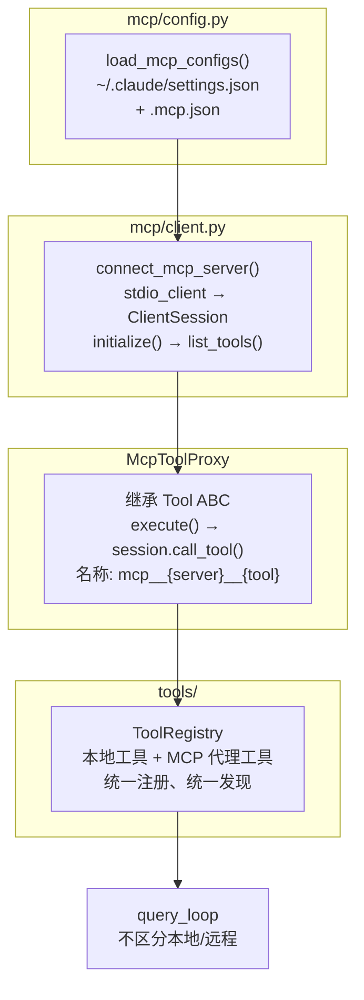
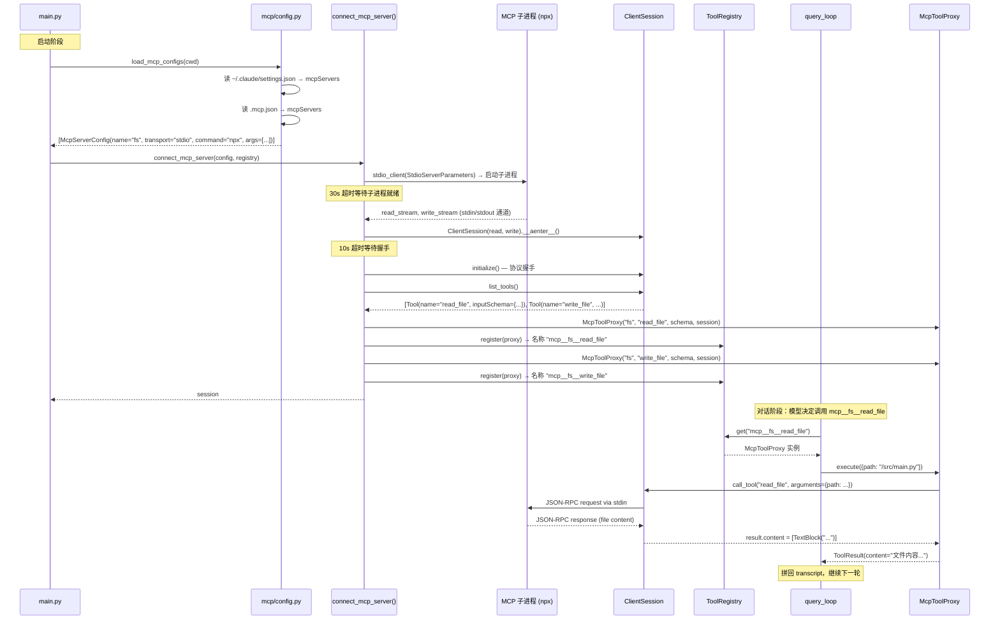

# MCP 集成

## 读前思考

MCP（Model Context Protocol）的核心承诺是：Agent 可以像调用本地工具一样调用远程服务器上的工具。问题是"像本地工具一样"这句话隐藏了大量复杂性——远程工具的名称怎么和本地工具区分？连接断了怎么办？远程工具的并发安全性谁来保证？如果你已经有一个 ToolRegistry 管理 22 个本地工具，MCP 工具是另建一套注册体系，还是想办法塞进同一个 Registry？

另一个问题：MCP 支持 stdio、SSE、HTTP 三种传输方式，但 claudecode 只实现了 stdio。这是偷懒还是有意为之？stdio 模式意味着每个 MCP 服务器都是一个子进程——这对启动时间和资源管理意味着什么？

## 核心问题

MCP 集成解决的是「如何将远程 MCP 服务器提供的工具透明地接入本地工具系统，使 query_loop 无需区分本地工具和远程工具」。claudecode 用代理模式（McpToolProxy）将每个远程工具包装为本地 Tool 实例，注册到同一个 ToolRegistry 中。整个 MCP 层只有两个文件：mcp/config.py 做配置加载，mcp/client.py 做连接和代理。

## 方案展示

### 设计选择 1：代理模式 + 统一注册

McpToolProxy 继承 Tool ABC，实现与本地工具完全相同的四个接口。get_name() 返回 mcp__{server_name}__{tool_name} 格式的全局唯一名称（双下划线分隔避免与工具名中的单下划线冲突），execute() 内部通过 MCP ClientSession 发送 RPC 调用到远程服务器，将结果转换为本地 ToolResult。注册到 ToolRegistry 后，query_loop 通过 registry.get(name) 查找时完全不知道这是一个远程代理。

这个选择的核心收益是零侵入：编排层（orchestration.py、streaming_executor.py）、hooks 系统、权限系统都不需要为 MCP 做任何特殊处理。MCP 工具和本地工具走完全相同的执行路径——PreToolUse hook 可以拦截 MCP 工具，Semaphore 同样限制 MCP 工具的并发数，ToolResult 的 is_error 机制同样兜底 MCP 调用失败。

以启动时连接一个 filesystem MCP 服务器并在对话中调用其工具为例，trace 完整流程：

这个 trace 展示了两个阶段：启动时的连接-注册流程（子进程启动 → 握手 → 获取工具列表 → 创建代理 → 注册），和对话时的透明调用流程（query_loop 通过 registry 查找到代理 → 代理通过 session 发 RPC → 结果转为 ToolResult）。query_loop 完全不知道这是一个远程工具。

代价是 MCP 工具的生命周期与 session 绑定。McpToolProxy 持有 ClientSession 引用，如果 MCP 服务器进程崩溃或被用户手动终止，session 失效后所有代理工具的 execute() 都会抛异常（被 try/except 转为错误 ToolResult）。没有自动重连机制——用户需要重启 claudecode 才能恢复 MCP 连接。

### 设计选择 2：仅支持 stdio 传输

connect_mcp_server() 在检查 config.transport != "stdio" 时直接返回 None 并记录警告。这不是遗漏——stdio 是 MCP 生态中最成熟的传输方式，绝大多数 MCP 服务器（filesystem、git、database 等）都通过 npx 或 python 子进程启动。SSE 和 HTTP 传输需要额外的连接管理（心跳、重连、认证），复杂度显著上升，而收益有限（本地开发场景下 stdio 延迟已经足够低）。

stdio 模式的工作方式是：用 StdioServerParameters 描述子进程的启动命令和参数，通过 stdio_client 启动子进程并建立 stdin/stdout 通信通道，然后在通道上创建 ClientSession 完成协议握手。连接超时设为 30 秒（防止服务器启动卡住），session 初始化超时 10 秒。

代价是每个 MCP 服务器都是一个独立的子进程。如果用户配置了 5 个 MCP 服务器，启动时就要 fork 5 个子进程并等待它们全部就绪。任何一个服务器启动失败（命令不存在、依赖缺失）都不会阻塞其他服务器——connect_mcp_server 的 except 块捕获所有异常并返回 None，确保单个服务器的失败不影响整体启动。

### 设计选择 3：配置的双源加载

load_mcp_configs() 从两个来源加载配置：用户级 ~/.claude/settings.json 的 mcpServers 字段（跨项目共享的通用工具），和项目级 .mcp.json 文件（随代码版本控制的项目专属工具）。两者都有效，项目级追加在用户级之后。同名服务器在两处都有定义时不做去重，都会被加载——工具名通过 mcp__{server}__{tool} 格式天然隔离，但如果 server_name 也相同就会触发 register() 的重复注册检查（ValueError 被捕获后跳过）。

配置解析兼容两种 key 名（"type" 新版格式和 "transport" 旧版格式），只允许已知的传输类型（stdio/sse/http），缺少必要字段（stdio 缺 command、sse/http 缺 url）时跳过并记录警告。这种防御性解析确保配置文件中的错误条目不会导致整个 MCP 系统崩溃。

## 工程优化

**MCP SDK 可选依赖。** connect_mcp_server() 在 import mcp 失败时优雅降级（记录警告并返回 None），不阻塞主程序启动。这意味着用户不安装 mcp 包也能正常使用 claudecode 的所有本地工具，只是 MCP 功能不可用。

**富内容透传。** McpToolProxy.execute() 解析远程工具返回的多种内容类型：text 块提取文本，image 块转换为 Claude API 的 base64 图片格式。如果返回内容包含非文本块，以 list[dict] 格式返回 ToolResult（保留结构化信息）；纯文本则拼接为字符串返回（减少不必要的复杂度）。

**并发安全假设。** McpToolProxy.is_concurrency_safe() 无条件返回 True，假设每次 RPC 调用都是独立的，远程服务器自行处理并发控制。这个假设对无状态工具（如搜索、查询）成立，但对有状态的远程工具（如数据库写入）可能不成立。框架层无法校验这个假设。

**连接超时分两级。** stdio_client 启动子进程超时 30 秒（某些 npx 包首次运行需要下载依赖），ClientSession 初始化超时 10 秒（协议握手通常很快）。两级超时避免了"服务器进程启动了但握手卡住"和"服务器根本没启动"两种不同故障的混淆。

## 面试要点

**追问 1：为什么把 MCP 工具塞进同一个 ToolRegistry 而不是单独管理？** 统一注册的核心收益是零侵入——编排层、hooks、权限系统都不需要为 MCP 写特殊逻辑。如果单独管理（比如一个 McpRegistry），query_loop 就需要在查找工具时先查本地再查远程，hooks 需要两套触发路径，权限检查也需要区分来源。这些"如果"分支会在每个消费方引入复杂度。统一注册的代价是 MCP 工具的生命周期管理更隐晦——session 失效时工具仍然在 registry 中，只是 execute() 会失败。如果要实现自动重连或动态移除失效工具，就需要在 registry 层面增加生命周期钩子。

**追问 2：MCP 工具名用 mcp__{server}__{tool} 格式，如果模型在 tool_use 中返回了一个不存在的 MCP 工具名会怎样？** registry.get(name) 返回 None，_execute_one 将其转为 ToolResult(content="Error: Unknown tool 'xxx'", is_error=True)。模型看到错误后通常会在下一轮修正工具名或换一种方式完成任务。这和模型产生幻觉本地工具名的处理路径完全一致——MCP 没有引入额外的错误处理分支。但如果一个 MCP 服务器在对话中途断开（session 失效），工具仍在 registry 中，execute() 会抛异常被 try/except 捕获转为错误 ToolResult——模型可能反复尝试调用一个已经不可用的工具，直到轮次预算耗尽。

**追问 3：如果让你加 SSE 传输支持，架构上需要改什么？** 当前架构对传输方式的假设集中在 connect_mcp_server() 一个函数中。加 SSE 支持需要：在 config 解析中接受 url 字段（已有），在 connect 函数中根据 transport 类型分支（stdio 走子进程，SSE 走 HTTP 连接），创建对应的 ClientSession。McpToolProxy 不需要改——它只依赖 session.call_tool() 接口，不关心底层传输。真正的新复杂度在连接管理：SSE 是长连接，需要心跳保活、断线重连、认证 token 刷新。这些在 stdio 模式下不存在（子进程活着连接就在）。如果要做，建议在 connect 层增加一个 ConnectionManager 抽象，管理不同传输方式的生命周期差异。
