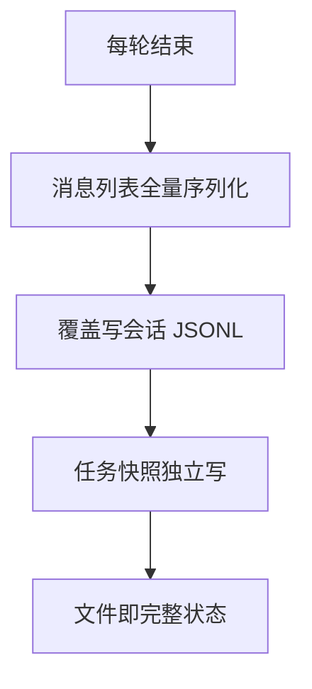
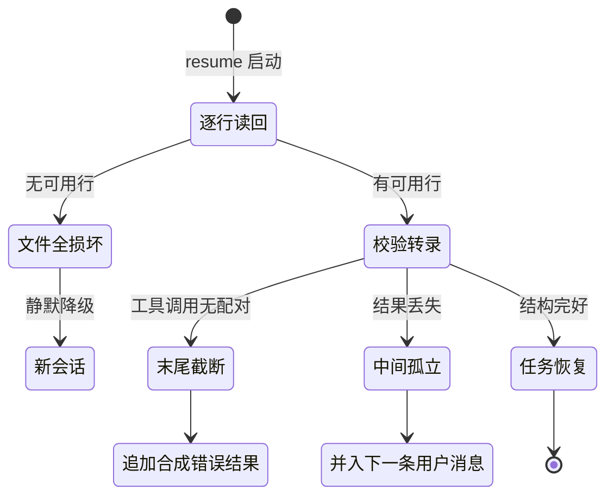

# 会话状态与持久化

## 读前思考

- 一个 CLI Agent 的会话本质是进程内存里的一份消息列表，进程一退出就没了。你会在什么时机把它写盘？如果每轮对话结束都整体重写整个文件，会话越长代价越高——这笔代价能换回什么？
- 崩溃可能发生在写文件写到一半、工具调用到一半、后台任务跑到一半。恢复时你打算修复到什么程度：精确重放到中断点，还是"修到模型能继续对话就行"？两种选择对工具执行副作用分别意味着什么？

## 核心问题

**如何以最小工程量为单用户 CLI 会话提供"崩溃后可继续"的持久化：把会话状态存成什么、什么时候存、崩溃后恢复到什么程度。**

claudecode 是四个项目里状态层最简的一档：会话即内存消息列表，每轮结束整体覆盖写一个 JSONL 文件；后台任务状态用独立 JSON 快照；没有数据库、没有增量写、没有运行中检查点，恢复只发生在进程重启后重新加载 transcript 的时刻，属批处理式持久化。它的价值在于把"最小可用"的边界画清楚了——单用户 CLI 不需要哪些能力，以及为了省下这些能力要付出什么。

| 维度 | claudecode 的选择 |
|------|------------------|
| 会话载体 | 内存消息列表 + 每轮全量覆盖写 JSONL |
| 任务状态 | 内存注册表 + 独立任务快照文件 |
| 检查点语义 | 压缩边界消息（transcript 内的一等消息类型）|
| 恢复动作 | 重启后修复 transcript，非终态任务一律判死 |
| 并发支持 | 无，同一会话不支持多进程共享 |

## 方案展示

### 设计选择一：全量覆盖写 JSONL，不做增量也不上数据库

会话每轮结束由外层 REPL 调用保存入口，把内存中的消息列表整体序列化、覆盖写进用户目录下的会话文件（源码：session/storage.py 的保存函数）。消息序列化走 API 格式往返，落盘格式与 Anthropic API 的消息结构一致，恢复后零转换。后台任务因为生命周期与会话不同步，单独存任务快照文件，避免每次会话落盘都携带任务数据。



**为什么这么选**：单进程、单用户、单会话，最硬的需求只是"重启后还能接着聊"。全量覆盖写让文件本身就是完整状态，没有事务、没有迁移、没有增量合并逻辑；崩溃最多留下半截行，读取时逐行解析、损坏行跳过即可兜底。**牺牲了什么**：写放大随会话长度线性增长（每轮重写全部历史），无法多进程共享会话，崩溃瞬间的文件可能是新旧内容混合的中间状态。

### 设计选择二：恢复即修复到 API 可接受，而非精确重放

恢复时先逐行读回 JSONL，再跑一遍转录校验（源码：validate_transcript）修复两种断裂：末尾截断——最后一条助手消息含工具调用却没有配对结果，追加一条合成的错误结果占位；中间孤立工具调用——某条助手消息的工具调用结果丢失，把合成结果并入下一条用户消息，纯文本内容转为混合列表。修复的目标不是还原现场，而是让消息序列满足 API 的配对要求。



**为什么这么选**：API 拒绝孤立的工具调用块，而重放被中断的工具存在副作用风险；合成一个标注为错误的占位结果，模型看到错误标记后可以自行决定重试。**牺牲了什么**：中断点的工作结果永久丢失，恢复粒度为整个 transcript——不能只续半个工具调用，也不能恢复运行中的后台任务。

### 设计选择三：任务注册表悲观恢复

后台任务用注册表维护状态（源码：session/task_registry.py），五种状态覆盖从登记到终止的完整生命周期。崩溃恢复时执行恢复入口：凡是不在终态集合（完成/失败/终止）里的任务，一律改判为终止。运行句柄字段刻意不参与序列化——它只在进程内存中有意义。

**为什么这么选**：进程已死，运行中的协程任务必然不存在，任何"恢复运行"的尝试都是在骗模型；直接判死让模型明确知道任务没了，不会产生幽灵任务误导后续决策。**牺牲了什么**：运行中的后台任务（比如一个正在执行的子代理）不可恢复，只能由用户重新发起。

## 核心机制执行流：一次崩溃后的会话恢复

以用户进程崩溃、重启后用会话 id 恢复为例：

```mermaid
sequenceDiagram
    participant U as 用户
    participant CLI as CLI 入口
    participant LD as 会话加载器
    participant VL as 转录校验器
    participant RG as 任务注册表
    participant LOOP as 主循环

    U->>CLI: 以恢复参数重启
    CLI->>LD: 按会话 id 逐行读回 JSONL
    LD->>LD: 跳过损坏行
    alt 全部损坏或文件不存在
        LD-->>CLI: 返回空, 静默降级为新会话
        CLI->>LOOP: 新会话开始
    else 有可用行
        LD->>VL: 校验转录完整性
        alt 末尾工具调用无配对
            VL->>VL: 追加合成错误结果占位
        else 中间孤立工具调用
            VL->>VL: 合成结果并入下一条用户消息
        end
        LD->>RG: 加载任务快照
        RG->>RG: 非终态任务全部判死
        VL-->>LOOP: 修复后的消息列表
        LOOP->>LOOP: 正常继续对话
    end
```

**阶段一：逐行读回。** 加载器逐行解析，任何一行解析失败即跳过——单行损坏不毁掉整个会话。这是全量覆盖写方案的第一道兜底。

**阶段二：转录校验。** 校验器检查消息序列的配对完整性。末尾截断走"追加合成结果"分支：合成结果标记为错误并带占位文本，模型读到的是"该工具调用失败了"而非"什么都没有"。中间孤立走"并入下一条用户消息"分支，保证每条助手消息的工具调用都有配对结果。

**阶段三：任务判死。** 任务快照恢复把非终态任务全部改判终止。会话文件与任务快照分写存在短暂不一致窗口——比如会话已落盘而任务快照还是旧的——悲观判死让这个窗口无害：多判死一个任务只是让用户重新发起，绝不会让模型误以为幽灵任务还活着。

**边界路径——文件全损坏：** 加载器返回空，恢复静默降级为新会话，不报错也不阻断启动。**边界路径——写盘时崩溃：** 文件可能留下半截行，由阶段一跳过；若恰好最后一条助手消息的工具调用结果没写进去，由阶段二合成修复。**边界路径——角色交替等 API 层违规：** 不在恢复阶段处理，交给下游的消息规范化入口，恢复只保证配对合法。

## 工程优化

**损坏行隔离**：逐行解析失败即跳过，单行损坏不毁掉整个会话，也不需要备份文件。

**落盘格式即 API 格式**：序列化往返与 API 消息结构一致，恢复后零转换；四种消息类型（用户/助手/压缩边界/系统）显式区分，压缩边界是一等消息类型，恢复时自然成为历史截断点（压缩机制见 05-context）。

**历史文件上限**：全局输入历史追加写并自动截断到固定条数，当前会话条目优先排序。

**一次性调用不持久化**：非交互的一次性调用模式不产生会话文件，避免垃圾文件堆积。

**轮内恢复与跨进程恢复分离**：输出截断走轮内重试（放大上限或拼接续写，见 03-orchestrator），不属于会话恢复的职责——两类恢复的触发时机和代价完全不同。

## 面试要点

**1. 全量覆盖写 JSONL、增量追加写、SQLite，为什么选全量覆盖？什么信号出现时该换？**

参考答案方向：全量覆盖的实现代价最低——文件即完整状态，无事务无迁移无合并；代价是写放大随会话长度线性增长。增量追加省写带宽，但"部分行可能是半截"的解析问题依然存在，还要处理覆盖语义；SQLite 解决并发写入和查询，但引入依赖和 schema 治理。换方案的信号是"会话平均轮次"和"并发写入者数量"同时上升：单用户短会话用全量覆盖完全合理，多用户长会话就必须换。判断标准是"会话平均轮次 × 并发写入者数量"。

**2. 恢复时为什么合成"错误"结果而不是重执行被中断的工具？**

参考答案方向：重执行的前提是副作用可重放——文件写入、网络请求、后台任务都不满足，重复执行可能造成双倍副作用；合成错误结果把"是否重试"的决策交给模型，模型看到错误标记可以自行决定换参数重试或放弃。代价是中断点的工作结果丢失，且模型可能把合成错误当真、基于错误信息继续决策。判断标准是"副作用可重放性 × 模型对错误标记的纠错能力"。

**3. 这套状态层接入 IM（多用户）最大的障碍是什么？**

参考答案方向：当前状态层是为"崩溃后恢复单用户会话"设计的——消息列表活在进程内存，保存与加载是批处理式全量覆盖。IM 场景需要按用户和频道维护独立会话、跨请求持久化、并发写入，这要求从"一个文件一个会话"升级到"会话管理器 + 按用户分片 + 并发控制"。内核循环本身可以复用（通道替换的论证见 01-gateway），会话状态层才是工程量的下限。判断标准是"并发会话数 × 跨请求持久化要求"。
