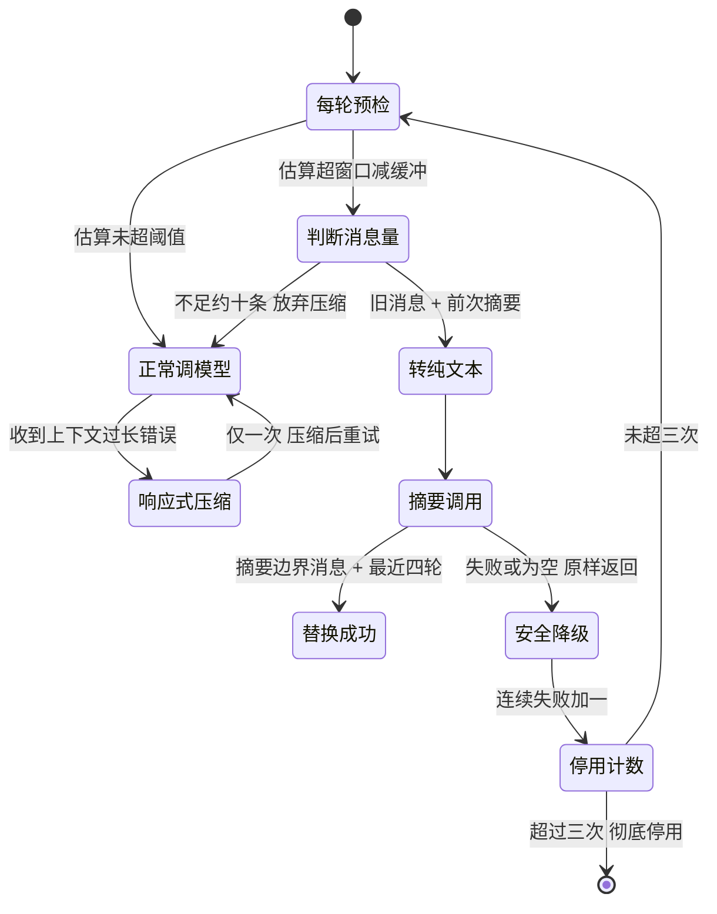
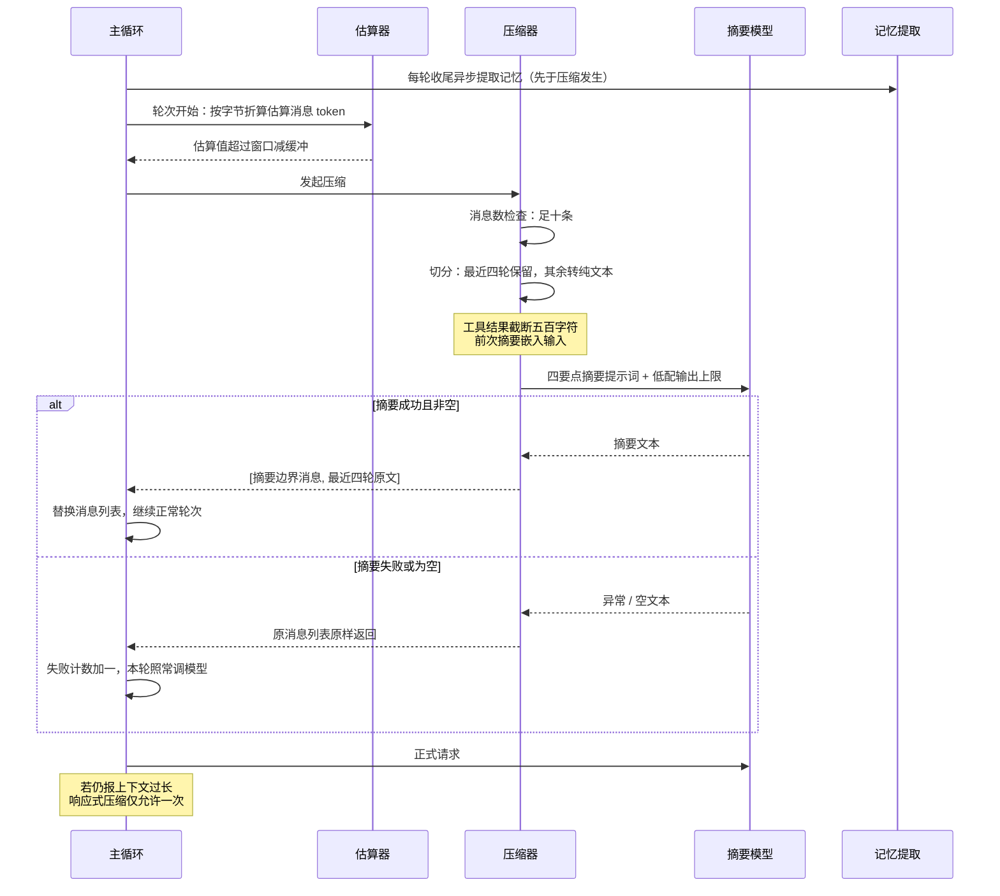

# 上下文工程

## 读前思考

- 一个 CLI 工具的每次会话，系统提示词都要从十几个来源拼装：角色定义、任务原则、运行环境、记忆指令、用户自己写的规则文件。拼装顺序重要吗？如果把每次都变的动态内容排在最前面，静态内容还能被缓存吗？
- 用户的规则可能分散在三层目录里——全局一份、项目每一级祖先目录一份、本地私有再一份，文件之间还能互相包含。全部合并注入提示词时，包含循环怎么防？谁的优先级最高？

## 核心问题

上下文工程解决的核心问题是：**在会话开始时一次性组装出缓存友好的系统提示词，并在窗口将满时用最简单的策略把历史缩小。** claudecode 是四个项目中上下文工程做得最轻的：组装一次成型、按缓存特性分三类排序，压缩只有一条主策略加两级兜底——这符合 CLI 短会话的定位，压缩是低频事件，复杂度收益比不划算。

| 维度 | claudecode 的选择 |
|------|------------------|
| 提示词结构 | 十一段，按静态 / 动态 / 条件三类排序 |
| 缓存策略 | 返回段落列表，API 层按独立缓存段传入 |
| 规则文件 | CLAUDE.md 三层来源 + 包含指令递归展开 |
| 组装时机 | 会话开始时组装一次 |
| 压缩触发 | 估算超"窗口 − 固定缓冲"，预检 + 响应式双时机 |
| 摘要形态 | 自由文本全量摘要，保留最近四轮 |
| 失败退路 | 原样返回 + 连续三次失败后停用 |

## 方案展示

### 设计选择一：三类十一段的系统提示词组装

系统提示词由提示词装配函数（源码：build_system_prompt）按固定顺序拼装，共十一个段落，分三类：七个静态段内容固定（取自段落常量库，与官方产品的提示词文本对齐），两个动态段每次构建重新生成，两个条件段按配置注入。

| 序号 | 段落 | 类型 | 核心内容 |
|------|------|------|----------|
| 1 | Intro | 静态 | 角色定义（交互式软件工程助手）+ 安全指令 + URL 生成限制 |
| 2 | System | 静态 | 系统行为规则：权限模式、提醒标签处理、注入防御、上下文自动压缩声明 |
| 3 | Doing tasks | 静态 | 任务执行原则：先读再改、不过度工程、失败后先诊断再换策略 |
| 4 | Actions | 静态 | 操作风险评估：可逆/不可逆区分，高风险操作执行前征求确认 |
| 5 | Using tools | 静态 | 工具使用偏好：专用工具优先于通用命令，无依赖的调用并行发出 |
| 6 | Tone/Style | 静态 | 输出风格：简洁、无 emoji、引用代码附文件与行号 |
| 7 | Output efficiency | 静态 | 输出效率：先结论后推理、跳过寒暄 |
| 8 | Environment | 动态 | 运行环境：工作目录、是否 git 仓库、平台、shell、日期、模型名 |
| 9 | Summarize | 动态 | 提醒模型把工具结果中的关键信息记入回复，因为原文可能被压缩清除 |
| 10 | Memory | 条件 | 记忆系统行为指令 + 记忆索引内容（仅配置了记忆目录时注入） |
| 11 | CLAUDE.md | 条件 | 用户自定义指令（仅规则文件存在时注入） |

装配函数返回的是段落列表而非拼接后的单字符串：API 层把每段作为独立的缓存控制段传入，静态段跨请求命中 prompt cache，动态段的变化只击穿自己那一段。CLAUDE.md 内容被刻意放在最末——在模型注意力分配上，越靠后的指令优先级越高，用户指令应当压过内置指令。

**为什么这么选**：CLI 会话开始时环境就确定了（目录、平台、模型），组装一次即可全程复用；三类排序让缓存命中边界清晰可控。**牺牲了什么**：会话中途的环境变化（如切换工作目录）不会反映到提示词；动态段的日期等信息每次会话都变，会话级缓存从动态段起失效。技能的提示词注入面（注入时机、被压缩掉的后果）见 07-tools.md，本篇只列它进入窗口的位置。

### 设计选择二：CLAUDE.md 层级发现与注入

用户规则文件的加载器（源码：load_claude_md）按三层来源从低到高发现并合并：

| 层级 | 来源 | 说明 |
|------|------|------|
| 用户全局 | 主目录下的 CLAUDE.md | 对所有项目生效 |
| 目录层级 | 从根目录到工作目录的每一级祖先：CLAUDE.md、隐藏目录下的 CLAUDE.md、隐藏 rules 目录中的全部规则文件（按文件名排序） | 越靠近工作目录优先级越高 |
| 本地私有 | 工作目录下的 CLAUDE.local.md | 通常被版本控制排除 |

合并顺序即优先级：先加载的内容排在前面，后加载的排在后面，本地私有文件最后加载、影响力最高。文件支持行首的包含指令（@路径），加载器递归展开目标文件内容，支持主目录、相对、绝对三种路径写法。递归带两重防护：已访问路径集合防止 A 包含 B、B 又包含 A 的循环；嵌套深度上限十层防止过深递归。任何读取失败（权限、编码）都静默跳过，不影响其他文件加载；文件中的 HTML 注释会被移除，供作者写不进提示词的隐藏备注。

**为什么这么选**：层级发现让项目规则自然融入——克隆项目即获得团队规范，无需任何配置步骤；本地私有层给个人偏好留出不上仓库的位置。包含指令让大规则集可以模块化组织。**牺牲了什么**：全部规则常驻系统提示词，规则文件越大静态尾巴越长，挤占会话空间；静默失败意味着拼写错误的包含指令不会有任何提示。配置体系本身（无集中配置的立场）见 01-gateway.md，本篇只讲规则文件如何进入窗口。

### 设计选择三：固定缓冲 + 保尾全摘要压缩

压缩的触发判断（源码：should_auto_compact）是"估算 token 超过窗口减去固定缓冲区"。token 不调 API 精确计数，而是按字节折算估算（纯文本和 JSON 结构化内容用不同折算率），零成本、每轮都能算；估算不含系统提示词和工具 schema，系统性偏低，靠固定缓冲区吸收误差。压缩主体（源码：compact_messages）的策略：消息总量不足约十条时直接放弃压缩；否则保留最近四轮对话原文，其余全部转纯文本喂给摘要模型——工具结果截断到五百字符后展开保留，之前压缩过的旧摘要作为"前次摘要"嵌入输入，防止更早信息彻底丢失。摘要提示词是自由文本四要点：关键决策、文件路径与代码位置、任务当前状态、未解决问题。产物是一条摘要边界消息加最近四轮原文。

触发时机有两个：一个是每轮开始前的预检，主动压缩；另一个是响应式——收到"上下文过长"类 API 错误后被动触发，且每次查询限定只能触发一次，避免压缩-重试-压缩的循环。失败时不改动消息：摘要异常或产出为空，原消息列表原样返回（安全降级）；连续失败累计超过三次，压缩功能整体停用。

**为什么这么选**：CLI 会话的长度普遍有限，压缩很少发生，策略越简单失败面越小、行为越可预测；字节估算虽然粗糙，但固定缓冲区加响应式兜底的组合足以覆盖估算误差。**牺牲了什么**：中间历史只剩一段自由文本，摘要质量无校验；保尾按轮数而非 token，遇到超长轮次时保留量失控。

## 核心机制执行流：一次完整压缩从触发到生效

以"长会话中估算首次越过阈值"为例：

**阶段一：预检估算。** 轮次开始时先做字节折算估算，零成本、不落 API。估算刻意不含系统提示词和工具 schema——它们相对稳定，且固定缓冲区已为其留出余量。

**阶段二：切分与摘要。** 压缩器先检查消息量是否值得压缩（不足约十条直接放弃），再按轮切分。按轮切天然安全：一轮包含用户消息和助手回复，不会切断工具调用对。转纯文本时工具结果展开但截断，防止摘要请求自身超限。

**阶段三：替换或降级。** 摘要成功则用边界消息加最近四轮替换原列表——压缩本身不消耗轮次预算，属于故障成本而非有效工作（轮次预算的完整讨论见 03-orchestrator.md）。摘要失败则原样返回，会话不中断，只累计失败计数；计数超过三次说明压缩路径持续不可用，彻底停用以避免每轮浪费一次注定失败的调用。

**边界路径——响应式压缩**：估算漏判、请求真的触发"上下文过长"错误时，走响应式分支：立即压缩一次并重试，用单次标记防止错误-压缩-错误的循环。这是预检估算的最后一道兜底。

**与长期记忆的接口**：claudecode 不做压缩前刷写，因为时序上不需要——记忆提取在每轮收尾时异步执行，提取读到的是压缩前的完整消息；等压缩发生时，本轮提取早已完成。记忆索引（MEMORY.md）在会话开始时随系统提示词一次性注入，内容来源与检索机制见 06-memory.md，本篇只讲注入时机。

## 工程优化

**估算误差由缓冲区吸收**：字节折算必然不准，设计上不追求精确，而是把缓冲区设为足够覆盖系统提示词和工具 schema 的量级——估算偏低多少，缓冲区就兜住多少，响应式压缩再兜住剩余漏网。

**前次摘要链式嵌入**：多次压缩的会话里，旧摘要不会随旧消息消失，而是作为文本嵌入下一次摘要的输入。信息随压缩次数逐层稀释，但关键事实有持续的存活通道。

**加载器静默失败**：CLAUDE.md 链上任何一个文件读取失败都只跳过该文件。规则注入是增强项而非必需项，单个坏文件不应阻塞整个会话启动。

**摘要调用低配化**：压缩用同一条模型调用闭包的低配版本（更小的输出上限），复用现有链路，不引入第二个客户端或配置面。

## 面试要点

**1. 系统提示词为什么按"静态 → 动态 → 条件"排序，而不是把最重要的内容放最前面？**

参考答案方向：两种排序优化不同目标。按重要性排序优化模型注意力，按缓存特性排序优化计费。claudecode 选择缓存排序的前提是：静态段本身已经覆盖核心行为约束，动态条件段更多是个性化增强；同时用"CLAUDE.md 放最末"部分补偿用户指令的注意力位置。如果把日期这类每天一变的内容排到第一段，后面所有静态内容的缓存全部作废。判断标准是"缓存段的价值密度 × 内容变化频率"：高频复用的静态内容排前面，低频变化的内容排后面，例外只有必须抢占注意力的用户指令。

**2. 按轮保留四条和按 token 保留预算，两种保留策略各有什么盲区？**

参考答案方向：按轮保留的盲区是轮次大小不均——如果最近四轮里有一轮包含巨型工具结果，保留量可能超出预期，压缩腾不出足够空间；按 token 保留的盲区是可能切断工具调用对，需要额外的切点吸附逻辑，且切点计算本身依赖精确计数。claudecode 用按轮是因为它配了响应式压缩兜底：保尾过大导致请求仍然超长时，响应式分支再压一次。判断标准是"计数精度 × 轮次大小方差"：计数粗糙但轮次均匀用按轮，计数精确但轮次悬殊用按 token。

**3. 连续三次压缩失败就彻底停用，会不会太激进？更温和的方案是什么？**

参考答案方向：激进的理由是失败成本不对称——每次失败的压缩都白付一次摘要调用，而压缩本身只是优化项，停用后会话仍能继续，最多最终触发响应式分支或窗口耗尽。温和方案可以改成指数退避重试或按会话重置计数，但在 CLI 短会话里，会话剩余轮次往往撑不到退避窗口结束，重试大概率是纯浪费。判断标准是"会话剩余长度 × 失败原因的可恢复性"：长服务会话值得退避重试（失败可能只是瞬时限流），短 CLI 会话直接停用更省。
