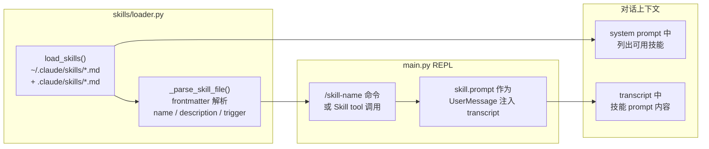

# 技能系统

## 读前思考

技能（Skill）和工具（Tool）都是"扩展 Agent 能力"的机制，但它们的扩展方式完全不同：工具给模型一个新的 action（读文件、跑命令），技能给模型一段新的 instruction（怎么组织代码审查、怎么写 commit message）。问题是：如果你要让用户用 Markdown 文件定义技能，这些 Markdown 应该在什么时机被加载？是启动时全部读进内存，还是用到时才读？加载后是注册为工具让模型主动调用，还是作为 slash command 让用户手动触发？

另一个问题：技能文件的格式要不要标准化？如果用户写了一个没有 frontmatter 的 .md 文件，你是报错、跳过、还是用文件名做默认值？

## 核心问题

技能系统解决的是「如何让用户通过 Markdown 文件定义可复用的 prompt 模板，并在对话中按需注入」。claudecode 的实现极简：skills/loader.py 一个文件，做三件事——从两个目录加载 .md 文件、解析可选的 YAML frontmatter、提供按名称查找。技能不是工具（不注册到 ToolRegistry），而是通过 slash command 触发后作为 UserMessage 注入 transcript。

## 方案展示

### 设计选择 1：prompt 注入而非工具注册

技能不注册为 Tool，不作为模型可以主动调用的 action。它的激活方式是用户通过 slash command 手动触发（/skill-name），触发后 skill.prompt 的完整内容作为一条 UserMessage 注入当前 transcript。模型在下一轮看到这条消息后，按照 prompt 中的指令行事。

这个选择定义了技能的本质：它不是给模型一个新能力，而是给用户一个"临时改变模型行为"的开关。用户决定何时激活哪个技能，模型不能自行选择。这与 Tool 的设计哲学相反——Tool 是模型自主决策调用的，用户只通过权限系统做门禁。

代价是技能无法被模型自主发现和组合。如果用户忘了触发某个技能，模型不会主动使用它。system prompt 中会列出可用技能的名称和描述（作为提示），但模型不能自己"调用"一个技能——它只能建议用户触发。另外技能 prompt 注入后成为 transcript 的一部分，会占用上下文窗口空间，长对话中可能被 auto-compact 压缩掉。

### 设计选择 2：frontmatter 可选 + 宽容解析

技能文件支持可选的 YAML frontmatter（被 --- 包围的头部区域），定义 name、description、trigger 三个元数据字段。没有 frontmatter 的文件以文件名（不含 .md 后缀）作为技能名，整个文件内容作为 prompt。frontmatter 解析不依赖 PyYAML 库，而是用简单的逐行 key: value 匹配——只支持最基础的格式，足以覆盖技能元数据的需求。

这种宽容设计降低了技能创作的门槛：用户只需要写一个 .md 文件放到 ~/.claude/skills/ 目录下，不需要学习任何格式规范就能立即使用。想要更精确控制时再加 frontmatter。prompt 为空的技能被跳过（没有意义的定义），文件不可读时静默跳过不影响其他技能加载。

代价是 frontmatter 解析能力有限——不支持多行值、嵌套结构、列表等 YAML 特性。如果用户的 description 中包含冒号（如 "description: A tool for: testing"），split(":", 1) 只取第一个冒号后的内容，不会出错但可能截断。另外没有 schema 校验，拼写错误的字段名（如 "desc:" 而非 "description:"）会被静默忽略。

### 设计选择 3：双目录搜索 + 确定性排序

load_skills() 按优先级搜索两个目录：~/.claude/skills/（用户级，跨项目共享）和 .claude/skills/（项目级，随代码版本控制）。每个目录内按文件名字典序排序（sorted），保证加载顺序的确定性——无论文件系统返回什么顺序，同一组技能文件总是以相同顺序加载。

项目级技能的设计意图是让团队可以通过代码仓库分发共享技能（如代码审查规范、commit message 格式），新成员 clone 项目后自动获得这些技能，无需手动配置。用户级技能则是个人偏好（如"我总是喜欢用 pytest 而非 unittest"）。

当前实现中两个目录的同名技能都会加载（不做去重），get_skill_by_name() 返回第一个匹配的（即用户级优先）。这意味着项目级技能无法覆盖同名的用户级技能——如果用户有一个叫 "review" 的个人技能，项目中的 "review" 技能永远不会被匹配到。

## 工程优化

**大小写不敏感匹配。** get_skill_by_name() 用 lower() 做比较，用户输入 /My-Skill 或 /my-skill 都能匹配到名为 "my-skill" 的技能。这减少了"记不住精确大小写"的摩擦。

**trigger 字段预留自动触发。** Skill dataclass 有 trigger 字段（如正则表达式），设计意图是未来支持根据用户输入自动匹配触发技能，无需手动 slash command。当前实现中 trigger 只被解析和存储，没有被任何匹配逻辑消费。

**零外部依赖。** 整个技能系统不依赖 PyYAML、markdown 解析器或任何第三方库。frontmatter 用正则 + 字符串分割解析，prompt 内容原样保留（不做 Markdown 渲染）。这确保了技能加载不会因为依赖缺失而失败。

## 面试要点

**追问 1：为什么技能不做成工具让模型自主调用？** 这是一个控制权归属的设计决策。工具是模型的 action space——模型决定何时调用什么工具，用户通过权限系统做事后门禁。技能是用户的行为指令——用户决定何时改变模型的工作方式。如果技能是工具，模型可能在不恰当的时机"调用"一个代码审查技能（比如用户只是想读个文件），或者在需要时忘记调用。把触发权交给用户（slash command），保证了技能只在用户明确需要时生效。代价是增加了用户的认知负担——需要记住有哪些技能可用、何时该触发。system prompt 中列出可用技能部分缓解了这个问题。

**追问 2：技能 prompt 注入 transcript 后会被 auto-compact 压缩掉，这算 bug 还是 feature？** 算 feature。技能 prompt 的目的是影响模型在当前任务中的行为，一旦任务完成（对话进入新话题），技能指令被压缩掉是合理的——你不希望三轮对话前触发的"代码审查模式"永远占据上下文空间。如果用户需要持续生效的指令，应该写在 CLAUDE.md 中（每次构建 system prompt 时都会重新加载），而非作为技能触发。技能适合一次性任务指令，CLAUDE.md 适合持久行为规范。

**追问 3：如果两个目录有同名技能，当前是用户级优先。如果要改成项目级优先（让团队规范覆盖个人偏好），需要改什么？** 只需要交换 load_skills() 中 search_dirs 列表的顺序（项目级在前），或者在 get_skill_by_name() 中返回最后一个匹配而非第一个。但更根本的问题是：当前设计没有"覆盖"语义——两个同名技能都会加载到列表中，只是查找时返回第一个。如果要支持真正的覆盖（项目级技能完全替换用户级同名技能），需要在加载时做去重：后加载的覆盖先加载的。这引入了"加载顺序即优先级"的隐式约定，需要在文档中明确说明。
