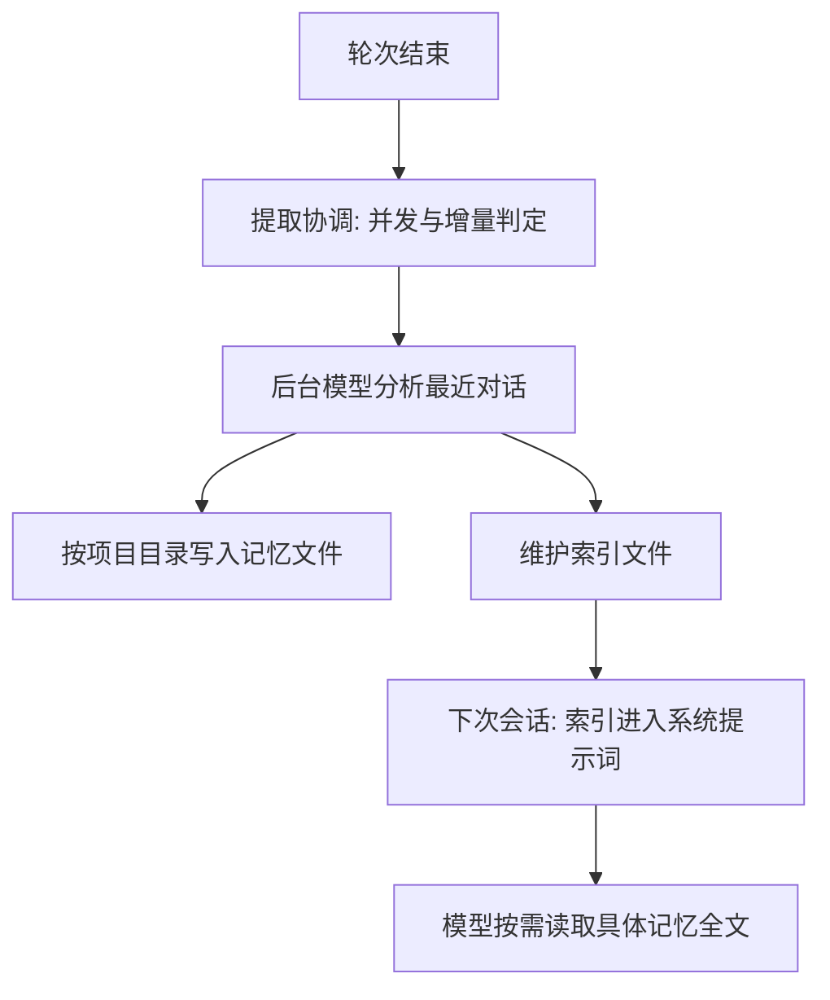
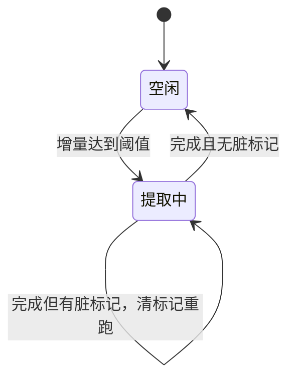
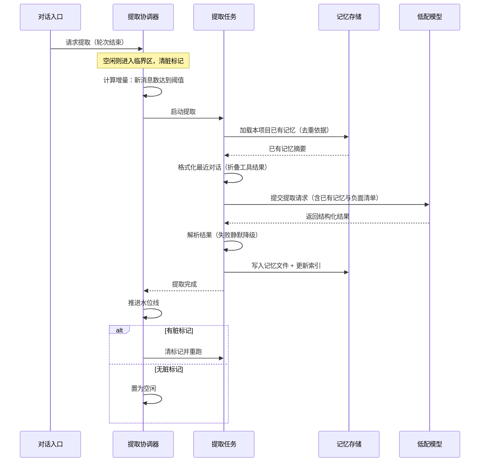

# 长期记忆

## 读前思考

- 上下文窗口是有限的，但用户期望 Agent 记住跨会话的信息：偏好、项目决策、反馈。最直觉的方案是每轮结束把重要信息存到文件、下次加载进系统提示词——可谁来决定什么算"重要"？让模型自己判断，它可能存一堆无用信息；每轮都存，成本又不可控。你怎么设计一个既挑剔又自动的提取机制？
- 提取本身要花一次模型调用，而调用耗时从一秒到半分钟不等。用户快速连发多轮时，提取任务会堆积。你会怎么控制并发，既不丢工作又不重复劳动？

## 核心问题

先划清边界。短期记忆是单会话内的上下文窗口管理：claudecode 的形态是固定缓冲加保尾摘要——估算达到"窗口减固定缓冲"阈值时保留最近四轮原文，更早的内容压缩成一段摘要（机制见 [05-context](05-context.md)），它回答的是"这次对话装不下了怎么办"，会话结束即不再保留。长期记忆是跨会话的持久化：claudecode 的形态是后台模型提取加项目隔离文件——每轮结束后由一次独立的低配模型调用挑出值得保留的事实，按项目写入独立目录（本篇主题），它回答的是"下次会话还知道什么"。两层机制不通用：压缩在窗口内腾空间，记忆在窗口外保事实。

记忆系统解决的核心问题是：**如何从对话中自动提取值得跨会话保留的信息，持久化到项目级文件，并在后续会话中注入模型上下文。** 边界说明：会话状态的保存与恢复归 [04-state](04-state.md)，单会话内的压缩归 [05-context](05-context.md)，本篇只讲跨会话的长期记忆。

claudecode 的记忆系统由三块组成：后台模型调用做提取（源码：提取协调器统一调度），文件系统做持久化（按项目隔离、每条记忆一个文件），索引文件做注入入口。它不建检索引擎——记忆规模被设计成"索引装得下、全文按需读"。

| 维度 | claudecode 的选择 |
|------|----------------|
| 提取方式 | 每轮结束后后台模型调用，四类分类 + 负面清单 |
| 存储后端 | 文件系统：按项目隔离目录，每条记忆一个 .md 文件 |
| 检索方式 | 免检索引擎：索引注入 + 模型按需读全文 |
| 注入时机 | 系统提示词只注入索引文件（组装时机见 [05-context](05-context.md)） |
| 整合与过期 | 无自动整合、无自动过期 |
| 并发控制 | 提取合并：同时只跑一个，脏标记决定是否重跑 |

## 方案展示

### 设计选择一：后台模型提取 + 四类分类 + 负面清单

提取不是规则匹配，而是每轮对话结束后用一次独立的后台模型调用分析最近对话。提取指令定义了四类分类：用户画像（角色、偏好、专业水平）、行为反馈（对工作方式的纠正或确认）、项目上下文（进行中的工作、决策、截止日期）、外部资源指针。与正面分类同等重要的是负面清单——什么不该保存：读代码就能知道的内容、版本历史这类有权威来源的信息、调试方案（修复已在代码中）、CLAUDE.md 已有的内容、临时任务状态。大多数轮次返回空列表是设计内的常态，而不是提取失败。

**为什么这么选**：隐式信息（用户纠正了代码风格、提到截止日期、分享团队规范）的表达形式无穷，规则无法覆盖，只有语义理解能判断"这段话里有什么是未来会话需要的"；负面清单从源头控制记忆膨胀——记住一切等于什么都没记住。**牺牲了什么**：每轮一次 API 调用是持续的提取成本；提取质量完全依赖模型判断力，负面清单再细也无法穷尽"不该存"的情况。

### 设计选择二：项目隔离 + 文件持久化 + 索引注入

每个项目以工作目录路径的稳定哈希（SHA-256 前缀）获得独立记忆目录，确保项目 A 的记忆不出现在项目 B 的会话中——刻意用密码学哈希而非语言内置哈希，因为后者在不同进程间会随机化，同一项目会映射到不同目录。每条记忆存为独立 .md 文件；索引文件（MEMORY.md）记录全部记忆的链接和一行描述。

注入系统提示词时只加载索引，不加载全文：模型看到索引知道有哪些记忆可用，判断相关时用工具读具体文件。索引维护采用"新增追加、已有原地更新"策略；读操作不创建目录，写操作才按需建目录——没有产生过记忆的项目不留任何痕迹。

**为什么这么选**：索引注入把 token 预算决策推迟到模型判断"这条记忆与当前任务相关"之后，等于让模型自己做检索，省掉整套检索设施；项目隔离符合"每个代码库有自己的上下文"的开发者直觉。**牺牲了什么**：没有过期机制——记忆一旦保存永远存在，长期使用后索引膨胀会挤占系统提示词预算（索引超过上限行数时截断并告警，只是兜底不是治理）。

### 设计选择三：提取合并的并发控制

提取合并机制解决"多轮快速连续触发提取"的并发问题（源码：ExtractionCoordinator）。要点有三：同一时刻只允许一个提取任务运行；运行期间新轮次到达只打脏标记，不启动新提取；当前提取完成后检查脏标记，已置则清标记并自动重跑。另有水位线追踪已处理到的消息位置，每次只提取增量；增量不足最小消息数阈值时不触发提取，短对话不浪费调用。

**为什么这么选**：提取的执行时间取决于模型响应速度，波动极大。固定时长的防抖在这种场景两难：窗口设短了任务堆积，设长了等待太久。合并机制不需要预设时长——它只保证"同时最多一个在跑、跑完不漏工作"，最后一轮内容一定会被后续提取扫描到。**牺牲了什么**：提取延迟——快速连发多轮时只有首尾各跑一次，中间轮次的内容并入最后一次提取；若模型响应很慢，提取可能还在分析旧话题时用户已换了新话题。

## 核心机制执行流：一次提取的完整生命周期

以用户完成一轮对话（新增消息数达到增量阈值）后触发提取为例：

**阶段一：准入判定。** 轮次结束后对话入口请求提取，协调器检查两件事：当前是否空闲（不空闲只打脏标记）；增量是否达到最小消息数阈值（不足则跳过，短对话不值得花一次调用）。

**阶段二：上下文组装。** 提取任务先加载本项目的已有记忆摘要作为去重依据，再格式化最近对话——工具执行结果被折叠为占位文本，只保留对话语义，显著压缩提取请求的 token 量。

**阶段三：模型分析与落盘。** 低配模型按四类分类输出结构化结果，大多数轮次为空列表。非空结果逐条写入项目目录下的独立文件，并在索引中追加或更新对应条目。

**阶段四：收尾与合并判定。** 协调器推进水位线，然后检查脏标记：有则清标记重跑一轮（覆盖提取期间新到的轮次），无则回到空闲。

**边界路径——提取失败静默降级**：模型调用失败、输出格式不合规、文件写入失败，全部被捕获且不向用户暴露。提取是尽力而为的后台任务，绝不能中断对话主流程。格式解析兼容模型给结果包代码块标记的情况，剥离后再解析。

**边界路径——单文件损坏**：加载记忆时对每个文件单独容错，单个文件损坏（编码或权限问题）只跳过该文件，不影响其余记忆。

## 记忆系统提示词结构

记忆系统通过两个互相独立的提示词影响模型行为：注入主系统提示词的"记忆行为指令"，和只用于后台提取调用的"提取指令"（不进入主对话）。

主提示词中的记忆段落由以下子段拼接：

| 子段 | 内容 |
|------|------|
| 目录位置提示 | 告知记忆目录路径，明确无需重新创建 |
| 四类记忆定义 | 用户画像 / 行为反馈 / 项目上下文 / 资源指针，各含保存时机与用法 |
| 负面清单 | 代码模式、版本历史、调试方案、CLAUDE.md 已有内容、临时状态——即使用户要求也不存 |
| 保存两步流程 | 先写独立记忆文件，再在索引中加一行指针 |
| 访问时机 | 看似相关或用户明确要求时使用；用户要求忽略时不使用 |
| 使用前验证 | 记忆中的路径与符号可能过时，引用前必须验证存在性 |
| 与其他持久化的分工 | 任务方案与会话步骤各有专门机制，记忆只存对未来会话有用的信息 |
| 索引内容 | 当前索引列表（超行数上限截断并告警），或空状态提示 |

提取指令则定义分类标准、负面清单、严格的结构化输出格式与"大多数轮次没什么值得保存"的选择性原则。两份提示词分离的意义：提取的细碎约束不占用主对话预算，主对话的记忆指令不干扰提取判断。

## 工程优化

**提取失败不影响主流程**：提取链路上的所有异常（调用失败、解析失败、写入失败）都被捕获并静默降级——后台增强任务不能反噬核心交互。

**语义级去重**：提取时把已有记忆的摘要传给模型，指令中明确要求不重复保存。去重放在模型层而非文件层，因为措辞不同、语义相同的两条记忆，文件级比对识别不了。

**工具内容折叠**：组装提取上下文时把工具执行结果折叠为占位文本——提取关注的是对话语义（用户说了什么、模型答了什么），不是文件内容和命令输出，折叠后 token 量显著下降。

**读操作零副作用**：加载记忆不创建任何目录，目录不存在直接返回空；只有真正写入时才建目录，保证未产生记忆的项目不留痕迹。

## 面试要点

**1. 为什么用模型做提取而不是规则匹配（如匹配"记住这个"）？**

参考答案方向：规则只能捕获显式标记，但有价值的信息大多是隐式的——纠正代码风格、提到截止日期、分享团队规范，表达形式无穷无尽。模型提取能理解语义，代价是每次一次 API 调用和判断力不稳定，靠增量阈值和负面清单控制成本与噪声。判断标准是"隐式信息占比 × 可接受的调用成本"：隐式信息越多、调用越便宜，越应该选模型提取。

**2. 记忆没有过期机制，长期使用后索引膨胀怎么办？三种候选方案怎么选？**

参考答案方向：候选方案有三类——按时间过期、按容量淘汰、按召回价值整理。claudecode 当前选择"用户显式管理"（对话中要求删除或直接改文件），因为自动过期的最大风险是误删仍有价值的旧记忆（如数月前的架构决策），手动删除的摩擦反而给了用户控制感。若要自动化，更稳的是召回计数式惰性淘汰：被引用才续命，长期未引用的降级。判断标准是"用户对误删的容忍度 × 记忆增长速率"：增长慢可以靠显式管理，增长快必须引入基于使用频率的自动淘汰。

**3. 提取合并机制和简单的防抖（延迟固定时长后执行）有什么区别？各自适合什么场景？**

参考答案方向：防抖是"等最后一次输入后固定时长再执行"，适合执行快、请求密、耗时可预测的场景；合并是"执行中新请求只设标记、完成后按标记决定重跑"，适合执行耗时不确定的场景。记忆提取耗时取决于模型响应（秒级到数十秒波动），防抖窗口设短了任务堆积、设长了等待过久，合并则不需要预设时长，天然保证同时最多一个在跑且不丢最后一轮。判断标准是"执行时间的确定性 × 请求密度"：执行时间越不可预测，合并相对防抖的优势越大。
