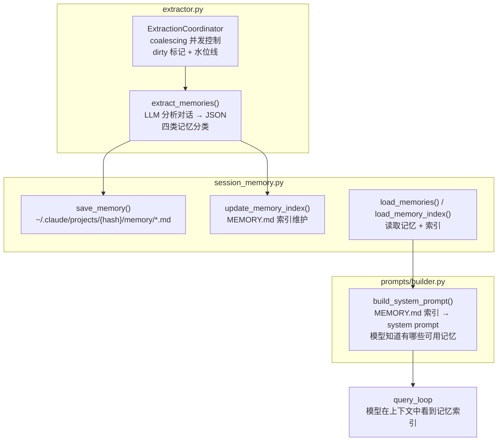
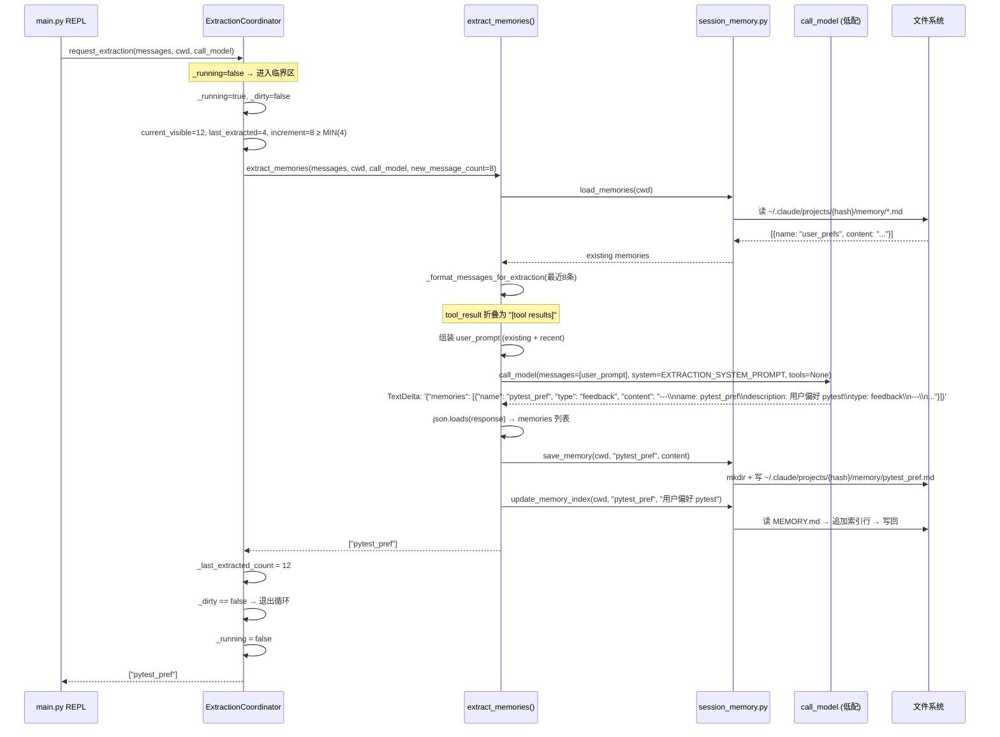
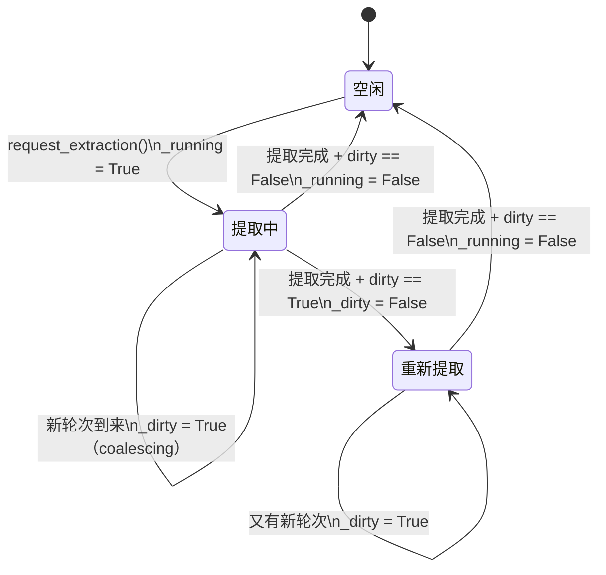

# 记忆系统

## 读前思考

Agent 的记忆系统面临一个根本矛盾：对话上下文是有限的（context window），但用户期望 Agent 能"记住"跨会话的信息（偏好、项目决策、反馈）。最直觉的方案是每轮对话结束后把重要信息存到文件里，下次对话时加载进 system prompt。问题是：谁来决定什么"重要"？如果让模型自己判断，它可能保存一堆无用信息；如果每轮都保存，token 成本会爆炸。你怎么设计一个既 selective 又 automatic 的提取机制？

另一个问题：记忆提取本身需要调用 LLM（分析对话内容、判断什么值得保存），这意味着每轮对话结束后都要额外花一次 API 调用。如果用户快速连续输入多轮，提取任务会堆积。你怎么处理这个并发问题？

## 核心问题

记忆系统解决的是「如何从对话中自动提取值得跨会话保留的信息，持久化到项目级文件，并在后续对话中通过 system prompt 注入」。claudecode 用后台 LLM 调用做提取（extractor.py），用文件系统做持久化（session_memory.py），用 ExtractionCoordinator 做并发控制。记忆按项目隔离（cwd 路径哈希），按四类分类（user/feedback/project/reference），通过 MEMORY.md 索引文件注入 system prompt。



## 方案展示

### 设计选择 1：后台 LLM 提取 + 四类分类

记忆提取不是规则匹配，而是每轮对话结束后用一次独立的 LLM 调用分析最近对话，判断是否有值得保存的信息。提取模型使用专门的 EXTRACTION_SYSTEM_PROMPT，定义了四类记忆分类：user（用户角色、偏好、专业水平）、feedback（对工作方式的纠正或确认）、project（进行中的工作上下文、决策、截止日期）、reference（外部资源指针）。

提取模型的 prompt 同样重要的是"什么不该保存"的负面清单：代码模式和架构（读代码就能知道）、git 历史（git log 是权威来源）、调试方案（修复已在代码中）、CLAUDE.md 已有的内容、临时任务状态。这个负面清单防止了记忆膨胀——大多数轮次实际上没有什么值得保存的，提取模型返回 {"memories": []} 是常态。

提取结果要求严格的 JSON 格式（{"memories": [{name, type, content}]}），每条记忆的 content 必须包含 YAML frontmatter。解析时兼容模型把 JSON 包裹在 ```json ``` 代码块中的情况（剥离代码块标记后再 json.loads）。解析失败静默降级——大多数失败是因为模型输出格式不合规，属于正常情况。

以用户完成一轮对话（8 条新消息）后触发记忆提取为例，trace 完整执行流：



这个 trace 展示了提取的完整生命周期：REPL 轮次结束触发请求 → Coordinator 检查增量是否达到阈值 → 加载已有记忆做去重 → 格式化最近对话 → 调用 LLM 分析 → 解析 JSON → 保存文件 → 更新索引 → 更新水位线。如果提取期间又有新轮次到来（_dirty=true），Coordinator 会在当前提取完成后自动重新进入循环。

代价是每轮提取需要一次 API 调用（虽然用 max_tokens=4096 的低配 call_model）。对于快速连续的多轮对话，ExtractionCoordinator 的 coalescing 机制避免堆积（见设计选择 3）。另外提取质量完全依赖模型的判断力——prompt 中的负面清单再详细，也无法覆盖所有"不该保存"的情况。

### 设计选择 2：项目隔离 + 文件持久化 + 索引注入

每个项目通过 cwd 路径的 SHA-256 前 12 字符获得独立的记忆目录（~/.claude/projects/{hash}/memory/）。这确保了在 /project-a 下保存的记忆不会出现在 /project-b 的对话中。使用 SHA-256 而非 Python 内置 hash() 是因为后者在 Python 3.3+ 中每次进程启动都随机化（PYTHONHASHSEED），会导致同一项目在不同会话中映射到不同目录。

记忆以独立的 .md 文件存储（每条记忆一个文件），MEMORY.md 作为索引文件记录所有记忆的链接和一行描述。注入 system prompt 时只加载索引（MEMORY.md 的内容），不加载所有记忆的完整内容——模型看到索引后知道有哪些记忆可用，需要时可以通过工具读取具体文件。这控制了 system prompt 的 token 开销。

索引维护采用 append-or-update 策略：新记忆追加到索引末尾，已有记忆原地更新描述行。文件名中的特殊字符替换为下划线防止路径注入。读操作不创建目录（目录不存在返回空列表），写操作才 lazy mkdir——确保只有实际产生记忆的项目才留下目录痕迹。

代价是记忆没有过期机制。一旦保存，记忆永远存在（除非用户手动删除文件或模型在对话中被要求删除）。长期使用的积累可能导致索引膨胀，system prompt 中列出几十条记忆索引会占用可观的 token 空间。

### 设计选择 3：ExtractionCoordinator 的 coalescing 并发控制

ExtractionCoordinator 解决"多轮对话快速连续触发提取"的并发问题。设计要点：同一时刻只允许一个提取任务运行（asyncio.Lock + _running 标记），如果提取运行期间有新轮次到来，设置 dirty 标记而非启动新提取，当前提取完成后若 dirty 已设置则自动重新提取。



水位线机制（_last_extracted_count）追踪已处理的可见消息数，每次只提取增量部分。MIN_NEW_MESSAGES = 4 的阈值确保短对话不触发提取（避免浪费 API 调用）。这保证了最后一个轮次一定会被扫描到（不丢失工作），同时避免了 N 轮快速对话产生 N 次提取调用。

代价是提取有延迟——如果用户快速输入 10 轮，提取只在第 1 轮和第 10 轮各执行一次（中间 8 轮被 coalesce）。第 2-9 轮的内容在第 10 轮的提取中被覆盖。如果第 1 轮提取期间模型响应很慢（如 30 秒），用户可能已经开始了新话题，但提取仍在分析旧对话。

## 记忆系统提示词结构

记忆系统通过两个独立的提示词影响模型行为：一个是注入主 system prompt 的「记忆行为指令」（由 build_memory_prompt() 构建，对应 system prompt 的第 10 段），另一个是后台提取任务的「提取系统提示词」（EXTRACTION_SYSTEM_PROMPT，仅用于提取 LLM 调用，不进入主对话）。

**主 system prompt 中的记忆段落**由以下八个子段拼接而成：

| 子段 | 内容 |
|------|------|
| 目录位置 + 存在性提示 | 告知模型记忆目录路径，明确目录已存在无需 mkdir |
| 四种记忆类型定义 | user（用户画像）、feedback（行为纠正/确认）、project（项目上下文）、reference（外部资源指针），每种包含何时保存、如何使用、示例 |
| 不应保存的内容 | 代码模式、git 历史、调试方案、CLAUDE.md 已有内容、临时任务状态——即使用户明确要求也不保存 |
| 保存操作两步流程 | Step 1: 写独立 .md 文件（带 YAML frontmatter）；Step 2: 在 MEMORY.md 索引中添加一行指针 |
| 何时访问记忆 | 看起来相关时、用户明确要求时；用户要求忽略时则不使用 |
| 使用前验证 | 记忆中的文件路径/函数名可能已过时，推荐前必须 grep/检查存在性 |
| 与其他持久化机制的区分 | Plan 用于当前任务方案，Tasks 用于当前会话步骤，Memory 只保存对未来会话有用的信息 |
| MEMORY.md 索引内容 | 当前已有记忆的索引列表（超过 200 行截断并警告），或空状态提示 |

**提取系统提示词**（EXTRACTION_SYSTEM_PROMPT）是提取 LLM 的专用指令，定义了：四类记忆的分类标准、负面清单（什么不该保存）、严格的 JSON 输出格式要求（{"memories": [...]}）、frontmatter 模板、以及「大多数轮次没有什么值得保存」的选择性原则。这个提示词不会出现在主对话的 system prompt 中，只在 extract_memories() 的独立 API 调用中使用。

## 工程优化

**提取失败不影响主流程。** extract_memories() 的所有异常（API 调用失败、JSON 解析失败、文件写入失败）都被捕获并静默降级。记忆提取是"尽力而为"的后台任务，绝不能因为提取失败而中断用户的对话体验。

**已有记忆去重。** 提取时将当前项目已有记忆的前 100 字符摘要传给提取模型，prompt 中明确要求"不要重复保存已有信息"。这在 LLM 层面做去重而非文件层面——因为两条措辞不同但语义相同的记忆，文件级去重无法识别。

**工具调用内容折叠。** _format_messages_for_extraction() 将 UserMessage 中的 tool_result 内容折叠为 "[tool results]"，只保留文本消息。提取关注的是对话语义（用户说了什么、模型回复了什么），而非工具执行的具体细节（文件内容、命令输出）。这显著减少了提取 prompt 的 token 量。

**单文件损坏不阻塞加载。** load_memories() 对每个 .md 文件的读取用 try/except 包裹，单个文件损坏（编码错误、权限问题）只跳过该文件，不影响其他记忆的加载。

## 面试要点

**追问 1：为什么用 LLM 做提取而不是规则匹配（如正则匹配"记住这个"）？** 规则匹配只能捕获显式标记的信息（用户说"记住我喜欢 pytest"），但大量有价值的信息是隐式的——用户纠正了模型的代码风格、提到了项目截止日期、分享了团队规范。这些信息的表达形式无穷无尽，规则无法覆盖。LLM 提取能理解语义，判断"这段话中有什么是未来对话需要的"。代价是每次提取需要一次 API 调用（token 成本 + 延迟），且提取质量不稳定——模型可能保存无用信息或遗漏重要信息。MIN_NEW_MESSAGES 阈值和负面清单 prompt 是控制成本的工程手段。

**追问 2：记忆没有过期机制，长期使用后索引膨胀怎么办？** 当前设计确实没有自动过期。可能的方案有三种：基于时间的 TTL（超过 N 天的记忆自动归档）、基于容量的 LRU（索引超过 N 条时删除最旧的）、基于 LLM 的定期整理（用一次 API 调用合并/删除过时记忆）。claudecode 选择不做自动过期，可能是因为记忆系统的定位是"用户显式管理"——模型可以在对话中被要求"删除这条记忆"，用户也可以直接编辑文件。自动过期的风险是误删仍有价值的记忆（如三个月前保存的架构决策），而手动删除的摩擦让用户有控制感。

**追问 3：ExtractionCoordinator 的 coalescing 和简单的 debounce（延迟 N 秒后执行）有什么区别？** Debounce 是"等最后一次输入后 N 秒再执行"，适合用户输入频率可预测的场景。Coalescing 是"正在执行时新请求只设标记，执行完后检查标记决定是否重跑"，适合执行时间不确定的场景。记忆提取的执行时间取决于 LLM 响应速度（1-30 秒不等），如果用 debounce，延迟设短了会堆积多个提取，设长了用户等太久。Coalescing 不需要预设延迟——它保证同一时刻只有一个提取在跑，跑完后自动检查是否有遗漏。代价是如果提取本身很慢（30 秒），dirty 标记可能被设置多次但只触发一次重跑——中间轮次的内容被合并到最后一次提取中，不会丢失但会延迟。
