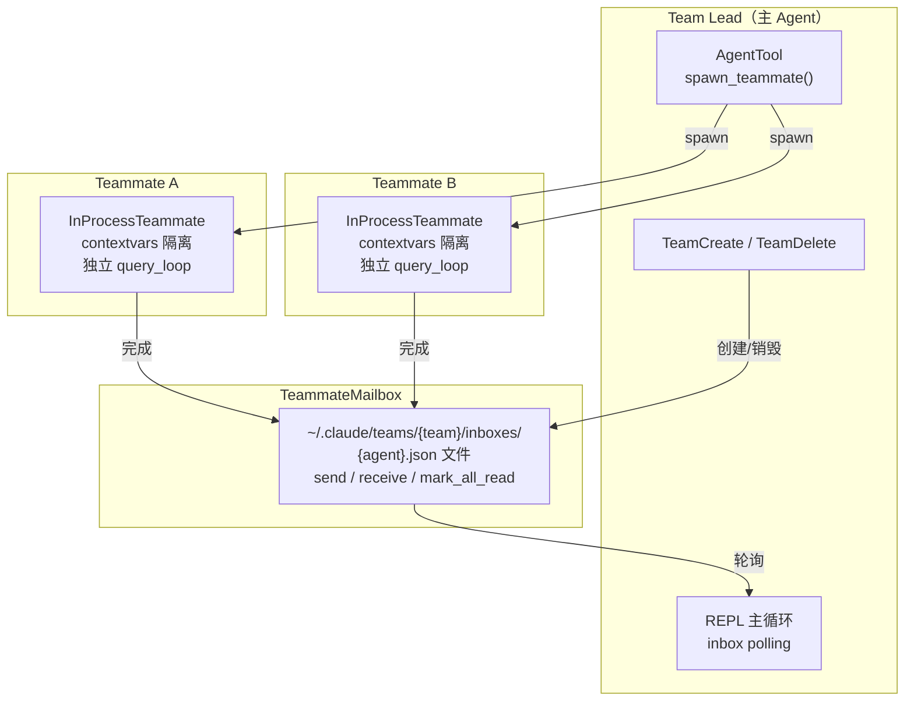
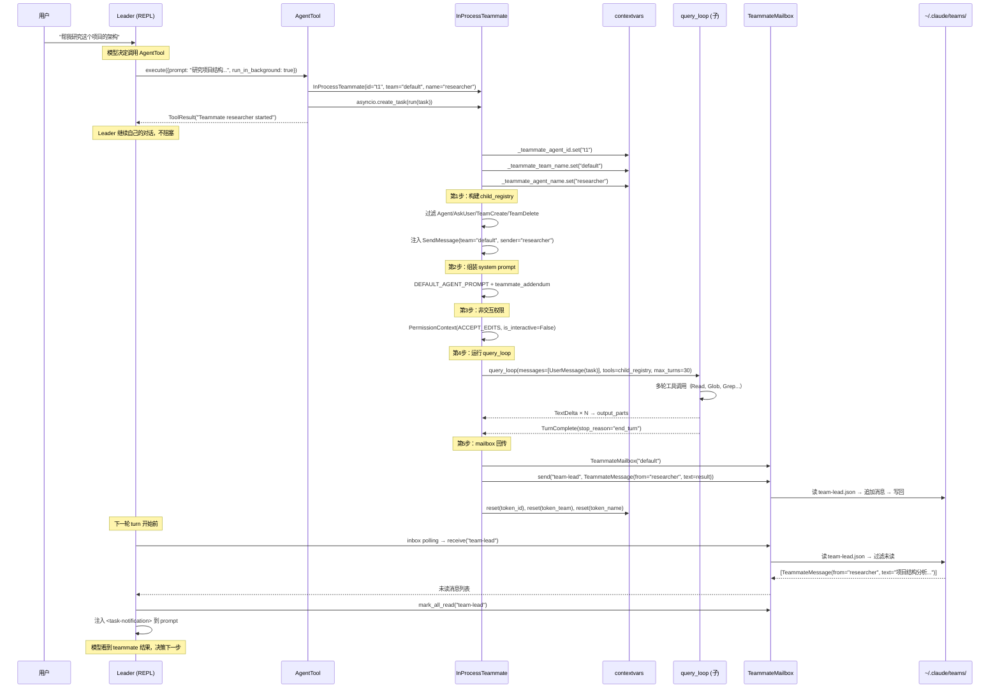

# 子代理/编排

## 读前思考

一个 Agent 需要委派子任务时，最直觉的实现是 fork 一个新进程跑另一个 Agent 实例。问题是子 Agent 需要继承父 Agent 的模型配置、API 客户端、工具集（但要过滤掉危险工具），还需要一种方式把结果送回父 Agent。如果你选择在同一进程内运行子 Agent（共享事件循环），你怎么隔离它们的身份和状态，防止子 Agent 的操作污染父 Agent 的上下文？

另一个问题：多个子 Agent 并行执行时，它们之间怎么通信？如果 team-lead 需要等待所有 worker 完成后再汇总，你是用 asyncio.gather 阻塞等待，还是设计一种异步消息机制让 leader 在轮次间隙轮询结果？

## 核心问题

子代理/编排解决的是「如何让一个 Agent 创建并管理多个子 Agent 并行执行任务，同时保证身份隔离、工具安全和结果回传」。claudecode 用 contextvars 做同进程内的身份隔离（InProcessTeammate），用文件系统 JSON 做消息传递（TeammateMailbox），用 system prompt 注入做协调器行为定义（Coordinator）。整个 swarm 层有四个文件：coordinator.py、in_process_runner.py、mailbox.py、spawn.py。

## 方案展示

### 设计选择 1：同进程 contextvars 隔离

InProcessTeammate 不 fork 新进程，而是在同一 asyncio 事件循环中以独立协程运行。身份隔离通过 Python 的 contextvars 实现：_teammate_agent_id、_teammate_team_name、_teammate_agent_name 三个 ContextVar 在每个 teammate 的 run() 方法入口设置，在 finally 中用 token 精确重置。多个 teammate 以 asyncio.Task 形式并发运行在同一线程中，contextvars 保证每个协程任务拥有独立的上下文副本。

这个选择的核心收益是资源共享和简单性。子 Agent 直接复用父 Agent 的 call_model_factory（通过工厂的工厂模式延迟绑定 model），不需要重新创建 API 客户端。query_loop 是纯函数，传入新的 messages 列表和 child_registry 就能独立运行。相比跨进程方案（需要 IPC、序列化、进程管理），同进程方案的代码量减少了 80%。

以 Leader 派发一个"研究项目结构"任务给 teammate 为例，trace 完整的 spawn → 执行 → 回传流程：

这个 trace 展示了几个关键设计：AgentTool 返回后 Leader 不阻塞（run_in_background=true），teammate 在独立协程中运行自己的 query_loop；contextvars 在 run() 入口设置、finally 中重置，保证即使异常也不泄漏身份；mailbox 是异步解耦的——teammate 写入结果后 Leader 在下一轮才看到，不是实时推送。

代价是隔离不彻底。所有 teammate 共享同一个 Python 进程的内存空间——一个 teammate 的未捕获异常（如 MemoryError）可能影响整个进程。contextvars 只隔离了身份信息，不隔离文件系统访问（所有 teammate 都能读写同一个文件系统）或全局状态（如 logging 配置）。另外 contextvars 的隔离依赖 asyncio 的协程调度——如果 teammate 内部使用了线程池（如 BashTool 的 subprocess），线程中的 contextvars 需要额外传播。

### 设计选择 2：工具过滤 + 非交互权限

子 Agent 的工具集不是父 Agent 的完整复制。InProcessTeammate._execute_with_query_loop() 构建 child_registry 时排除四类工具：Agent（防止无限递归创建子 Agent）、AskUserQuestion（teammate 无法与终端用户交互）、TeamCreate/TeamDelete（teammate 不应管理团队生命周期）。SendMessage 被特殊处理——注入当前 teammate 的身份信息（team_name, sender_name），使其发送消息时自动携带正确的发件人。

权限方面，teammate 使用 PermissionMode.ACCEPT_EDITS + is_interactive=False。这意味着读取和编辑操作自动允许，但 Bash 等高危工具在非交互模式下会 fail-fast（直接拒绝而非弹出确认对话框）。设计意图是：teammate 在后台运行，不能打断用户要求确认，但也不能无限制地执行危险命令。

代价是工具过滤是硬编码的（if tool.get_name() in ("Agent", "AskUserQuestion", ...)）。新增需要排除的工具时必须修改这个列表。更灵活的方案是让每个 Tool 声明自己是否允许在子 Agent 中使用（类似 is_concurrency_safe 的声明模式），但这增加了 Tool ABC 的接口复杂度。

### 设计选择 3：文件系统 Mailbox + 轮询消费

TeammateMailbox 用 JSON 文件做消息队列：每个 agent 有一个收件箱文件（~/.claude/teams/{team}/inboxes/{agent}.json），发送消息是读取收件人的 JSON → 追加消息 → 全量写回。接收是读取自己的 JSON → 过滤未读消息 → 标记已读。

选择文件系统而非内存队列的理由：agent 可能运行在不同进程中（虽然当前实现是同进程，但架构预留了跨进程扩展），消息需要在 agent 重启后仍然可读，实现简单不依赖外部中间件。对于 agent swarm 场景（低频消息，每个 teammate 完成时发一条），文件 I/O 的延迟完全可接受。

Leader 消费结果的方式是轮询：REPL 主循环在每轮 turn 之前检查 leader 的 inbox（inbox polling），将收到的 <task-notification> 注入 prompt。这不是实时推送——leader 只有在自己的轮次间隙才能看到 teammate 的完成通知。如果 leader 正在等待一个耗时 30 秒的 teammate，它会在下一轮 turn 开始时才看到结果。

代价是没有文件锁。两个 teammate 同时向 leader 的 inbox 写入消息时（读取 → 追加 → 写回的窗口期），后写入的会覆盖先写入的，丢失一条消息。对于低频场景这是可接受的简化，但如果 swarm 规模扩大到几十个并发 teammate，就需要加锁或换用数据库。

## 工程优化

**Coordinator 是 prompt 而非运行时。** coordinator.py 不做任何编排逻辑——它只是在 system prompt 前面注入一段协调器指令，告诉模型“你应该分解任务、用 AgentTool 派发 worker、收集结果后汇总”。实际的编排决策完全由模型自主完成。这意味着 coordinator 的“智能”取决于模型的指令遵循能力，而非代码逻辑。

**Coordinator 提示词的五个组成部分：**

| 部分 | 内容 |
|------|------|
| 1. 角色定义 | 协调者身份：指挥 worker 研究/实施/验证，综合结果与用户沟通，简单问题直接回答不委派 |
| 2. 可用工具 | Agent（生成 worker）、SendMessage（继续已有 worker）、TaskStop（停止 worker），以及 task-notification XML 结果格式 |
| 3. Worker 管理 | 并发策略（读并行、写串行）、失败处理（继续同一 worker）、停止时机 |
| 4. 任务工作流 | 四阶段：Research（worker 并行）→ Synthesis（协调者综合）→ Implementation（worker 执行）→ Verification（worker 验证） |
| 5. Worker Prompt 编写指南 | 自包含原则（worker 看不到对话）、目的声明、continue vs spawn 决策表、好/坏示例 |

**Teammate 提示词附加段的结构：** Teammate 的 system prompt 是主 agent 的完整 system prompt（build_system_prompt() 的输出）加上 teammate_prompt.py 的附加段。附加段包含四个部分：通信规则（必须用 SendMessage，纯文本回复对队友不可见）、身份信息（agent 名、团队名、agent ID）、任务生命周期（接收任务→自主执行→汇报结果→等待）、重要规则（不修改他人正在编辑的文件、不确定时向 team-lead 询问）。

**子 Agent 的 DEFAULT_AGENT_PROMPT：** 当 worker 被生成时如果没有指定自定义 prompt，使用 DEFAULT_AGENT_PROMPT 作为默认指令。它定义了三个行为约束：完成任务（不要半途而废）、不过度工程（不要 gold-plate）、简洁汇报（只报告 essentials，因为调用方会转达给用户）。

**max_turns 限制子 Agent 预算。** InProcessTeammate 的 query_loop 调用设置 max_turns=30（主 Agent 默认 50-100），防止子 Agent 无限循环消耗 API 调用。子 Agent 不传 auto_compact_fn——其上下文通常较短（单任务对话），不需要压缩。

**错误不中断 mailbox 发送。** _execute_with_query_loop 的 try/except 确保即使 query_loop 执行失败，错误信息也会被记录并通过 mailbox 发送给 leader。leader 看到的是 "(Error: ...)" 文本而非静默无响应，可以据此决定重试或换策略。

**contextvars 的 token 重置。** run() 方法在 finally 中用 token 重置 contextvars（而非直接 set(None)），保证嵌套场景下的正确性——如果一个 teammate 内部又创建了子 teammate（虽然 AgentTool 被过滤了，但理论上其他路径可能触发），内层重置不会破坏外层的身份。

## 面试要点

**追问 1：为什么用 contextvars 而不是给每个 teammate 一个独立的 QueryEngine 实例？** 实际上每个 teammate 确实有独立的 messages 列表和 child_registry，但它不需要完整的 QueryEngine——它直接调用 query_loop 纯函数，传入所需的依赖。QueryEngine 的价值在于管理长期状态（跨多轮 submit 的 messages 累积、token 统计），而 teammate 是一次性执行（接收任务 → 跑完 → 发结果），不需要跨轮次状态。contextvars 解决的是另一个问题：在共享的事件循环中，SendMessage 工具和 mailbox 需要知道"当前正在执行的是哪个 teammate"，这个身份信息通过 contextvars 透明传递，不需要在每个函数调用中显式传参。

**追问 2：文件系统 Mailbox 在并发写入时会丢消息，为什么不用 asyncio.Queue？** asyncio.Queue 只能在同一事件循环内使用，且不支持持久化。当前实现虽然主要是同进程，但架构预留了跨进程扩展（TS 原版支持多进程 teammate）。如果换成 asyncio.Queue，跨进程场景就需要完全重写通信层。文件系统方案虽然简陋，但天然支持跨进程、持久化、可调试（直接 cat JSON 文件就能看到消息历史）。丢消息的风险在当前规模下（通常 2-5 个 teammate）极低，因为 teammate 完成时间通常错开。如果真要解决，加一个 fcntl.flock 文件锁即可，不需要换架构。

**追问 3：Coordinator 的编排逻辑完全靠 prompt 驱动，如果模型不遵循指令（比如不分解任务直接自己干）会怎样？** 系统会退化为单 Agent 模式——不会出错，只是失去了并行加速的收益。这是 prompt-driven 编排的固有风险：编排质量取决于模型的指令遵循能力，而非代码保证。claudecode 选择这个方案是因为编排决策本身需要智能（怎么分解任务、哪些可以并行、结果怎么汇总），硬编码的编排逻辑无法适应任意任务。代价是不可预测性——同样的任务，模型可能给出不同的分解方案，或者在某些情况下完全忽略协调器指令。如果要更可靠的编排，需要在代码层面定义 DAG 执行图，但这会丧失灵活性。
