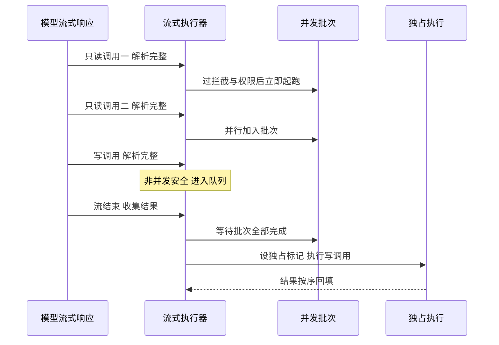
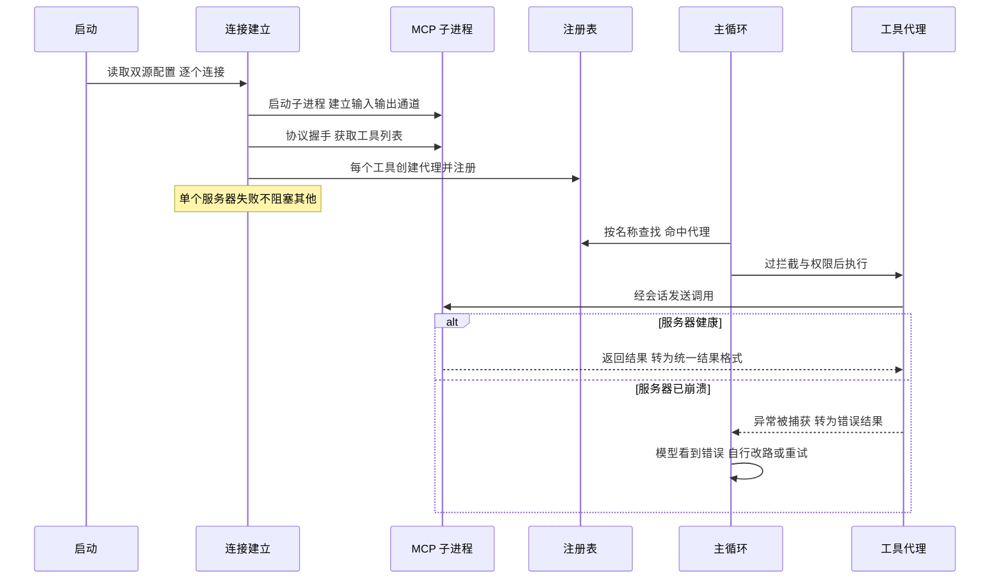

# 工具与扩展生态

## 读前思考

- 22 个内置工具、每个工具有不同的并发安全特性、执行前后要过用户配置的拦截脚本、工具集还会在运行时变化（远程工具随时加入）。这种规模下最直觉的 switch-case 分发为什么不够？注册、发现、执行这三个环节要分开设计还是绑在一起？
- 模型流式返回 5 个工具调用，参数还在传输中。你是等全部解析完再开始执行，还是解析完一个就跑一个？如果后者里有写操作，怎么保证它不会和还在跑的只读操作打架？

## 核心问题

**claudecode 的工具面是四个项目中最"一条路径"的：定义用抽象基类、发现用一张注册表、执行用批次分组加流式提前，MCP 远程工具也塞进同一张表走完全相同的路径。** 作为 Claude Code 的 Python 重实现，它的取舍是"能用且路径统一"优先于完备——没有重连、没有安装扫描、没有插件框架，扩展靠三个正交的极简机制。

| 维度 | claudecode 的选择 |
|------|------------------|
| 工具定义 | 抽象基类四接口：名称、schema、执行、并发安全声明 |
| 注册发现 | 注册表薄封装，运行时按角色动态组装 |
| 执行编排 | 批次分组 + 流式提前执行 + 独占标记 |
| 结果控制 | 单层输出上限，超限截断并标注 |
| MCP | 代理模式进同一注册表，仅 stdio，无重连 |
| 技能 | Markdown 文件，用户斜杠触发注入对话 |
| 扩展 | Hooks / Skills / MCP 三正交机制，无插件系统 |

## 方案展示

### 设计选择一：抽象基类 + 注册表的运行时动态组装

工具抽象基类定义四个接口：返回唯一名称、返回 schema、执行、声明是否并发安全（源码：Tool、is_concurrency_safe）。注册表是"名称到工具"字典的薄封装：按名查找返回空而非抛异常，未注册的工具名（模型幻觉或远程工具已移除）被调用方转成带错误标记的结果回填，由模型自行改路；重复注册同名工具被禁止，因为名称是 API 层面的路由键。

注册表的核心价值在运行时动态组装：子代理的工具集排除委派工具防止无限递归，后台代理排除交互式工具，MCP 工具在连接建立后动态注册。主循环只按名字查表，不持有任何具体工具的引用。

**为什么这么选**：新增工具只需实现四个接口，编排层零修改；动态组装让同一套工具定义服务不同角色的代理。代价是并发安全声明完全信任工具作者——框架无运行时校验，声明错了就是竞态，只能靠代码审查兜底。

### 设计选择二：批次分组 + 流式提前执行

模型一次返回多个调用时，批次编排按并发安全性分组：连续的并发安全工具合为一个批次并行，遇到非并发安全工具先刷出当前批次，该工具独占执行（源码：partition_batches）。全局并发受一个固定上限的信号量约束，独占标记确保写操作执行期间所有其他工具排队——这保证"读到写了一半的文件"不会发生。

流式执行器是批次的演进版：API 还在流式返回时，某个工具调用的参数一旦解析完整就立即后台起跑，不等其余调用（源码：StreamingToolExecutor）。命令执行工具的并发声明不是简单否定，而是解析命令参数：只读命令允许并发，写命令要求独占。工具失败一律转为带错误标记的结果而非抛异常——每个调用必须有配对的结果消息，缺一条整个请求会被 API 拒绝；执行前后的拦截脚本与权限检查的执行前拦截语义见 09-guardrails.md。

**为什么这么选**：工具调用是无状态的——依赖由模型在下一轮决定，所以不需要依赖图调度，一个布尔声明就够。流式提前让只读操作与参数传输时间重叠，省下可观延迟。代价是批次与流式两套编排共享单工具执行逻辑但调度策略各写一份，修改拦截语义要两处同步。

### 设计选择三：MCP 代理模式 + 仅 stdio

每个远程工具被包装成一个继承同一基类的代理，名称用"服务器加工具"的双下划线格式避免冲突，注册进同一张注册表（源码：McpToolProxy）。主循环查表时完全不知道这是远程代理——拦截脚本、权限检查、并发信号量、错误回填全部复用，零特殊代码。仅支持 stdio 传输：绝大多数服务器通过子进程启动，网络连接的心跳、重连、认证复杂度远超本地开发场景的收益。配置从用户级设置与项目级文件双源加载，项目级配置随仓库分发（配置加载的分层归属见 01-gateway.md）。

**为什么这么选**：还原内核的定位下，MCP 只需"能用"。代理模式的路径统一收益立竿见影，代价同样直白：无重连无保活——服务器进程崩溃后代理仍留在注册表中，每次调用抛错转为错误结果，模型可能反复尝试直到轮次预算耗尽，用户需重启程序恢复；代理默认声明并发安全，对有状态的远程工具并不成立。

### 扩展维度：三个正交机制不构成插件系统

claudecode 没有统一的插件框架，扩展能力分散在三个正交机制上：执行拦截（shell 命令在工具执行前后做通过或阻止的二元决策，其拦截语义是护栏机制的一部分，主写见 09-guardrails.md）、行为引导（Markdown 技能在启动时从用户级与项目级两个目录发现，斜杠命令触发时整篇注入对话；技能内容何时驻留上下文及其被压缩面见 05-context.md）、能力扩展（MCP 配置声明远程工具）。三者载体分别是 shell、Markdown、JSON，各自极简，互不感知。

这不构成插件系统：没有统一的发现入口、没有清单与版本、没有分发渠道、没有权限声明，一个"插件"如果需要跨维度（拦截加引导加新工具）必须分别配置三处。它们成立的前提是单用户 CLI 的扩展需求简单。

**为什么这么选**：不定义统一接口让每个机制保持零学习成本——会写 shell 就能拦截，会写 Markdown 就能引导。代价是配置分散、无版本管理、跨维度组合没有协调。

## 完整执行流：一个 MCP 工具从启动连接到对话调用

以用户配置了一个文件系统 MCP 服务器、模型调用其读文件工具为例：

**阶段一：启动连接。** 启动时读取用户级与项目级两份配置，逐个服务器建立 stdio 连接：拉起子进程、在输入输出通道上完成协议握手、列举工具。连接与握手各有一级超时，区分"进程没起来"和"握手卡住"两种故障；单个服务器失败被捕获返回空，不影响整体启动；MCP 依赖包未安装时整个功能优雅降级。

**阶段二：代理注册。** 每个远程工具创建一个代理对象，以双下划线命名注册进同一张表。从此主循环对它们与内置工具一视同仁。

**阶段三：对话调用。** 模型发起调用，主循环按名查表命中代理，经拦截脚本与权限检查后执行；代理经会话发送调用，把远程返回的文本或图片块转为统一结果格式回填对话。

**边界路径——未知工具名。** 模型幻觉出不存在的名称时，查表返回空，转为"未知工具"的错误结果——与远程服务器中途断开的表现汇合在同一条错误回填路径上，循环不中断。

**边界路径——输出超限。** 命令执行工具限制子进程输出大小与执行时长，超限截断并留标记、超时则先给进程留清理时间再强制终止——模型看到截断或超时标记后自行换策略。

## 工程优化

**富内容结果**：结果内容支持文本与结构化块的联合类型，图片等富内容可直接透传；统一文本提取接口让拦截回调与界面预览不必关心内容形态。

**注册分三层**：文件类工具随启动绑定，扩展工具延迟导入缩短启动，协作类工具先注册骨架、运行时组件就绪后以完整版覆盖。

**信号量防资源耗尽**：即使一个批次有二十个并发安全工具，同时执行的数量也被固定上限约束，防止文件描述符耗尽或磁盘饱和。

**技能宽容解析**：无 frontmatter 的文件以文件名为名、全文为内容；解析不依赖外部库，逐行匹配基础格式，坏文件静默跳过不拖累其他技能；两个目录（用户级与项目级）同名技能按用户级优先返回。

## 面试要点

**1. 为什么不用更细粒度的依赖图调度，而只用"并发安全与否"一个布尔做批次分组？**

依赖图调度需要知道工具间的数据依赖，但这里的工具调用是无状态的——每个工具只接收模型给的参数，不消费其他工具的输出，依赖完全由模型在下一轮根据结果决定。在这个前提下，拓扑排序与环检测的复杂度没有收益：一个布尔声明就保证了写操作的原子性。判断标准是"工具间是否存在框架可见的数据流"——不存在时批次分组即最优，存在时才值得上依赖图。

**2. 流式提前执行相比等全部解析完再跑，实际收益和反向风险是什么？**

收益取决于工具执行时间与流式传输时间的重叠度：执行慢的命令类工具收益明显，第一个解析完就起跑，后续工具的传输时间被完全掩盖。反向风险有两类：工具执行极快时，任务调度与独占判断的开销反而让收益趋零；第一个到达的工具若非并发安全，它会立即独占，后续工具照样排队，与批次模式无差别。判断标准是"单工具平均执行时长 × 批内工具数"——乘积越大流式越值。

**3. 三个正交机制为什么不构成插件系统？什么时候它们会不够用？**

插件系统的定义性特征是统一的发现、版本、分发与权限声明，三个机制一样都没有：配置分散在三处文件，互相无协调，无清单无版本。够用的前提是单用户 CLI——拦截用 shell 够、引导用 Markdown 够、新工具用 MCP 够。不够用的信号：需要把扩展分享给团队（分发）、一次扩展要同时动三个维度且升级需同步（版本）、扩展要声明自己需要哪些权限（治理）。判断标准是"扩展是否跨维度组合 × 是否有第三方分发需求"，两者都否时统一框架就是过早抽象。
