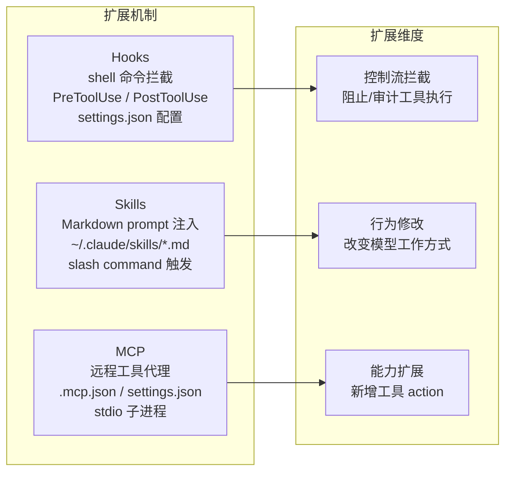

# 插件/扩展系统

## 读前思考

"插件系统"这个词暗示了一种正式的扩展机制：定义接口、注册实现、生命周期管理。但 claudecode 没有传统意义上的插件系统——它的扩展点分散在三个机制中：Hooks（shell 命令拦截）、Skills（Markdown prompt 注入）、MCP（远程工具代理）。问题是：如果你不定义一个统一的 Plugin 接口，这三个机制各自解决什么类型的扩展需求？它们之间的边界在哪里？

## 核心问题

claudecode 没有单一的插件/扩展系统，而是通过三个正交机制提供扩展能力：Hooks 做执行拦截（PreToolUse/PostToolUse shell 命令）、Skills 做行为注入（Markdown prompt 模板）、MCP 做能力扩展（远程工具代理）。三者各自独立，没有统一的插件注册表或生命周期管理。

## 方案展示

### 设计选择 1：Hooks — shell 命令做执行拦截

Hooks 是 claudecode 最接近"插件"的机制。用户在 ~/.claude/settings.json 的 hooks 字段配置 shell 命令，分为 PreToolUse（工具执行前）和 PostToolUse（工具执行后）两个时机。PreToolUse hook 可以通过退出码 2 阻止工具执行（如禁止在特定目录下运行 rm），PostToolUse hook 用于审计和通知（如文件修改后自动运行 lint）。

HookConfig 有三个字段：event（触发时机）、command（shell 命令）、tool_name（限定只对特定工具生效，None 表示所有工具）。hook 执行超时 10 秒（HOOK_TIMEOUT_S），超时后进程被强制杀死，防止挂起的 hook 阻塞工具执行。hook 通过 stdin 接收 JSON 格式的工具调用信息（工具名、参数），通过 stdout 返回消息，通过退出码传递决策（0=通过，2=阻止）。

这个设计的哲学是"用操作系统原语做扩展"——不需要学习任何 SDK 或 API，会写 shell 脚本就能写 hook。代价是能力有限：hook 只能做通过/阻止的二元决策，不能修改工具参数或替换工具结果。另外 shell 命令的启动开销（fork + exec）在高频工具调用场景下可能成为瓶颈。

### 设计选择 2：三机制正交而非统一插件接口

Hooks、Skills、MCP 三者解决完全不同维度的扩展需求，没有统一的 Plugin ABC 或注册表。Hooks 拦截控制流（"这个工具能不能执行"），Skills 修改行为（"模型应该怎么工作"），MCP 扩展能力（"模型能做什么新事情"）。三者可以独立使用，也可以组合（比如 MCP 工具的执行同样受 Hooks 拦截和权限检查）。

不定义统一接口的好处是每个机制保持极简——Hooks 就是 shell 命令，Skills 就是 Markdown 文件，MCP 就是 JSON 配置 + stdio 子进程。用户不需要理解"插件框架"就能使用任何一个扩展点。代价是没有统一的发现机制（没有 /plugins list 命令列出所有扩展）、没有版本管理、没有依赖解析。

## 工程优化

**Hooks 的延迟导入。** orchestration.py 和 streaming_executor.py 中 hooks 相关模块用延迟导入（from cc.hooks.hook_runner import ...），避免循环依赖（hooks 模块也依赖 tools 模块的类型定义），同时减少未配置 hooks 时的启动开销。

**tool_name 过滤减少无效执行。** 配置了 tool_name 的 hook 只在匹配的工具调用时执行，其他工具调用直接跳过。这避免了"每次工具调用都 fork 一个 shell 进程检查是否需要拦截"的开销。

## 面试要点

**追问 1：为什么不把 Hooks、Skills、MCP 统一成一个插件框架？** 因为三者的扩展维度完全不同，强行统一会导致接口过于抽象。一个 Plugin 接口要同时表达"拦截工具执行""注入 prompt 文本""注册新工具"三种能力，要么变成 God Interface（什么都能做但什么都不精确），要么拆成三个子接口（那就和现在没区别，只是多了一层注册表）。当前方案让用户按需选择最合适的扩展点，不需要理解整体框架。代价是三个机制的配置分散在不同文件中（settings.json、skills 目录、.mcp.json），新用户需要分别学习。

**追问 2：Hooks 用退出码 2 做阻止，如果用户的 hook 脚本有 bug 意外返回了 2 会怎样？** 工具会被阻止执行，模型看到 "Blocked by hook: {stdout}" 的错误信息。模型可能会换一种方式完成任务（比如被阻止用 Bash 后改用 FileRead），或者向用户报告被阻止。没有"hook 误触发"的检测机制——框架信任 hook 的退出码语义。如果要更健壮，可以在 hook 输出中要求结构化 JSON（如 {"decision": "block", "reason": "..."}），但这增加了 hook 编写的复杂度。
