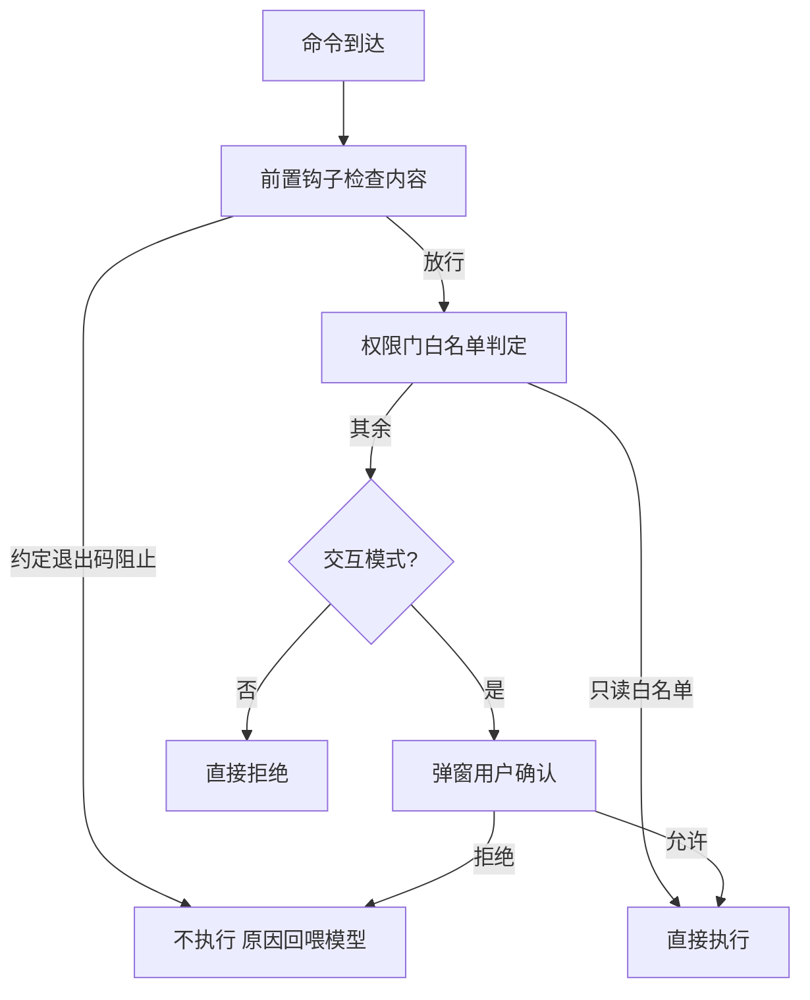
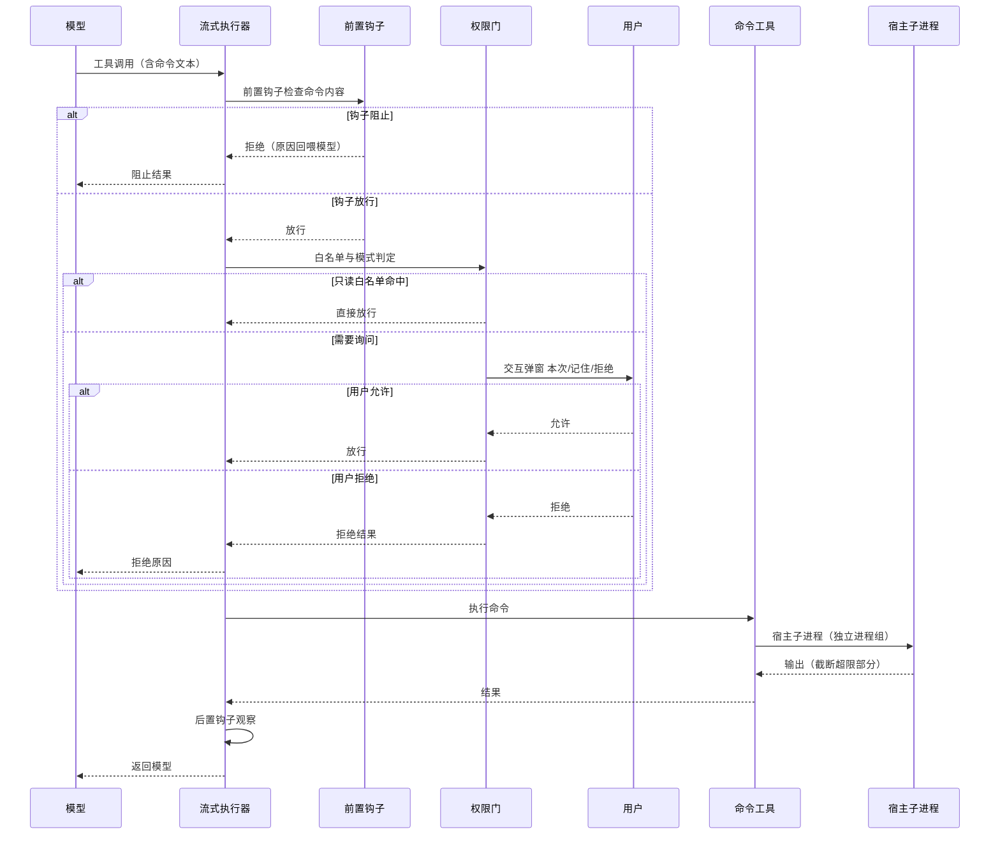

# 执行运行时与隔离

## 读前思考

- 本地开发工具要不要做沙箱？想清楚这个问题之前，先问另一个问题：沙箱隔离的是"谁"？如果被隔离的正是那个需要读写你真实仓库、跑你真实构建的助手，隔离的收益和损失分别是什么？
- 假如一个 Agent 在没有人的环境里运行（CI 管道、子任务），遇到需要确认的操作该怎么办？等下去（挂起）、放行（裸跑）、还是拒绝（任务失败）？三种选择各自的代价是什么？

## 核心问题

**执行时隔离要解决的是：决定命令在什么环境里执行。claudecode 的回答是"不隔离"——命令直接在用户宿主环境执行，用执行前的权限治理替代执行时的环境隔离，并明确宣告这套方案的适用前提与风险。**

claudecode 没有沙箱模块：shell 工具直接在宿主环境 fork 子进程执行，没有容器、没有内核级隔离、没有路径掩码。安全边界全部押在执行前——内容级钩子、工具级白名单门、人工确认三道闸（机制归 09-guardrails），执行层不再设环境级防线，只保留超时与截断等物理限额。这是单用户交互式开发工具的经典取舍：用户本人即信任锚点，零隔离换取对真实仓库的零摩擦操作能力。本篇是"无沙箱"立场的完整论证：为什么不做、用什么替代、前提是什么、风险在哪。

| 维度 | claudecode 的选择 |
|------|--------------------|
| 执行环境 | 宿主直跑，无 OS 级围栏 |
| 替代机制 | 执行前三层拦截（归 09-guardrails）+ 执行层物理限额 |
| 无人值守 | 非交互模式下询问即拒绝（fail-fast） |
| 执行链 | 前置钩子 → 权限门 → 执行 → 后置钩子 |
| 爆炸半径控制 | 超时两阶段终止、输出截断、只读命令并发白名单 |

## 方案展示

### 设计选择一：人在环审批替代隔离——为什么本地 CLI 不需要沙箱

沙箱解决的是"不可信执行体加无人值守"问题：执行体不可信，所以要用操作系统边界框住；没有人在环，所以不能靠人工闸门。claudecode 的场景两个条件都不成立——执行体是受控的模型，决策链上有用户本人在环。于是它选择让用户当审批者：每次危险操作弹确认，用户判断这条命令该不该跑。这一选择的完整链路是三层拦截：可编程钩子看命令内容（可以按内容精确判定），权限门做工具级白名单门禁（只读工具放行、其余询问），最后人工确认兜底；非交互模式下询问直接转拒绝。

**为什么这么选**：本地 CLI 的部署成本必须为零——不依赖 Docker、不需要守护进程；操作对象是用户的真实仓库，挂载、网络限制、容器启动延迟都会直接伤害"在真实环境里干活"这个核心场景。人在环审批把每次危险执行的决策权交还用户，换来零摩擦。**牺牲了什么**：命令一旦放行即拥有用户全部权限，没有 OS 级兜底；提示词注入诱导的危险命令只隔一次人工确认，防线依赖用户的判断力；跳过检查模式（BYPASS）下没有任何拦截，等于裸奔——这是把"用户理解风险"作为前提的明确声明。

### 设计选择二：非交互 fail-fast——没有人在环时宁可拒绝

权限门区分交互与非交互：交互模式（终端 REPL）下询问会弹窗等用户输入；非交互模式（管道输出、后台任务、子代理）下询问直接转为拒绝——不等待、不挂起、不放行。子代理天然无法执行 shell 命令，因为它的执行链永远处于非交互状态。

**为什么这么选**：无人值守场景里没有终端可以弹窗，等待等于挂死任务；放行等于把决定权交给模型自己，违背"用户在环"的前提。拒绝是最诚实的第三选项：明确宣告该场景超出了这套安全模型的适用边界。**牺牲了什么**：子代理等无人值守执行体的能力被显著限制——需要跑测试、构建的任务做不了，只能由主代理代跑；任务可能因此失败，失败信息回喂模型后由用户决定下一步。

### 设计选择三：执行层物理限额——放行之后控制爆炸半径的物理维度

即使命令通过了所有拦截，执行层仍保留物理限额：命令超时走两阶段终止（先温和终止、宽限后强制杀）；输出超过上限截断，防止撑爆上下文；只读命令白名单允许安全并行（列表类、查看类、状态类命令并发执行），其余命令独占串行。

**为什么这么选**：拦截决定"能不能跑"，物理限额决定"跑起来后最多造成多大损害"——超时防止失控进程无限运行，截断防止输出淹没窗口，并发白名单让安全命令享受并行加速而不引入写竞争。**牺牲了什么**：物理限额不阻止危险操作本身，只限制其物理后果；只读白名单是硬编码的，新增只读命令需要人工登记，漏登记则失去并行加速。

## 核心机制执行流：一次命令执行经钩子与权限门的完整路径

以交互模式下模型调用 shell 工具执行一条删除命令为例：

**阶段一：前置钩子。** 执行器先跑用户配置的可编程钩子，钩子按命令内容做细粒度判定——权限门只能决定"这个工具能不能用"，钩子能决定"这条具体命令能不能跑"。钩子以约定退出码表达语义：硬阻止、放行、警告。**边界路径：钩子超时**——钩子运行超时后被强制终止，但工具照常执行：策略层存在失败开放的缝隙，超时的钩子等于没拦。

**阶段二：权限门。** 会话内记住的放行决定（用户此前选"记住"的命令）优先命中，然后匹配用户规则文件的允许与拒绝规则（拒绝优先于允许），最后按权限模式判定：跳过检查模式直通一切；允许编辑模式放行只读与编辑工具；仅只读模式只放行只读工具。其余工具落入询问。**边界路径：跳过检查模式**——直通一切，规则文件与模式判定全部失效，这是最高风险档位，仅建议受信环境使用。

**阶段三：询问分支。** 交互模式下弹窗给三个选项：本次允许、会话内记住、拒绝。拒绝时原因回喂模型，模型可以改换命令重试。**边界路径：非交互**——询问直接转拒绝，不弹窗不等待，子代理由此失去 shell 能力。

**阶段四：执行与物理限额。** 宿主子进程执行，独立进程组保证超时后能杀尽子孙；超时走两阶段终止——先温和终止，宽限期内不退出再强制杀。输出超过上限截断后返回。

**阶段五：后置钩子。** 观察类钩子看到执行结果，输出截断后再回喂（后置钩子的输出也限长，防止结果本身污染上下文）。

**边界路径——拒绝后重试**：拒绝结果作为工具结果回喂模型，模型通常能自行改路（换更安全的命令或换工具），这是"拒绝"与"中断"的本质区别——拒绝是可恢复的。

## 工程优化

**两阶段超时终止**：先温和终止给进程善后机会，宽限后强制杀，兼顾优雅终止与必然回收。

**输出双限截断**：命令输出按字节上限截断，钩子输出单独限长，两层都保护上下文窗口。

**只读命令并发白名单**：列表、查看、状态类命令可并行执行，写命令独占，安全与吞吐兼得。

**会话级记忆渐进收敛**：用户选"记住"后同命令不再询问，随着使用收敛打扰频率，审批疲劳可控。

## 面试要点

**1. "沙箱隔离的是谁"——这句话怎么理解？本地 CLI 做沙箱会损失什么？**

参考答案方向：沙箱的收益是隔离不可信执行体，本地 CLI 的执行体是受控的模型，真正需要操作的是用户自己的环境；做沙箱意味着挂载真实项目目录、容忍网络限制与启动延迟，每一项都直接伤害实用性——装依赖被断网卡住、容器冷启动拖慢每个回合。损失大于收益时，零隔离是合理选择。判断标准是"执行体的不可信度 × 隔离的摩擦成本"：不可信度低而摩擦高，隔离不划算；一旦执行体来源不可信（如执行外部代码），结论反转。

**2. 无沙箱方案的前提是什么？什么信号出现时该补上沙箱？**

参考答案方向：前提是单用户、交互式、目标环境是用户自己的开发环境、有可承担审批责任的人在环。四个条件任何一条松动就该重新评估：无人值守任务变多（非交互拒绝导致任务频繁失败）、开始执行外部不可信代码（插件、下载的脚本）、部署成服务暴露给多用户。信号出现时补沙箱不是推翻设计——拦截层保留，隔离层作为第二道防线叠加。判断标准是"无人值守时长 × 执行体不可信度"：两者乘积越大，越该引入环境隔离。

**3. 钩子超时后工具照常执行（失败开放），这个缝隙怎么看？**

参考答案方向：失败开放是"策略可靠性"与"可用性"的取舍——钩子卡死不能阻塞主流程，模型任务要继续；代价是超时的钩子等于没拦，策略层出现真空。失败关闭的替代方案（钩子超时即拒绝）更安全但把策略故障转嫁给用户：一个卡死的钩子会让所有工具调用失败。修复方向是钩子侧的重试与降级，而不是执行层改失败关闭。判断标准是"策略可靠性的要求 × 阻断的代价"：策略由团队托管、要求强一致时倾向失败关闭；用户自配、追求可用时失败开放可接受。
