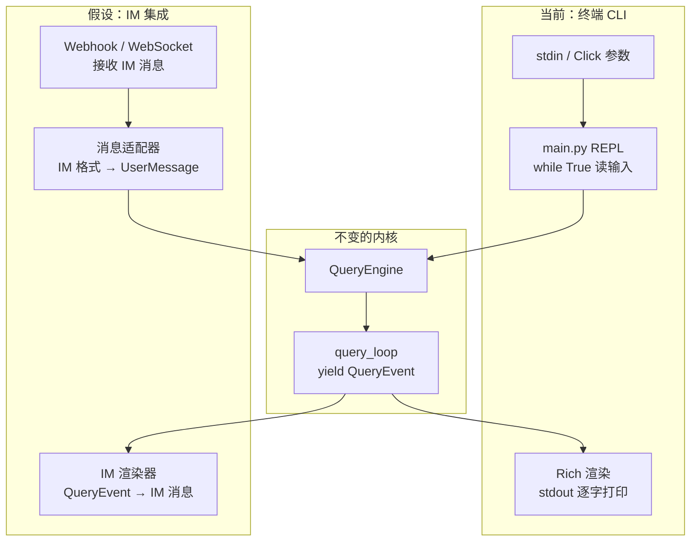

# 消息通道/IM 集成

## 读前思考

claudecode 是一个终端 CLI 工具，它的"消息通道"就是 stdin/stdout。问题是：如果要把这个 Agent 内核接入 Slack、钉钉、飞书等 IM 平台，架构上需要改什么？当前的 REPL 循环（while True 读 stdin → 跑 query_loop → 写 stdout）能直接复用吗？

## 核心问题

claudecode 当前没有 IM/消息通道集成。它的交互模式是终端 REPL（_run_repl）和管道模式（_run_print_mode），输入来自 stdin，输出通过 Rich 渲染到 stdout。但它的架构分层（query_loop 纯函数 + QueryEvent 事件协议）天然支持非终端消费方——IM 集成不需要改内核，只需要替换控制面。

## 方案展示

### 设计选择 1：事件协议天然支持多消费方

query_loop 的 AsyncIterator[QueryEvent] 返回类型意味着任何能消费 async generator 的代码都可以驱动这个循环。终端 REPL 用 Rich 渲染 TextDelta 实现逐字打印，IM 适配器可以累积 TextDelta 直到 TurnComplete 再一次性发送完整消息。ToolUseStart 在终端显示工具调用提示，在 IM 中可以选择静默或发送"正在执行..."状态。

QueryEngine 的三个入口方法（submit/run_turn/submit_messages）已经覆盖了不同场景：IM 场景用 submit()（接收用户文本，自动包装为 UserMessage），子 Agent 场景用 submit_messages()。IM 集成只需要一个新的控制面（替代 main.py 的 REPL 循环），不需要改 QueryEngine 或 query_loop。

### 设计选择 2：AskUser 工具是唯一的交互阻塞点

当前架构中唯一假设"有终端用户在场"的组件是 AskUserQuestion 工具——它需要用户在终端中输入回答。IM 场景下这个工具需要适配：要么通过 IM 消息向用户提问并等待回复（异步阻塞），要么在子 Agent 的工具过滤中排除它（当前 InProcessTeammate 已经这么做了）。

权限系统的交互确认（PermissionMode.DEFAULT 下高危工具弹出确认）也需要适配。当前非交互模式（is_interactive=False）直接拒绝 ASK 决策，IM 场景可能需要改为"发送确认消息到 IM 并等待用户回复"。

## 工程优化

**Rich 渲染与内核完全解耦。** ui/renderer.py 是 QueryEvent 的唯一终端消费方，替换为 IM 渲染器不影响内核。render_event() 函数接收 QueryEvent 并输出到 Rich console，IM 渲染器可以实现相同签名但输出到 HTTP API。

## 面试要点

**追问 1：如果要把 claudecode 接入 Slack，最小改动方案是什么？** 写一个新的控制面（替代 main.py）：一个 Slack WebSocket 监听器接收消息，调用 engine.submit(text) 获取事件流，累积 TextDelta 到 TurnComplete 后通过 Slack API 发送完整回复。AskUser 工具需要改为发送 Slack 消息并异步等待回复。权限模式设为 ACCEPT_EDITS 或 BYPASS（IM 场景无法弹出交互式确认）。内核（query_loop、tools、prompts）零改动。

**追问 2：当前架构对 IM 集成最大的障碍是什么？** 会话状态管理。当前 QueryEngine 的 messages 列表存活在进程内存中，进程退出就丢失。IM 场景需要跨请求持久化会话（用户发一条消息、等回复、可能几小时后再发下一条）。session/storage.py 已经有 save/load 机制，但它是为"恢复崩溃会话"设计的，不是为"多用户并发会话"设计的。IM 集成需要一个会话管理器，按用户/频道维护独立的 QueryEngine 实例或 messages 列表，并在每次请求间持久化和恢复。
