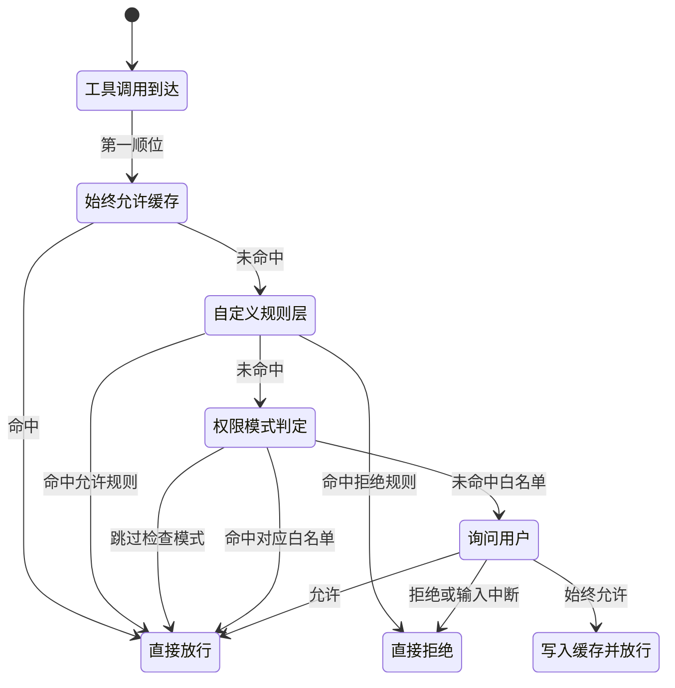
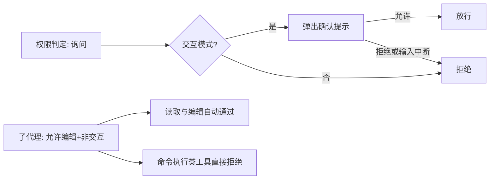
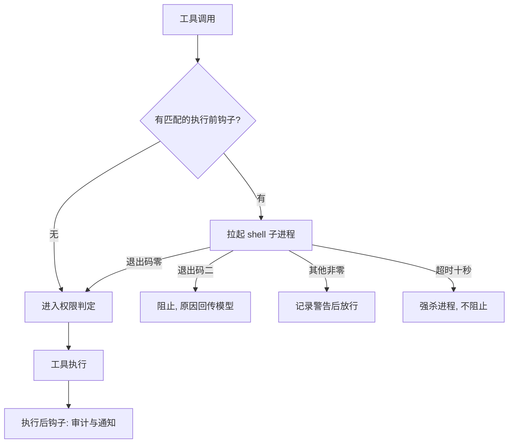
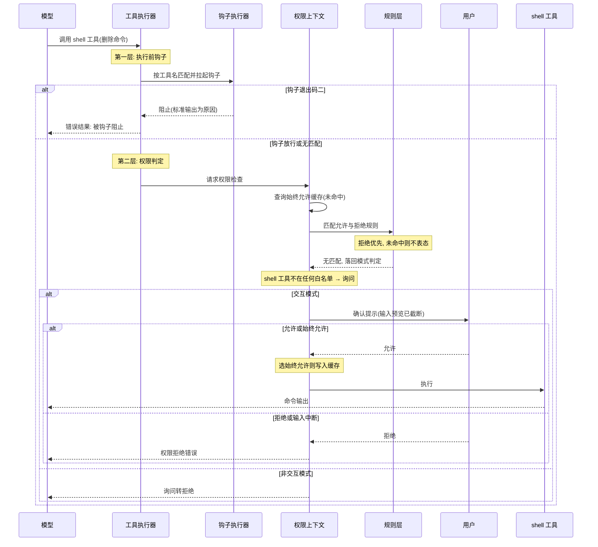

# 执行前拦截与信任治理

## 读前思考

- claudecode 能在用户本机执行任意 shell 命令、读写项目文件。如果模型被工具返回内容里嵌入的恶意指令诱导，生成了一条递归删除整个项目的命令，从命令生成到真正落地之间只有一道很短的窗口——你会在这个窗口里设几道闸？每道闸各检查什么？
- 如果你选择白名单模式（只有明确列入允许名单的工具自动执行），新增工具时忘了配置权限会怎样？这个默认应该是"放行"还是"询问"——两个方向出错的代价一样吗？

## 核心问题

执行前拦截解决的核心问题是：**在 Agent 拥有本机完整执行能力的前提下，给模型的每一次危险动作一次被人否决的机会，同时不让确认摩擦毁掉可用性。**

claudecode 是本地命令行开发工具，用户本人就是管理员——安全目标不是隔离用户，而是防模型犯错。它没有任何代码执行沙箱，命令直接在宿主文件系统上执行，安全边界完全依赖执行前拦截：三层独立判定（Hooks 内容级、自定义规则级、权限模式级）加上最终的人工确认，任何一层拒绝都会阻止执行。命令放行之后"在什么环境里跑"的问题在这里不存在——执行时隔离的讨论（以及"为什么不做沙箱"的立场）见 08-runtime。密钥方面，模型服务凭据通过环境变量注入，没有专门的引用或掩码机制，这是它相对其他三个项目的空白面；环境变量对模型不直接可见，但能执行命令就意味着能读到环境，这正是拦截层必须守住 shell 工具的原因之一。

| 维度 | claudecode 的选择 |
|------|-------------------|
| 权限模型 | 工具白名单分类 + 三级权限模式，白名单语义 |
| 规则配置 | settings.json 声明允许/拒绝规则，拒绝优先 |
| 人工介入 | 交互模式弹确认，支持"始终允许"记忆 |
| 非交互语义 | 询问直接转拒绝（fail-fast） |
| 内容级拦截 | Hooks shell 脚本，退出码表达放行/阻止 |
| 密钥管理 | 环境变量直接使用，无引用机制 |
| 安装时扫描 | 无（扩展物为本地 shell 命令与 Markdown） |

## 方案展示

### 设计选择一：三级权限模式 + 白名单分类 + 自定义规则层

权限判定的底座是白名单语义：只有明确列入白名单的工具获得放行，其余一律进入"询问"。工具被分成两个硬编码的集合——只读集合（文件读取、模式搜索、任务查询等，所有模式下放行）与编辑集合（文件编辑、写入等，"允许编辑"及以上模式放行）。不在任何集合中的工具（shell 执行、子代理、远程 MCP 工具）在常规模式下都是询问。

三级模式控制严格程度：仅只读模式最保守，只放行只读集合；允许编辑模式是推荐的交互档位，读取与编辑自动通过、命令执行要确认；跳过检查模式放行一切，仅限受信环境使用。

白名单之上还有一层可配置的规则层：从 settings.json 的权限配置字段加载允许与拒绝两组规则，每条规则要么是工具名精确匹配，要么是"工具名:命令通配模式"的形式（例如放行一切 git 开头的命令，通配符对命令字段做匹配）。判定顺序上**拒绝规则优先于允许规则**；两组都未命中时规则层不表态，决定权落回模式判定。规则的解析是防御式的——配置文件不存在、内容不是合法结构、字段类型错误，一律返回空规则集，配置出错不会让主流程崩溃。

权限上下文还维护一份"始终允许"缓存：用户在确认提示中选择"始终允许"后，该工具名写入缓存，后续同名调用命中缓存直接放行，不再弹确认。

**为什么这么选**：白名单语义是安全侧倒——忘记配置新工具的代价是多几次确认，而不是直接暴露。远程 MCP 工具的名称是动态生成的，永远进不了硬编码白名单，因此默认天然需要确认，恰好符合"来历不明的工具先问人"的直觉。拒绝优先保证一条精确的拒绝规则能压住一条过宽的允许规则；规则层则给硬编码白名单留出不改代码的调节阀门。

**牺牲了什么**：白名单硬编码，新增内置工具必须人工决定归属，漏配即落入询问。MCP 工具每次调用都弹确认，对重度用户是持续的摩擦痛点。通配规则只能匹配命令字段，表达不了多参数组合条件。"始终允许"缓存按工具名整体生效——一旦对 shell 工具选了始终允许，该工具下危险与安全的具体命令不再区分。

### 设计选择二：非交互场景的 fail-fast 拒绝

权限上下文持有一个交互标志。交互模式（终端会话）下，询问决策会弹出确认提示等待用户输入，提示中展示截断后的工具输入预览，让用户有足够但不冗长的信息做判断；输入流结束或键盘中断一律按拒绝处理——拿不到明确许可时方向永远是否定。

非交互场景（管道输出、子代理、后台任务）下没有终端可以弹对话框，询问决策**直接转换为拒绝**——不等待、不阻塞。子代理的典型配置是"允许编辑模式 + 非交互标志"：读取与编辑自动通过，shell 等需要确认的工具全部直接拒绝。子代理因此天然不能执行任何命令——这是有意的安全约束而非实现遗漏。

**为什么这么选**：无人值守场景里"等待确认"等于死锁，fail-fast 把不可能完成的等待替换成立即的否定结果，错误方向与安全一致。子代理由主代理派生、运行在用户视线之外，剥夺它的命令执行权等于把"人在回路"这个前提强制保留在主对话里。

**牺牲了什么**：子代理能力显著受限——需要跑测试、构建项目的任务它做不了，只能交回主代理执行，或者用户把模式改成跳过检查（以安全换能力）。管道脚本里任何超出只读与编辑的操作都会静默失败，使用者需要理解这条语义才不会被"莫名拒绝"困扰。

### 设计选择三：Hooks 内容级拦截

权限系统只能回答"这个工具能不能用"，回答不了"这条具体命令能不能跑"——后者交给 Hooks。用户在 settings.json 中配置若干 shell 命令作为钩子，每条钩子声明触发时机（工具执行前/执行后）、要运行的命令，以及可选的目标工具名（不声明则对所有工具生效）。

执行前钩子的协议完全建立在操作系统原语上：命中目标工具的钩子被拉起为子进程，工具名与参数以结构化文本从标准输入传入，决策通过退出码返回——零表示放行，二表示阻止（标准输出承载阻止原因，会作为错误结果回传给模型，模型看到原因后可自行改路），其他非零值只产生警告不影响执行。钩子有十秒时限，超时进程被强制杀死，且**超时不阻止工具执行**——钩子挂死时宁可放行工具也不卡死主循环；钩子运行中的任何异常同样被吞掉，扩展机制的故障不传染给工具执行。多个执行前钩子按短路语义运行：第一个返回阻止即终止链路。执行后钩子用于审计与通知（如文件修改后自动跑静态检查），接收截断到千字符级别的工具输出。

**为什么这么选**：用 shell 脚本做扩展意味着零学习成本——会写脚本就能写钩子，不需要任何专有接口。拦截点放在工具执行边界而非工具内部，钩子与工具代码互不侵入。它补上的正是权限系统的盲区：可以配置"允许 shell 工具，但禁止对某个目录执行递归删除"这类命令内容级的策略。

**牺牲了什么**：退出码只能表达二元决策，钩子不能修改工具参数、不能替换工具结果。每次命中都要付出进程启动开销，高频调用场景可能成为瓶颈。框架完全信任钩子的退出码语义——脚本自身的错误没有检测机制（见面试要点 2）。

## 核心机制执行流：一次 shell 调用的三层拦截

以用户在允许编辑模式下工作、模型生成一条递归删除构建目录的命令为例：

**阶段一：钩子先行。** 执行顺序是刻意的——钩子在权限检查之前运行，内容级的细粒度拦截先于工具级的粗粒度门禁。一条配置良好的钩子可以在权限系统还没有机会询问用户之前就拦下特定目录的删除操作。钩子阻止时，原因文本作为错误结果回传，模型有机会改用更安全的方案而不是盲目重试。

**阶段二：缓存与规则。** 权限上下文先查"始终允许"缓存，再交给规则层。规则层的拒绝优先意味着管理员可以用一条拒绝规则钉死底线，无论允许规则写得多宽。规则未表态时，决定权按白名单语义落回模式判定——shell 工具不在只读与编辑集合中，判定结果是询问。

**阶段三：人在回路。** 交互模式下确认提示展示截断后的输入预览；输入流结束或中断按拒绝处理。用户选择"始终允许"会写入缓存，后续该工具的调用直通——这是以粒度换摩擦的交易。

**边界路径——钩子超时或异常。** 钩子超过十秒被强杀，工具照常进入权限判定；钩子内部异常被吞掉，同样不阻止。钩子层的失败模式是放行的，真正的安全底线在权限层与用户确认。

**边界路径——子代理发起同一调用。** 子代理运行在非交互标志下，询问决策直接转拒绝，不会有任何等待。模型收到拒绝错误后可以把任务交回主代理。

## 工程优化

**钩子与权限的粗细分工**：执行链路固定为"查找工具 → 执行前钩子 → 权限检查 → 执行 → 执行后钩子"。钩子处理命令内容（权限系统看不见的维度），权限处理工具归属（钩子不必重复判断的维度），两层各管一段，配置者可以只在自己关心的维度上设防。

**对象接口的函数式适配**：权限上下文是带状态的对象，主执行循环却是纯函数风格——构建阶段把对象的检查方法适配成一个闭包传入循环，循环只知道"调一个函数拿到布尔值"，不感知权限实现的任何细节。拦截机制的存在不污染执行主路径的结构。

**防御式解析保主流程**：规则文件缺失或损坏返回空规则，钩子配置出错不影响其余钩子，钩子运行异常被捕获吞掉。所有安全扩展的故障模式都是"退回基础层"而不是"拖垮执行"。

**确认提示的信息裁剪**：输入预览截断到两百字符级别，既给用户判断依据，又避免超长参数把终端刷屏；输入结束与键盘中断统一按拒绝记账，不留悬挂状态。

## 面试要点

**1. 白名单语义下远程 MCP 工具永远需要确认，这对重度用户是持续的痛点，怎么缓解？**

参考答案方向：痛点根源是 MCP 工具名称动态生成、永远进不了硬编码白名单。缓解路径有两条：一是扩展规则层——它已支持"工具名:参数通配"语法，可以按服务器前缀整批放行某个受信服务器的全部工具；二是引入"受信服务器"概念，在配置中标记后其工具自动视为已允许。两条路都保留了"默认询问"的安全侧倒，只是把授权决策从每次确认前移到一次性配置。判断标准是"信任的授予单位 × 前移后是否可撤销"——按服务器整批授权、可随时收回，才值得做。

**2. 钩子用退出码二表达阻止，如果用户的钩子脚本有 bug 意外返回了二会怎样？框架能做什么？**

参考答案方向：工具会被阻止，模型收到"被钩子阻止"加脚本标准输出的错误信息，可能改路也可能向用户报告——而框架没有任何"钩子误触发"的检测机制，它完全信任退出码语义。这是"操作系统原语做扩展"的代价：协议极简但表达力只有二元。更健壮的方向是要求钩子输出结构化决策（明确的决定字段加原因字段），但这又抬高了钩子编写门槛。另一个隐含风险在反面：超时与异常都按不阻止处理，一个坏钩子不会卡死系统，但也提供不了保护。判断标准是"协议简单性 × 决策表达力"——二元协议适合拦截，不适合需要参数化响应的场景。

**3. 拒绝优先于允许、未列名默认询问——这套语义为什么整体向安全侧倒？体验受损时正确的放宽方式是什么？**

参考答案方向：两个默认值回答的是同一个问题：不确定时倒向哪边。未列名默认询问，意味着新增工具的漏配只产生摩擦、不产生暴露；拒绝优先，意味着一条底线规则不会被过宽的允许规则意外击穿。安全错误的代价（不可逆的破坏）远高于体验错误的代价（多点几次确认），所以侧倒方向没有争议。正确的放宽方式是显式且可撤销的：用规则层逐条放行已审查的命令模式，或用"始终允许"缓存按工具放行——而不是切到跳过检查模式，后者会同时拆掉所有层，连钩子之外的兜底也一并消失。判断标准是"不确定时的默认方向 × 放宽操作的粒度与可逆性"。
