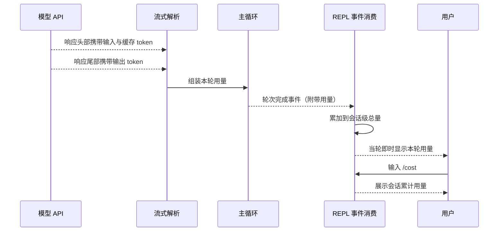
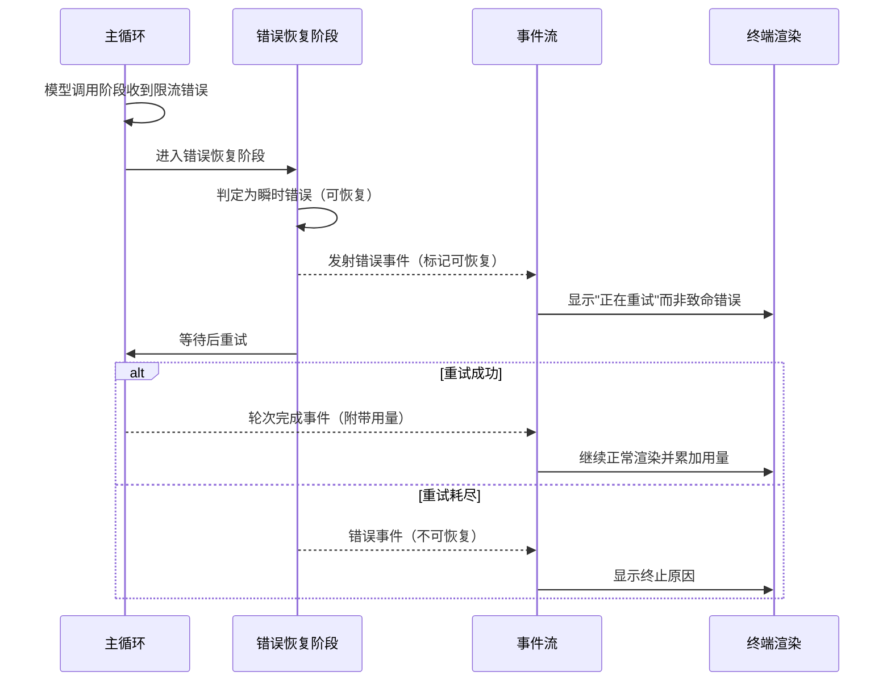

# 可观测性

## 读前思考

- Agent 的可观测性和传统服务不同：你关心的不只是延迟和错误率，还有"这一轮用了多少 token""工具执行花了多久""上下文还剩多少空间"。如果在每个模块里都加埋点代码，业务逻辑会被观测代码淹没。怎么在不侵入内核的前提下收集这些信息？
- 如果你的 CLI 工具想回答"这次对话质量如何、哪类任务容易出错"，而你既没有日志平台也没有评估数据集，你能依赖什么？

## 核心问题

可观测性解决的核心问题是：**如何追踪 Agent 运行时的 token 消耗、工具执行状态、错误信息和上下文健康度，且不为观测引入独立基础设施**。

claudecode 是单用户 CLI 工具，定位是"零观测基础设施"：没有独立的 metrics/tracing 系统，观测能力建立在三个已有机制之上——事件流（轮次完成事件携带用量统计）、Python logging、/cost 命令。

| 维度 | claudecode 的选择 |
|------|------------------|
| token 追踪 | 事件流内嵌用量，REPL 累加 |
| 成本查看 | /cost 命令读累加值 |
| 日志 | 标准 logging，非结构化 |
| 调试界面 | 终端渲染即面板 |
| 评估 | 无内建机制 |

## 方案展示

### 设计选择一：事件流内嵌用量统计

token 用量不靠独立采集器，而是内嵌在事件协议里：每次 API 调用完成时，轮次完成事件（TurnComplete）携带用量对象（输入、输出、缓存创建、缓存读取 token）。REPL 消费该事件时顺手累加到引擎的会话级总量上，/cost 命令直接读累加值。

**为什么这么选**：token 数据是事件流的副产品——API 在流式响应的头尾分别吐出输入和输出 token（分离采集避免重复计数），解析层拼进本轮用量，随轮次事件流到消费端，消费端顺手累加。整条链路没有一处专门埋点，任何消费事件流的代码都能拿到用量。

**牺牲了什么**：只有会话级粗粒度统计——没有按工具分类的消耗、没有按轮次的趋势、没有跨会话历史。累加器活在进程内存里，进程退出统计即丢。

### 设计选择二：标准 logging 做诊断

各模块用 Python 标准 logging 记录诊断：warning 级记录工具执行失败、自动压缩失败、MCP 连接超时等异常路径；info 级记录工具注册、记忆保存等关键操作；debug 级记录高频低价值信息。没有结构化 JSON、没有 trace ID 关联、没有运行时级别调整。

**为什么这么选**：单用户 CLI 不是需要集中分析的多实例服务，人类可读的字符串日志配终端输出已经够用。这是"够用就好"的判断，不是遗漏。

**牺牲了什么**：无法做事后聚合分析（"统计本月所有 429 错误"做不到）；同一轮对话的多条日志无法关联；多代理并行场景下日志交错难以阅读。

### 设计选择三：UI 即观测面板

终端渲染本身就是观测界面：文本增量事件逐字打印模型输出，工具开始事件显示工具名与参数摘要，工具结果事件显示截断后的结果预览，压缩发生事件通知上下文被压缩，错误事件携带是否可恢复的标记（is_recoverable）——限流重试时 UI 显示"正在重试"而非红色报错。

**为什么这么选**：CLI 用户就坐在终端前，不需要远程 dashboard——流式输出和错误提示已经回答了"系统在干什么、出什么事了"。

**牺牲了什么**：终端是线性流，无法展示并行工具执行的时序、用量趋势、上下文使用率；多代理场景下终端输出可能信息过载。

## 核心机制执行流：一个错误如何被观测、分类并呈现

以一次模型调用触发 429 限流为例：

**阶段一：错误进入恢复阶段。** 主循环的模型调用阶段不直接处理错误，而是转入错误恢复阶段——限流、网络抖动被归为瞬时错误，自动等待重试。

**阶段二：事件携带可恢复标记。** 错误事件带标记区分"需要用户关注的致命错误"与"系统正在自动恢复的瞬时错误"，UI 层据此决定呈现方式。这是 claudecode 唯一接近"健康度评估"的机制：它分类错误的性质，但不打分、不统计频率。

**阶段三：恢复或终止。** 重试成功则流程回到正常路径，轮次完成事件照常携带用量；重试耗尽则以不可恢复错误终止本轮。

**边界路径——工具失败**：工具执行失败不中断循环，失败结果作为工具结果返回给模型，由模型决定重试或换路，warning 日志留痕。

## 工程优化

**缓存 token 分离统计**：用量对象区分缓存创建与缓存读取 token——缓存读取占比高说明系统提示词与工具定义被有效缓存，实际计费远低于输入 token 表面值。

**工具结果 UI 截断**：工具结果在终端只显示前若干字符预览，完整结果进入对话记录——防止读大文件后刷屏，同时模型仍能看到完整内容。

**事件即接口**：因为观测数据全部承载在事件协议上，未来加外部追踪（如 OTel）可以在引擎消费事件流处做 span 管理，不必改纯函数的主循环。

## 评估机制

claudecode 没有内建评估机制，这一点要如实说明：**输出质量**方面没有评分、没有数据集回归、没有摘要质量检查——改提示词后效果是否变好只能靠人工试用判断；**系统健康**方面只有错误事件的可恢复标记做粗分类，没有用量异常检测、没有卡住检测、没有诊断报告。统计数据的生命周期也限制了评估：用量累加器随进程退出消失，没有任何历史可供"这次比以前贵/慢/差"的对比。作为对照，hermes-agent 用批量回归数据集、openclaw 用在线质量审计分别覆盖了这两个方向（见各自项目篇）。

**代价**：这是"零基础设施"立场的延伸——不为单用户 CLI 增加评估负担；但任何依赖 claudecode 内核做二次开发的项目，都要自建评估能力。

## 面试要点

**1. claudecode 的"事件流即观测"在什么场景下不够用？要追踪"模型为什么做了这个决策"还缺什么？**

参考答案方向：事件流只能回答"发生了什么"（调了哪个工具、用了多少 token），回答不了"为什么"。追踪决策需要完整 prompt 记录（模型看到了什么上下文）、推理内容、备选方案——这些 claudecode 都没有持久化，推理增量事件只覆盖了推理内容且随进程消失。判断标准是"要回答的问题属于事实层还是决策层 × 数据是否需要跨进程存活"。

**2. 如果要给 claudecode 加外部追踪（如 OTel），最小侵入方案是什么？**

参考答案方向：主循环是纯函数，不能在其中直接调用追踪 SDK。两条路：参数注入可选的追踪回调（侵入循环签名），或在引擎消费事件流处做 span 管理——主循环各阶段本身就是天然的 span 边界，轮次完成事件上记录用量属性即可。后者不改循环、只加消费方，更符合现有架构。判断标准是"观测代码放在纯函数内还是事件消费侧 × 是否破坏循环的可测试性"。

**3. 没有按工具的 token 统计，被问"哪个工具最费 token"时怎么推断？要精确统计需要改什么？**

参考答案方向：粗略推断：命令执行与文件读取类工具的输出最大，其结果作为工具结果进入对话记录，后续每轮 API 调用都会重发，是输入 token 的主要来源；系统提示词与工具定义是固定开销。精确统计需要在工具结果构建处记录每个结果的序列化大小，作为轮次事件的扩展属性上报——又一次印证"观测数据承载在事件协议上"的扩展方式。判断标准是"估算精度需求 × 埋点成本是否值得"。
