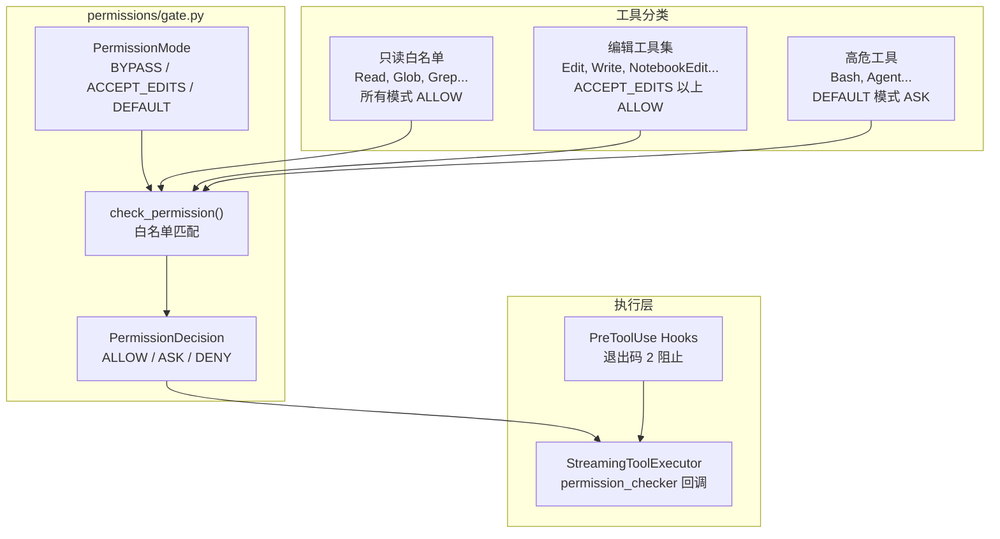
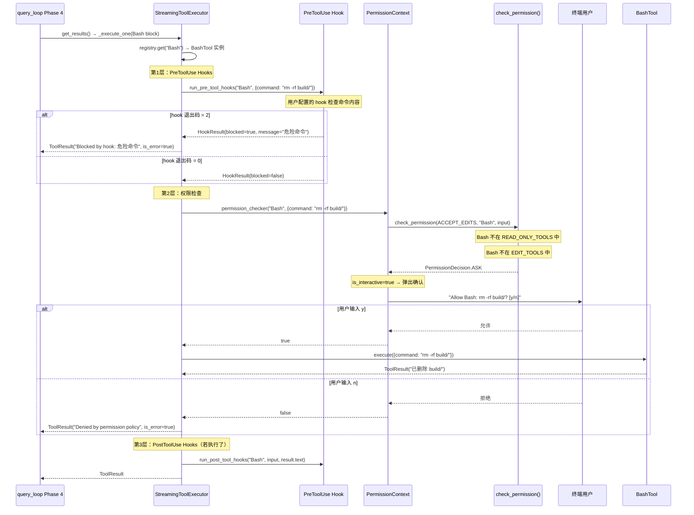

# 安全与沙箱

## 读前思考

Agent 能执行 shell 命令、读写文件、访问网络——这意味着一个错误的模型决策就可能 rm -rf 整个项目。你怎么设计一个权限系统，既不让用户每次工具调用都要确认（太烦），又不让模型无限制地执行危险操作（太危险）？如果你选择白名单模式（只有明确允许的工具自动执行），新增工具时忘了配置权限会怎样？

## 核心问题

安全与沙箱解决的是「如何在 Agent 自主执行工具时控制风险，防止模型决策导致不可逆破坏」。claudecode 用三级权限模式（BYPASS/ACCEPT_EDITS/DEFAULT）+ 白名单工具分类 + 非交互 fail-fast 语义实现权限门控。没有代码执行沙箱（BashTool 直接在宿主文件系统上执行），安全边界完全依赖权限检查。

## 方案展示

### 设计选择 1：白名单 + 三级模式

check_permission() 的判定逻辑是白名单模式：只有明确列入白名单的工具获得 ALLOW，其余一律 ASK。这确保了新增工具（包括 MCP 远程工具）在未被显式配置前默认需要用户确认——安全侧倒。

三级模式控制严格程度：BYPASS 跳过所有检查（仅限 CI/CD 等受信环境），ACCEPT_EDITS 允许读取+编辑但命令执行需确认（推荐的交互模式），DEFAULT 仅允许读取（最安全的默认模式）。工具分为两个白名单：READ_ONLY_TOOLS（Read、Glob、Grep 等，所有模式下 ALLOW）和 EDIT_TOOLS（Edit、Write 等，ACCEPT_EDITS 以上 ALLOW）。不在任何白名单中的工具（Bash、Agent、MCP 工具）在 DEFAULT 和 ACCEPT_EDITS 模式下都是 ASK。

以 ACCEPT_EDITS 交互模式下模型调用 Bash "rm -rf build/" 为例，trace 权限检查的完整路径：

这个 trace 展示了三层拦截的完整路径：Hooks 做内容级细粒度检查（可以分析具体命令字符串），权限系统做工具级粗粒度门禁（白名单匹配），用户确认做最终决策。三层中任何一层拒绝都会阻止执行。在非交互模式下（子 Agent、--print），ASK 直接转为 DENY，不弹确认。

代价是白名单是硬编码的 frozenset。新增工具时必须手动决定是否加入白名单，否则它会默认 ASK——安全但可能影响体验（用户需要频繁确认）。另外 MCP 工具永远不在白名单中（名称动态生成），所以在非 BYPASS 模式下每次 MCP 工具调用都需要确认，这对重度 MCP 用户来说很烦。

### 设计选择 2：非交互 fail-fast

PermissionContext 有一个 is_interactive 标志。交互模式（REPL）下 ASK 决策会弹出确认对话框等待用户输入；非交互模式（--print 管道、子 Agent、后台任务）下 ASK 直接转为 DENY——不等待、不阻塞、直接拒绝。

这个设计防止了后台 Agent 卡死在权限确认上（没有终端可以弹对话框）。InProcessTeammate 使用 ACCEPT_EDITS + is_interactive=False，意味着读取和编辑自动允许，Bash 等高危工具直接拒绝。子 Agent 不能执行 shell 命令——这是一个有意的安全约束。

代价是子 Agent 的能力被显著限制。如果任务需要子 Agent 运行测试（pytest）或构建项目（make），它做不到。解决方案是 leader 自己执行这些命令，或者将权限模式改为 BYPASS（但牺牲了安全性）。

### 设计选择 3：无沙箱 + Hooks 补充

claudecode 没有代码执行沙箱——BashTool 直接在宿主文件系统上 fork 子进程执行命令。安全边界完全依赖权限检查（执行前拦截）和 Hooks（用户自定义的 shell 命令检查）。没有 seccomp、namespace、容器等内核级隔离。

Hooks 的 PreToolUse 机制是权限系统的补充：用户可以配置 hook 检查 Bash 命令的具体内容（如禁止 rm -rf、禁止访问特定目录），通过退出码 2 阻止执行。这比权限系统的工具级粒度更细——权限系统只能决定"Bash 工具能不能用"，Hooks 可以决定"这条具体的 Bash 命令能不能跑"。

代价是如果用户配置了 BYPASS 模式且没有 Hooks，模型可以执行任何 shell 命令。这是一个"用户自己承担风险"的设计——claudecode 信任用户理解 BYPASS 的含义。

## 工程优化

**权限检查在工具执行路径中的位置。** StreamingToolExecutor._execute_one() 的执行顺序是：查找工具 → PreToolUse hooks → permission check → execute → PostToolUse hooks。权限检查在 hooks 之后，意味着 hook 可以在权限检查之前做更细粒度的拦截（如根据命令内容决定），而权限检查做粗粒度的工具级门禁。

**PermissionContext 的 OOP → 函数式适配。** QueryEngine._build_permission_checker() 将 PermissionContext 的 OOP 接口（ctx.check()）适配为 query_loop 需要的函数式接口（async def _check(tool_name, tool_input) -> bool）。这保持了 query_loop 的纯函数性——它不知道权限检查的具体实现，只调用一个闭包。

## 面试要点

**追问 1：为什么不做代码执行沙箱（如 Docker 容器或 gVisor）？** claudecode 的定位是本地开发工具，用户在自己的机器上运行，需要直接访问项目文件、git 仓库、开发环境。沙箱会引入文件系统隔离（需要挂载项目目录）、网络限制（影响 npm install、pip install）、性能开销（容器启动延迟）。对于"AI 编程助手"场景，这些限制会严重影响实用性。安全策略选择了"执行前拦截"（权限 + Hooks）而非"执行时隔离"（沙箱），把安全决策权交给用户。代价是 BYPASS 模式下没有兜底——如果模型执行了 rm -rf /，没有任何机制能阻止。

**追问 2：白名单模式意味着 MCP 工具永远需要确认，这对重度 MCP 用户怎么办？** 当前确实是一个体验痛点。可能的方案：在 settings.json 中允许用户配置"信任的 MCP 服务器"列表，来自信任服务器的工具自动加入白名单。或者在 PermissionRules 中支持通配符匹配（如 mcp__filesystem__* 全部 ALLOW）。当前实现中 PermissionRules（rules.py）存在但功能有限，扩展它是解决这个问题的自然路径。
