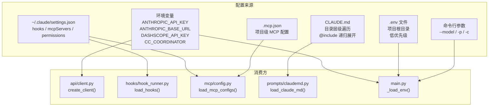

# 配置与环境管理

## 读前思考

一个 Agent 系统的配置来源可能有五六个：环境变量、.env 文件、用户级 settings.json、项目级 .mcp.json、CLAUDE.md 指令文件、命令行参数。问题是：当这些来源对同一个配置项给出不同值时，谁赢？如果你不定义明确的优先级链，用户会遇到"我明明改了环境变量为什么没生效"的困惑。

## 核心问题

配置与环境管理解决的是「如何从多个来源加载配置，按优先级合并，并支持运行时切换」。claudecode 的配置分散在多个文件中，没有统一的配置管理器，而是由各模块自行加载各自的配置。优先级链在代码中隐式定义（环境变量 > .env 文件 > 默认值），没有集中文档化。

## 方案展示

### 设计选择 1：分散加载 + 隐式优先级

claudecode 没有统一的 Config 类或配置加载器。每个模块自行加载自己关心的配置：api/client.py 从环境变量读 API key，hooks/hook_runner.py 从 settings.json 读 hook 配置，mcp/config.py 从 settings.json + .mcp.json 读 MCP 服务器列表，prompts/claudemd.py 从目录层级搜索 CLAUDE.md。

main.py 的 _load_env() 是唯一做"多源合并"的地方：先读 .env 文件（低优先级），再用环境变量覆盖（高优先级）。支持的 key 只有三个：ANTHROPIC_API_KEY、ANTHROPIC_BASE_URL、DASHSCOPE_API_KEY。这个合并逻辑是硬编码的 for 循环，不是通用的配置合并框架。

代价是配置优先级不透明。用户无法通过一个命令看到"当前生效的完整配置及其来源"。如果 settings.json 中的 mcpServers 和 .mcp.json 中有同名服务器，两者都会被加载（不做去重），可能导致重复注册。CLAUDE.md 的搜索逻辑（从 cwd 向上遍历到根目录，每级检查 .claude/CLAUDE.md）在嵌套项目中可能产生意外的指令叠加。

### 设计选择 2：CLAUDE.md 的层级发现 + @include

CLAUDE.md 是 claudecode 的“项目指令文件”，类似 .editorconfig 或 .eslintrc 的层级配置模式。load_claude_md() 从 cwd 向上遍历到文件系统根目录，在每一级检查 .claude/CLAUDE.md 是否存在，将所有找到的文件内容合并（越靠近 cwd 的优先级越高）。支持 @include 指令递归展开引用的其他文件。

这个设计让 monorepo 中的子项目可以有自己的 CLAUDE.md（覆盖或补充上级目录的指令），同时共享上级目录的通用规范。内容最终注入 system prompt，模型在每轮对话中都能看到。

**CLAUDE.md 在 system prompt 中的位置和作用：** CLAUDE.md 是 system prompt 的第 11 段（最后一段），在所有其他段落之后注入。这个位置确保用户自定义指令的优先级最高——当 CLAUDE.md 中的规则与前面的静态段落冲突时，模型倾向于遵循更晚出现的 CLAUDE.md 指令。注入时的格式是固定的头部（"Codebase and user instructions are shown below. Be sure to adhere to these instructions."）加上合并后的文件内容。

**搜索路径和优先级（从低到高）：**

| 层级 | 路径 | 作用域 |
|------|------|--------|
| 1 | ~/.claude/CLAUDE.md | 用户全局（对所有项目生效） |
| 2 | 从根目录到 cwd 每级的 CLAUDE.md 和 .claude/CLAUDE.md | 项目层级（父级 → 子级） |
| 3 | 每级的 .claude/rules/*.md | 规则目录（按文件名字母序） |
| 4 | cwd/CLAUDE.local.md | 私有本地指令（最高优先级，通常 .gitignore） |

**@include 机制的防御设计：** 支持三种路径格式（~/、相对路径、绝对路径），用 seen 集合防止循环引用（A→B→A），max_depth=10 限制嵌套深度，读取失败静默返回空串不影响其他文件。HTML 块注释（\<!-- ... -->）会被剥离，通常用于在 CLAUDE.md 中写隐藏备注。

代价是 CLAUDE.md 的内容没有大小限制。如果用户在 CLAUDE.md 中写了几千行指令，会显著占用 context window 空间，挤压实际对话的可用 token。没有“CLAUDE.md 太长时截断或警告”的保护机制。

### 设计选择 3：运行时模型切换

/model 命令支持在 REPL 运行时切换模型，无需重启。切换逻辑在 main.py 的 REPL 循环中：解析 __MODEL__ 标记 → is_dashscope_model() 判断目标模型类型 → 创建新 client（不同的 API key + base_url）→ 替换 engine._client → 重建 system_prompt。

这不是一个通用的"配置热重载"机制——只有模型切换支持运行时变更。hooks、MCP 配置、权限模式的变更都需要重启。模型切换之所以能热重载，是因为它只影响 client 实例和 system prompt，不影响工具注册表或权限上下文。

## 工程优化

**.env 文件格式极简。** _load_env() 逐行解析 key=value 格式，跳过 # 注释行，不支持引号转义、多行值、变量引用。这覆盖了 99% 的使用场景（API key 配置），避免了引入 python-dotenv 依赖。

**settings.json 损坏时优雅降级。** load_hooks() 和 load_mcp_configs() 对 JSON 解析失败用 try/except 包裹，记录警告并返回空列表。配置文件损坏不会阻止程序启动，只是对应功能不可用。

**模型列表硬编码。** AVAILABLE_MODELS 是一个写死的列表（3 个 Claude 模型 + 3 个百炼模型），不从 API 动态获取。新增模型需要改代码。这是 YAGNI 判断——当前支持的模型数量有限，动态获取增加了 API 调用和错误处理复杂度。

## 面试要点

**追问 1：为什么不做统一的配置管理器（如 pydantic-settings 或 dynaconf）？** claudecode 的配置项数量很少（API key、base_url、hooks、MCP 服务器、模型名），且各配置项的消费方完全不同（client.py 不需要知道 hooks 配置）。统一配置管理器会引入一个所有模块都依赖的中心点，增加耦合度。当前"各模块自行加载"的模式让每个模块只依赖自己需要的配置来源，新增配置项不需要改中心 schema。代价是优先级规则分散在代码中，新用户难以理解"为什么我的配置没生效"。

**追问 2：CLAUDE.md 的层级叠加在 monorepo 中会不会产生冲突？** 会。如果 /repo/.claude/CLAUDE.md 说"用 tabs 缩进"，/repo/packages/ui/.claude/CLAUDE.md 说"用 spaces 缩进"，两者都会被加载到 system prompt 中，模型看到矛盾的指令。当前没有"子级覆盖父级"的合并语义——所有内容简单拼接。解决冲突依赖模型自己的判断力（通常会遵循更具体的指令）。如果要更精确，可以引入"覆盖"标记（如子级 CLAUDE.md 中声明 override: true 时忽略父级同类指令），但这增加了解析复杂度。
