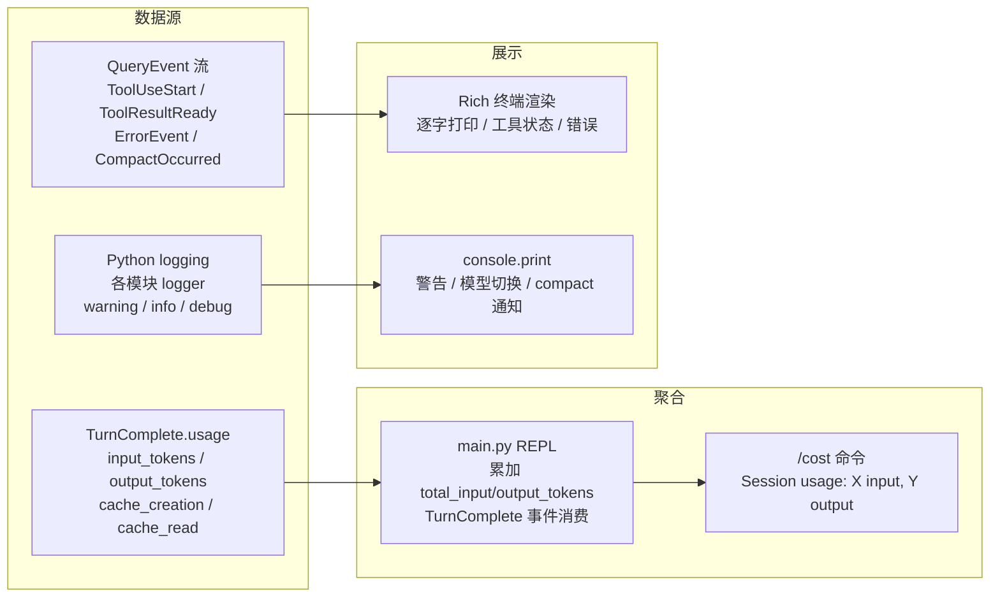
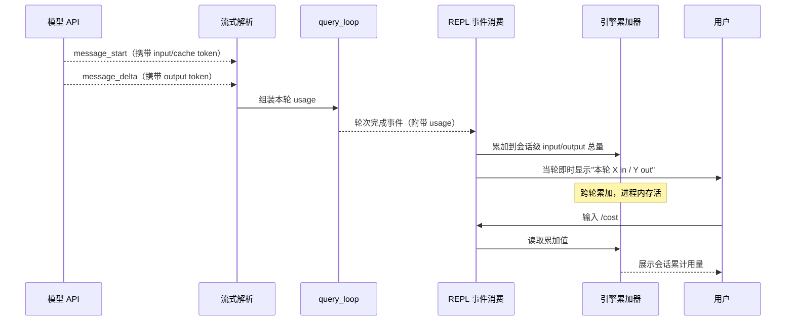

# 可观测性

## 读前思考

Agent 系统的可观测性和传统 Web 服务不同：你关心的不只是延迟和错误率，还有"模型这一轮用了多少 token""工具执行花了多长时间""上下文窗口还剩多少空间"。问题是：如果你在每个模块里都加 logging 和 metrics 代码，业务逻辑会被观测代码淹没。你怎么在不侵入内核的前提下收集这些信息？

## 核心问题

可观测性解决的是「如何追踪 Agent 运行时的 token 消耗、工具执行状态、错误信息和上下文健康度」。claudecode 没有独立的 metrics/tracing 系统，而是通过三个已有机制提供可观测能力：QueryEvent 事件流（TurnComplete 携带 usage 统计）、Python logging 模块（各模块的 logger.warning/info/debug）、/cost slash command（会话级 token 汇总）。

## 方案展示

### 设计选择 1：事件流内嵌 usage 统计

token 用量追踪不是通过独立的 metrics 采集器，而是内嵌在 QueryEvent 协议中。每次 API 调用完成时，TurnComplete 事件携带 Usage 对象（input_tokens、output_tokens、cache_creation_input_tokens、cache_read_input_tokens）。main.py 的 REPL 事件循环在消费 TurnComplete 时累加到 engine 的 total_input_tokens / total_output_tokens 属性中。

这个设计的好处是零额外基础设施——不需要 Prometheus client、不需要 OpenTelemetry SDK、不需要 metrics 上报端点。token 统计作为事件流的副产品自然产生，任何消费 QueryEvent 的代码都能获取用量数据。/cost 命令直接读取 engine 的累加值，一行代码搞定。

代价是只有会话级的粗粒度统计。没有按工具分类的 token 消耗（不知道 Bash 工具的结果占了多少 input_tokens），没有按轮次的趋势图，没有跨会话的历史对比。如果需要这些，就需要在 TurnComplete 消费点增加结构化日志或 metrics 上报。

下面以"一轮对话的 token 用量如何被统计并最终通过 /cost 展示"为例，trace 这条观测数据的完整流转：

这条链路的关键在于 token 数据是"顺流而下"的副产品，而不是专门去采集的：API 在流式响应的头尾分别吐出输入和输出 token（分离采集避免重复计数），解析层把它们拼进本轮 usage，随轮次完成事件一起流到消费端，消费端顺手累加。整条链路没有一处专门的"埋点"代码，观测能力完全寄生在既有的事件协议上——这是"零基础设施"的具体含义。代价也在图里：累加器活在进程内存里，进程一退出会话统计就没了，没有任何持久化或跨会话聚合。

### 设计选择 2：Python logging 做诊断

各模块用标准 Python logging 记录诊断信息：logger.warning 记录工具执行失败、auto-compact 失败、MCP 连接超时等异常路径；logger.info 记录 MCP 工具注册、记忆保存等关键操作；logger.debug 记录 mailbox 读写、memory index 更新等高频低价值信息。

没有结构化日志（JSON 格式）——所有日志都是人类可读的字符串格式。没有 trace ID 关联同一轮对话中的多条日志。没有日志级别动态调整（需要重启修改 logging 配置）。这些是"够用就好"的判断：claudecode 是单用户 CLI 工具，不是需要集中式日志分析的多实例服务。

### 设计选择 3：UI 即观测面板

Rich 终端渲染本身就是可观测性的主要界面。TextDelta 逐字打印让用户实时看到模型输出，ToolUseStart 显示工具调用信息（工具名 + 参数摘要），ToolResultReady 显示工具执行结果（截断到 500 字符），CompactOccurred 通知上下文被压缩，ErrorEvent 显示错误信息。用户不需要额外的 dashboard——终端输出就是 dashboard。

代价是信息密度受限。终端只能显示线性流，无法展示并行工具执行的时序关系、token 消耗的趋势图、context window 的使用率百分比。对于调试复杂的多 Agent 场景（swarm），终端输出可能信息过载。

## 工程优化

**cache token 分离统计。** Usage 对象区分 cache_creation_input_tokens 和 cache_read_input_tokens，让用户了解 prompt caching 的效果。如果 cache_read 占比高，说明 system prompt 和工具 schema 被有效缓存，实际计费 token 远低于 input_tokens 显示的值。

**ToolResultReady 截断到 500 字符。** 工具结果在 UI 中只显示前 500 字符预览，完整结果写入 transcript。这防止了 cat 一个大文件后终端被刷屏，同时保证模型能看到完整内容。

**错误事件携带 is_recoverable 标记。** ErrorEvent.is_recoverable 让 UI 层可以区分"需要用户关注的致命错误"和"系统正在自动恢复的瞬时错误"。429 限流时 UI 可以显示"正在重试..."而非红色错误，减少用户焦虑。

## 面试要点

**追问 1：如果要给 claudecode 加 OpenTelemetry tracing，最小侵入方案是什么？** query_loop 的每个 Phase 已经是天然的 span 边界：Phase 1（prepare）、Phase 2（call_model）、Phase 3（error_recovery）、Phase 4（tool_execution）。在 query_loop 入口创建一个 root span，每个 Phase 创建 child span，TurnComplete 时记录 usage 属性。由于 query_loop 是纯函数，不能在其中直接调用 tracing SDK——需要通过参数注入一个可选的 tracer 回调，或者在 QueryEngine 层（消费事件流时）做 span 管理。后者更简单：在 engine.submit() 中创建 span，在 TurnComplete 事件时结束 span 并记录属性。

**追问 2：当前没有按工具的 token 消耗统计，如果面试官问"哪个工具最费 token"你怎么回答？** 当前无法精确回答。粗略推断：Bash 工具的输出（最大 200KB）和 FileRead 的内容是最主要的 input_tokens 来源，因为它们的结果作为 tool_result 写入 transcript，后续每轮 API 调用都会重新发送。system prompt（含 CLAUDE.md 和工具 schemas）是固定的 input_tokens 开销。如果要精确统计，需要在 Phase 4 构建 ToolResultBlock 时记录每个 tool_result 的序列化大小，作为 TurnComplete 的扩展属性上报。
