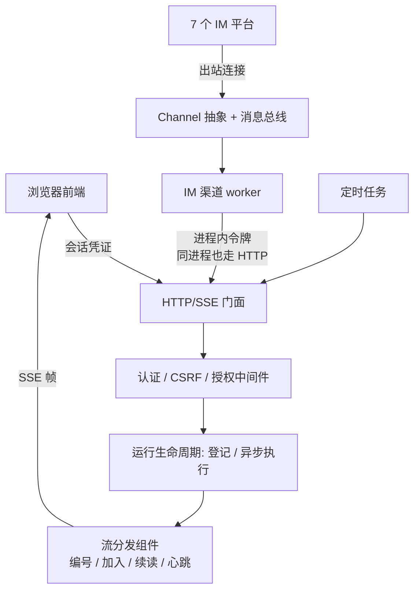
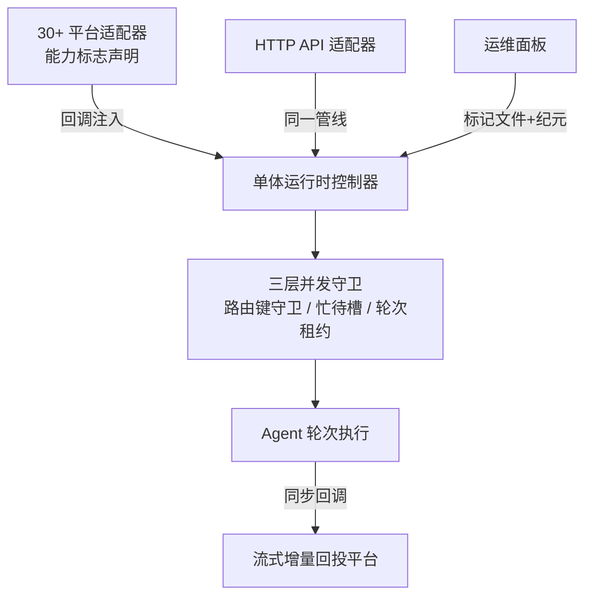
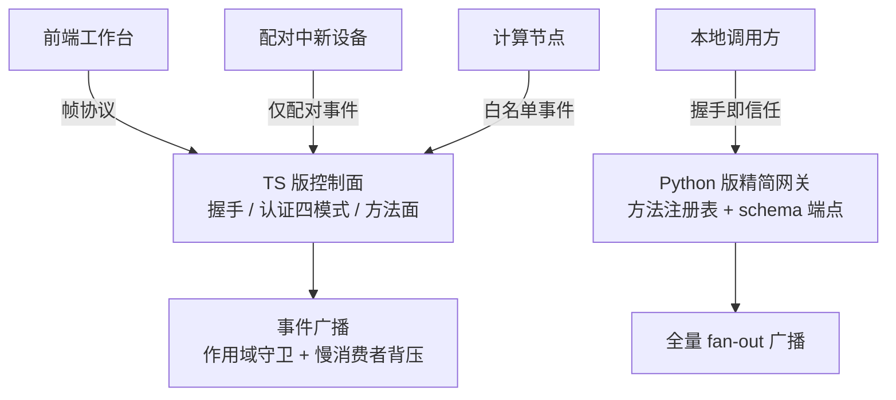
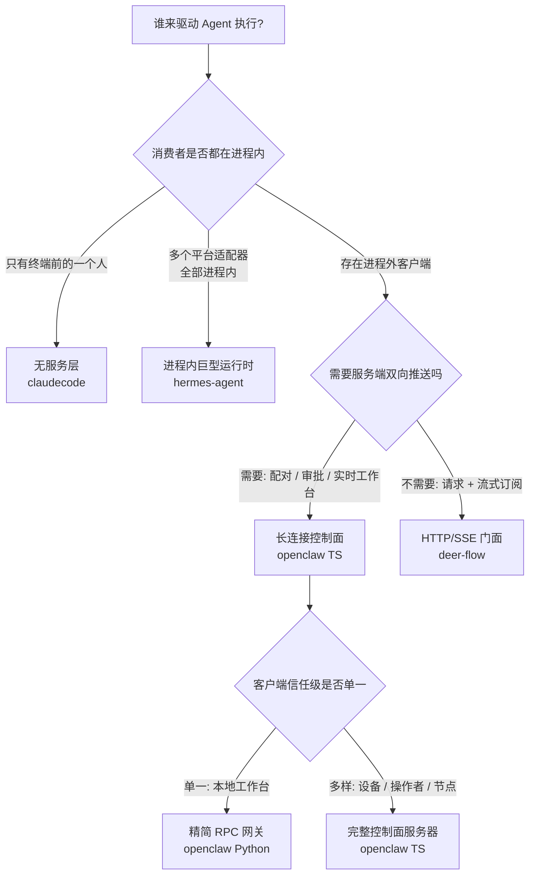

# 对外服务层与消息通道

## 读前思考

- Agent 内核写好了，"让别人用上它"这一层该做多重？如果内核的能力完全相同，是让它跑在终端里、跑在单进程内服务 30 个聊天平台，还是做成一个常驻的控制面服务器？决定这一层重量的约束到底是什么？
- 先做个预测：一个 Agent 只服务一个本地用户，但要同时挂 30 个聊天平台——它的对外服务层应该是一个独立的服务器进程，还是根本不需要独立存在？反过来，如果调用方里有陌生设备，这一层又必须多长出多少东西？

## 核心问题

本主题解决的核心问题是：**以什么形态、什么协议、什么信任假设，把 Agent 的执行能力暴露给进程外（或进程内多平台）的调用方，并把运行时产生的事件安全地送回去。** 内核决定"Agent 能做什么"，这一层决定"谁能用、怎么接入、事件发给谁"。

边界声明：连接进来之后每个动作的权限审批（工具放行与否、危险命令审批）归 09-guardrails，本篇只讲连接级认证——判断句是"这个机制回答的是'你是谁'还是'你能不能做这件事'"；消息归属判定之后的会话状态隔离归 04-state；配置中敏感信息的分离与写回防泄露归 09-guardrails。

| 项目 | 一句话定位 | 部署假设 |
|------|-----------|---------|
| deer-flow | 唯一 HTTP/SSE 门面：连自家进程内渠道也必须走同一个 LangGraph 兼容 API | 多用户、多调用方、可水平部署 |
| hermes-agent | 进程内巨型消息运行时：不开任何对外协议端口，单体控制器管理 30+ 平台适配器 | 单实例个人助手，常驻、无外部控制面 |
| openclaw | 双实现对照：TS 版是长连接控制面服务器，Python 版是握手即信任的精简 RPC 网关 | 多客户端多角色 / 本地单工作台 |
| claudecode | 无服务层：纯终端 REPL 内核，事件迭代器输出天然可换消费方 | 单用户、单终端 |

注意这四种形态不是"功能多少"的递进，而是对同一个问题在不同约束下的不同回答。

## 方案展示

### deer-flow：HTTP 门面 + Channel 抽象 + 双轨配置

deer-flow 把对外服务层做成了系统的边界定义：浏览器前端、IM 渠道、定时任务全部走同一套 LangGraph 兼容的 HTTP API。最能说明立场的是自家渠道——渠道管理器和网关在同一个进程里，本可以拿运行时引用直接调用，实际上却构造了一个指向自家网关的 HTTP 客户端，带进程内令牌和 CSRF 配对，与外部集成方没有任何区别。事件侧由流分发组件隔开生产与消费：每个事件带单调编号，客户端可以中途加入运行、断线续读，重启时为孤儿运行补发结束信号。渠道侧是三层结构：Channel 接口定义平台适配，消息总线解耦路由，渠道管理器统一调度；每个渠道用策略模式声明并发行为（并行、串行、缓冲合并、拒绝），全部走出站连接（长轮询或 WebSocket），不要求公网 IP。配置走双轨：持有启动期单例的组件绑定启动快照、重启才生效；无状态字段按请求重新解析、改完立即生效；哪 12 类字段重启才生效有一份显式清单。认证栈 fail-closed：全局中间件对所有非公共路径强制校验，首次启动要求运维手动建管理员。

**为什么这么选**：统一入口让认证、授权、追踪、CSRF 这些横切关注点只实现一次，任何新调用方自动继承；渠道复用官方 SDK，行为与外部集成方一致，消灭了"内部直调路径没测试"的盲区；企业内网部署不允许暴露 webhook 端口，所以渠道一律走出站连接。**牺牲了什么**：每次渠道调用多一跳本地往返和两次序列化；耦合方向反转——网关重启期间同进程的渠道一起不可用；兼容协议继承了 LangGraph 平台的概念负担，部分资源只是占位实现。机制细节见 docs/deer-flow/01-gateway.md。

### hermes-agent：进程内巨型运行时 + 能力标志适配器

hermes-agent 的回答最反直觉：**它没有对外协议，服务层就是运行时本身**。约 2.4 万行的单体控制器通过 Mixin 组合与回调注入，把 30+ 平台适配器的装配、消息路由、会话并发控制全部吸收进一个对象——适配器只拿到几个函数引用，不知道网关内部结构；控制器只编排生命周期，不了解平台连接细节。平台差异不用继承层次表达，而是能力标志：每个适配器声明自己支持什么（流式编辑、附件、线程），上层按标志选投递路径。并发正确性靠三层守卫：按路由键的入口守卫、面向交互体验的忙/待槽、按解析后会话 ID 的轮次租约。生命周期立场同样独特：运行中的进程没有任何外部控制通道，排空重启只能通过携带实例纪元的标记文件送达；连 OpenAI 兼容的 HTTP API 也被做成"又一个平台适配器"，和聊天消息走完全相同的管线。配置按五层优先级合并（命令行 > 环境变量 > 项目配置 > 用户配置 > 默认值），越具体的来源优先级越高。

**为什么这么选**：所有调用方（30+ 平台 + HTTP API）都在同一个进程内，把新入口建模为"又一个平台"可以零成本复用路由、授权、忙时守卫；不开控制端口把生命周期攻击面降到零；能力标志避免了 30+ 平台下的继承层次爆炸。**牺牲了什么**：全部状态共享同一个事件循环和命名空间，无法多实例水平扩展；标记文件契约是单进程语义，多实例部署下整套生命周期工程要重做；能力标志把平台差异推成上层代码里的运行时分支，新增能力要改所有消费方。机制细节见 docs/hermes-agent/01-gateway.md。

### openclaw：控制面服务器与精简网关的双实现对照

openclaw 对同一问题给出了轻重两份答案。TS 版把服务层做成真正的中央控制面：前端工作台、配对中的新设备、计算节点、IM 通道，全部通过同一种帧协议进出。协议单一来源——请求帧、响应帧、事件帧三种帧形在独立协议包里定义一次，服务端校验、客户端类型、文档导出全部从同一份声明推导，握手确认帧一次下发方法清单、事件清单、状态快照和流控策略。事件广播治理最重：每种事件声明所需访问级别，配对中的设备看不到任何会话内容；未声明的事件默认拒绝，把"新增事件忘写声明"的错误方向从信息泄露扭转为静默失联。通道是严格的 transport-only：只做格式转换与传输限制，产品逻辑全部归核心。Python 版是轻量化回答：约 20 个方法的注册表，数据模型即契约，运行时开放 schema 端点导出正在执行的那一份契约；握手校验版本区间后直接置为已认证——写明的本地部署假设，不是遗漏；广播全量 fan-out，无过滤无背压；消息归属由 9 级路由优先级决定，粒度越细的规则优先级越高。配置侧 TS 版支持文件包含模块化与原子写入加备份轮转，Python 版约 200 行实用主义加载器。

**为什么这么选**：TS 版的客户端角色天然多样且需要服务端主动推送，长连接控制面是必然；Python 版部署在开发者笔记本，能建连的默认都是可信方，作用域过滤在这里是纯成本。**牺牲了什么**：TS 版的协议包膨胀成所有客户端的公共依赖，事件-作用域守卫表本身成了必须持续维护的安全资产；Python 版假设边界很硬——端口一旦离开环回，无凭据握手加全量广播意味着任何能建连的人都看得到所有会话内容。机制细节见 docs/openclaw/01-gateway.md。

### claudecode：无服务层——进程形态决定的，不是缺失

诚实的结论：**claudecode 没有对外服务层，也不需要有**。它是纯终端 REPL 内核，唯一的调用方就是坐在终端前的那一个人，交互同步——输入一条、执行完、再输入下一条，不存在并发会话、多客户端或需要推送的旁观者。在这个进程形态下，服务层要解决的每个问题（谁能接入、事件发给谁、并发怎么隔离）都不存在。但它的主循环以异步事件迭代器输出执行过程，"谁来消费这些事件"从一开始就是控制面的问题而不是内核的问题——终端 REPL 只是当前挂载的那个消费者。配置同样是"无集中配置"立场：各模块自行加载各自的来源，没有统一优先级链。**牺牲了什么**（即当前的边界）：没有多用户支持、没有认证、没有并发会话——这些不是欠账，是它的进程形态此刻不需要的东西。机制细节见 docs/claudecode/01-gateway.md。

## 横向对比

### 岔路口对比表

| 岔路口 | deer-flow | hermes-agent | openclaw（TS / Python） | claudecode |
|--------|-----------|--------------|------------------------|-----------|
| 事件扇出治理 | 按运行订阅：事件编号支持中途加入与断点续读 | 同步回调桥：增量进阻塞队列，节流后回投原平台 | 作用域守卫 + 慢消费者背压，未声明默认拒绝 / 全量 fan-out，无过滤无背压 | 不存在扇出，终端直接消费迭代器 |
| 信任模型 | fail-closed 用户体系：会话凭证 + 属主隔离 + 首启建管 | 配对码：短寿命、低尝试次数的人工流程 | 四种认证模式 + 只针对失败的限流 / 握手直接信任 | 无认证（单终端用户即全部信任域） |
| 通道抽象模式 | 接口 + 策略模式（四种并发策略可选） | 能力标志（声明式，避免继承爆炸） | transport-only（通道不拥有产品逻辑） | 无通道（事件协议天然可换消费方） |
| 生命周期治理 | 关停排空窗口 + 启动期孤儿运行清点恢复 | 标记文件 + 纪元、关停取证、重启熔断 | 通道账号作为被监管任务：退避重启、断路器 / 从简逐账号启动 | 无（进程退出即终止） |
| 配置动态度 | 文件签名热重载 + 显式 startup-only 清单 | 五层优先级链 + 仅当前会话的运行时修改 | 文件包含 + 原子写入 / 启动时加载不写回 | 无热重载（仅运行时模型切换命令） |

### 形态分岔的因果

**岔路口一：服务形态。** 因为部署形态与消费方数量不同，所以在"执行能力要不要一个独立的服务面"上分岔。claudecode 的消费者只有终端一人，服务面没有需求对象；hermes-agent 的 30+ 消费方全部以适配器形式活在进程内，"服务面"退化为进程内的路由与并发问题；openclaw 有进程外的异质客户端需要持续连接，必须有真正的服务器；deer-flow 的交互是"发起一次运行、订阅它的流"，HTTP/SSE 足以表达，不需要长连接协议。

**岔路口二：通道抽象的厚度。** 因为平台数量与产品逻辑归属不同，所以在"通道接口该多厚"上分岔。平台少时接口继承够用（deer-flow 的 7 个平台用策略模式即可）；平台到 30+ 时继承层次会爆炸，hermes-agent 改用能力标志让每个适配器只声明自己有什么；openclaw 索性规定通道不拥有任何产品逻辑，15+ 通道只做格式翻译，新功能在核心实现一次全通道获得；claudecode 没有平台，问题不存在。

**岔路口三：事件扇出治理。** 因为客户端的信任级与数量不同，所以在"运行时事件发给谁"上分岔。openclaw TS 版的连接里有陌生设备和旁观者，必须按作用域过滤并治理慢消费者；Python 版的连接全是自己人，全量 fan-out 是假设之内的正确选择；deer-flow 的事件流天然按运行隔离，订阅一个运行就只看到那个运行的事件；hermes-agent 根本没有广播需求，事件通过同步回调桥回投给发起消息的那个平台。

**岔路口四：信任模型。** 因为单用户本地与多用户的约束不同，所以在"凭什么相信调用方"上分岔。claudecode 和 openclaw Python 版的信任域等于"能碰到这台机器的人"，认证是多余摩擦；hermes-agent 信任操作者本人，但平台会送来陌生人，所以用配对码做首次接触授权；openclaw TS 版要为不同角色发不同权限；deer-flow 面向多用户，必须有完整用户体系与 fail-closed 中间件。动作级审批（连上之后能做什么）一律见 09-guardrails。

**岔路口五：配置治理。** 因为配置项规模与变更方式不同，所以在"配置要不要集中、能不能热改"上分岔。配置只有五六个时分散加载最省事（claudecode）；多场景使用时需要清晰的优先级链（hermes-agent 的五层）；模块数到四十以上需要集中声明加热重载边界（deer-flow 的签名检测与 startup-only 清单）；支持 UI 改配置则必须解决写回——改哪个文件、怎么原子落盘（openclaw TS）。

## 面试要点

**1. 服务层应该拥有产品逻辑，还是只做路由与传输？**

正反考量：hermes-agent 的单体控制器拥有大量产品逻辑——忙时消息是中断、排队还是转向，授权确认如何唤醒阻塞中的轮次，这些交互语义全在服务层裁决，好处是 30+ 平台共享同一套行为、装配点只有一处，代价是全部复杂度挤在一个事件循环里无法拆分。openclaw 走相反方向：通道只做传输，产品逻辑归核心引擎，好处是修改一个功能只改一处，代价是平台特有的交互意图需要额外的翻译层。deer-flow 居中：路由是薄壳，产品逻辑沉淀在服务层，但全部收在同一个进程内。判断标准：**取决于入口数量 × 治理关注点与业务语义的耦合度**——入口多且治理可以独立于业务表达时，服务层应该薄；当交互语义本身就是路由的一部分（如同会话忙时处置），逻辑只能收敛在服务层里。

**2. 用户快速连续发三条消息（"帮我查 X"→"算了不查了"→"帮我查 Y"），四个项目分别怎么处理？**

参考答案方向：claudecode 不存在这个问题——终端输入是同步的，一条处理完才能输入下一条。deer-flow 用渠道并发策略的串行模式让三条消息排队执行，缓冲模式则把快速连续的消息合并为一次运行。hermes-agent 的每会话隔离加消息去重会把短间隔的连发合并进单槽待处理。openclaw TS 版的处理最特别：消息携带生命周期代数，第三条消息让前两条对应的运行在执行前发现自己已过时，从而安全丢弃——代次防重入的状态机制详见 04-state。判断标准：**取决于消息是否可丢 × 会话状态的并发模型**——可合并的通知类流量适合缓冲，对话类流量要么串行要么用代次让旧运行自判过时。

**3. 进程内巨型运行时在什么规模下必须拆成控制面服务器？**

正反考量：hermes-agent 的形态在"消费方全部进程内、单实例部署"时是高效的——零协议开销、零序列化、并发守卫就是几把进程内的锁。但三个信号出现时开始结构性失效：其一，出现第二信任级的消费者（外部设备、不可信网络上的客户端），进程内直调没有地方做认证裁决；其二，状态需要跨进程——标记文件契约和轮次租约都是单进程语义，多实例部署下标记会互相干扰、租约看不见别的进程，必须升级为数据库级协调；其三，单事件循环成为吞吐瓶颈，30+ 平台的消息处理与 Agent 轮次互相争抢。反过来也要承认拆分不是免费的——openclaw TS 版的协议包膨胀、守卫表维护成本、帧翻译开销，都是控制面形态的固定成本。判断标准：**取决于客户端角色多样性 × 进程实例数量**——只要两者都还是"一"，进程内运行时就是更简单的正确答案；任何一个变成"多"，控制面就开始变得必要。
