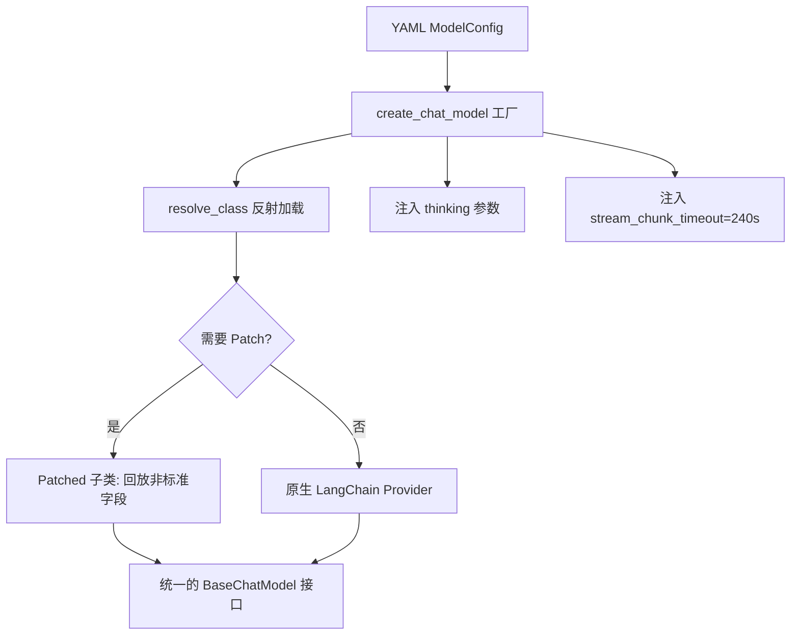
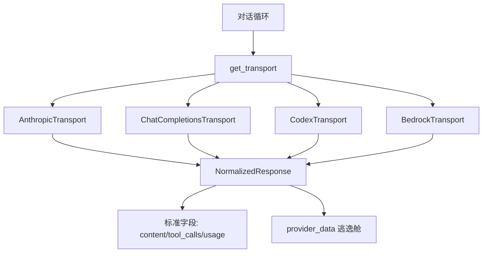
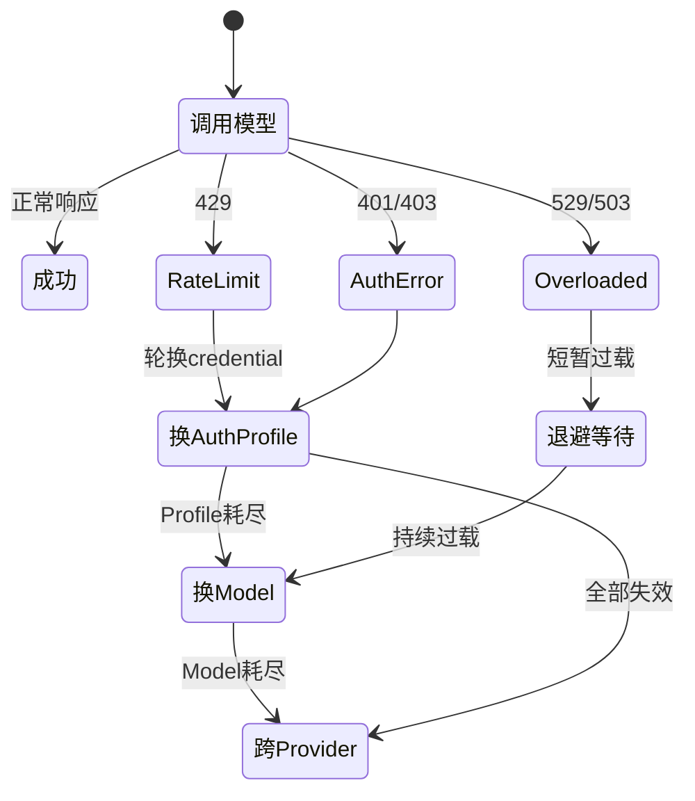
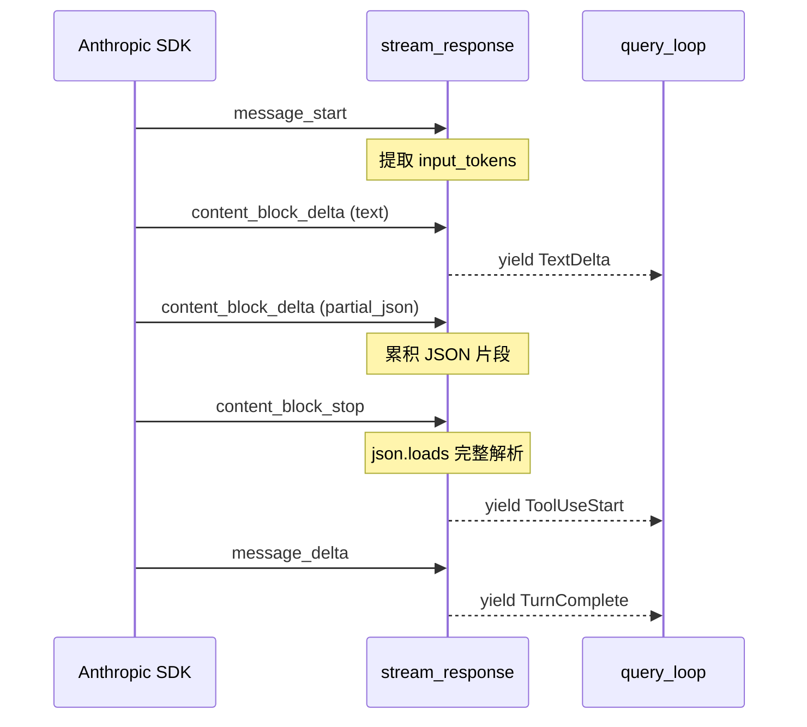
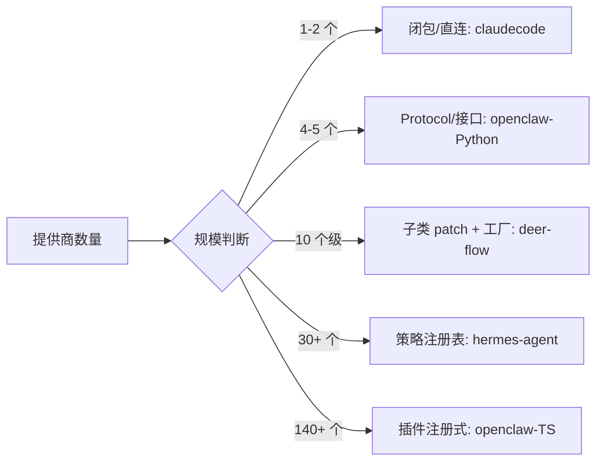

# LLM 接入层

## 读前思考

- 四个项目面对同一个问题——"让上层 Agent 循环不感知底层 API 差异"——但抽象程度从"完全没有 Provider 接口"到"140+ 插件注册式"跨度极大。什么因素决定了一个项目应该走多远？是提供商数量、团队规模、还是部署场景？
- 当一次模型调用因为 rate-limit 失败时，你有至少四种恢复手段：同 key 重试、换 key、换模型、换提供商。这四种动作的成本递增，但并非所有项目都需要全部四层。一个本地 CLI 工具和一个面向企业的多租户产品，在错误恢复上的设计复杂度应该差多少？

## 核心问题

LLM 接入层解决的核心问题是：**在模型提供商协议各异（SSE 格式、认证方式、thinking 字段定义均不统一）的前提下，为上层 Agent 循环提供统一的调用接口，并在调用失败时自动选择成本最低的恢复路径。**

四个项目在这个问题上的定位差异，直接决定了它们的抽象深度：

| 维度 | deer-flow | hermes-agent | openclaw | claudecode |
|------|-----------|--------------|----------|------------|
| 定位 | 企业级 LangGraph 编排 | 个人全能助手（30+ 提供商） | 双实现：本地 Gateway + 全栈 AI 助理 | Claude Code 内核还原 |
| Provider 数量 | ~10（Patched 子类） | 30+（Transport 注册表） | Python 4 / TS 140+ | 2（Anthropic + 百炼兼容） |
| 抽象模式 | 子类 override + 工厂反射 | Transport 策略 + 注册表 | Protocol 鸭子类型 / 插件注册 | 闭包依赖注入，无接口 |
| 错误恢复 | LangChain 内建重试 | 分类学驱动（20+ 种枚举） | 7 种分类 / 三层故障转移 | 二分法（可恢复/不可恢复） |
| 代码规模 | ~2000 行（含所有 patch） | ~5000 行（transport + adapter） | ~800 行 / ~2037 行（单文件） | ~600 行（3 个文件） |

## 方案展示

### deer-flow：Patched Provider + 配置驱动工厂

deer-flow 基于 LangChain 的 BaseChatModel 构建，核心矛盾是 LangChain 的通用解析器会丢弃 provider 特有字段（DeepSeek 的 reasoning_content、Gemini 的 thought_signature、Claude 的 thinking 块）。它的选择是不 fork LangChain，而是为每个需要补丁的 provider 写一个子类，只重写三个钩子方法把被丢弃的字段"回放"到 generation_info 中。

模型创建通过 YAML 配置 + 类路径反射完成：配置文件写 `use: "langchain_openai:ChatOpenAI"`，工厂函数 resolve_class() 用 importlib 动态加载，再注入 thinking 参数、超时配置、stream_usage 等。thinking 模式的启用/禁用按 gateway 类型走不同参数结构（OpenAI 用 extra_body.thinking，vLLM 用 chat_template_kwargs，Anthropic 用 thinking.type + budget_tokens），集中在工厂函数的分支逻辑中。

**为什么这么选**：deer-flow 的 provider 增长缓慢（一年加几个），且都基于 LangChain 生态。子类 override 让 LangChain 上游更新时可以直接删掉已修复的 patch，不需要合并 fork。代价是工厂函数变成 if-else 分支集合，每新增一种 gateway 类型都要加一段 thinking 参数映射。

### hermes-agent：Transport 策略 + 错误分类学

hermes-agent 将每种协议封装为独立的 Transport 类（AnthropicTransport、ChatCompletionsTransport、CodexTransport、BedrockTransport），所有 Transport 实现同一个抽象基类的四个方法：build_kwargs、normalize_response、convert_messages、convert_tools。Transport 在模块导入时自动注册到全局注册表，对话循环通过 get_transport(api_mode) 一行代码获取实例。

所有提供商的响应被规范化为 NormalizedResponse（content、tool_calls、finish_reason、reasoning、usage），协议特有的状态放入 provider_data 字典——一个受控的"逃逸舱"。错误恢复由 classify_api_error() 将异常映射为 ClassifiedError，携带四个布尔恢复提示（retryable、should_compress、should_rotate_credential、should_fallback），重试循环只读提示不再自己解析错误字符串。

**为什么这么选**：30+ 提供商且持续增长，if-else 分支会线性膨胀。策略模式让新增提供商的成本从"修改核心循环"降为"添加一个文件"。错误分类学把散落在各处的内联字符串匹配集中为 1700 行规则库，新增错误类型只需修改一处。代价是双层间接调用（Transport → Adapter），调试一个格式问题需要跳转两个文件。

### openclaw：从 Protocol 到插件注册——规模驱动的抽象升级

openclaw 的 Python 版和 TS 版展示了同一问题在不同规模下的答案。Python 版（4 个 provider）用 typing.Protocol 定义 ProviderPlugin 接口，任何实现了 list_models 和 create_stream 方法的类自动满足契约，错误恢复是 7 种分类 + 单层降级（key 轮换 → fallback model），~200 行代码表达完整逻辑。

TS 版（140+ 扩展）走了插件注册式：Provider 通过 openclaw.plugin.json 声明元数据，通过 register(api) 调用 api.registerProvider() 完成动态注册，暴露 30 多个可选钩子。错误恢复是三层故障转移：auth profile 轮换 → 同 provider 换 model → 跨 provider fallback，model-fallback.ts 单文件 2037 行，追踪约 30 个状态变量。

**为什么这么选**：Python 版是本地 Gateway，一个 key 打天下，Protocol 鸭子类型足够。TS 版面向生产环境，用户可能配置多个 provider、每个 provider 多个 auth profile（个人 key + 团队 key + OAuth），需要智能切换以最大化吞吐。代价是 TS 版的状态变量爆炸，可读性极差；且类型安全从编译期退到运行时，需要契约测试补偿。

### claudecode：闭包注入——"不抽象"的选择

claudecode 没有 Provider 接口、没有注册表、没有策略模式。它的"抽象"完全通过三层闭包实现：stream_response() 做 SSE 状态机转换，make_call_model() 返回绑定了 client + model 的闭包，make_call_model_factory() 是工厂的工厂。query_loop 只认识一个签名：(**kwargs) -> AsyncIterator[QueryEvent]。

模型切换不用多 Provider 路由，而是在 REPL 层直接替换 client 实例。百炼支持之所以能工作，是因为百炼实现了 Anthropic API 兼容接口，SSE 事件格式完全相同。错误分类极简：429/529 和连接错误标记为可恢复，其他一律不可恢复。

**为什么这么选**：claudecode 只面向 Anthropic 兼容 API，写 Provider ABC 是过度设计。闭包注入让测试只需返回预设事件序列的 mock 闭包，不需要 mock 任何 class。代价是没有编译期约束——如果未来要接入 SSE 协议不同的 Provider，需要重写 stream_response 而非实现一个新 class。

## 横向对比

四个项目在 LLM 接入层的核心岔路口是**抽象深度与提供商规模的关系**：

| 岔路口 | deer-flow | hermes-agent | openclaw-Python | openclaw-TS | claudecode |
|--------|-----------|--------------|-----------------|-------------|------------|
| Provider 抽象 | 子类 override | 策略模式 + 注册表 | Protocol 鸭子类型 | 插件注册（30+ 钩子） | 无（闭包注入） |
| 新增 Provider 成本 | 写一个 patch 文件 | 写一个 Transport 文件 | 写一个实现类 | 写一个 extension 目录 | 重写 stream_response |
| 响应规范化 | LangChain Message | NormalizedResponse | 标准化 dict | AssistantMessageEvent | QueryEvent |
| 非标准字段处理 | generation_info 回放 | provider_data 逃逸舱 | 不处理 | 插件自定义钩子 | 不处理 |
| 错误恢复深度 | LangChain 内建 | 4 维布尔提示 | 7 种分类 + 单层 | 三层故障转移 | 二分法 |
| Thinking 支持 | 工厂集中映射 | Transport 各自处理 | 不涉及 | resolveThinkingProfile | 互斥分支 |

这张图揭示了一个规律：抽象深度与提供商数量正相关，但不是线性关系——从 1 到 5 个 provider 的抽象跳跃（闭包→接口）远小于从 30 到 140 个的跳跃（策略→插件注册）。每次跳跃的触发条件是"前一层抽象的维护成本超过了新增的间接层成本"。

**错误恢复的复杂度同样与部署场景正相关**。claudecode 是本地 CLI，一次调用失败用户可以看到错误信息手动重试，所以二分法够用。hermes-agent 是长时间运行的个人助手，需要自动恢复但不能太慢（用户在等），所以用分类学精确匹配恢复策略。openclaw-TS 面向生产环境多租户，一个 provider 完全不可用时必须自动切到备选，所以三层故障转移是必要的。deer-flow 把错误恢复委托给 LangChain 内建机制，因为它的编排层（LangGraph）有自己的重试和 checkpoint 逻辑。

**非标准字段的处理策略**是另一个有趣的分歧。deer-flow 和 hermes-agent 都面临"推理模型字段在规范化时丢失"的问题，但解法不同：deer-flow 在 LangChain 解析后回放（因为 LangChain 是中间层），hermes-agent 在规范化时直接保留到 provider_data（因为自己做解析）。openclaw-TS 通过插件钩子让每个 provider 自己决定保留什么，claudecode 和 openclaw-Python 则完全不处理——前者只用 Anthropic 协议（字段本来就认识），后者定位简单不需要多轮 thinking 回放。

## 面试要点

**1. 如果你从零设计一个 LLM 接入层，预期支持 5-10 个 provider，你会选哪种抽象模式？为什么？**

参考答案方向：5-10 个 provider 处于"接口继承"和"策略注册表"的边界。如果协议差异主要是参数差异（同一 SSE 格式，不同的 endpoint 和 auth），一个带配置的多路复用函数就够了（类似 openclaw-Python 的 Protocol）。如果协议差异是结构性的（Anthropic 的 content blocks vs OpenAI 的 choices delta vs Bedrock 的 Converse），策略模式更合适——每个 Transport 独立处理转换逻辑，新增 provider 不修改核心循环。判断标准不是 provider 数量，而是"协议差异是参数级还是结构级"。deer-flow 选了子类 patch 是因为它站在 LangChain 肩膀上，差异被 LangChain 消化了大部分；hermes-agent 从零做解析，所以每个 provider 需要一个完整的 Transport。

**2. hermes-agent 的错误分类学（20+ 种枚举 + 4 维布尔提示）和 openclaw-TS 的三层故障转移，哪个更适合"高可用"场景？各自的失效模式是什么？**

参考答案方向：两者解决不同层面的问题。hermes-agent 的分类学回答"这个错误应该怎么恢复"（重试/压缩/换 key/换模型），是单次决策；openclaw-TS 的三层转移回答"当前恢复手段耗尽后下一步做什么"，是升级链路。高可用场景两者都需要——先分类决定当前动作，当前层级耗尽后沿升级链走。hermes-agent 的失效模式是分类器规则库覆盖不全（新 provider 的错误格式不在 1700 行规则中，走 unknown 兜底）；openclaw-TS 的失效模式是状态变量爆炸（30 个 let 变量在并发场景下可能产生竞态，且难以单元测试覆盖所有组合）。

**3. claudecode 的"不抽象"选择在什么条件下是合理的？如果它要接入 OpenAI 格式（SSE 事件结构完全不同），最小改动路径是什么？**

参考答案方向：合理条件是"所有目标 provider 走同一协议"。claudecode 的百炼支持之所以不需要改 stream_response，是因为百炼实现了 Anthropic API 兼容。接入 OpenAI 格式的最小路径是写一个 stream_response_openai()，把 OpenAI 的 choices[0].delta 格式转换为同样的 QueryEvent 流，然后在 make_call_model 层根据 model 名选择调用哪个 stream_response。query_loop 不需要改一行——它只认识 AsyncIterator[QueryEvent] 签名。这证明闭包注入虽然没有编译期约束，但通过统一的事件协议实现了运行时的可替换性。代价是没有接口约束确保新的 stream_response_openai 覆盖了所有 QueryEvent 类型。

