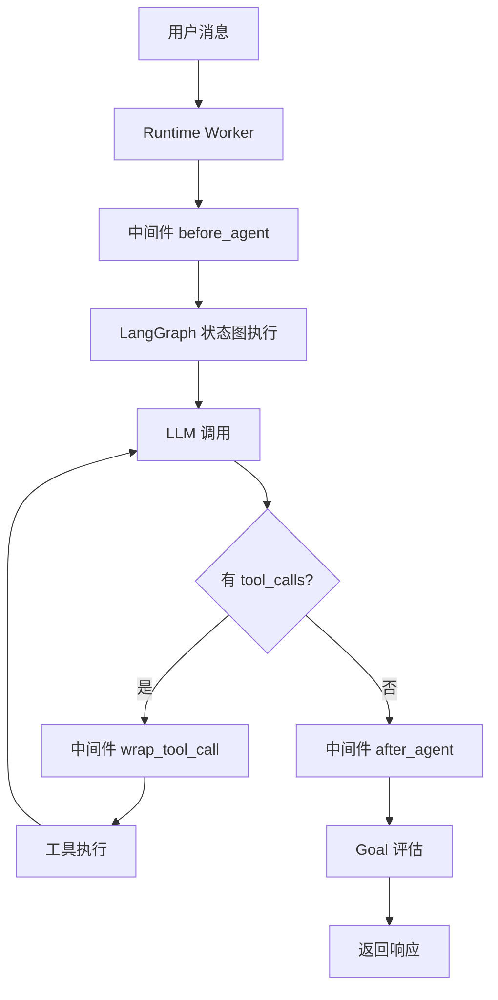
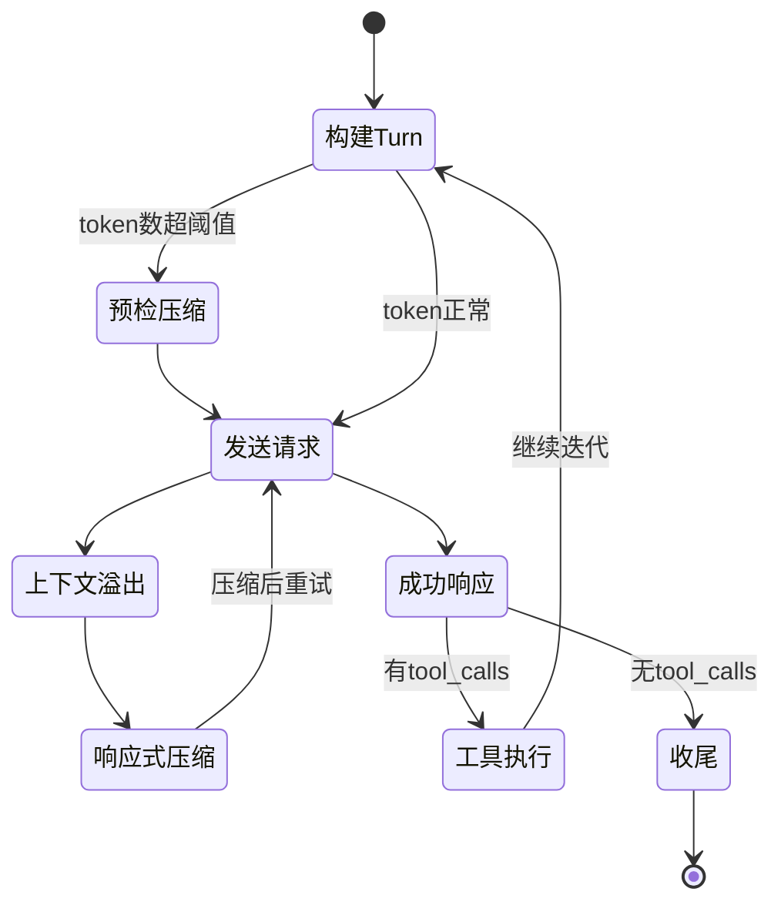
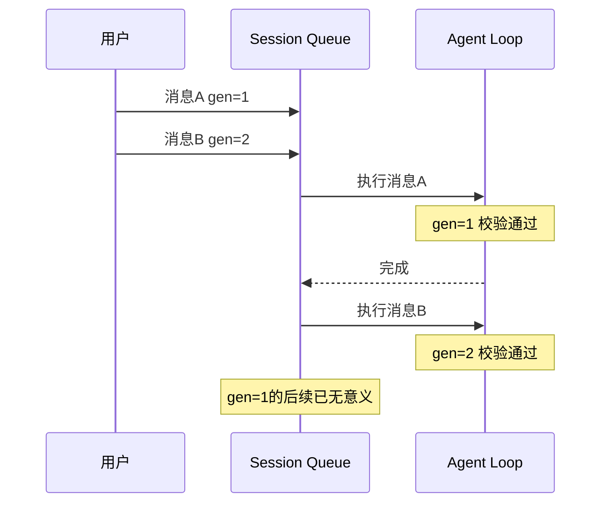
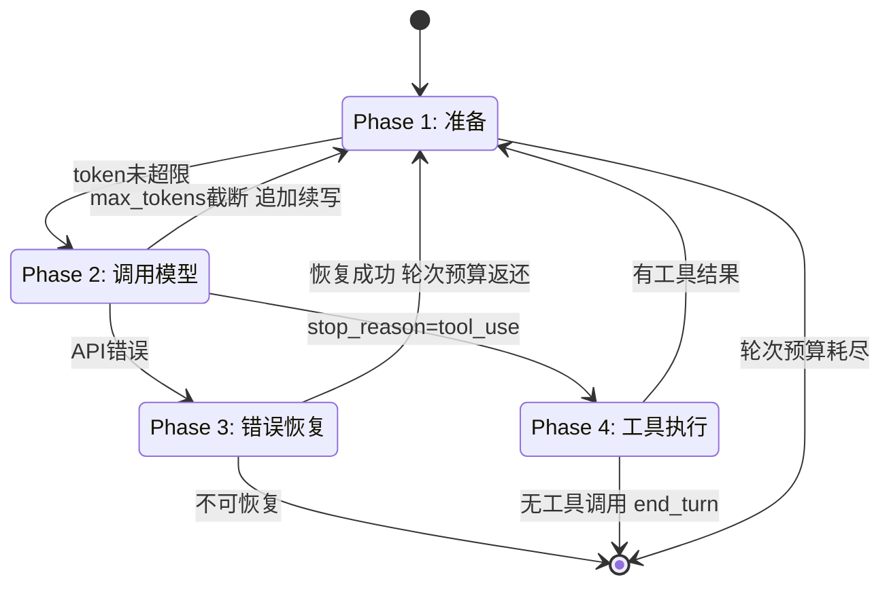
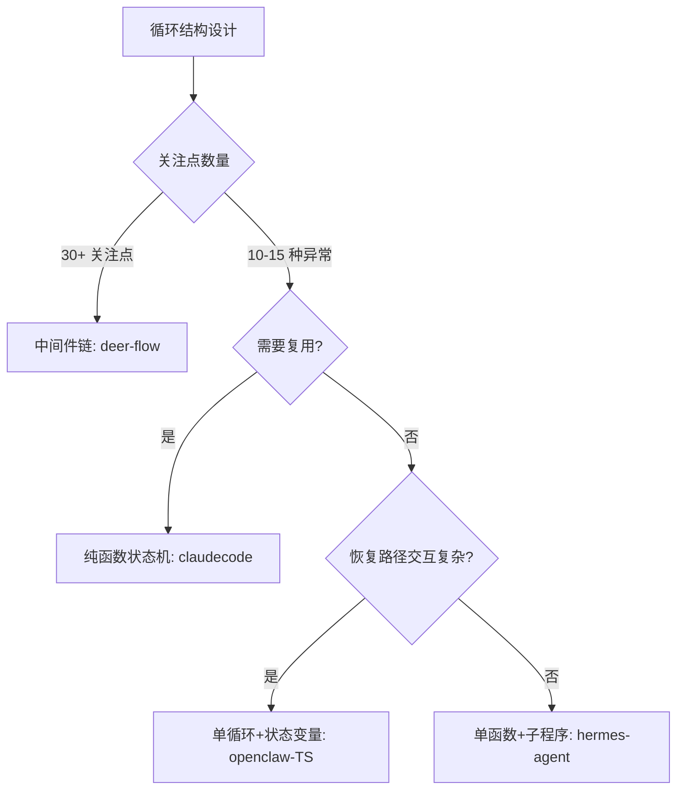

# Agent 主循环

## 读前思考

- 一个 Agent 主循环的最小实现只有四行代码：调模型、解析响应、执行工具、拼回结果。但当你把错误恢复、上下文压缩、并发控制、流式输出、用户中断全塞进去之后，四个项目给出了从"38 个中间件链"到"6517 行单函数"的巨大跨度。什么因素决定了循环应该拆多细？是团队规模、异常路径数量、还是复用需求？
- 如果模型陷入"调同一个工具 → 得到同样结果 → 再调一次"的死循环，你是直接终止（快但可能误杀），还是先注入一条提示让模型自我纠正（慢但给一次机会）？这个选择背后假设了什么？

## 核心问题

Agent 主循环解决的核心问题是：**如何可靠地驱动"LLM 推理 → 工具执行 → 结果回注"的多轮迭代，同时在上下文膨胀、API 错误、工具失败、用户中断等异常条件下保证不丢状态、不无限循环、不资源泄漏。**

四个项目的循环结构差异，本质上反映了它们对"复杂度应该放在哪里"的不同回答：

| 维度 | deer-flow | hermes-agent | openclaw | claudecode |
|------|-----------|--------------|----------|------------|
| 循环结构 | LangGraph 状态图 + 38 中间件链 | 单函数 6517 行 + 子程序提取 | Python 三层嵌套 / TS 单循环 + 30 状态变量 | 纯函数 async generator 四阶段状态机 |
| 异常处理位置 | 分散在各中间件中 | 集中在主循环 if-else 中 | Python 外层 retry / TS 内联判断 | Phase 3 集中分派 |
| 并发控制 | Runtime Worker + asyncio.Task | 线程级中断信号 | 双队列 + Generation 防重入 | Semaphore(10) + 独占标记 |
| 上下文管理 | SummarizationMiddleware | 预检 + 响应式双时机压缩 | 三级降级（截断→压缩→硬截断） | 70% 阈值 auto-compact |
| 复用方式 | 中间件可插拔 | 不可复用（单实例） | 不可复用 | 同一函数多入口驱动 |
| 代码规模 | ~5000 行（含中间件） | 6517 行（单函数） | 456 行 / 4366 行 | ~800 行（query_loop 本体） |

## 方案展示

### deer-flow：中间件链 + LangGraph 状态图

deer-flow 把 Agent 循环建模为 LangGraph 的 CompiledStateGraph，但核心复杂度不在图本身，而在叠加其上的 38 个中间件链。每个中间件在 before_agent、wrap_tool_call、after_agent 三个钩子点介入执行流。中间件顺序通过 Feature Flags 声明式控制启用，通过 @Next(Anchor) / @Prev(Anchor) 装饰器定位插入位置。

关键设计是静态 system prompt + 动态上下文注入的分离：系统提示完全静态（利于 prefix cache），动态信息（日期、记忆、技能）通过 DynamicContextMiddleware 注入到首条 HumanMessage 的 system-reminder 标签中。ClarificationMiddleware 被硬编码为永远在链尾——即使锚点把它推走，工厂也强制移回。

**为什么这么选**：deer-flow 是企业级编排框架，30+ 个关注点（沙箱、安全护栏、token 预算、loop 检测、MCP 路由）需要独立开发和测试。中间件链让每个关注点是一个独立文件，新增功能不需要修改核心循环。代价是执行路径极难追踪——一次工具调用经过 15+ 个中间件的检查，调试时需要理解整条链的顺序语义。

### hermes-agent：单体循环 + God-File Decomposition

hermes-agent 的 run_conversation() 保持在单一函数中（6517 行），没有拆分为状态机节点或中间件链。它通过"God-File Decomposition"将前置准备（turn_context.py）、工具执行（tool_executor.py）、收尾处理（turn_finalizer.py）、错误分类（error_classifier.py）等职责提取为独立模块，主循环只负责编排调用顺序。

上下文压缩有两个触发时机：Turn 开始前的"预检压缩"和 API 返回 context_overflow 后的"响应式压缩"。空响应处理是 5 级递进策略：检查是否合法 end_turn → 检查是否 refusal → 注入 "please continue" → 切换温度 → 放弃。

**为什么这么选**：Agent 循环的异常路径太多（工具失败、压缩、中断、空响应、fallback），状态机方案中 N 个阶段 × M 种异常 = N×M 个转换边，最终状态图比单函数更难理解。保持单一控制流让主循环"像一本目录清晰的书"，每个章节可独立阅读但阅读顺序确定。代价是 6517 行单函数极难做 code review，团队超过 5 人同时修改会产生严重合并冲突。

### openclaw：三层嵌套 vs 单循环——同一项目的两种答案

Python 版把主循环拆成三个清晰层次：retry_loop（容错）→ single_attempt（一次完整交互，最多 25 轮 tool turn）→ tool_loop（执行一批 tool_call）。每层职责单一，retry_loop 不关心工具怎么执行，single_attempt 不关心错误怎么恢复。

TS 版选择了单 while(true) + 约 30 个 let 状态变量。每次迭代执行"单次尝试"子程序（一次模型调用及其工具执行），然后根据返回结果在循环体内决定下一步。不拆分的原因是恢复路径之间有复杂交互——compaction 后需要重置 thinking level，rate-limit 后需要判断是否 escalate 到 model fallback——这些交互在分层架构中需要跨层通信，反而更难理解。

TS 版独有的 **Lifecycle Generation 防重入**机制：每次 run 携带 generation 编号，队列执行前校验是否 current。用户快速连续发消息时，旧 run 安全丢弃，避免回复过时内容。

**为什么这么选**：Python 版是本地 Gateway，并发场景简单，三层嵌套的清晰度收益大于跨层通信成本。TS 版面向多 channel 生产环境，恢复路径交互复杂，单循环内的 if-else 比跨层状态传递更直接。代价是 TS 版 run.ts 膨胀到 4366 行，状态变量之间的约束难以用局部推理验证。

### claudecode：纯函数状态机 + 事件驱动

claudecode 的 query_loop 是一个顶层 async generator 函数，不持有任何长期状态，所有依赖通过参数注入，所有输出通过 yield QueryEvent 传递。四阶段状态机（准备→调用→错误恢复→工具执行）通过三个 continue 路径形成循环，三个退出条件跳出循环。

关键创新是 StreamingToolExecutor 的"流式提前执行"：API 还在输出后续 token 时，已完整解析的 tool_use block 立即在后台 asyncio.Task 中启动执行。并发控制分两层：Semaphore(10) 限制全局并发数，独占标记确保非并发安全工具执行期间无其他工具并行。

**为什么这么选**：query_loop 需要在四种场景下被驱动——REPL 交互、CLI 一次性管道、子 agent 内部调用、单元测试 mock。纯函数 + 参数注入让同一个循环只需传入不同的消息列表和模型调用闭包即可复用。代价是接线复杂度转移到上层：装配层要解决"引擎构建时子组件就需要引用引擎自身"的循环依赖（引擎自引用注入），不理解整条依赖链的人容易漏掉注册步骤。

## 横向对比

四个项目在 Agent 主循环上的核心岔路口是**"复杂度放在循环内还是循环外"**：

| 岔路口 | deer-flow | hermes-agent | openclaw-TS | claudecode |
|--------|-----------|--------------|-------------|------------|
| 复杂度位置 | 循环外（中间件链） | 循环内（if-else） | 循环内（状态变量） | 循环内（阶段分派） |
| 新增关注点 | 加一个中间件文件 | 在主循环中加分支 | 在 while 体中加判断 | 在对应 Phase 中加逻辑 |
| 调试难度 | 高（追踪 15+ 中间件） | 中（单文件内搜索） | 高（30 个变量交互） | 低（四阶段定位） |
| 复用能力 | 中间件可复用 | 不可复用 | 不可复用 | 循环本身可复用 |
| 并发模型 | Runtime Worker 隔离 | 线程级中断 | 双队列 + Generation | Semaphore + 独占标记 |

**上下文窗口管理**是第二个重要分歧——它决定了循环能跑多久。四个项目收敛出同一个骨干模式：**预检 + 响应式双时机**。预检指每轮调模型前先估算当前消息的 token 量，超过阈值就先压缩再调用；响应式指真发出请求后收到"上下文过长"类错误，立即压缩并重试。两个时机缺一不可：预检依赖估算（估算总有误差，尤其不含工具 schema 时会系统性低估），响应式是估算失误的兜底；只有响应式则每次触发都浪费一次注定失败的 API 调用。在这个共同骨干上各家的差异在于精细度：deer-flow 把压缩做成中间件链的一环，claudecode 用固定缓冲阈值加"连续失败三次放弃"，hermes 有阈值自适应和反抖动，openclaw-TS 用 provider 真实用量计数加动态阈值。精细度与部署场景正相关——本地 CLI 会话短，简单阈值够用；长期运行的生产环境必须防"压缩→溢出→再压缩"的死循环。压缩算法本身（保留什么、摘要什么、失败怎么降级）的完整对比见 13-context-compaction。

循环层面还有两个与预算相关的细节设计。其一，**压缩不消耗轮次预算**：压缩和错误恢复属于"故障成本"而非"有效工作"，如果它们占用 max_turns 配额，一个频繁限流或频繁压缩的会话会在做完任何实际工作前就"轮次耗尽"（claudecode 用恢复后返还轮次的方式实现，另设独立的重试计数防无限重试）。其二，**max_tokens 截断续写**：模型输出被输出长度上限截断（停止原因是长度而非自然结束）时，claudecode 先把输出上限逐级放大重试，仍截断则把已生成内容接回消息列表并追加一条"请继续"，让模型接着写——这把"输出太长"从错误变成了多轮拼接问题，代价是拼接处可能出现重复或断句。

**工具循环终止**策略体现了对 LLM 能力的不同假设。deer-flow 用 LoopDetectionMiddleware 检测重复模式；hermes-agent 用最大迭代次数硬限制；openclaw-TS 先注入提示让 LLM 自我纠正，失败后才强制终止；claudecode 用 max_turns 计数器。openclaw-TS 的"先提示后终止"假设 LLM 有元认知能力——一次提醒就能改变策略；如果模型能力弱，这只浪费一轮调用。

**中断与 steering（运行中插话）** 是循环设计里最能区分"请求-响应服务"和"长期运行助手"的一环。问题是：Agent 正在跑一个多轮工具循环，用户突然发来新消息，怎么办？openclaw-TS 做得最完整——双队列（会话内串行 + 全局并发）配合运行代次编号，用户快速连发消息时旧 run 会被安全丢弃，还支持向运行中的（子）代理注入新指令并重启，把旧队列清空后用新消息续跑。这套机制的前提是消息与执行解耦：消息进队列，执行按代次校验，过时的执行主动退场。hermes 靠按线程传播的中断标记，让正在执行的工具在下一个边界点感知到中断并停下。claudecode 的循环本身是纯函数、不处理排队，中断由外层的 REPL/引擎层负责。deer-flow 用 run 级的中断事件配合断连即取消。判断标准是"会话是否长期在线且消息可能乱序到达"：一次性 CLI 调用不需要 steering，多 channel 常驻服务必须有它，否则用户改了主意 Agent 还在跑旧任务。

## 面试要点

**1. 中间件链（deer-flow）和单函数（hermes-agent）在什么规模下各自占优？如果一个项目从 5 个关注点增长到 30 个，什么时候应该从单函数迁移到中间件？**

参考答案方向：5 个关注点时单函数占优——所有逻辑在一处，调试时不需要追踪中间件顺序，新增分支只需要理解当前上下文。30 个关注点时中间件占优——单函数的 if-else 分支已经无法被人脑同时持有，合并冲突频率超过团队容忍度。迁移时机不是关注点数量，而是"修改一个关注点时是否需要理解其他关注点"——如果答案从"不需要"变成"经常需要"，说明耦合度已经超过了单函数的承载能力。deer-flow 的锚点定位（@Next(SandboxMiddleware)）是迁移后的关键设计——它让新中间件不需要知道全局顺序，只需要声明相对位置。

**2. 错误重试该不该消耗轮次预算？claudecode 的"可恢复错误返还轮次"设计解决了什么问题？如果去掉它，用户体验会怎么退化？**

参考答案方向：Agent 循环有最大轮次限制（防止无限循环）。如果 429 限流重试也消耗轮次预算，一个频繁限流的 API 可能在几次重试后就耗尽预算，导致用户看到"达到最大轮次"的错误——但实际上模型还没有开始做真正的工作。恢复成功后返还轮次让错误恢复"免费"，轮次预算只计算有效的模型交互。去掉它的最坏情况：网络不稳定时用户频繁看到"轮次耗尽"而非真正的结果。防无限重试靠另一个独立的重试计数器（有独立上限），两个计数器解耦了"有效工作量"和"故障恢复成本"。判断标准是"预算想约束什么"：约束成本就该把重试也计入，约束任务复杂度就该只计有效轮次——大多数 Agent 的 max_turns 是后者。

**3. openclaw-TS 的 Lifecycle Generation 防重入和 claudecode 的纯函数无状态，哪个更适合多 channel 并发场景？为什么？**

参考答案方向：两者解决不同层面的问题。claudecode 的纯函数无状态解决的是"循环本身可被多入口驱动"——子 agent 和主 agent 用同一个 query_loop，传入不同参数。它不处理"同一 session 的多条消息如何排队"。openclaw-TS 的 Generation 解决的是"消息到达顺序与执行顺序不一致"——用户快速发三条消息，旧消息的 run 需要被安全丢弃。多 channel 并发场景两者都需要：循环本身无状态（可并行执行多个 session），session 内有 Generation 防重入（保证消息语义正确）。如果只有无状态没有 Generation，用户会收到过时的回复；如果只有 Generation 没有无状态，循环无法被多个 session 并行驱动。

