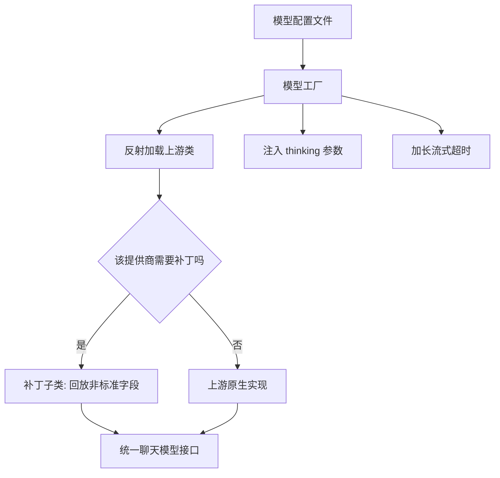
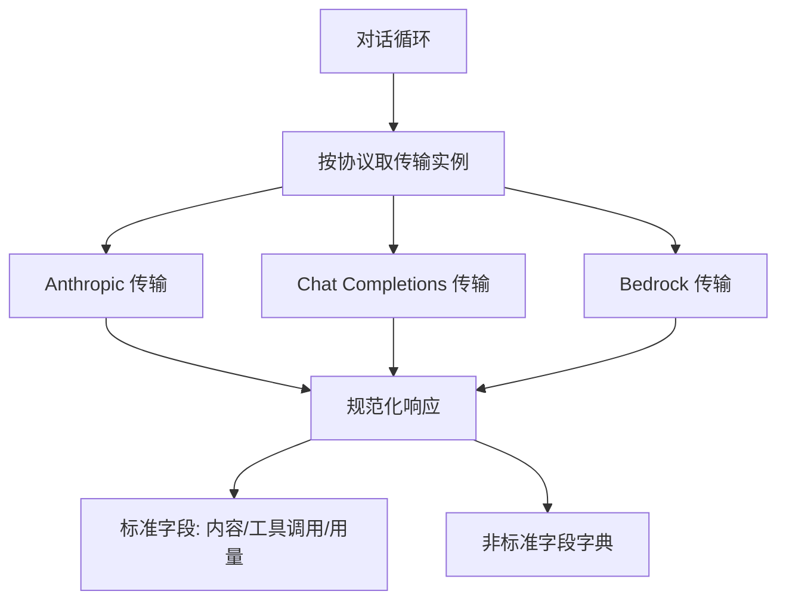
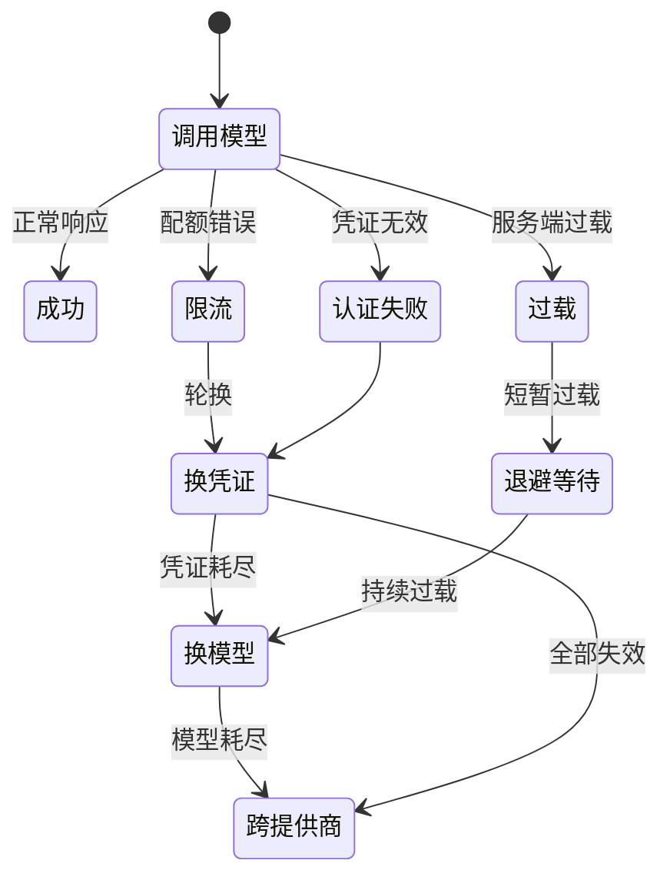
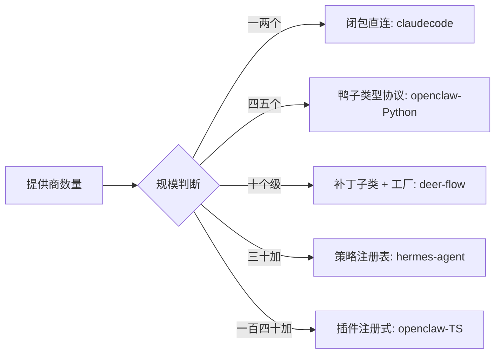

# 模型接入层

## 读前思考

- 上层 Agent 循环只想"把消息发出去、把响应拿回来"，但每个提供商的协议都不一样：SSE 事件结构不同、认证方式不同，连"模型思考过程"这种字段都没有统一定义。四个项目在抽象层该做多重这个问题上给出了差异极大的答案——从完全不写任何 Provider 接口，到以插件注册方式容纳一百四十多个提供商。除了提供商数量，还有什么因素决定抽象该走多远？
- 一次调用因为限流失败，手里的恢复手段按成本从低到高排列是：同 key 重试、换 key、换模型、换提供商。四层手段可以叠加共存，但并非每个产品都需要全部四层。一个跑在用户自己电脑上的命令行工具，和一个用户可能同时配置多套凭证的在线服务，错误恢复的设计深度应该差多少？

## 核心问题

模型接入层解决的核心问题是：**在模型提供商协议各异（SSE 格式、认证方式、thinking 字段定义均不统一）的前提下，为上层循环提供统一的调用接口，并在调用失败时自动选择成本最低的恢复路径。**

先划一条边界：token 计数的"来源"（估算、API 精确计数、响应回传用量）归本篇，计数在压缩阈值中的"用法"见 [05-context](./05-context.md)；凭证的密钥管理归 [09-guardrails](./09-guardrails.md)，本篇只讲凭证如何传入 provider。

四个项目在定位上的差异，直接决定了各自的抽象深度与恢复投入：

| 维度 | deer-flow | hermes-agent | openclaw | claudecode |
|------|-----------|--------------|----------|------------|
| 定位 | 企业级编排框架，站在 LangChain 肩膀上 | 个人全能助手，追求提供商覆盖广度 | 双实现：本地 Gateway + 全栈助理 | Claude Code 内核还原 |
| Provider 规模 | 约 10 个 | 30+ 且持续增长 | Python 4 / TS 140+ | 2 个（同一协议） |
| 抽象形态 | 补丁子类 + 配置驱动工厂 | Transport 策略 + 注册表 | 鸭子类型协议 / 插件注册 | 无接口，闭包注入 |
| 代码规模 | 约 2000 行 | 约 5000 行 | 约 800 行 / 单文件 2000+ 行 | 三个文件约 600 行 |

## 方案展示

### deer-flow：补丁子类 + 配置驱动工厂

deer-flow 不 fork 上游框架，而是为每个需要打补丁的提供商写一个子类，只在解析链路上重写那几个会丢字段的钩子，把推理内容等非标准字段"回放"到统一的消息属性里。模型创建由配置文件加类路径反射的工厂完成，thinking 参数按网关类型在工厂内集中分支注入。

**为什么这么选**：提供商增长缓慢且都在 LangChain 生态内，子类覆盖让上游修复问题后可以整块删掉补丁，不承担 fork 合并成本。**牺牲了什么**：工厂函数是不断生长的分支集合，每新增一种网关类型都要补一段 thinking 参数映射。

机制细节见 [deer-flow/02-model](../deer-flow/02-model.md)。

### hermes-agent：Transport 策略 + 错误分类学

hermes-agent 把每种协议封装为独立的传输类，统一实现"构建请求参数、规范化响应、转换消息、转换工具 schema"四个方法，导入时自动注册进全局注册表。所有提供商的响应被规范化为同一个结构，协议特有的状态（带签名的 thinking 块、加密推理条目）放进一个受控的非标准字段字典。错误恢复不靠散落的字符串匹配，而是一个分类器把任意异常映射为携带恢复提示的结构——可重试与否、是否压缩上下文、是否换 key、是否换模型。

**为什么这么选**：30+ 提供商且持续增长，新增提供商的成本必须从"修改核心循环"降为"添加一个文件"；错误分类集中后，新增错误类型只改一处规则。**牺牲了什么**：传输层与适配器文件双层间接，调试一个格式问题要跳两个文件。

机制细节见 [hermes-agent/02-model](../hermes-agent/02-model.md)。

### openclaw：同一问题在不同规模下的两个答案

Python 版（4 个提供商）用鸭子类型协议定义接口，任何实现了模型列表与流式创建两个方法的类自动满足契约，错误恢复是 7 种分类加单层降级，约两百行代码表达完整逻辑。TS 版（140+ 扩展）走插件注册式：提供商以声明文件描述元数据、以注册调用暴露三十多个可选钩子，错误恢复是三层故障转移——同提供商换凭证、同提供商换模型、跨提供商切换，核心状态机单文件超过两千行。

**为什么这么选**：本地 Gateway 一个 key 打天下，鸭子类型足够；生产级产品里用户可能为每个提供商配置多套凭证，需要逐层升级以最大化可用性。**牺牲了什么**：TS 版状态变量爆炸、可读性差，类型安全从编译期退到运行时，要靠契约测试补偿。

机制细节见 [openclaw/02-model](../openclaw/02-model.md)。

### claudecode：闭包注入——"不抽象"的选择

claudecode 没有 Provider 接口、没有注册表。它的"抽象"完全靠闭包分层：最内层把原始 SSE 事件流转成内部事件，中间层把客户端与模型名固定为一个只需传消息的闭包，最外层再包一层工厂供子代理运行时选模型。主循环只认识一个签名——接收任意参数、返回事件迭代器的可调用对象。模型切换不走多 Provider 路由，而是在交互层直接替换客户端实例；百炼兼容模型能工作，是因为它实现了相同的 SSE 协议。

**为什么这么选**：所有目标模型走同一协议，写接口是过度设计；闭包注入让测试只需返回预设事件序列的假闭包。**牺牲了什么**：没有编译期约束，未来接入协议不同的提供商需要重写协议转换层而非实现一个新类。

机制细节见 [claudecode/02-model](../claudecode/02-model.md)。

## 横向对比

四个项目的核心岔路口是**抽象深度与提供商规模、部署场景的关系**：

| 岔路口 | deer-flow | hermes-agent | openclaw-Python | openclaw-TS | claudecode |
|--------|-----------|--------------|-----------------|-------------|------------|
| 新增 Provider 成本 | 写一个补丁文件 | 写一个传输文件 | 写一个实现类 | 写一个扩展目录 | 重写协议转换层 |
| 非标准字段处理 | 解析后回放 | 规范化时保留进字典 | 不处理 | 插件自定义钩子 | 不处理 |
| 错误恢复深度 | 委托上游框架内建重试 | 分类学驱动四维提示 | 7 种分类 + 单层降级 | 三层故障转移 | 二分法 |
| Thinking 支持 | 工厂集中映射 | 各传输自行处理 | 不涉及 | 思考档案解析钩子 | 参数互斥分支 |
| 结构化输出 | 清洗后宽容解析 | 插件通道 JSON 模式 + schema 校验 | 不处理 / 透传 JSON 模式 | 透传 + JSON5 容错 | 仅工具参数累积解析 |
| 运行时模型切换 | 不支持（启动时边界） | 命令改当前会话 | 不涉及 | 记住上次模型 | 交互命令热切换 |

这张图揭示的规律是：抽象深度与提供商数量正相关，但不是线性关系——从 1 到 5 个的跳跃（闭包到接口）远小于从 30 到 140 的跳跃（策略到插件注册）。每次跳跃的触发条件是"前一层抽象的维护成本超过了新增间接层的成本"。

**错误恢复的复杂度与部署场景正相关。** claudecode 是本地命令行工具，调用失败用户肉眼可见、可手动重试，二分法够用。hermes-agent 是长时间运行的个人助手，需要自动恢复但用户在等，所以用分类学精确匹配恢复动作，避免盲目重试。openclaw-TS 面向生产多凭证场景，一个提供商完全不可用时必须自动切到备选，三层故障转移因此必要。deer-flow 把错误恢复委托给 LangChain 内建机制，因为它的编排层有自己的重试与检查点逻辑。

**非标准字段的处理策略**是另一个分歧点。deer-flow 和 hermes-agent 都面临"推理模型字段在规范化时丢失"的问题，但 deer-flow 在上游框架解析后回放（因为框架是中间层），hermes-agent 在自己规范化时直接保留进字典（因为自己做解析）。openclaw-TS 通过插件钩子让每个提供商自决保留什么；claudecode 和 openclaw-Python 完全不处理——前者只用一种协议（字段本来就认识），后者定位简单不需要回放。

**结构化输出：四家都没有把"结构正确"完全交给提供商保证。** hermes-agent 的插件补全通道最正式：可声明 JSON 模式或完整 schema，接入层注入"只输出 JSON"的指令、向支持的提供商透传响应格式参数、返回后剥离代码围栏再解析，给了 schema 还会做库级校验，同时返回原文与解析结果两个字段。openclaw-TS 的 OpenAI 协议族传输支持把响应格式参数（JSON 对象或 JSON schema 两种形态）原样透传，子代理的结构化产物则用容错解析（标准解析失败退到 JSON5 解析器）。deer-flow 的辅助结构化调用（目标评估、后续建议、输入润色）走"先清洗再解析"：剥离 thinking 块与代码围栏、按最外层花括号提取、逐字段校验类型与长度；MCP 工具则包装成文本与结构化产物分离的双轨形态。claudecode 没有独立的结构化输出通道，唯一的结构化解析面是工具参数的累积解析，失败时静默降级为空参数——这作为对比项说明：协议单一且工具调用本身就是结构化通道时，"不做结构化输出"是成立的。

**prompt cache 断点的摆放**是最少被讲透的机制。Anthropic 式缓存的规则是：请求中最多标记 4 个缓存断点，API 把断点之前的全部前缀缓存下来，下次请求若前缀逐字节相同就按约一折计费读取。断点放哪里因此成了一道设计题。hermes 的策略是"系统提示词 + 最后三条非系统消息"共四个断点——系统提示词断点覆盖恒定的大头，最后三条消息的断点随对话前移滑动：本轮的最后一条在下轮成为倒数第二条，其前缀已在上轮被缓存，天然形成增量缓存链；实现里还要跳过空内容消息（有些中转网关会忽略打在空消息上的标记，浪费断点名额）。openclaw-TS 同样遵守四断点预算，但把复杂度花在 provider 适配上：直连 Anthropic、Bedrock 上的 Claude、自建兼容端点三种情形的标记语义各不相同，长有效期缓存只对可信任的官方域名开放；系统提示词还支持"稳定前缀/动态后缀"的显式分界，断点只打在稳定前缀上。claudecode 的做法最朴素：系统提示词按段落拼装、静态段落在前动态段落在后，靠段落顺序保证可缓存前缀最长。deer-flow 把这件事委托给 LangChain。判断标准是"消息前缀的稳定性由谁保证"：自己管前缀就要自己摆断点，交给框架就接受框架的默认策略。

**token 计数有三种来源，各自服务不同场景。** 本地估算（claudecode 按字节折算、deer-flow 按字符折算）零成本、每轮可算，用于压缩阈值这类高频判断，精度差一两千但阈值留了余量；API 精确计数要一次网络往返，只用于计费展示这类低频场景；provider 回传的真实用量最准但只能事后拿到，openclaw-TS 用它做压缩触发判断，还专门写了一层规范化把二十多种 provider 的用量字段变体（含缓存读写、推理 token 的各种命名）统一成标准结构——多供应商平台不做这层统一，成本核算就无从谈起。组合模式是：事前用估算、事后用真实用量校准、计费用精确值；计数如何参与压缩阈值计算见 [05-context](./05-context.md)。

**流式工具参数解析**藏着所有自研接入层都会踩的坑：工具调用的参数以 JSON 片段增量到达，每个片段都不是合法 JSON，不能逐段解析。claudecode 只累积字符串、等内容块结束事件才做一次完整解析，失败静默降级为空参数并记诊断日志——工具收到空参数会报错，模型看到错误可以重试，比整个循环崩溃好。openclaw-TS 更激进：每个片段到达都用容错解析器尝试一次，让界面实时展示参数拼装过程，块结束时再做最终解析。hermes 干脆不做流式参数解析，等响应完整后统一规范化，代价是工具启动时机晚。这里还有一个隐蔽的关联问题：thinking 块带签名，签名针对"它在响应中的位置之前的内容"计算，如果 thinking 与工具调用交错出现、回放时顺序错乱，API 会直接拒绝请求——hermes 和 openclaw-TS 都为此保留了原始块序列通道。

**运行时模型切换**是"模型选择"的运行时形态，四家的投入差异很大。claudecode 的 /model 命令支持会话进行中热切换：判断目标模型属于哪个兼容集合，用对应的凭证与端点创建新客户端，替换引擎持有的实例，并重建系统提示词——这是它唯一支持热变更的配置，因为只影响客户端实例与提示词，不触碰工具注册与权限上下文。openclaw-TS 不做会话内热切换，但持久化用户上次使用的模型，下次启动自动恢复。hermes-agent 的配置命令可改当前会话的模型。deer-flow 则把模型提供商划入启动时边界，运行时切换不被支持（配置热重载的边界治理见 [01-gateway](./01-gateway.md)）。

## 面试要点

**1. 如果你从零设计一个模型接入层，预期支持 5-10 个 provider，你会选哪种抽象模式？为什么？**

参考答案方向：5-10 个提供商处于"接口继承"和"策略注册表"的边界。如果协议差异主要是参数差异（同一 SSE 格式，不同的端点和认证），一个带配置的多路复用函数就够了。如果协议差异是结构性的（内容块流 vs 增量选项流 vs 会话式接口），策略模式更合适——每个传输独立处理转换逻辑，新增提供商不修改核心循环。判断标准不是提供商数量，而是"协议差异是参数级还是结构级" × "是否有上游框架已经消化了差异"。deer-flow 选了子类补丁是因为它站在 LangChain 肩膀上；hermes-agent 从零做解析，所以每个提供商需要一个完整的传输实现。

**2. hermes-agent 的错误分类学和 openclaw-TS 的三层故障转移，哪个更适合"高可用"场景？各自的失效模式是什么？**

参考答案方向：两者解决不同层面的问题。分类学回答"这个错误应该怎么恢复"（重试/压缩/换 key/换模型），是单次决策；三层转移回答"当前恢复手段耗尽后下一步做什么"，是升级链路。高可用场景两者都需要——先分类决定当前动作，当前层级耗尽后沿升级链走。分类学的失效模式是规则库覆盖不全（新提供商的错误格式不在规则中，走未知兜底）；三层转移的失效模式是状态变量爆炸（几十个状态变量在并发场景下可能产生竞态，且难以用单元测试覆盖所有组合）。判断标准是"错误空间的稳定性 × 凭证拓扑的复杂度"。

**3. claudecode 的"不抽象"选择在什么条件下是合理的？如果它要接入一个流式协议完全不同的提供商，最小改动路径是什么？**

参考答案方向：合理条件是"所有目标提供商走同一协议"。百炼支持之所以不需要改协议转换层，是因为它实现了相同协议。接入异构协议的最小路径是写一个新的流式转换函数，把对方的增量事件格式转换为同样的内部事件流，然后在闭包工厂层根据模型名选择调用哪个转换函数——主循环不需要改一行，因为它只认识统一的事件迭代器签名。这证明闭包注入虽然没有编译期约束，但通过统一的事件协议实现了运行时可替换性。代价是没有接口约束确保新的转换函数覆盖了所有事件类型。

**4. prompt cache 断点只有 4 个名额，你会怎么分配？"最后 N 条消息滑动断点"策略为什么能形成增量缓存链？**

参考答案方向：分配原则是"覆盖最大的稳定前缀 + 让增量部分也能续上缓存"。第一个断点给系统提示词（体量最大且恒定），剩下的给消息尾部。滑动断点能形成增量链的原因在于缓存按前缀匹配：本轮打在最后一条消息上的断点缓存了从头到这条消息的全部前缀；下轮新增消息后，这条消息成为倒数第二条，它之前的前缀仍逐字节相同，缓存直接命中，API 只需增量处理新消息。这条链的脆弱点是"前缀必须逐字节相同"——任何改写历史的操作（上下文压缩、消息重排、动态系统提示词）都会让整条链失效，这正是压缩与缓存对抗的根源（见 [05-context](./05-context.md)）。判断标准是"会话轮次 × 单轮前缀体量"：轮次多、前缀大，滑动断点的收益才显著；单轮短会话只需要系统提示词一个断点。
