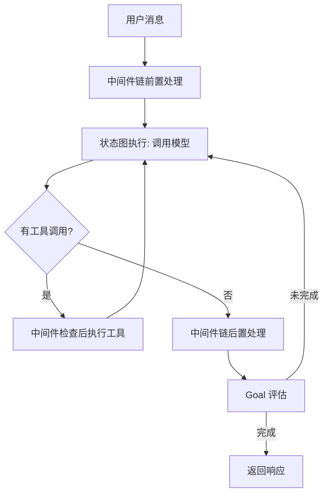
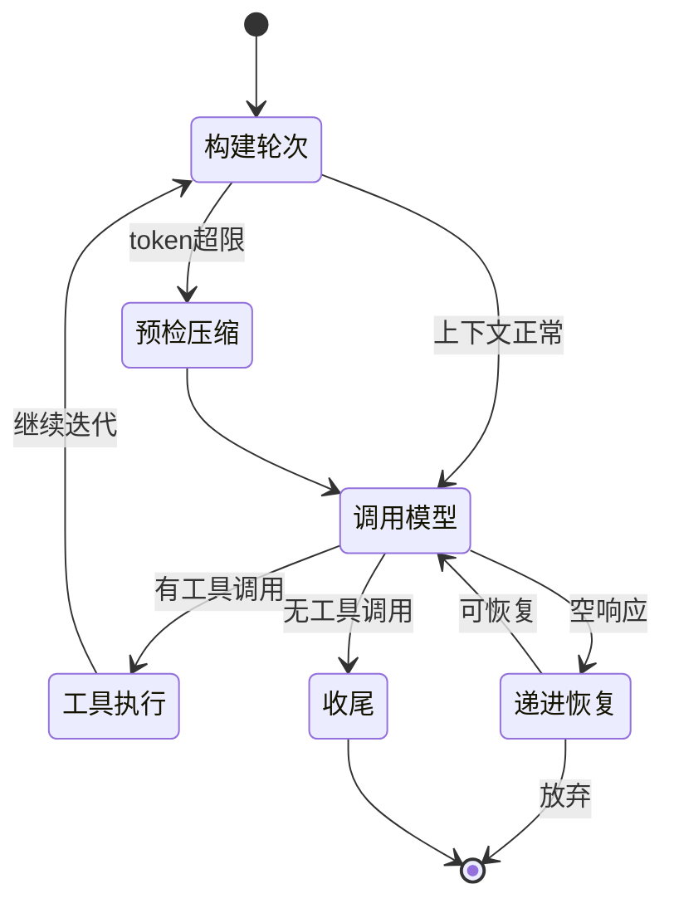
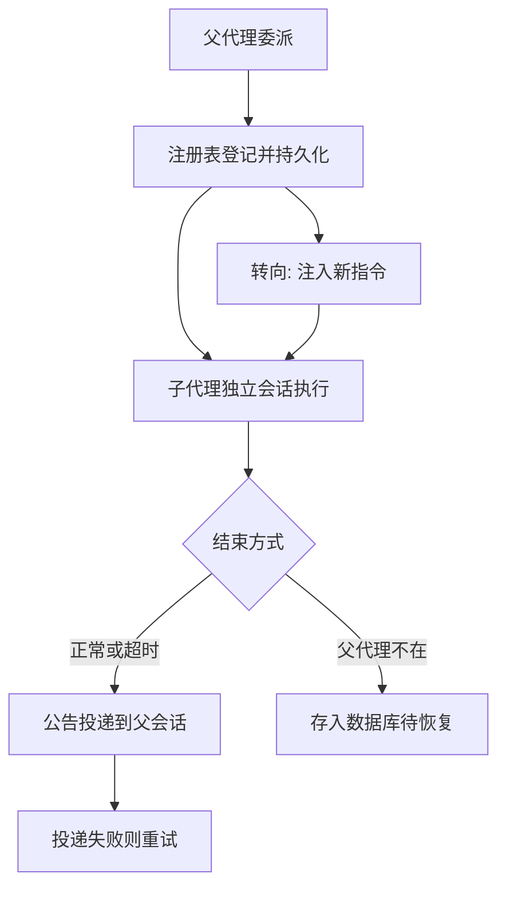
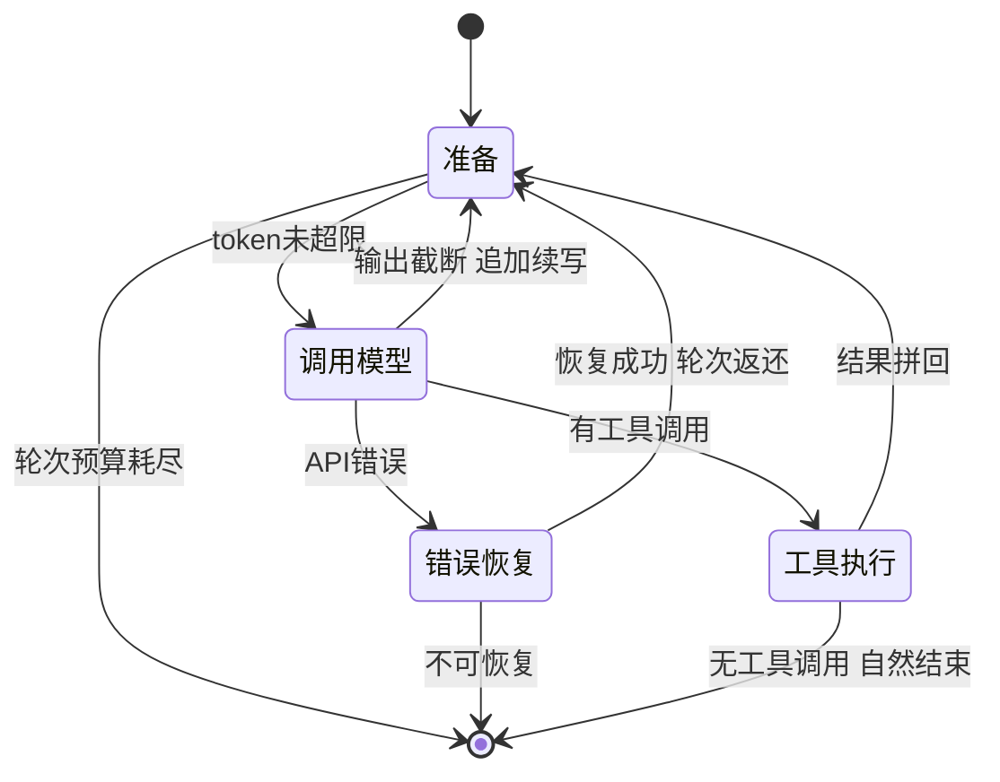
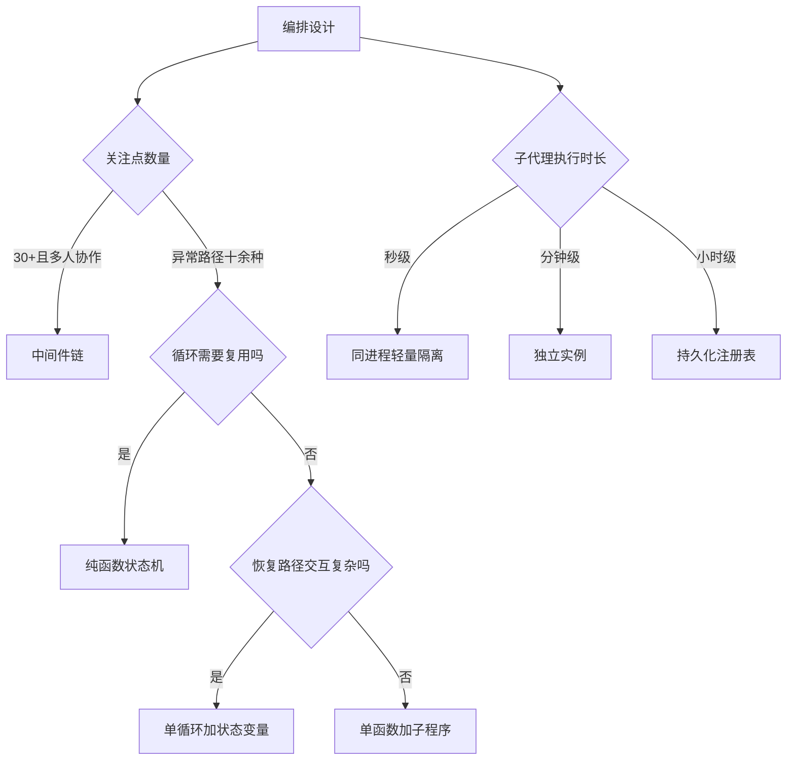

# 编排与主循环

## 读前思考

- Agent 主循环的最小实现只有四个动作：调模型、解析响应、执行工具、拼回结果。真正的问题是循环怎么知道自己该停下——模型不说"我做完了"，只是不断调用同一个工具、得到同样的结果，你是直接强制终止（快但可能误杀一个确实需要很多轮的复杂任务），还是先注入一条提示期待它自我纠正（慢但给一次机会）？两种做法各自假设了模型具备什么能力？
- 当循环自己跑不完时，任务就要拆分委派给子代理。子代理应该看到之前的对话（共享上下文）还是只看到任务描述（完全隔离）？子代理能不能再拆分子任务——如果不限制嵌套深度，一个递归委派的 bug 会造成什么后果？

## 核心问题

编排与主循环解决的核心问题是：**如何可靠地驱动"模型推理 → 工具执行 → 结果回注"的多轮迭代，明确判断何时终止，在 API 错误与工具失败下恢复而不泄漏资源，并把可并行的子任务安全地拆分委派出去。**

先划清边界：上下文压缩的完整机制（保留什么、摘要什么、失败怎么降级）归 05-context，本篇只讨论循环在何时检查压缩、压缩是否消耗轮次预算；消息排队、执行代次与防重入归 04-state；工具被调度之后的执行生命周期归 07-tools。

| 维度 | deer-flow | hermes-agent | openclaw | claudecode |
|------|-----------|--------------|----------|------------|
| 循环结构 | LangGraph 状态图 + 38 个中间件链 | 单函数六千余行 + 子程序提取 | Python 三层嵌套 / TS 单循环加状态变量 | 纯函数异步生成器四阶段状态机 |
| 终止判断 | 重复模式检测中间件 | 最大迭代次数硬限制 | 先提示自我纠正、失败才终止 | 轮次计数器 |
| 错误恢复 | 分散在各中间件 | 空响应五级递进 | 分层分类恢复 / 循环内联升级 | 三级恢复加轮次返还 |
| 子代理形态 | 隔离异步任务 | 委派与咨询双模式 | TS 持久化编排引擎 / Python 基础派发 | 同进程协程加文件邮箱 |
| steering 与中断 | run 级中断事件 | 线程级中断信号 | 双队列加代次编号、可转向运行中子代理 | 循环不处理，外层 REPL 负责 |

## 方案展示

### deer-flow：中间件链编排 + 隔离子代理

deer-flow 把循环建模为状态图，但真正的复杂度在叠加其上的 38 个中间件链：每个中间件在循环开始前、工具调用包装、循环结束后三个钩子点介入执行流，启用与否由功能开关声明式控制，插入位置用相对锚点声明。循环终止靠专门的重复模式检测中间件与 token 预算中间件；动态上下文不放在系统提示里，而由中间件注入到首条用户消息（静态与动态的分离及压缩细节见 05-context）。

调度一侧：主代理通过任务工具委派，每个子代理运行在独立的异步任务中，有自己的上下文和工具集，看不到父代理的对话历史；并发数量由链上的专门中间件限制。结果回传用加法式状态合约——不新增状态枚举，而是把多个停止原因组合起来（如"完成但轮次耗尽"）表达"部分完成 + 失败原因"，父代理可以程序化判断该重试还是换策略；主代理还维护一份委派账本记录已派出的任务与结果，避免重复委派。

**为什么这么选**：企业级编排框架有 30+ 个关注点（沙箱、护栏、预算、循环检测、委派限额）需要独立开发与测试，中间件链让每个关注点是一个独立文件，新增功能不碰核心循环。加法式合约避免了"N 种完成状态 × M 种失败原因"的枚举爆炸。**牺牲了什么**：执行路径极难追踪，一次工具调用要经过十几个中间件的检查，调试需要理解整条链的顺序语义；子代理完全隔离意味着背景信息必须写进任务描述。机制细节见 docs/deer-flow/03-orchestrator.md。

### hermes-agent：单体循环 + 委派/咨询双模式

hermes-agent 的主循环保持在单一函数中（六千余行），不拆状态机节点也不拆中间件链；前置准备、工具执行、收尾处理、错误分类被提取为独立子程序，主循环只负责编排调用顺序。终止靠最大迭代次数硬限制；空响应不是简单重试，而是五级递进恢复：先判断模型是否合法地无话可说或拒绝回答，再注入续写提示、切换采样参数，最后才放弃。压缩有轮次开始前的预检与收到溢出错误后的响应式两个时机，它在循环中的位置与机制细节见 05-context。

调度一侧有两种并行机制：委派模式创建独立的代理实例，子代理有工具、能执行，继承父代理的工具集交集与凭证，但对话、会话、终端环境完全独立，且被明确禁止写入共享记忆；咨询模式（多模型并行分析）中模型只返回纯文本建议、不能调用工具，主代理看过多个观点后自己决策。两者都通过线程池并行扇出，但结果的使用方式完全不同。

**为什么这么选**：异常路径太多，状态机方案"N 阶段 × M 异常"会产生 N×M 条转换边，状态图比单函数更难读；单一控制流让所有异常分支按确定顺序可读。委派与咨询分开，是因为并非所有并行都需要执行能力——多视角决策咨询不该为工具和会话付出开销。**牺牲了什么**：单函数难以做代码评审，多人同时修改会产生严重合并冲突；两套并行机制带来双倍维护成本。机制细节见 docs/hermes-agent/03-orchestrator.md。

### openclaw：同一项目的两种循环 + 持久化编排引擎

Python 版把主循环拆成三层：外层负责容错（按错误分类决定恢复路径），中层负责一次完整交互（最多 25 轮工具轮次），内层负责执行一批工具调用，每层职责单一。TS 版走了相反的路：一个大循环加约 30 个状态变量，原因是恢复路径之间交互复杂——压缩后要重置思考级别、限流后要判断是否降级模型，分层需要跨层通信反而更难。终止判断上 TS 版做得最精细：检测到重复调用同一工具且结果无进展时，先注入一条提示给模型自我纠正的机会，失败才强制终止。会话内串行与全局并发靠双队列调度，并配合执行代次编号做防重入（代次如何校验、过时执行如何丢弃属于状态主题，见 04-state）。

TS 版调度一侧是完整的编排引擎：注册表集中管理子代理生命周期，持久化数据库保证进程重启不丢状态，孤儿恢复处理父代理崩溃后的遗留子代理；结果不直接返回，而是通过公告机制投递到父会话，支持重试与过期；还能向运行中的子代理注入新指令让它转向。Python 版只有基础派发与等待，无持久化、无转向，符合本地轻量定位。

**为什么这么选**：Python 版并发场景简单，分层带来的清晰度收益大于跨层通信成本；TS 版面向多通道生产环境，恢复路径交互复杂，单循环内的条件分支比跨层状态传递更直接。子代理可能运行数小时，进程重启不能丢状态，注册表、持久化与公告才都是必需的。**牺牲了什么**：TS 版单循环膨胀到四千余行，状态变量之间的约束难以用局部推理验证；编排引擎有十余个文件，持久化引入 I/O 开销。机制细节见 docs/openclaw/03-orchestrator.md。

### claudecode：纯函数循环 + 同进程轻量调度

claudecode 的循环是一个顶层异步生成器纯函数：不持有任何长期状态，所有依赖经参数注入，所有输出以事件形式递交。每轮分四个阶段（准备、调用模型、错误恢复、工具执行），三个回到起点的路径形成循环，三个退出条件跳出循环。核心恢复设计是"可恢复错误不消耗轮次预算"：恢复成功后返还这一轮的计数，预算只统计有效的模型交互，另设独立的重试计数防止无限重试。输出被长度上限截断时，先放大输出上限重试，仍截断则把已生成内容拼回对话并追加一条"请继续"，把"输出太长"变成多轮拼接问题。

调度一侧走最轻路线：子代理是同一进程内的独立协程，用协程上下文变量隔离身份和消息列表；复用同一个纯函数循环，只需传入新的消息列表和不同的模型调用闭包。通信用文件邮箱（每个代理一个 JSON 文件），leader 在轮次间隙轮询收件箱；子代理的工具集中排除掉"再生成子代理"的工具，物理防递归。编排决策完全由提示词驱动——注入一段协调器指令，由模型自己决定怎么分解任务。

**为什么这么选**：循环要被四种调用方驱动——交互式 REPL、一次性命令行、子代理内部、单元测试——纯函数加参数注入让同一个循环换不同参数即可复用；同进程调度避免了进程间通信与进程管理，文件邮箱简单且可直接查看调试。**牺牲了什么**：装配复杂度转移到上层，引擎构建时要解决"子组件需要引用引擎自身"的循环依赖；文件邮箱没有锁，高并发写入有覆盖风险。机制细节见 docs/claudecode/03-orchestrator.md。

## 横向对比

核心岔路口仍是**复杂度放在哪里**：deer-flow 把复杂度推到循环外（中间件链），hermes-agent、openclaw-TS、claudecode 都放在循环内（分别是条件分支、状态变量、阶段分派）。因为关注点数量与复用需求不同，所以在这个问题上分岔——30+ 个关注点且多人协作的企业框架必须拆，十几个异常路径、单实例复用无需求的个人助手可以合。

| 岔路口 | deer-flow | hermes-agent | openclaw | claudecode |
|--------|-----------|--------------|----------|------------|
| 新增一个关注点 | 加一个中间件文件 | 在主循环中加分支 | 在循环体中加判断 | 在对应阶段中加逻辑 |
| 终止策略的假设 | 模式可被代码检测 | 模型不会自己停 | 模型有一次自我纠正能力 | 轮次上限即安全边界 |
| 恢复成本归属 | 分散处理 | 递进试探 | 分类升级 | 返还轮次预算 |
| 子代理隔离与持久 | 异步任务级、无持久 | 实例级、无持久 | 注册表加持久化 | 协程级、无持久 |
| 结果回传形式 | 结构化状态合约 | 摘要 JSON | 公告投递加重试 | 文件邮箱 |

上下文管理决定循环能跑多久，但压缩机制的完整对比归 05-context；循环视角只剩两个共同事实。其一，四家都采用"预检 + 响应式"双时机：调用前先估算、超阈值先压缩，真发出请求收到溢出错误再压缩重试——预检依赖估算总有误差，响应式是估算失误的兜底，两者缺一不可。其二，压缩与错误恢复都不消耗轮次预算，因为它们属于故障成本而非有效工作——如果占用配额，一个频繁限流或频繁压缩的会话会在做任何实际工作前就"轮次耗尽"。claudecode 用恢复后返还轮次实现，另设独立重试计数；截断续写同理，把输出超限从错误降级为多轮拼接，代价是拼接处可能重复或断句。

**终止判断体现对模型能力的不同假设**。硬限制（hermes-agent、claudecode）假设"模型不会自己停，代码必须替它停"，简单但可能误杀确实需要多轮的复杂任务；模式检测（deer-flow）识别"同一工具、同样结果"的重复，更精准但需要检测开销；先提示后终止（openclaw-TS）假设模型有元认知、一次提醒就能换策略，假设不成立时只浪费一轮调用。判断标准是"模型自我纠正能力 × 误杀代价"：弱模型直接终止，高价值任务先给一次机会。

**steering（运行中插话）是区分"请求-响应服务"与"长期运行助手"的判定线**。openclaw-TS 做得最完整：双队列保证会话内串行、全局并发，过时执行靠代次编号校验主动退场，还能向运行中的子代理注入新指令、清空旧队列后用新消息续跑；hermes-agent 靠按线程传播的中断标记，让执行中的工具在下一个边界点感知并停下；deer-flow 用 run 级中断事件配合断连即取消；claudecode 的循环是纯函数、不处理排队，中断由外层负责。消息进队列、按代次校验的机制归 04-state。判断标准是"会话是否长期在线且消息可能乱序到达"：一次性命令行调用不需要 steering，多通道常驻服务必须有，否则用户改了主意 Agent 还在跑旧任务。

**子代理调度的分岔由执行时长与 token 经济学决定**。子代理存在的第一性理由是把探索性的 token 消耗隔离出去：父代理只付出"任务描述"一点输入和"最终摘要"一点输出，全部探索长尾都消耗在子代理自己的、用完即弃的上下文里——这也是四家的子代理几乎都不共享父对话历史的原因。因为子代理执行时长不同，所以在隔离与持久化上分岔：秒级短任务用同进程协程隔离（claudecode），分钟级任务用独立实例（deer-flow、hermes-agent），小时级长任务需要持久化注册表与孤儿恢复（openclaw-TS）。回传形式在"父代理如何消费结果"上分岔：自然语言摘要便于模型阅读后继续推理（hermes-agent、claudecode），结构化合约便于代码分支判断（deer-flow），公告广播解决"父代理可能不在场"（openclaw-TS）。hermes-agent 独有的咨询模式（只分析不执行）则说明并非所有并行都需要工具能力。子代理的压缩配置与记忆继承（几乎一致选择"不继承"、跳过记忆写入）见 05-context 与 06-memory。嵌套控制上每家都留了一道物理闸门——中间件限额、深度限制或工具排除——因为递归委派一旦失控就是指数级资源消耗。

## 面试要点

**1. 中间件链（deer-flow）和单函数（hermes-agent）在什么规模下各自占优？一个项目从 5 个关注点增长到 30 个，什么时候该从单函数迁移到中间件？**

参考答案方向：5 个关注点时单函数占优——所有逻辑在一处，调试不需要追踪中间件顺序。30 个关注点时中间件占优——单函数的分支已经无法被人脑同时持有，合并冲突频率超过团队容忍度。迁移时机不是关注点数量本身，而是"修改一个关注点时是否需要理解其他关注点"——答案从"不需要"变成"经常需要"，就是单函数承载能力到顶的信号。迁移后的关键设计是相对锚点定位：新中间件不需要知道全局顺序，只需声明"我要在谁之后"。判断标准是"关注点耦合度 × 团队并行修改人数"。

**2. 错误重试该不该消耗轮次预算？"可恢复错误返还轮次"解决了什么问题？去掉它用户体验会怎么退化？**

参考答案方向：循环有最大轮次限制防止无限循环。如果限流重试也消耗预算，一个不稳定的网络会在几次重试后耗尽配额，用户看到"达到最大轮次"的错误，而模型还没开始做真正的工作。恢复成功后返还轮次让错误恢复"免费"，预算只计有效交互；防无限重试靠另一个独立的重试计数器，两个计数器解耦了"有效工作量"与"故障恢复成本"。去掉它的最坏情况是网络不稳时用户频繁看到"轮次耗尽"而非结果。判断标准是"预算想约束什么"：约束成本就把重试计入，约束任务复杂度就只计有效轮次——大多数 Agent 的轮次预算是后者。

**3. openclaw-TS 的代次防重入和 claudecode 的纯函数无状态，哪个更适合多通道并发场景？为什么？**

参考答案方向：两者解决不同层面的问题。纯函数无状态解决"循环本身可被多个调用方驱动"——子代理和主代理用同一个循环、传入不同参数，它不处理"同一会话的多条消息如何排队"。代次编号解决"消息到达顺序与执行顺序不一致"——用户快速连发三条消息，旧的执行需要在开始前发现自己已过时并安全退场。多通道场景两者都需要：没有无状态，循环无法被多个会话并行驱动；没有代次校验，用户会收到过时的回复。代次机制的完整设计见 04-state。判断标准是"执行层可并行性 × 消息层新鲜度校验"，两个层面不能互相替代。

**4. 子代理的第一性价值是"隔离探索的 token 消耗"。如果一个任务本身不产生大量中间输出（一次工具调用就有答案），还值得用子代理吗？父代理该怎么消费结果？**

参考答案方向：不值得。子代理的成本是一整套独立上下文的启动开销（系统提示、工具 schema 都要重新计入输入）加一次结果回传的往返；只有当被隔离掉的探索长尾远大于这套固定开销时才划算。单次调用就能出答案的任务，父代理直接调工具更省。结果消费方式取决于回传形式：自然语言摘要适合父代理"读懂后继续推理"，结构化合约（状态、停止原因、用量）适合父代理"程序化判断下一步"——比如看到停止原因是"预算耗尽但有部分结果"，可以决定复用部分结果还是加预算重试。判断标准是"隔离收益 ÷ 启动开销"以及"父代理靠模型阅读还是靠代码分支消费结果"。
