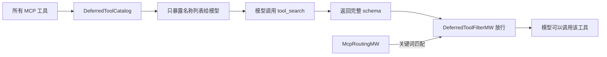
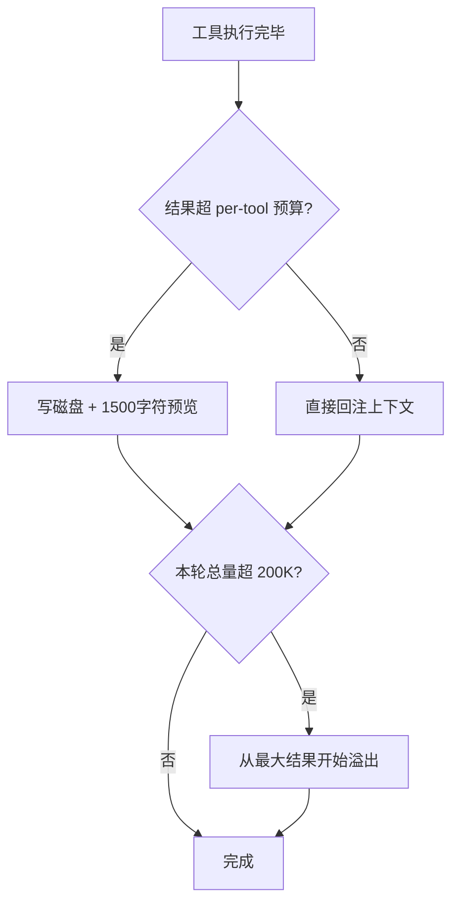
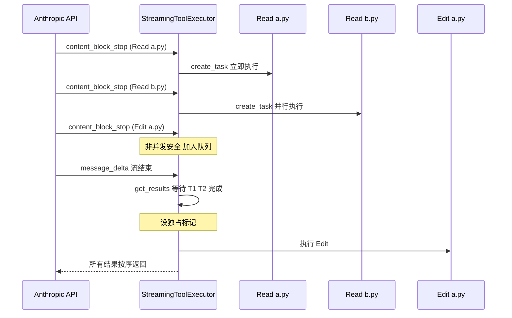
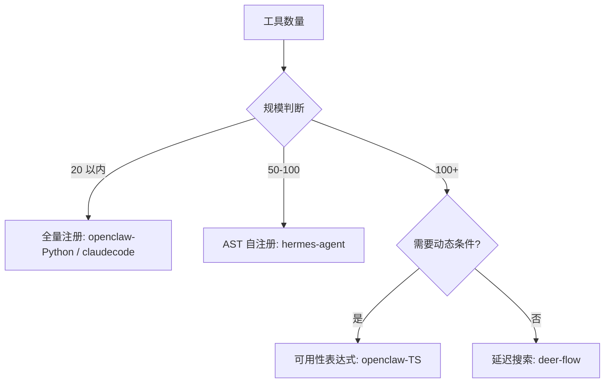

# 工具系统

## 读前思考

- 一个 Agent 有 100+ 个工具，但模型上下文窗口装不下所有工具的 JSON Schema。你是全量绑定（简单但费 token），还是让模型按需"搜索"工具（省 token 但多一轮往返）？这个选择的答案是否取决于工具数量，还是取决于别的因素？
- 模型一次返回 5 个工具调用：3 个 Read、1 个 Edit、1 个 Bash。全部串行太慢，全部并行可能读到写了一半的文件。四个项目给出了从"硬编码白名单"到"动态声明式标记"的不同并发策略——哪种方案在正确性和性能之间取得了最好的平衡？

## 核心问题

工具系统解决的核心问题是：**如何在保证安全的前提下，让 LLM 在正确的时机看到正确的工具，可靠地执行工具调用，并将结果控制在上下文窗口可承受的范围内。**

| 维度 | deer-flow | hermes-agent | openclaw | claudecode |
|------|-----------|--------------|----------|------------|
| 工具发现 | 延迟发现（DeferredToolCatalog） | 自注册 + AST 静态扫描 | Python 全量 / TS Tool Search | ABC + Registry 启动注册 |
| 可见性控制 | 多源优先级去重 | toolset bundle + check_fn | Profile 静态 / 可用性表达式 | Registry 动态组装 |
| 并发执行 | LangGraph 内建 | 白名单 + 路径重叠检测 | 按 owner 路由 | 批次分组 + 独占标记 |
| 结果控制 | 中间件链处理 | 三层预算体系 | 智能截断 + 敏感信息脱敏 | 200KB 硬限制 |
| 安全机制 | 中间件链权限检查 | 危险命令审批 + YOLO 冻结 | 策略管道 + 审批流 | PreToolUse Hook + 权限检查 |

## 方案展示

### deer-flow：延迟工具发现——用一轮搜索换 context 空间

deer-flow 面对的核心矛盾是 MCP 工具数量可能很多（几十到上百个），每个工具的 JSON Schema 约 200-500 token，全量绑定会消耗 10k-25k token。它的解决方案是 DeferredToolCatalog：只暴露工具名称列表给模型（约 500 token），模型需要某个工具时通过 tool_search 获取完整 schema。

tool_search 支持三种查询模式：select:name（精确选择）、+keyword rank（关键词 + 相关性排序）、regex（正则匹配）。每次搜索最多返回 5 个工具的 schema，防止 schema 爆炸。McpRoutingMiddleware 还能根据用户请求中的关键词自动提升对应工具，省去一次 tool_search 往返。

工具来自四个源头（config 声明 > 内置 > MCP > ACP），按优先级去重。用户显式配置的意图最强，覆盖默认行为。

**为什么这么选**：对于 32k 上下文窗口的模型，25k token 的工具 schema 几乎占满窗口。延迟发现把固定开销从 O(N×schema_size) 降为 O(N×name_size + K×schema_size)，K 是实际使用的工具数。代价是多一轮 LLM 往返（搜索→调用），增加约 1-2 秒延迟。

### hermes-agent：AST 扫描发现 + 三层结果预算

hermes-agent 的工具发现不用中心化清单。每个工具文件在模块顶层调用 registry.register() 完成注册，启动时 discover_builtin_tools() 用 ast.parse 扫描每个 .py 文件的 AST，只导入包含顶层 registry.register() 调用的模块。这避免了 import all 的副作用（辅助模块可能触发平台检测、GUI 初始化）。

工具结果的大小控制分三层递进：Layer 1 工具内部自行截断（语义感知，知道哪部分重要）；Layer 2 按注册表的 max_result_size 将超限结果写入磁盘，内联只保留 1500 字符预览；Layer 3 一轮所有工具完成后若总量超 200K 字符，从最大结果开始溢出到磁盘。

并发执行用 _PARALLEL_SAFE_TOOLS 硬编码白名单 + 路径重叠检测。全部 parallel-safe 且路径不重叠走并发，含交互式工具走顺序，混合走分段。

**为什么这么选**：100+ 个工具文件中实际注册工具的可能只有 70 个，AST 预筛消除了导入辅助模块的副作用。三层预算保证无论工具作者是否自觉截断，上下文都不会溢出。代价是白名单是硬编码的，新增工具需手动标注；磁盘 I/O 增加了延迟，模型需要额外 read_file 轮次获取完整输出。

### openclaw：从静态 Profile 到动态策略管道

Python 版用 ToolPolicy Profile 做静态分组：minimal、coding、messaging、full 四种 profile，Gateway 根据消息来源选择——飞书来的消息用 messaging（禁 bash/write/edit），本地 WebChat 用 full。一行代码决定工具面。

TS 版引入了"可用性表达式"：每个工具声明一组条件表达式（auth 状态、config 开关、env 变量、plugin 启用状态），运行时求值决定可见性。执行前经过六步策略管道（Sandbox → Profile → Provider → Sender → Group → Subagent），每步可独立 allow/deny，最终结果是所有步骤的交集。

工具执行按 owner 路由：Core 工具走 bash-tools.exec.ts，Plugin 工具路由到对应插件，MCP 工具通过 MCP client 转发，Channel 工具路由到对应通道。同一个"执行 bash"的请求，在 CLI 模式下直接执行，在 gateway 模式下可能需要审批，在沙箱模式下路由到容器内。

**为什么这么选**：Python 版工具少（20+），静态分组简单有效。TS 版工具来源多样（核心 + 140+ 插件 + MCP + 通道），可用条件动态变化，静态分组需要为每种组合创建 profile 导致组合爆炸。代价是调试困难——工具"应该出现但没出现"时需要追踪表达式求值链，TS 版因此专门实现了 tool-policy-audit.ts。

### claudecode：批次分组 + 流式提前执行

claudecode 用 ABC + Registry 模式：Tool 抽象基类定义四个接口（get_name、get_schema、execute、is_concurrency_safe），ToolRegistry 是 dict[name → Tool] 的薄封装。工具集在运行时动态组装——子 agent 排除 AgentTool 防递归，后台 agent 排除交互式工具，MCP 工具连接后动态注册。

并发编排的核心是批次分组算法：连续的并发安全工具合并为一个批次并行执行，遇到非并发安全工具时刷出当前批次，该工具独占执行。BashTool 的 is_concurrency_safe() 不是简单返回 False，而是解析 command 参数——只读命令（ls、cat、git status）返回 True 允许并发，写命令返回 False 要求独占。

StreamingToolExecutor 在 API 流式返回过程中，一旦 tool_use block 完整解析就立即启动执行。并发控制两层：Semaphore(10) 限制全局并发数，独占标记确保非并发安全工具执行期间所有其他工具排队。

**为什么这么选**：批次分组不需要分析工具间的数据依赖（工具调用是无状态的，依赖由模型在下一轮决定），只需一个布尔声明就能保证写操作的原子性。流式提前执行让 Read 在 API 还在传输 Edit 参数时就开始执行，节省约 30% 延迟。代价是 is_concurrency_safe() 的正确性完全依赖工具作者声明，框架无运行时校验。

## 横向对比

四个项目在工具系统上的核心岔路口是**"工具可见性应该静态决定还是动态求值"**：

| 岔路口 | deer-flow | hermes-agent | openclaw-Python | openclaw-TS | claudecode |
|--------|-----------|--------------|-----------------|-------------|------------|
| 发现机制 | 延迟搜索 | AST 扫描自注册 | 启动全量 | Tool Search | 启动注册 |
| 可见性决定时机 | 运行时（搜索后提升） | 启动时（check_fn） | 启动时（Profile） | 运行时（表达式求值） | 启动时（Registry 组装） |
| 并发策略 | LangGraph 内建 | 白名单 + 路径检测 | 无并发 | 无并发 | 声明式 + 批次分组 |
| 结果大小控制 | 中间件处理 | 三层预算 | 智能截断 | 200KB 硬限制 |
| 安全模型 | 中间件链 | 审批 + YOLO 冻结 | Profile 隔离 | 六步策略管道 | Hook + 权限检查 |

**结果大小控制**反映了不同的防御哲学。hermes-agent 的三层预算是最精细的——它假设"工具作者可能不自觉"，每层解决不同问题（语义截断 → 单条安全网 → 全局安全网）。claudecode 的 200KB 硬限制最简单——假设"工具作者会自己处理大输出"，框架只做最后兜底。openclaw-Python 的智能截断（检测尾部是否有关键词决定用 head+tail 还是 head-only）在两者之间——不依赖工具作者，但也不做全局预算。

**并发执行**是 claudecode 和 hermes-agent 独有的关注点。deer-flow 和 openclaw 的工具执行本质上是串行的（LangGraph 按序执行 tool_calls，openclaw 按 owner 路由后逐个执行）。claudecode 的批次分组和 hermes-agent 的白名单解决同一个问题，但思路不同：claudecode 让每个工具自己声明并发安全性（去中心化），hermes-agent 用全局白名单集中管理（中心化）。前者扩展性好但依赖作者正确性，后者安全但需要维护白名单。

## 面试要点

**1. 延迟工具发现（deer-flow）多出的那一轮 LLM 往返，在什么条件下是值得的？如果模型经常需要 5 个以上的工具呢？**

参考答案方向：值得的条件是"全量 schema 的 token 成本 > 搜索往返的 token 成本 × 预期搜索次数"。50 个工具全量绑定约 15k token，一次搜索往返约 500 token，如果一次对话平均搜索 3 次，总成本 1500 token 远小于 15k。但如果模型经常需要 5+ 个工具（如复杂编排场景），搜索往返累积到 2500+ token 且增加 5+ 秒延迟，此时可以考虑"热工具预加载"——高频工具直接绑定，低频工具走延迟发现。deer-flow 的 McpRoutingMiddleware 就是这个思路的雏形：根据关键词自动提升高频工具，省去搜索往返。

**2. hermes-agent 的三层结果预算和 claudecode 的 200KB 硬限制，哪个更适合"工具数量多且质量参差不齐"的场景？**

参考答案方向：三层预算更适合。200KB 硬限制假设所有工具的输出特征相似，但实际上 search_files 返回 100 行就很多了，而 terminal_tool 编译输出可能 50KB 才有用。三层预算的 Layer 1 让工具作者按语义截断（search_files 知道前 50 行最相关），Layer 2 按工具类型设不同阈值，Layer 3 做全局兜底。claudecode 的方案在工具少且都是内部开发时够用（22 个工具，作者就是团队自己），但面对 100+ 个第三方工具时无法假设每个作者都自觉做了截断。

**3. claudecode 的 is_concurrency_safe() 声明式接口和 hermes-agent 的硬编码白名单，在安全性上有什么本质区别？如果第三方 MCP 工具要接入，哪种方案更安全？**

参考答案方向：本质区别是"信任边界在哪"。claudecode 信任工具作者的声明（去中心化），hermes-agent 信任框架维护者的白名单（中心化）。第三方 MCP 工具接入时，hermes-agent 的方案更安全——MCP 工具不在白名单中，默认走顺序执行，即使工具作者声称自己并发安全也不会被允许。claudecode 的方案需要额外校验——如果 MCP 工具的 is_concurrency_safe() 返回 True 但实际有副作用，框架无法检测。解决方案是对非内置工具强制 is_concurrency_safe() = False，只有经过审核的内置工具才能声明并发安全。

