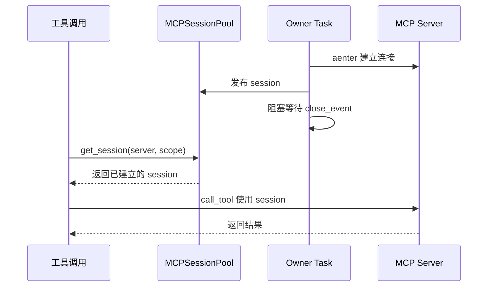
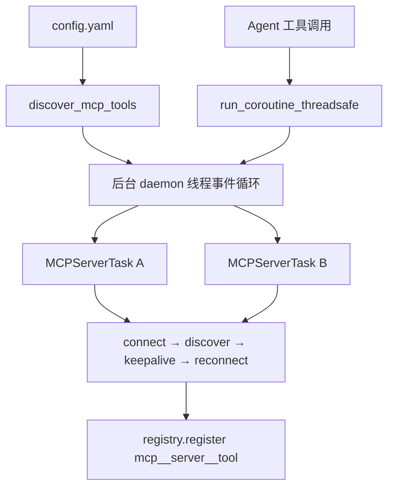
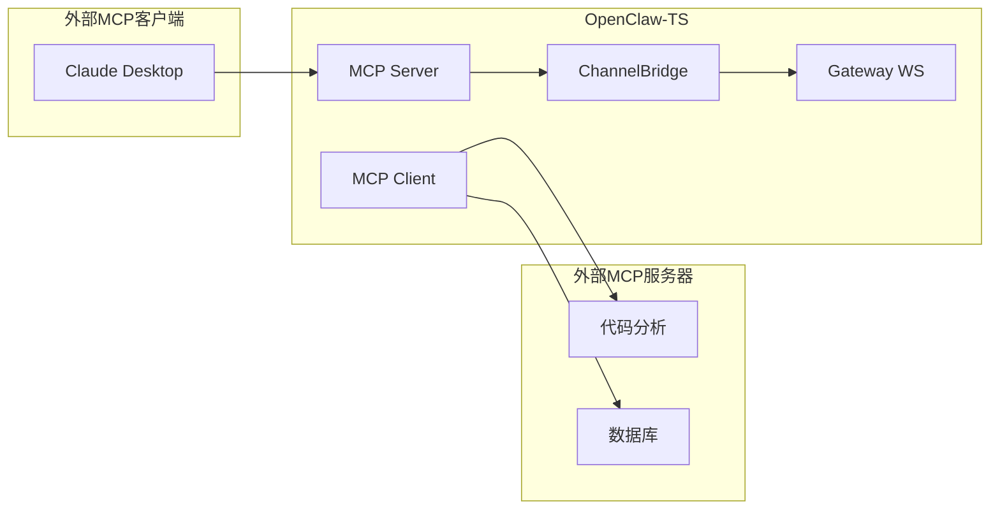
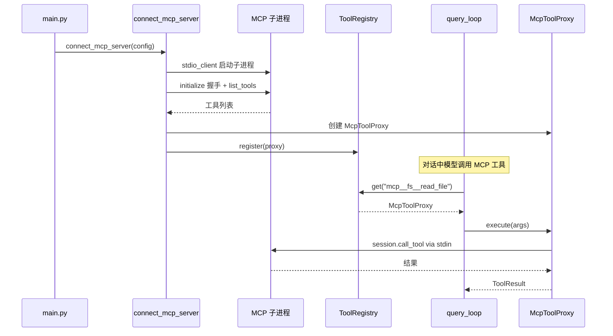
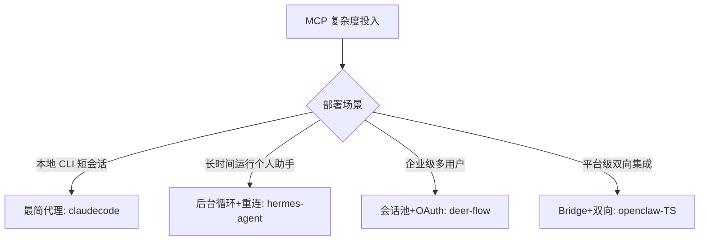

# MCP 集成

## 读前思考

- MCP 的核心承诺是"像调用本地工具一样调用远程工具"。但远程工具面临本地工具不存在的问题：连接会断、token 会过期、子进程会崩溃、网络会抖动。四个项目在"透明化"和"显式管理"之间走了不同的路——有的让 Agent 循环完全不知道 MCP 的存在，有的在统一注册表中保留了来源标记。哪种方案在连接断开时表现更好？
- 如果你的 Agent 既要作为 MCP 客户端（使用外部工具），又要作为 MCP 服务器（暴露自己的能力），这两个方向的实现能复用多少代码？双向 MCP 的复杂度是单向的两倍吗？

## 核心问题

MCP 集成解决的核心问题是：**如何将外部 MCP 服务器的工具透明地接入本地工具系统，管理好连接的生命周期（建立、保持、重连、安全），同时让上层 Agent 循环尽可能少地感知 MCP 的存在。**

| 维度 | deer-flow | hermes-agent | openclaw | claudecode |
|------|-----------|--------------|----------|------------|
| MCP 角色 | 客户端 | 双向（客户端 + 服务器） | TS 双向 / Python 无 | 客户端 |
| 传输协议 | stdio + HTTP/SSE | stdio + HTTP/SSE + Streamable HTTP | stdio + SSE + streamable-http | 仅 stdio |
| 连接管理 | Owner Task 会话池 | 后台事件循环 + 每服务器 Task | Bridge 模式 | 无（session 绑定生命周期） |
| 与原生工具关系 | 延迟目录 + 中间件路由 | 统一注册表 + 命名空间前缀 | 注册到统一工具面 | 代理模式 + 统一 Registry |
| 重连策略 | 无（会话池淘汰重建） | 指数退避 + park + 自探测 | 连接超时 + 重连 | 无（需重启） |
| 安全 | 路径重写 + 名称净化 | 环境变量白名单 + 描述注入扫描 + OSV | OAuth + mTLS | 无特殊处理 |

## 方案展示

### deer-flow：Owner Task 会话池 + OAuth 拦截器

deer-flow 通过 langchain-mcp-adapters 桥接 MCP 协议。核心设计是 Owner Task 模式：每个 stdio MCP 会话由一个专属 asyncio.Task 拥有完整生命周期，这个 owner task 进入 context manager 后阻塞等待关闭信号，工具调用时从会话池获取已建立的会话。仅 stdio 传输被池化——HTTP/SSE 使用 anyio TaskGroup，无法从不同 async task 安全关闭。

HTTP/SSE 服务器的 OAuth 认证通过拦截器透明处理：build_oauth_tool_interceptor() 在每次 call_tool 时检查 token 有效性，过期则自动刷新，上层完全不需要感知 OAuth 的存在。配置热更新用 (resolved_path, mtime, size, sha256) 四元组签名检测变更，变化时关闭所有会话并重建工具列表。

**为什么这么选**：anyio 的 cancel-scope 要求连接在同一个 Task 中打开和关闭，Owner Task 模式是对这个技术约束的直接回应。OAuth 拦截器让工具调用代码完全不涉及认证逻辑。代价是 HTTP/SSE 无法池化（技术约束而非设计选择），每次调用可能需要重建连接。

### hermes-agent：后台事件循环 + 分层安全

hermes-agent 的 MCP 集成是双向的——既是客户端也是服务器。客户端侧，所有 MCP 连接运行在一个共享的 daemon 线程 asyncio 事件循环上，每个服务器是一个长生命周期的 MCPServerTask。工具调用通过 run_coroutine_threadsafe() 从同步工具系统跨线程调度到异步 MCP 连接。

MCP 工具以 mcp__<server>__<tool> 格式注册到与原生工具相同的注册表，Agent 循环完全不需要知道工具来源。安全模型分四层：OSV 恶意软件预检（启动前检查 npm 包）→ 环境变量白名单（子进程只看到允许的变量）→ 描述注入扫描（检测工具描述中的 prompt injection）→ 凭证正则脱敏（结果中剥离 token/key）。

重连策略区分永久失败（401/403/ENOENT 立即 park）和瞬态失败（指数退避最多 5 次），park 状态每 300 秒自探测一次，恢复后重新注册工具。

**为什么这么选**：anyio cancel-scope 要求连接在同一个 Task 中打开和关闭，专用后台循环让连接生命周期与循环绑定。统一注册表的零侵入收益是持续的（Agent 代码永远不需要 MCP 感知逻辑），而命名空间前缀的 token 开销是一次性的。代价是跨线程复杂度（锁保护、ContextVar 手动传播）和 stdio 单 JSON-RPC 流的序列化瓶颈。

### openclaw：双向 MCP + Bridge 模式

openclaw TS 版同时做客户端和服务器。客户端侧（agent-bundle-mcp-runtime.ts 44.5KB）管理外部 MCP 服务器生命周期，获取工具列表后经 toolFilter 过滤注册到统一工具面。服务器侧通过 OpenClawChannelBridge（681 行）封装 Gateway WebSocket 连接管理、事件队列 + 游标、审批状态管理，MCP 工具层保持极薄。

服务器端选择拉模式（events_poll/events_wait）而非推模式——MCP 客户端实现质量参差不齐，有些处理不好服务器主动推送。拉模式让客户端控制消费节奏，服务器只维护有界队列（1000 条上限）和游标。

Python 版当前无 MCP 支持，符合其"本地 AI Gateway"定位——工具数量有限，不需要外部工具协议。

**为什么这么选**：OpenClaw 的定位是"个人 AI 助理平台"——既需要调用外部工具，也需要被外部系统调用（如让 Claude Desktop 通过 MCP 读取 Telegram 消息）。Bridge 模式把 Gateway 的复杂连接管理收敛到一个类中，工具层只需调 bridge 方法。代价是拉模式引入延迟（取决于客户端轮询频率），不适合实时场景。

### claudecode：代理模式——最简 MCP 集成

claudecode 的 MCP 层只有两个文件。McpToolProxy 继承 Tool ABC，execute() 内部通过 ClientSession 发送 RPC 调用，注册到同一个 ToolRegistry。query_loop 通过 registry.get(name) 查找时完全不知道这是远程代理。仅支持 stdio 传输——绝大多数 MCP 服务器通过 npx/python 子进程启动，SSE/HTTP 的连接管理复杂度（心跳、重连、认证）远超收益。

没有自动重连——MCP 服务器进程崩溃后 session 失效，所有代理工具的 execute() 抛异常被 try/except 转为错误 ToolResult。用户需要重启 claudecode 恢复连接。MCP SDK 是可选依赖，import 失败时优雅降级。

**为什么这么选**：claudecode 的定位是还原 Claude Code 内核，MCP 只需"能用"即可。代理模式让 MCP 工具与本地工具走完全相同的执行路径（hooks、权限、Semaphore 全部复用），零额外代码。代价是没有重连、没有 keepalive、没有安全扫描——服务器崩溃后工具变成"僵尸"（仍在 registry 中但 execute 失败）。

## 横向对比

四个项目在 MCP 集成上的核心岔路口是**"连接管理的复杂度应该投入多少"**：

| 岔路口 | deer-flow | hermes-agent | openclaw-TS | claudecode |
|--------|-----------|--------------|-------------|------------|
| 连接生命周期 | Owner Task 持有 | 后台循环 + Task | Bridge 管理 | 无管理 |
| 重连能力 | 会话池淘汰重建 | 指数退避 + park + 自探测 | 超时 + 重连 | 无 |
| 安全投入 | 路径重写 + 名称净化 | 四层安全模型 | OAuth + mTLS | 无 |
| 双向支持 | 否 | 是 | 是 | 否 |
| 对 Agent 透明度 | 高（延迟目录） | 完全透明 | 完全透明 | 完全透明 |

**安全投入与威胁模型正相关**。claudecode 是本地开发工具，用户自己配置 MCP 服务器，信任边界在用户自己——不需要安全扫描。hermes-agent 运行在用户本机且可能连接不受信任的第三方 MCP 服务器（npm 包），威胁面包括 secret 泄漏、prompt injection、供应链攻击，所以需要四层防护。deer-flow 部署在沙箱环境中，路径重写防止信息泄漏比防供应链攻击更重要。

**"透明化"的程度**是另一个有趣的分歧。所有项目都让 Agent 循环不区分本地/远程工具（统一注册），但 deer-flow 额外做了一层"延迟目录"——MCP 工具默认不暴露 schema，需要搜索后才可用。这不是为了透明化，而是为了 token 优化。hermes-agent 和 claudecode 的 MCP 工具在注册后立即可见，与本地工具完全平等。

## 面试要点

**1. hermes-agent 的"永久失败 park + 300 秒自探测"和 claudecode 的"无重连需重启"，在用户体验上差多少？什么场景下 claudecode 的方案是可接受的？**

参考答案方向：差在"长时间运行中的瞬态故障恢复"。如果 MCP 服务器因为网络抖动断开 5 秒，hermes-agent 自动重连后工具恢复可用，用户无感知；claudecode 的工具变成僵尸，用户需要重启整个程序。claudecode 的方案可接受的场景是：短会话（几分钟内完成）、MCP 服务器极稳定（本地 stdio 子进程不依赖网络）、用户对重启不敏感（CLI 工具重启成本很低）。判断标准是"会话预期持续时间 × MCP 服务器故障概率"——如果乘积很小，重连机制的复杂度不值得投入。

**2. openclaw 的 Bridge 模式（服务器端）和 hermes-agent 的统一注册表（客户端端），解决的是 MCP 集成的不同方向。如果一个项目同时需要两个方向，架构上怎么组织？**

参考答案方向：两个方向的复杂度来源不同。客户端端的复杂度在连接管理（重连、keepalive、多传输适配），适合用 hermes-agent 的后台循环 + Task 模式。服务器端的复杂度在状态管理（事件队列、审批流、会话元数据），适合用 openclaw 的 Bridge 收敛模式。两者可以共享传输层（stdio/HTTP 的连接建立和协议握手），但上层逻辑完全不同。组织方式：底层 mcp-transport 共享，客户端侧 mcp-client-manager 管理连接生命周期，服务器侧 mcp-server-bridge 管理状态和事件。

**3. MCP 工具注册到统一 Registry（透明化）在什么情况下会成为问题？如果 MCP 服务器在对话中途断开，统一 Registry 的表现是什么？**

参考答案方向：问题是"僵尸工具"——工具仍在 Registry 中，但 execute() 会失败。模型可能反复尝试调用一个已不可用的工具，直到轮次预算耗尽。hermes-agent 的解决方案是：MCPServerTask 检测到连接断开后主动注销工具（从 registry 移除），模型在下一轮看不到这个工具了。claudecode 没有这个机制——工具永远在 registry 中，只能靠 error ToolResult 告诉模型"这个工具坏了"。改进方向是在 Registry 层增加生命周期钩子：session 失效时自动标记工具为 unavailable，get_api_schemas() 不再返回这些工具。

