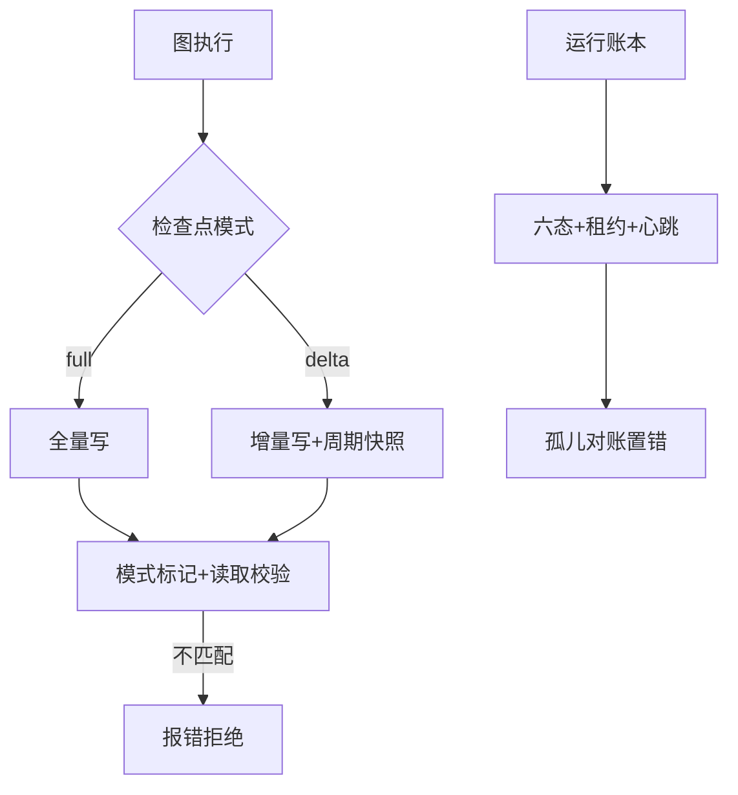
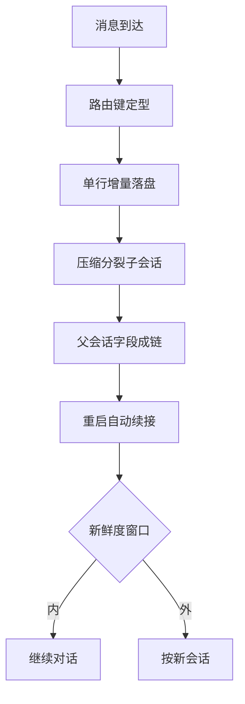
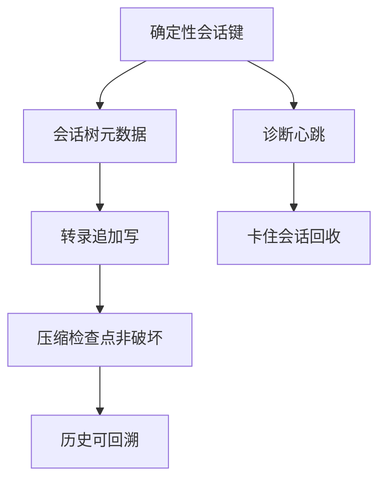
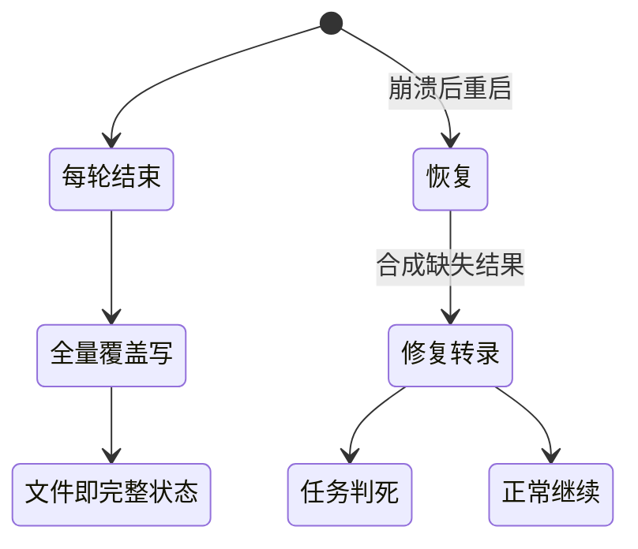

# 会话状态与持久化

## 读前思考

- Agent 跑了几十轮，网关重启或用户关掉终端，这几十轮的对话和任务进度怎么办？全部丢弃重来，还是存下来？如果存，存"模型看到的全部消息"还是"能重放执行痕迹的记录"？这两种存法对崩溃恢复分别意味着什么？
- 同一会话同一时刻只允许一条消息在执行（否则对话历史交错损坏），但用户可能快速连发三条消息。你会把"旧的别执行、新的先进来"的纪律放在哪一层——应用代码、数据库约束，还是消息队列？

## 核心问题

**如何为跨请求、跨进程、跨崩溃存活的会话建模状态：选定持久化介质与检查点形态，定义崩溃后的恢复动作，并建立并发写入的防重入纪律。**

先划清边界：消息归属路由的机制归 01-gateway，本篇只讲归属确定后的状态隔离；会话存储的恢复用途归本篇，回放与审计用途归 10-observability（同一存储两种消费，结构细节本篇主写）；压缩机制的完整对比归 05-context，本篇只讲压缩产物作为检查点的存储形态；会话消息的落盘不是长期记忆（见 06-memory）；防重入与循环调度的配合互引 03-orchestrator。

| 维度 | deer-flow | hermes-agent | openclaw | claudecode |
|------|-----------|--------------|----------|------------|
| 会话身份 | 线程显式资源，运行依附 | 确定性路由键（平台/聊天/线程）| 规范化会话键 + 别名重映射 | 随机短 id，本地单用户 |
| 状态载体 | 图状态检查点 + 运行账本 | SQLite 会话/消息表 | 会话树元数据 + 转录文件 | 内存消息列表 + JSONL |
| 落盘介质 | SQLite/Postgres + 迁移治理 | SQLite WAL 单行增量 | TS SQLite 迁移中 / Python JSON | JSONL 全量覆盖写 |
| 产品形态 | 多 worker 服务端 | 单进程 IM 网关 | 平台（双实现）| 单用户 CLI |

## 方案展示

### deer-flow：图状态检查点 + 运行账本双层持久化

deer-flow 把状态分成两层。图状态层由 LangGraph checkpointer 承载：每个执行步落一次检查点，full/delta 双模式（delta 只写增量，周期快照限制膨胀），模式一经创建进程级冻结、跨模式读取 fail-closed——四个项目里唯一把 checkpoint 做成带版本治理的一等公民的实现。运行账本层是六态 runs 表加租约加心跳，服务崩溃记账与前端展示。两层的恢复语义截然不同：图状态随时可从最近检查点续读，而运行层面则明确不续跑——孤儿运行被终态化为错误，前端得到明确失败而非悬挂。

**为什么这么选**：企业级多 worker 部署的检查点存储随会话增长，delta 压写放大；图执行副作用不可安全重放，所以宁可记账置错也不续跑。**牺牲了什么**：模式切换需重启进程、delta 读取必须经访问器重组；长运行遇重启必须重来。机制细节见 docs/deer-flow/04-state.md。

### hermes-agent：SQLite WAL 增量 + 自动续接

hermes 把会话当作 SQLite 里持久化的对话流：每条消息单行插入，工具执行完毕也立即落盘；压缩不覆盖历史而是分裂出新子会话、以父会话字段连成链，回退用软删除而非物理删除。恢复是四家里最积极的一家：重启后自动续接被打断的会话，带新鲜度窗口，适配器感知的恢复提示（交互平台询问用户、非交互平台直接继续）。内存侧配套超时回收：不活跃会话被序列化回磁盘、释放实例内存，下次消息到达再从磁盘恢复。

**为什么这么选**：IM 场景的对话连续性是体验底线，多平台并发要求行级增量与事务安全。**牺牲了什么**：schema 版本治理成为长期负担（版本号已到 23）；会话分裂链让恢复加载要沿链寻址而不是读一个文件。机制细节见 docs/hermes-agent/04-state.md。

### openclaw：会话树 + 非破坏检查点 + 双实现迁移态

openclaw 的会话身份是确定性键加别名重映射，父子关系直接放会话元数据字段形成会话树；压缩产物是追加式检查点（TS 版存会话条目的槽位，Python 版写独立 JSONL），转录永不就地截断。恢复偏诊断式：TS 版用陈旧阈值识别卡住会话并回收，Python 版状态机显式允许终态重新开始运行。两个实现共享同一会话契约，正处 SQLite-first 迁移中间态——TS 版走在前，Python 版保留原始 JSON 形态。

**为什么这么选**：平台级长期运行要求压缩可回溯、崩溃可诊断；双轨迁移让演进不停摆。**牺牲了什么**：树一致性靠生成方自律；双轨键控存在不一致窗口。机制细节见 docs/openclaw/04-state.md。

### claudecode：全量覆盖写 JSONL + 恢复即修复

claudecode 的会话即内存消息列表，每轮结束整体覆盖写一个 JSONL 文件；后台任务状态独立 JSON 快照。不设数据库、不写增量、不在运行中落检查点。恢复=重启后重新加载 transcript 并修复到 API 可接受：合成缺失的工具结果、非终态任务一律判死。

**为什么这么选**：单用户 CLI 最硬的需求只是"重启后还能接着聊"，全量覆盖让文件即完整状态、无事务无迁移。**牺牲了什么**：写放大随会话线性增长、崩溃留半截行、无法多进程共享。机制细节见 docs/claudecode/04-state.md。

## 横向对比

主线是"为什么持久化 → 怎么持久化 → 崩溃后怎么办 → 并发下怎么办"，四个项目在每个问题上都给出了不同答案。

**岔路口一：checkpoint 形态——同一个词在四家指四种东西。** 因为"压缩产物是否需要可回溯、可回滚"的约束不同，所以在检查点形态上分岔：deer-flow 的检查点是图状态本身（full/delta 双模式、带版本治理与进程级冻结），服务于"从任意检查点继续图执行"；hermes 的检查点语义是压缩分裂出的子会话链加回退软删除，服务于"全历史可审计、可撤销"；openclaw 的检查点是追加式压缩产物历史（TS 槽位 / Python JSONL），服务于"事后能回答这次压缩丢了什么"；claudecode 的检查点是一条压缩边界消息，混在转录里作为一等消息类型，服务于"恢复时知道历史截断在哪"。压缩产物形态的机制细节归 05-context，本篇只讲存储侧。

| 岔路口 | deer-flow | hermes-agent | openclaw | claudecode |
|--------|-----------|--------------|----------|------------|
| 检查点形态 | 图状态 full/delta 双模式 | 压缩分裂链 + 软删除 | 追加式检查点历史 | 压缩边界消息 |
| 恢复哲学 | 记账置错不续跑 | 自动续接 + 新鲜度窗 | 诊断回收 + 终态重启 | 重启修复 + 任务判死 |
| 存储演化 | 迁移治理双 ORM | WAL 单行增量 | 双轨中间态 | 全量覆盖写 |
| 防重入 | 跨 worker 租约 + 唯一索引 | 进程内轮次租约 | 代次编号 | 无 |
| 实例隔离 | 上下文变量配置栈 | 多 Profile 完全隔离 | 多代理目录分片 | 无（单用户）|

**岔路口二：恢复哲学——恢复粒度与是否重执行。** 因为产品形态不同（CLI 单用户可以粗暴重建现场；IM 网关必须无感续接对话；多 worker 服务端宁可失败重来也不重复副作用），所以恢复策略分岔为四档：claudecode 修复转录但不续任务（非终态任务一律判死，恢复粒度为整个转录）；hermes 自动续接会话（待续接标记加新鲜度窗口，对话连续性优先）；deer-flow 只把孤儿运行终态化为错误、绝不续跑（副作用不可重放）；openclaw 诊断回收卡住会话、Python 版显式允许终态重启。核心变量是"会话中断的代价 × 重放副作用的危险"：代价高且副作用安全才值得续跑，否则记账置错更稳。

**岔路口三：存储介质演化——何时值得上数据库。** 因为并发写入者数量与崩溃丢失容忍度不同，所以介质分岔为一条演化轴：JSONL 全量覆盖（claudecode，单进程串行写）→ JSON 索引加 JSONL（openclaw Python）→ SQLite 单行增量（hermes，多平台并发）→ SQLite-first 迁移双轨（openclaw TS，中间态）→ Alembic 治理加双 ORM 并存（deer-flow，多 worker）。这条轴上有三个值得讲的工程故事：hermes 为 WAL 在网络文件系统上的静默损坏做了版本探测与日志模式回退；deer-flow 空库走直接建表、遗留库走迁移，约束与索引必须在模型里双写条件保证两条路径行为一致；openclaw 双轨键控存在不一致窗口，旧文件存储的修复只走 doctor --fix。

**岔路口四：防重入——并发写入的纪律放在哪一层。** 因为会话状态的写入者是单进程还是多 worker 不同，所以串行化手段分岔：deer-flow 把纪律放在数据库层（每线程至多一个活跃运行的部分唯一索引加跨 worker 租约心跳）；hermes 放在进程内（按会话 ID 的轮次租约，失败开放）；openclaw TS 放在消息层（执行代次编号，过时执行在开始前自我退场）；claudecode 不需要（终端输入天然同步）。判断标准是"会话是否会跨进程写入 × 消息是否可能乱序到达"：两者都为否才不需要防重入。防重入与循环调度的配合见 03-orchestrator，与消息归属路由的关系见 01-gateway。

**岔路口五：实例隔离——"多个互不干扰的 Agent"怎么在同一台机器上共存。** 因为多实例的形态不同（同一用户的多场景、同一主机的多代理、进程内的多执行上下文），所以隔离粒度分岔：hermes 用多 Profile 完全隔离（配置/环境/技能/会话数据库各自独立，共享需显式声明）；openclaw 用多代理目录分片（会话索引、转录、检查点按代理物理隔离）；deer-flow 用上下文变量配置栈做进程内的执行上下文隔离（覆盖临时、不落盘）；claudecode 无此需求（单用户单进程）。隔离的代价都是重复——各自维护一份配置与状态，所以"默认隔离、显式共享"是共同答案，差异只在共享的显式通道怎么设计。实例隔离的机制细节分别见各项目 04-state 篇。

## 面试要点

**1. checkpoint 存"全量"还是"增量"？deer-flow 为什么敢用 delta 而其他项目不用？**

参考答案方向：全量简单可靠、恢复零重组；增量省存储但读取需要重组（delta 检查点没有完整状态值），半迁移状态还有静默损坏风险——deer-flow 为此配套了进程级冻结、fail-closed 兼容门和单向迁移。其他项目没有这套配套治理，用增量就是在赌。判断标准是"检查点体积 × 恢复读取频率"：存储贵且读取少，增量值得；两者任一不成立，全量更稳。

**2. 崩溃后"续跑"还是"置错"？hermes 自动续接和 deer-flow 记账置错分别适合什么场景？**

参考答案方向：续跑保住进度和对话连续性，但必须回答两个问题——工具副作用会不会被重复执行、过期上下文要不要清理（hermes 用新鲜度窗口和适配器感知提示回答）；置错语义简单、副作用安全，但长运行遇重启必须重来。判断标准是"会话中断的代价 × 重放副作用的危险"：高频短交互、副作用安全选续跑；低频长任务、副作用危险选置错。

**3. 从"文件全量写"升级到数据库的信号是什么？**

参考答案方向：信号是并发写入者数量与数据丢失成本。单进程串行写文件没有问题；多 worker 同时写同一会话需要行级并发与唯一约束；跨进程租约协调需要数据库；多后端部署还需要迁移治理。升级本身有代价——schema 版本治理、迁移脚本、网络文件系统兼容都成为长期负担（hermes 的 WAL 回退就是例子）。判断标准是"并发写入者数量 × 数据丢失成本"。

**4. 防重入的锁应该放在哪一层：数据库约束、进程内租约、还是消息代次？**

参考答案方向：数据库约束跨进程可靠但每次写入有开销，适合多 worker 服务端；进程内租约零延迟但跨进程失效，适合单进程网关；消息代次解决"消息到达顺序与执行顺序不一致"，与前两者正交——用户快速连发时旧执行自判过时退场。三者解决不同层面的问题，多通道生产系统往往要组合使用。判断标准是"会话是否会跨进程写入 × 消息是否可能乱序到达"。
