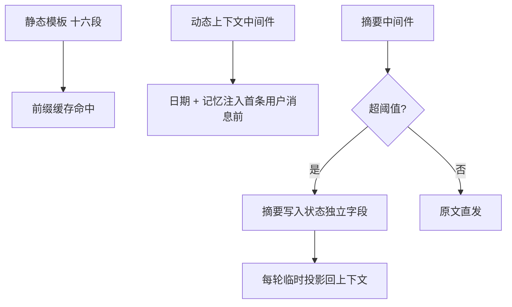
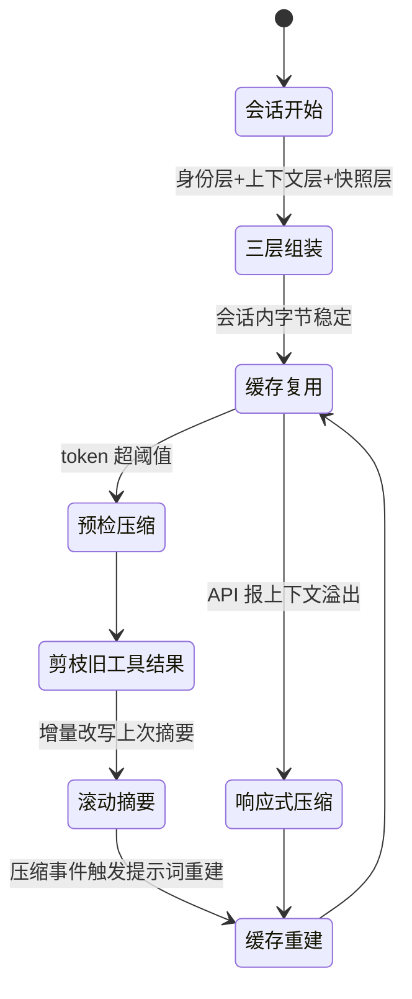
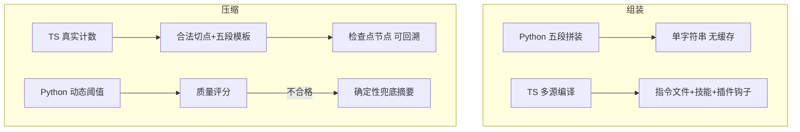

# 上下文工程

## 读前思考

- 每次调模型，都要把系统提示词、规则文件、记忆快照、全部对话历史装进一个容量固定的上下文窗口。这些内容里，哪些应该在会话开始时组装一次就冻结，哪些必须每轮重新注入？如果动态内容每轮都在变，提供商的前缀缓存还能命中吗？
- 窗口快被填满时只能压缩，但压缩要改写消息前缀——前缀一变，缓存折扣全丢；而且摘要本身可能写坏，漏掉关键决策、编造不存在的进展。什么时候组装、什么时候压缩、压缩坏了怎么兜底，这四个项目给出的答案差异很大。

## 核心问题

上下文工程解决的核心问题是：**在有限的上下文窗口里，决定"装什么进去、何时装进去、装满之后怎么缩小"，让模型既能持续工作，又始终记得当前在做什么。**

与长期记忆的边界：本篇是会话内的短期工作记忆管理——组装的时机与结构、压缩的全机制。注入内容的来源（记忆怎么被检索出来）归 06-memory.md；本篇只回答"内容何时以何种结构进入窗口"。token 用量的计数来源（估算还是真实用量）归 02-model.md，本篇只讲计数结果怎么用于压缩阈值。

| 维度 | claudecode | deer-flow | hermes-agent | openclaw |
|------|-----------|-----------|--------------|----------|
| 定位 | CLI 内核：一次组装、最简压缩 | cache 友好：企业级组装与压缩 | 字节稳定：长期个人助手 | 双实现：极简 vs 完整 |
| 提示词结构 | 三类分段 + 独立缓存段 | 全静态模板 + 隐藏动态消息 | 三层稳定性分级 | Python 五段拼装 / TS 多源编译 |
| 规则文件注入 | CLAUDE.md 层级发现 | SOUL.md 人格 + 中间件注入 | 单文件优先级发现 | instructions.md 发现 |
| 压缩一句话特点 | 保尾四轮、其余全摘要 | 摘要移出消息通道保 cache | 滚动摘要 + 多级降级 | TS 模板可审计 / Python 确定性兜底 |

## 方案展示

### claudecode：三类分段组装 + 保尾全摘要

系统提示词按"静态 → 动态 → 条件"三类顺序拼装：七个静态行为段（角色、系统规则、任务原则、风险确认、工具偏好、语气、输出效率）内容固定，两个动态段（运行环境、工具结果提醒）每次构建重新生成，两个条件段（记忆指令、CLAUDE.md 用户指令）按配置注入。拼装结果返回的是段落列表而非单字符串，API 层把每段作为独立缓存段传入，静态段跨请求命中缓存；CLAUDE.md 内容放在最后，保证用户指令优先级最高。压缩同样走最简路线：每轮用字节折算估算 token，一旦越过"窗口减固定缓冲"就启动——最近四轮对话原文保留，其余消息汇总成纯文本交给摘要模型，产物是一条摘要边界消息加最近四轮；若此前已压缩过，旧摘要会嵌入本次摘要的输入，避免更早的信息彻底丢失；摘要提示词只给四个要点方向（关键决策、文件与代码位置、任务状态、未解决问题），不约束输出格式。

```mermaid
sequenceDiagram
    participant Loop as 主循环
    participant Est as token 估算
    participant Cmp as 压缩器
    participant LLM as 摘要模型

    Loop->>Est: 每轮预检：估算当前消息 token
    Est-->>Loop: 估算值
    alt 超过窗口 − 固定缓冲
        Loop->>Cmp: 发起压缩
        Cmp->>Cmp: 切分：最近 4 轮保留 / 其余待摘要
        Note over Cmp: 消息太少则放弃压缩
        Cmp->>LLM: 旧消息转纯文本 + 前次摘要
        alt 摘要成功
            LLM-->>Cmp: 摘要文本
            Cmp-->>Loop: [摘要边界消息, 最近4轮原文]
        else 摘要失败或为空
            Cmp-->>Loop: 原消息列表原样返回（安全降级）
            Note over Loop: 连续失败 3 次后彻底放弃压缩
        end
    else 未超阈值
        Loop->>Loop: 正常调模型
    end
    Loop->>LLM: 正式请求
    alt 收到"上下文过长"错误
        Loop->>Cmp: 响应式压缩（仅允许一次）后重试
    end
```

**为什么这么选**：CLI 场景会话通常不长，组装一次即可复用，压缩是低频事件，简单策略的失败面小、可预测。估算不准没关系——固定缓冲区吸收低估误差，响应式压缩兜住漏网情况。**牺牲了什么**：全摘要意味着中间历史只剩一段自由文本，摘要质量无校验；估算不含系统提示词和工具 schema，长工具描述场景会系统性低估。机制细节见 docs/claudecode/05-context.md。

### deer-flow：全静态模板 + 摘要移出消息通道

deer-flow 把系统提示词做成完全静态的模板，动态信息（当前日期、用户记忆、活跃技能）全部剥离，由中间件在运行时以隐藏消息的形式注入到第一条用户消息之前——静态模板跨用户、跨会话字节相同，前缀缓存命中前缀拉到最长。压缩是中间件链中的一环（摘要中间件，源码：SummarizationMiddleware），触发器支持绝对 token 数、消息条数、窗口占比三种条件任意组合，保留最近 N 条消息，且 AI 消息与其工具结果永不切断——切点落在工具消息中间时整对后移。最独特的设计是**摘要不作为消息存在**：摘要文本写入会话状态的独立字段并由检查点持久化，每轮请求时以隐藏数据消息临时投影回上下文，消息前缀不被摘要改写污染。



**为什么这么选**：企业级多用户部署下，cache 折扣乘以用户量是真金白银；把动态内容挪出系统提示词、把摘要挪出消息通道，是四个项目中唯一对"组装与压缩都正面保 cache"的方案。**牺牲了什么**：整套机制深度绑定中间件框架和检查点持久化，无法单独摘出来用；token 用字符近似估算，精度垫底，只能靠宽松阈值补偿。机制细节见 docs/deer-flow/05-context.md。

### hermes-agent：三层字节稳定 + 滚动摘要多级降级

hermes 的系统提示词按稳定性分三层组装：身份与行为指导层会话内字节稳定，项目上下文层（上下文文件、调用方指令）会话级稳定，记忆快照与时间戳层每次构建可变。三层拼好后缓存复用，整个会话不重建，只有压缩事件或模型切换才触发重建。上下文文件采用优先级发现：同一项目只加载优先级最高的一个（自有格式 > AGENTS.md > CLAUDE.md > 编辑器规则文件），带截断上限并过滤注入攻击。压缩器是四家中防御最重的：阈值默认为窗口一半，小窗口模型自动抬升到四分之三，防止"不可压缩底座"导致的压缩抖动；压缩先剪枝（旧工具结果替换为一行语义概括），再对中间轮次做**滚动摘要**——在上次摘要基础上增量改写，摘要采用结构化检查点模板，带凭据脱敏和时间锚定两个独特设计。



**为什么这么选**：个人助手会话以天为单位持续，压缩是高频事件，任何一个未处理的边界情况都会以周为周期复现；字节稳定的提示词让高频请求持续吃到缓存折扣。**牺牲了什么**：复杂度极高，阈值抬升、剪枝分级、冷却期、反抖动各自引入配置项和状态；滚动摘要的错误会跨压缩累积，一次写坏的摘要会污染后续所有增量更新。机制细节见 docs/hermes-agent/05-context.md。

### openclaw：双实现——五段极简 vs 多源编译

两个实现的组装哲学差异显著。Python 版按固定顺序拼装五个部分：身份声明、渠道上下文、工具列表、工具规则、调用方补充指令——整个组装器只有几十行，代价是没有任何缓存优化，任何部分变化都导致整段失效。TS 版走多源编译：先收集运行时参数（主机、系统、模型、渠道、时区等），再由插件运行时层编译最终提示词，支持指令文件发现（工作区的 instructions.md）、技能内容注入、插件钩子追加段落、按提供商做格式变换，还能生成各段 token 占比的审计报表。压缩同样双轨：TS 版取 provider 真实用量计数，从尾部倒序累积到保留预算后在"不切断工具调用对"的合法切点下刀，摘要用固定五段模板并增量更新，产物是会话树中的检查点节点而非破坏性重写；Python 版用双档比例阈值且随工具结果数量动态下调，招牌是摘要质量评分——不合格即弃用 LLM 摘要，改用无 LLM 的确定性兜底。



**为什么这么选**：平台级长期运行的第一要求是"永远不能因为压缩失败而卡死会话"，TS 用模板可验证性和非破坏性检查点保证可审计，Python 用确定性兜底保证必有退路；组装上的分岔则是定位使然——Python 版面向单一渠道的嵌入式运行时，够用就好。**牺牲了什么**：TS 的固定模板对非编码类会话过于刚性；Python 的机械兜底摘要质量明显低于 LLM 摘要，只是"不至于崩"。机制细节见 docs/openclaw/05-context.md。

## 横向对比：上下文组装

组装的第一个岔路口是**动态内容放在系统提示词里还是挪出去**。因为对"前缀缓存值多少钱"的假设不同，四家分岔为两派：deer-flow 把全部动态内容（日期、记忆、技能）挪出静态模板，用隐藏消息注入；claudecode 和 hermes 选择"分段排序"——静态段在前、动态段在后，缓存至少命中静态前缀，hermes 更进一步按三层稳定性组织，让重建只发生在必要时刻；openclaw Python 版干脆不做缓存优化，因为单渠道场景下缓存收益撑不起改造成本。判断标准是"用户量 × 会话长度"：乘积越大，把动态内容挪出提示词的收益越高。

第二个岔路口是**规则文件怎么发现和注入**。claudecode 做得最完整：用户全局、目录层级逐级向下、本地私有三层来源全部合并，支持文件包含指令递归展开并带循环引用防护，合并结果放在提示词最末保证优先级最高。hermes 反其道而行——同一项目只按优先级加载一个文件，避免多文件规则冲突，代价是用户必须知道优先级表。deer-flow 把人格类规则（SOUL.md）编译进静态模板，运行时规则靠中间件注入。openclaw TS 版从工作区发现指令文件并注入，与技能内容、插件钩子并列。配置系统的层级合并归 01-gateway.md，本篇只讲规则文件作为"注入内容"进入窗口的方式。

组装时机也有分野：claudecode 会话开始时组装一次；hermes 组装后缓存、压缩或换模型才重建；deer-flow 每轮由中间件重新注入动态段——冻结换缓存命中，还是每轮重载换信息新鲜，这笔账与压缩策略直接相关：任何改写消息前缀的动作（包括压缩）都会让"冻结的提示词"之外的缓存投入部分作废。

## 横向对比：压缩

四个项目在压缩上的分岔可以归结为三个岔路口，每个岔路口的选择都由项目的部署假设决定。

**岔路口一：触发阈值怎么定——固定缓冲、比例、还是动态？** 因为对"上下文成本结构"的假设不同，四家走向三种阈值哲学。claudecode 和 openclaw TS 版用"窗口减固定预留"，隐含假设是窗口足够大、预留量相对窗口可忽略；deer-flow 和 hermes 用比例阈值，因为要适配从小型开源模型到旗舰模型的多种窗口，固定值在小窗口上会荒谬（hermes 甚至发现过比例下限在小窗口上退化为"永不触发"的缺陷，为此加了小窗口抬升规则）；openclaw Python 版的动态阈值（工具结果越多阈值越低）则假设工具输出是压缩收益的主要来源——工具结果可压缩性远高于人类对话，多攒一些提前压更划算。

**岔路口二：摘要形态——自由文本、结构化模板，还是滚动增量？** 分岔的根源是对"摘要质量能否被验证"的要求不同。自由文本（claudecode）灵活但不可验证，写坏了只能靠人发现；结构化模板（openclaw TS 版五段式、hermes 检查点）让"约束丢没丢、进展记没记"变成可检查的问题，openclaw Python 版更进一步把检查自动化成质量评分。滚动增量（hermes、openclaw TS 版）与全量重摘（claudecode、deer-flow）的分岔则是成本与错误传播的交换：增量更新不必每次重读全部历史，摘要调用的输入恒定小；但一次写坏的摘要会永久留在链条里，全量重摘每次都有机会自我修正。

**岔路口三：压缩与 prompt cache 的对抗怎么处理？** 压缩必然改写消息前缀，改写即 cache 全失效。deer-flow 是唯一正面解决的：摘要放独立状态字段、每轮临时投影，前缀不动。hermes 选择减少压缩次数（阈值抬升 + 反抖动），承认失效但控制频率。claudecode 和 openclaw 接受失效——前者会话短、压缩低频，后者用真实用量计数保证压缩只在真正必要时发生。这个岔路口的判断标准是"压缩频率 × cache 折扣幅度"：两者乘积大到超过工程改造成本时，才值得做 deer-flow 式的通道分离。

| 岔路口 | claudecode | deer-flow | hermes-agent | openclaw-TS | openclaw-Python |
|--------|-----------|-----------|--------------|-------------|-----------------|
| 阈值哲学 | 固定缓冲 | 比例（三条件任一） | 比例 + 小窗口抬升 | 固定预留 + 真实计数 | 双档比例 + 动态下调 |
| 摘要形态 | 自由文本全量 | 自由文本 + 独立通道 | 结构化 + 滚动增量 | 固定模板 + 增量 | 六要点 + 质量评分 |
| 工具对切断 | 按轮切天然安全 | 消息对整体移动 | 边界前移吸附 | 合法切点 + 前缀单独摘要 | 按条数切（最弱） |
| 失败退路 | 还原 + 三连败停 | —（框架层重试） | 冷却 + 反抖动 + 警告 | 重试 + 守卫层 | 评分弃用 + 确定性兜底 |
| cache 态度 | 接受失效 | 通道分离保 cache | 降频减损 | 接受失效 | 接受失效 |

压缩在循环中的位置（何时检查、是否消耗轮次预算）各项目只在编排篇留一句，见 03-orchestrator.md。

**与长期记忆的接口**：压缩会永久删除消息原文，如果这些消息里有值得跨会话记住的事实，必须赶在摘要前落盘。deer-flow 是唯一做了这个联动的项目——压缩启动前先把待提取对话绕过防抖窗口立即送入记忆队列；且子代理的压缩链特意跳过这个刷写，因为子代理的内部轮次不应进入用户的长期记忆。hermes 走的是另一条接口：记忆快照在会话开始时注入一次后全程冻结，压缩不影响注入内容，用"信息不新鲜"换缓存稳定，注入策略的完整讨论见 06-memory.md。其余两家不做联动的理由各不相同：claudecode 的记忆提取本来就每轮异步跑、时序上先于压缩；openclaw 的记忆整合走独立定时任务、数据源不依赖会话消息。

## 面试要点

**1. 动态信息（日期、记忆）该放进系统提示词还是消息历史？两种放法的缓存代价分别是什么？**

参考答案方向：放进系统提示词最方便，模型对系统指令的遵循度也高，但只要动态段排在提示词前部或整体变化，整个提示词的缓存就失效；挪进消息历史（隐藏消息注入）可以保住系统提示词的缓存前缀，代价是长对话中模型可能"忘记"早期注入的约束，且部分模型对用户消息里的指令遵循度较低。折中方案是分段排序：静态段在前、动态段在后，至少命中静态前缀。判断标准是"动态内容的变化频率 × 提示词占请求 token 的比例"：变化快且提示词长，挪出去；变化慢或提示词短，留在里面。

**2. 什么是"压缩抖动"？为什么会发生？怎么防？**

参考答案方向：压缩抖动指压缩刚完成、一两轮后又再次触发，会话大部分时间在做摘要而非干活。根因是"不可压缩底座"——系统提示词、工具 schema、保留的尾部原文、摘要本身，这些内容压缩后依然占据窗口；如果底座占比高（小窗口模型尤甚），压缩腾出的空间很快被新一轮工具输出填满。防御分两层：事前，阈值随窗口大小自适应（小窗口把触发线抬高）；事后，追踪每次压缩的实际节省率，节省率过低说明已无可压缩内容，应拒绝继续压缩并提示用户开新会话。判断标准是"底座 token ÷ 窗口大小"——占比超过触发阈值与保留预算之差时，压缩注定无效。

**3. 压缩后模型"忘了"早期确立的约束（比如用户说过"不要改测试文件"），怎么办？**

参考答案方向：分约束的类型处理。静态约束（编码规范、项目规则）本就该放在系统提示词或规则文件里，不参与压缩、天然免疫——这正是规则文件注入的价值。会话内约束（用户临时说的偏好和禁令）依赖摘要保真，结构化模板里"约束与偏好"设为必填段，强制摘要模型回答"用户提过什么要求"；自由文本摘要则容易把约束淹没在进展描述里。再往上一层是机制化保底：把关键信息移出摘要通道，比如文件操作清单跨压缩机械传递。判断标准是"约束违反的代价"：代价高的约束不能只靠摘要，要走结构化通道甚至权限系统。

**4. 摘要压缩、直接截断、冻结快照三种手段，什么场景选哪个？**

参考答案方向：截断零成本、零延迟，但信息丢失不可控，适合被截内容价值密度低的场景——超长工具输出保留头尾即可。摘要有一次 LLM 调用的成本和失败风险，但信息保留可控，适合历史中混有关键决策的场景。冻结快照（会话开始时检索注入、全程不变）不是压缩手段而是注入策略，它假设"会话中途产生的新信息不需要立即回注"，换取缓存命中。实践中三者组合使用：单条超长结果先截断、整体历史超限再摘要、跨会话知识用快照注入。判断标准是"内容的价值密度 × 任务对连续性的要求"：密度低用截断，密度高且任务长用摘要，跨会话复用用快照。
