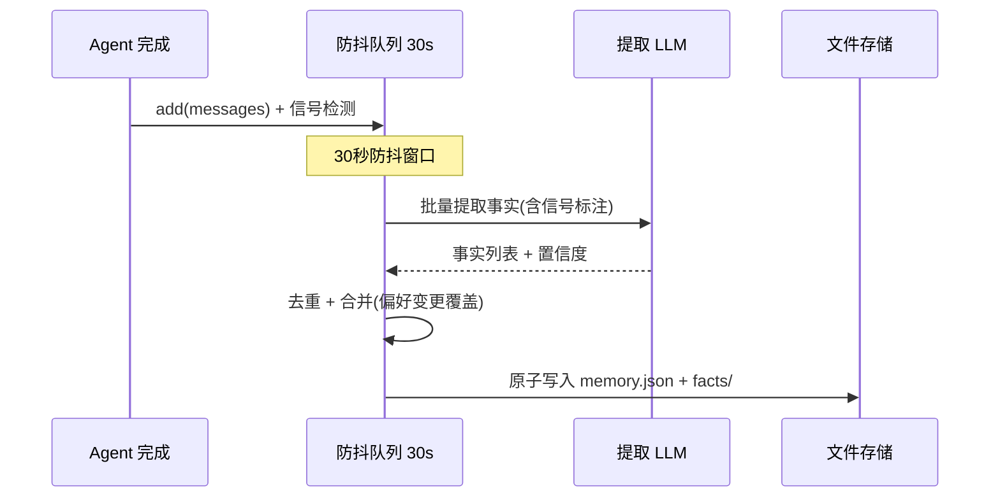
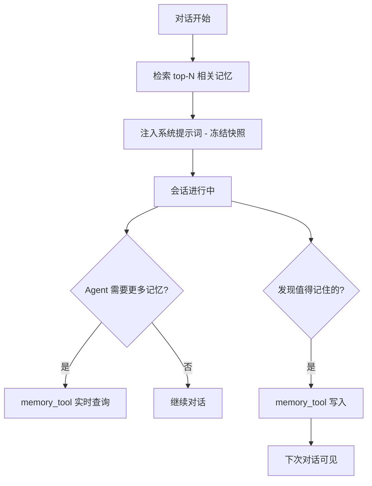
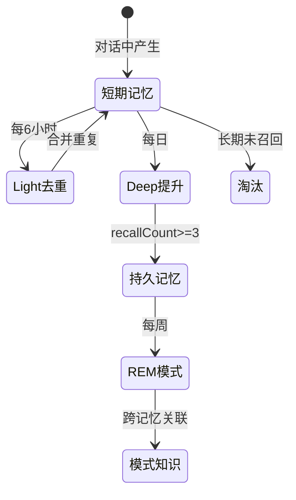
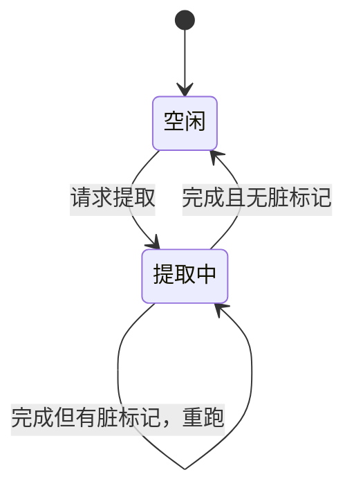

# 记忆系统

## 读前思考

- 大多数 Agent 在对话结束后就忘掉一切。如果要实现跨 session 的长期记忆，你会怎么从对话中提取"值得记住"的信息？用规则匹配（"记住我喜欢 Python"）还是用 LLM 语义分析？前者只能捕获显式标记，后者每轮都要额外花一次 API 调用。
- 记忆提取后存在哪里、怎么检索、何时注入？如果全部塞进 system prompt 会占满上下文，如果完全不加载又等于没记。四个项目在"记住一切"和"不浪费 token"之间走了不同的路——有的用冻结快照换 prompt cache 命中率，有的用三阶段"做梦"模拟人类睡眠记忆整合。

## 核心问题

记忆系统解决的核心问题是：**如何从对话中自动提取持久化事实，跨 session 精准检索并注入 Agent 上下文，同时处理去重、冲突、容量管理和 token 成本控制。**

先划清一条边界：Agent 的"记忆"分短期和长期两层。短期记忆是单次会话内的上下文窗口管理——对话太长装不下时怎么压缩、保留什么、摘要什么，这属于上下文压缩的范畴（见 13-context-compaction）。本篇只讲长期记忆：跨会话的持久化——这次对话里"用户喜欢 Python"这个事实，下次对话怎么还知道。两层在"压缩会删掉尚未提取的事实"这个点上交汇，见下文"压缩与记忆的联动"。

| 维度 | deer-flow | hermes-agent | openclaw-TS | claudecode |
|------|-----------|--------------|-------------|------------|
| 提取方式 | 防抖队列 + LLM（信号检测） | 对话后异步 LLM | 对话中产生 + 做梦整合 | 后台 LLM + 四类分类 |
| 存储后端 | 文件系统（memory.json + facts/） | FTS5 SQLite（默认）+ 向量（可选） | SQLite + FTS5 + 向量 / QMD | 文件系统（.md 文件） |
| 检索方式 | tiktoken 预算截断 | FTS5 BM25 + 实时工具查询 | FTS5 + 向量混合排序 | MEMORY.md 索引注入 |
| 注入时机 | 中间件 before_agent | 冻结快照 + 实时查询 | 检索后注入 prompt | system prompt 索引 |
| 生命周期 | 容量上限 100 条 | 无自动过期 | 三阶段做梦整合 | 无自动过期 |
| 并发控制 | 防抖窗口 30s | SQLite WAL | cron 调度 | Coalescing 状态机 |

## 方案展示

### deer-flow：防抖队列 + 信号检测 + 分层存储

deer-flow 的记忆提取不是立即处理，而是入队后 30 秒防抖批量处理。入队前检测纠正信号（用户说"不对""我改主意了"）和强化信号（"对""没错"），这些信号传递给 LLM 提取器以提高事实更新精度——如果用户纠正了之前的偏好，提取器知道要覆盖旧事实而非新建。

存储分两层：memory.json 是用户级摘要（跨 agent 共享），facts/ 是 per-agent 的 canonical Markdown 文件（每个事实一个文件，SHA-256 分片）。注入时 tiktoken 精确计算 2000 token 预算，guaranteed_categories（如 correction）优先保证配额。

关键协调点：上下文压缩会把旧消息替换成摘要、原文永久消失，所以 deer-flow 设计了"摘要前刷写"——压缩启动前，待提取的对话绕过防抖窗口立即送入记忆队列，确保即将被摘要删除的内容先进入记忆管道（详见下文"压缩与记忆的联动"）。

**为什么这么选**：防抖批量处理降低了 LLM 调用频率（30 秒内多轮对话合并为一次提取）。信号检测让偏好变更能被正确识别（"我转到 Rust 了"覆盖"我喜欢 Python"）。代价是 30 秒内的提取延迟，以及 LLM 提取的 API 成本。

### hermes-agent：冻结快照 + 异步提取 + FTS5

hermes-agent 的记忆通过两个通道进入 Agent 感知：系统提示词中的冻结快照（对话开始时检索 top-N 相关记忆注入，整个会话期间不变）和 memory_tool 实时查询（Agent 随时可以搜索/写入记忆）。冻结的核心收益是 prompt cache 命中率——Anthropic 的 cache 节省 90% 输入 token 计费。

提取在 turn 结束后由辅助 LLM 异步完成，不影响响应速度。存储默认 FTS5 SQLite（零依赖、确定性），可选向量数据库做语义检索。FTS5 的 BM25 排序对关键词匹配场景效果已经很好，个人助手场景的记忆通常几百到几千条。

**为什么这么选**：冻结快照保证了 prefix cache 命中（节省 90% 输入 token 计费），对高频使用的个人助手是显著的成本差异。FTS5 零依赖（SQLite 随 Python 标准库），确定性（相同查询总是返回相同结果）。代价是会话中写入的新记忆不出现在系统提示词中（最终一致性），FTS5 对语义相似但关键词不同的查询效果差。

### openclaw-TS：三阶段"做梦" + 混合检索

openclaw TS 版的核心创新是模拟人类睡眠记忆整合的三阶段"做梦"机制：Light Dreaming（每 6 小时）去重近期记忆（相似度 0.9 合并）；Deep Dreaming（每日凌晨 3 点）提升高频召回的短期记忆为持久记忆（recallCount≥3 且 score≥0.8）；REM Dreaming（每周）发现跨记忆的模式（minPatternStrength=0.75）。

检索用 FTS5 全文 + 向量嵌入双通道混合排序：FTS5 处理精确关键词匹配（函数名、错误码），向量处理语义匹配（"部署问题"匹配"上线失败"），两路结果按加权分数合并。所有记忆操作追加到 JSONL 审计日志，整个过程可审计可回滚。

Python 版无跨会话记忆，只有上下文压缩（结构化摘要，非聊天摘要）。

**为什么这么选**：记忆整合不是删除旧数据——需要判断什么值得保留、什么应该合并、什么模式值得提取。三阶段分离让每阶段有独立的调度频率和质量标准。混合检索解决了"关键词精确但缺语义理解 vs 向量有语义理解但丢精确关键词"的经典矛盾。代价是做梦消耗 LLM token，且做梦期间可能影响服务性能。

### claudecode：后台 LLM 提取 + 项目隔离 + Coalescing

claudecode 每轮对话结束后用一次独立 LLM 调用分析最近对话，按四类分类提取记忆（user/feedback/project/reference）。提取 prompt 同样重要的是"什么不该保存"的负面清单（代码模式、git 历史、调试方案、CLAUDE.md 已有内容）。大多数轮次返回空列表是常态。

记忆按项目隔离（以工作目录路径的哈希前缀区分目录），以独立 .md 文件存储，MEMORY.md 作为索引注入 system prompt。并发用提取合并机制解决（源码中的 ExtractionCoordinator）：同一时刻只允许一个提取任务运行，运行期间新轮次只打脏标记，任务完成后检查脏标记决定是否重跑。

没有自动过期机制——记忆一旦保存永远存在。

**为什么这么选**：LLM 提取能理解语义（隐式偏好、纠正、项目上下文），规则无法覆盖。项目隔离确保 /project-a 的记忆不出现在 /project-b 中。提取合并比固定时长的防抖更适合执行时间不确定的场景（LLM 响应从一秒到半分钟不等，固定窗口要么太短要么浪费）。代价是每轮提取一次 API 调用，且没有过期机制导致索引可能膨胀。

## 横向对比

四个项目在长期记忆上的分岔集中在三个岔路口，每个岔路口的选择都能追溯到项目的部署假设。

**岔路口一：提取时机——每轮同步分析，还是攒批异步处理？** 因为对"提取成本与实时性"的取舍不同而分岔。claudecode 每轮对话后都跑一次后台提取，成本最高但记忆最新鲜——CLI 场景会话短，错过一轮可能就错过了唯一的提取机会。deer-flow 用防抖批量：30 秒窗口内的多轮对话合并为一次提取，成本降一个量级，代价是提取延迟——企业场景对话密集，逐轮提取的 API 开销乘以用户数不可接受。hermes 和 openclaw-TS 则把提取时机部分交给模型自己（工具主动写入），后台只做低频整合——个人助手场景下模型"觉得值得记"的判断本身就是有效过滤器。执行时间不确定的异步提取还有并发问题：claudecode 的提取合并机制（同一时刻只跑一个任务、后到的请求合并进脏标记）比固定时长的防抖窗口更适合 LLM 响应时长波动大的场景，而防抖更适合"提取快、请求密"的场景。

**岔路口二：注入形式——全文注入、索引注入，还是冻结快照？** 分岔的根源是"上下文预算给记忆留多少"。deer-flow 全文注入但用 token 预算截断（重要类别优先保配额），保证模型无需额外动作就能看到记忆，代价是每轮都占预算。claudecode 只注入索引（记忆标题列表），模型需要时用工具读全文——把预算决策推迟到模型判断"这条记忆和当前任务相关"之后，代价是多一次工具往返。hermes 的冻结快照牺牲会话内的记忆更新可见性，换取 prompt cache 命中（详见 13-context-compaction 对 cache 的分析）。判断标准是"记忆条数 × 单条长度 × 会话轮次"：乘积小可以全文注入，乘积大必须索引化或快照化。

**岔路口三：整合深度——写了就放着，还是持续加工？** openclaw-TS 是唯一做深度整合的：记忆有从短期到持久的晋升路径（按召回频次和分数）、定期去重合并、跨记忆的模式发现。其他三家的记忆基本是"写了就在那里"的平面存在，最多加容量上限。分岔原因是运行时长假设：CLI 工具（claudecode）的记忆库以周为单位增长，膨胀之前用户可能已经换项目了；平台级服务（openclaw-TS）跑数月到数年，不整合的记忆库会变成检索噪声的来源——去重、晋升、淘汰不是锦上添花而是必需品。整合的代价是持续的后台 LLM 消耗和"整合本身出错"的新风险面。

## 压缩与记忆的联动

长期记忆的原料是对话消息，而上下文压缩会把旧消息替换成摘要、原文永久消失——如果压缩发生在提取之前，尚未提取的事实就永远丢了。这是短期与长期记忆唯一的强耦合点，四个项目给出了四种答案。

deer-flow 是唯一做显式联动的：压缩中间件启动前先执行摘要前刷写，把待提取对话绕过防抖窗口立即送入记忆队列。更细的一层是子代理的压缩链特意跳过这个刷写——子代理的内部轮次（中间工具调用过程）不该进入用户的长期记忆，只有主链的对话才值得持久化。其他三家不做联动各有理由：claudecode 的提取每轮异步跑，时序上天然先于压缩（压缩是低频事件）；openclaw-TS 的记忆整合走独立定时任务，数据源不依赖会话消息列表；hermes 的记忆靠模型主动调工具写入，模型在压缩前有机会自己保存。这四种答案的共同点是：**都要保证"提取读到消息"发生在"压缩删除消息"之前**，区别只在这个顺序是靠显式钩子保证（deer-flow）、靠频率差保证（claudecode）、还是靠数据源解耦保证（openclaw-TS）。

## 面试要点

**1. hermes-agent 的冻结快照（性能优先）和 deer-flow 的每轮重新加载（一致性优先），在什么场景下各自占优？**

参考答案方向：冻结快照在高频短对话场景占优——每次对话只有 5-10 轮，prefix cache 命中节省的 90% 输入 token 计费是显著的成本差异，且短对话中记忆变化的概率低。每轮重新加载在长对话 + 记忆频繁写入场景占优——如果 Agent 在第 5 轮写入了一条关键记忆，第 50 轮需要引用它，冻结快照中看不到（因为是本次会话写入的），每轮重新加载能看到。判断标准是"会话平均轮次 × 记忆写入频率"——乘积小用冻结，乘积大用实时。

**2. openclaw-TS 的三阶段做梦频率（6 小时/每日/每周）如果设错了会怎样？怎么确定正确的频率？**

参考答案方向：Light 频率太低→重复记忆堆积，检索冗余；太高→浪费 LLM token（大多数时候没有新重复）。Deep 频率太高→短期记忆的召回数据还没攒够就被评估，可能把噪声提升为持久记忆；太低→有价值的短期记忆等待太久才被固化。REM 频率太高→模式样本不足，发现不可靠；太低→跨记忆关联迟迟不被发现。判断标准是"记忆产生速率 × 召回数据积累速度"：产生越快去重要越勤，召回越稀疏晋升评估要越缓。工程上的确定方法是监控记忆库健康度指标（重复率、召回命中率、模式覆盖率）并据此调整——openclaw-TS 在健康度跌破阈值时自动触发恢复，就是这种自适应的雏形。

**3. claudecode 的记忆没有过期机制，长期使用后索引膨胀怎么办？hermes-agent 和 openclaw-TS 的方案哪个更适合借鉴？**

参考答案方向：openclaw-TS 的做梦淘汰更优雅——去重合并冗余、只晋升高价值记忆，未被晋升的短期记忆自然淘汰；但它需要后台调度设施，CLI 工具没有常驻进程，照搬不现实。更贴合 claudecode 形态的借鉴是两个轻量机制：容量上限（超出按最后访问时间淘汰最旧的，deer-flow 的做法）和召回计数（每次记忆被模型引用时计数，长期未引用的降级或删除，openclaw-TS 晋升逻辑的反向应用）。判断标准是"有没有常驻后台 × 记忆增长速率"：有后台可以做主动整合，没后台只能在读写时顺带做惰性淘汰。

