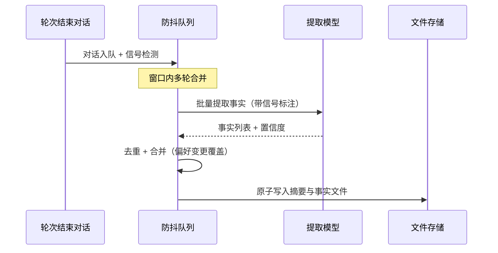
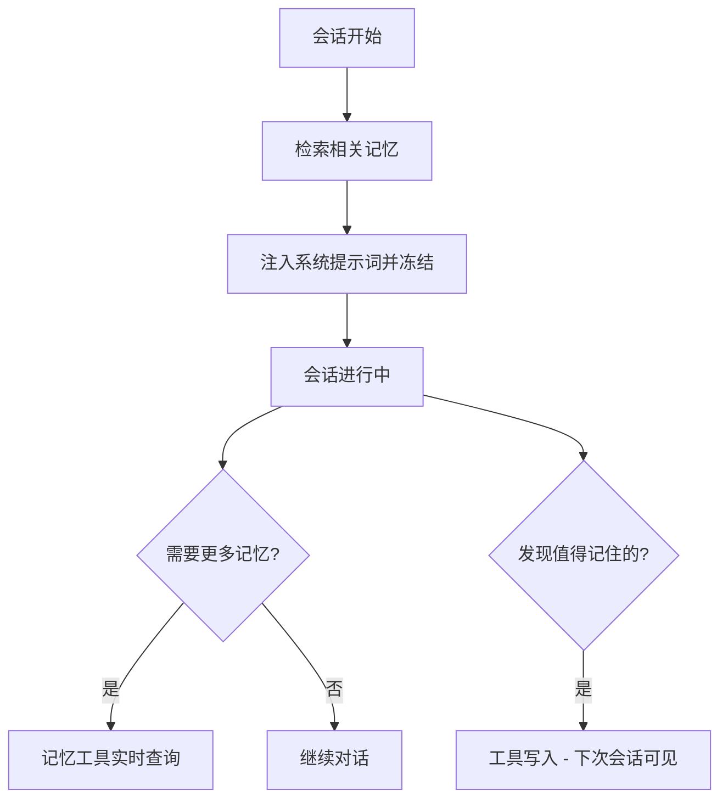
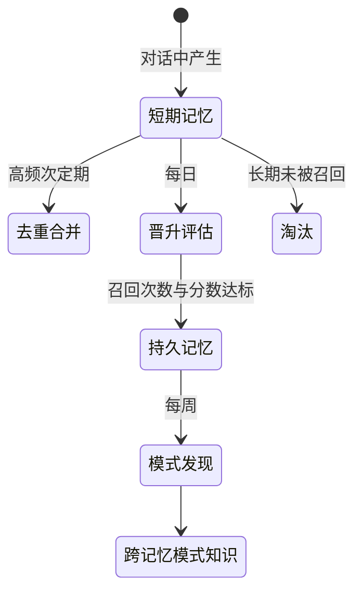
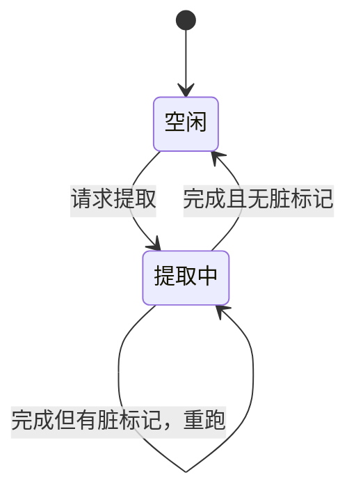

# 长期记忆

## 读前思考

- 大多数 Agent 在对话结束后就忘掉一切。要实现跨会话的长期记忆，你会怎么从对话中提取"值得记住"的信息？用规则匹配（"记住我喜欢 Python"）还是让模型做语义分析？前者只能捕获显式标记，后者每次都要额外花一次 API 调用。
- 记忆提取出来之后，下次用的时候怎么找到它？按关键词精确匹配还是按语义相似度？每轮都把全部记忆加载进上下文，还是只给模型一份目录、让它按需读全文？先预测一下：四个项目部署形态差异很大，谁的记忆库会大到必须定期整合，谁可以写了就放着不管？

## 核心问题

记忆系统解决的核心问题是：**如何从对话中自动提取持久化事实，跨会话精准检索并注入 Agent 上下文，同时处理去重、冲突、容量管理和 token 成本控制。**

先划清边界。Agent 的"记忆"分短期和长期两层：短期记忆是单次会话内的上下文窗口管理——对话太长装不下时怎么压缩、保留什么、摘要什么，属于上下文工程的范畴，见 [05-context](05-context.md)。本篇只讲长期记忆：跨会话的持久化——这次对话里"用户喜欢 Python"这个事实，下次会话怎么还知道。两层在"压缩可能删掉尚未提取的事实"这一个点上交汇，见下文"压缩与记忆的联动"。再划一条线：对话消息本身的持久化是会话存储而不是记忆，其存储结构与恢复机制见 [04-state](04-state.md)，本篇不涉及。

| 维度 | deer-flow | hermes-agent | openclaw | claudecode |
|------|-----------|--------------|----------|------------|
| 提取触发 | 防抖队列 + 信号检测 | 轮次后异步提取 | 对话中产生 + 定期整合 | 每轮后台提取 + 四类分类 |
| 存储后端 | 文件（摘要 + 事实文件） | 全文索引库默认，向量可选 | 全文 + 向量同库 / 外部记忆服务 | 文件（每条一个 .md） |
| 检索方式 | 全量加载 + token 预算截断 | 全文检索 + 工具实时查询 | 全文 + 向量混合排序 | 索引注入 + 按需读全文 |
| 注入形式 | 中间件每轮前注入 | 冻结快照 + 实时查询 | 检索后注入提示词 | 系统提示词只放索引 |
| 整合与过期 | 容量上限淘汰 | 无自动过期 | 三阶段定期整合 | 无自动过期 |

## 方案展示

### deer-flow：防抖批量提取 + 全文预算注入

deer-flow 的记忆提取不是逐轮立即处理，而是入队后经防抖窗口批量执行。入队前检测纠正信号（用户说"不对""我改主意了"）和强化信号（"对""没错"），信号传给提取模型——用户改口时覆盖旧事实而不是新建一条矛盾记忆。存储分两层：用户级摘要跨 agent 共享，每个 agent 的事实文件独立隔离。机制细节见 [deer-flow/06-memory](../deer-flow/06-memory.md)。

注入走全文模式：中间件在每轮对话前加载记忆并按 token 预算截断，重要类别（如纠正类）优先保配额。关键协调点：上下文压缩会把旧消息永久替换成摘要，所以 deer-flow 设计了"摘要前刷写"——压缩启动前，待提取对话绕过防抖窗口直接入队，确保被删内容先进记忆管道。

**为什么这么选**：防抖批处理压低提取模型调用频率，窗口内多轮合并为一次提取，成本降一个量级；信号检测让偏好变更被识别为"覆盖"而非"新增"。**牺牲了什么**：窗口内的提取延迟，以及持续的提取 API 成本。

### hermes-agent：冻结快照 + 实时查询 + 全文检索默认

hermes-agent 的记忆通过两条通道进入模型感知：会话开始时检索一批相关记忆注入系统提示词，整个会话期间冻结不变；模型还可以随时调记忆工具做实时搜索或写入。冻结的直接收益是 prompt cache 命中——系统提示词字节序列不变，前缀缓存就能持续省输入计费。检索默认走全文索引排序，向量后端作为可选项按需启用。机制细节见 [hermes-agent/06-memory](../hermes-agent/06-memory.md)。

提取在轮次结束后由辅助模型异步完成，不占主对话响应时间；写入是即时的，但本次会话写入的新记忆不会出现在冻结快照里，模型靠工具返回值感知最新状态，下次会话才进快照。

**为什么这么选**：冻结快照用会话内记忆更新的可见性换缓存命中率，对高频个人助手是显著的成本差异；全文检索零依赖、结果确定，个人助手的记忆规模（几百到几千条）下效果足够。**牺牲了什么**：会话内写入的记忆不进系统提示词（最终一致性）；查询措辞与记忆措辞不重合时，关键词检索找不到。

### openclaw：三阶段"做梦"整合 + 混合检索

openclaw TS 版的核心创新是模拟人类睡眠记忆整合的三阶段"做梦"机制：浅层整合高频次去重近期记忆，深层每日把召回次数多、相关度高的短期记忆晋升为持久记忆，REM 阶段每周发现跨记忆的关联模式。记忆库有晋升、合并、淘汰的完整生命周期，不是"写了就放着"的平面仓库。Python 版没有跨会话记忆，只靠单会话内的上下文压缩应对（压缩机制见 [05-context](05-context.md)）。机制细节见 [openclaw/06-memory](../openclaw/06-memory.md)。

检索用全文 + 向量双通道混合排序：全文通道处理精确匹配（函数名、错误码这类标识符），向量通道处理语义匹配（"部署问题"能匹配"上线失败"），两路结果按加权分数合并。所有记忆操作追加到事件日志，审计与回放用途见 [10-observability](10-observability.md)。

**为什么这么选**：平台级服务以月、年为单位运行，不整合的记忆库会变成检索噪声的来源，去重、晋升、淘汰是必需品；三阶段分离让每阶段有独立的调度频率和质量标准。混合检索解决"关键词精确但缺语义理解、向量有语义理解但丢精确关键词"的经典矛盾。**牺牲了什么**：整合持续消耗后台模型 token，且合并、晋升本身可能出错，成为新的风险面。

### claudecode：每轮后台提取 + 项目隔离 + 索引注入

claudecode 每轮对话结束后跑一次独立的后台模型调用，分析最近对话并按四类分类（用户画像 / 行为反馈 / 项目上下文 / 外部资源指针）提取记忆。与正面清单同等重要的是"什么不该保存"的负面清单：读代码就能知道的内容、有权威来源的历史记录、项目规则文件已有的内容、临时任务状态——大多数轮次返回空列表是常态。并发用提取合并机制解决：同一时刻只允许一个提取任务运行，运行期间新轮次只打脏标记，完成后按标记决定是否重跑。机制细节见 [claudecode/06-memory](../claudecode/06-memory.md)。

记忆按项目隔离（工作目录路径哈希出独立目录），每条记忆一个文件；系统提示词只注入索引文件，模型判断某条记忆相关时再用工具读全文。索引在系统提示词中的位置与组装时机见 [05-context](05-context.md)。

**为什么这么选**：每轮提取贴合 CLI 短会话形态——错过一轮可能就错过唯一的提取机会；索引注入把 token 预算决策推迟到模型判断"这条记忆和当前任务相关"之后。**牺牲了什么**：每轮一次 API 调用是四家中最高的提取频率；没有过期机制，长期使用索引可能膨胀。

## 横向对比

四个项目在长期记忆上的分岔集中在四个岔路口，每个选择都能追溯到项目的运行形态假设。

**岔路口一：提取时机——每轮分析还是攒批处理？** 因为对提取成本与新鲜度的权衡不同，在"何时触发提取"上分岔为逐轮、防抖与模型主动三类。claudecode 每轮后台提取，成本最高但记忆最新鲜——CLI 会话短，错过一轮可能就错过唯一机会。deer-flow 用防抖窗口把多轮合并为一次提取——企业场景对话密集，逐轮提取的开销乘以用户数不可接受。hermes-agent 与 openclaw 把提取时机部分交给模型自己（工具主动写入），后台只做低频整合——个人助手场景下模型"觉得值得记"的判断本身就是有效过滤器。异步提取的执行时间不确定，还要解决并发：提取合并（同时只跑一个、后到请求并入标记）适合模型响应时长波动大的场景，固定时长防抖适合"提取快、请求密"的场景。

**岔路口二：注入形式——全文注入、索引注入还是冻结快照？** 分岔的根源是"上下文预算给记忆留多少"以及"愿不愿用一致性换缓存"。deer-flow 全文注入并按预算截断，模型无需额外动作就能看到记忆，代价是每轮都占预算。claudecode 只注入索引，把全文读取推迟到模型判断相关之后，代价是多一次工具往返。hermes-agent 冻结快照换 prompt cache 命中，牺牲会话内的记忆可见性。判断标准是"记忆条数 × 单条长度 × 会话轮次"：乘积小可以全文注入，乘积大必须索引化或快照化。

**岔路口三：检索方式——本质上是"记忆库怎么做 RAG"的问题。** 因为记忆库规模与查询形态不同，在检索通道上分岔为全文、混合与免检索。全文关键词检索（hermes-agent 默认、openclaw 全文通道）零依赖、结果确定、对精确标识符命中率高，短板是查询措辞与记忆措辞不重合时失效；向量检索补上语义理解，代价是嵌入模型依赖和精确关键词的丢失；openclaw TS 版双通道并行、加权合并，hermes-agent 把向量留作可选后端。claudecode 干脆不建检索引擎——索引本身就是检索入口，由模型决定读哪条，记忆条数少时省掉整套检索设施；deer-flow 是另一个极端：不检索、全量加载、预算截断，等于假设记忆库永远小到装得下。判断标准是"记忆规模 × 查询模糊度"：规模小且查询精确可以全文甚至免检索，规模大且查询模糊必须引入向量。

**岔路口四：整合深度——写了就放着还是持续加工？** 因为预期运行时长不同，在记忆库生命周期上分岔为平面仓库与分层整合。CLI 工具的记忆库以周为单位增长，膨胀之前用户可能已经换项目，所以 claudecode、hermes-agent 不做整合，deer-flow 只加容量上限兜底。openclaw TS 版以月、年为单位运行，去重、晋升、淘汰是维持检索质量的必需品。整合的代价是持续的后台模型消耗和"整合本身出错"的新风险面。

| 岔路口 | deer-flow | hermes-agent | openclaw | claudecode | 分岔原因 |
|--------|-----------|--------------|----------|------------|----------|
| 提取并发处理 | 防抖窗口合并 | 事务序列化写入 | 定时任务错峰 | 合并状态机 + 脏标记 | 提取执行时间的确定性 |
| 与 prompt cache 的关系 | 注入用户消息位保护前缀 | 冻结快照换命中 | 检索后常规注入 | 索引稳定、全文按需 | 注入量 × 会话频率 |
| 检索通道构成 | 免检索全量加载 | 全文默认、向量可选 | 全文 + 向量混合 | 索引 + 按需读 | 记忆规模 × 查询模糊度 |
| 记忆库生命周期终点 | 容量上限淘汰 | 自然增长 | 整合晋升 + 未晋升淘汰 | 永不过期 | 预期运行时长 |

## 压缩与记忆的联动

长期记忆的原料是对话消息，而上下文压缩会把旧消息替换成摘要、原文永久消失——如果压缩发生在提取之前，尚未提取的事实就永远丢了。这是短期与长期记忆唯一的强耦合点（压缩机制本身见 [05-context](05-context.md)），四个项目给出了四种答案。

deer-flow 是唯一做显式联动的：压缩启动前先执行"摘要前刷写"，把待提取对话绕过防抖窗口立即送入记忆队列。更细的一层是子代理的压缩链特意跳过这个刷写——子代理的内部轮次不该进入用户的长期记忆，只有主链对话才值得持久化。其他三家不做联动各有理由：claudecode 的提取每轮异步跑，时序上天然先于压缩（压缩是低频事件）；openclaw TS 版的记忆整合走独立定时任务，数据源不依赖会话消息列表；hermes-agent 的记忆靠模型主动调工具写入，模型在压缩前有机会自己保存。四种答案的共同点是：**都要保证"提取读到消息"发生在"压缩删除消息"之前**，区别只在这个顺序靠显式钩子保证、靠频率差保证、还是靠数据源解耦保证。联动的另一面是 hermes-agent 的冻结快照：压缩替换的是对话消息，快照不受影响，但模型写入记忆后"从对话历史中回忆"的兜底路径可能被压缩抹掉——冻结与缓存的权衡细节见 [05-context](05-context.md)。

## 面试要点

**1. hermes-agent 的冻结快照（性能优先）和 deer-flow 的每轮重新加载（一致性优先），在什么场景下各自占优？**

参考答案方向：冻结快照在高频短对话场景占优——每次对话只有几轮，前缀缓存命中节省的输入计费是显著的成本差异，且短对话中记忆变化的概率低。每轮重新加载在长对话且记忆频繁写入的场景占优——如果 Agent 在会话早期写入了一条关键记忆，几十轮后需要引用它，冻结快照中看不到（本次会话写入的不进快照），每轮重新加载能看到。判断标准是"会话平均轮次 × 记忆写入频率"：乘积小用冻结，乘积大用实时。

**2. openclaw 三阶段"做梦"的调度频率如果设错了会怎样？怎么确定正确的频率？**

参考答案方向：去重阶段频率太低则重复记忆堆积、检索冗余，太高则浪费 token（大多数时候没有新重复）；晋升阶段频率太高则召回数据还没攒够就被评估，可能把噪声提升为持久记忆，太低则有价值的记忆迟迟不固化；模式阶段频率太高则样本不足、发现不可靠，太低则跨记忆关联迟迟不被发现。判断标准是"记忆产生速率 × 召回数据积累速度"：产生越快去重要越勤，召回越稀疏晋升评估要越缓。工程上的确定方法是监控记忆库健康度指标（重复率、召回命中率）并据此调整——openclaw 在健康度跌破阈值时自动触发恢复，就是这种自适应的雏形。

**3. claudecode 的记忆没有过期机制，长期使用后索引膨胀怎么办？hermes-agent 和 openclaw 的方案哪个更适合借鉴？**

参考答案方向：openclaw 的整合淘汰更优雅——去重合并冗余、只晋升高价值记忆，未被晋升的短期记忆自然淘汰；但它需要常驻后台调度设施，CLI 工具没有常驻进程，照搬不现实。更贴合 claudecode 形态的是两个轻量机制：容量上限（超出按最后访问时间淘汰最旧的，deer-flow 的做法）和召回计数（每次记忆被引用时计数，长期未引用的降级或删除，openclaw 晋升逻辑的反向应用）。判断标准是"有无常驻后台 × 记忆增长速率"：有后台可以做主动整合，没后台只能在读写时顺带做惰性淘汰。
