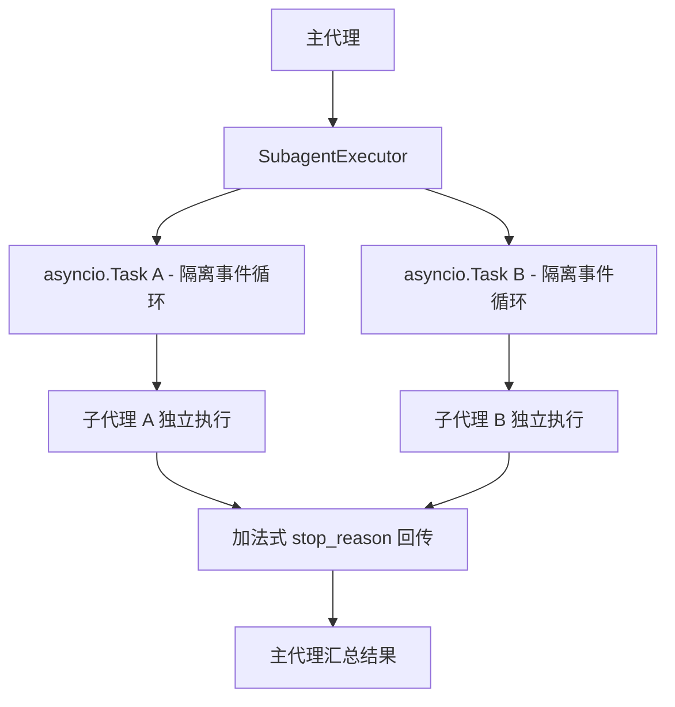
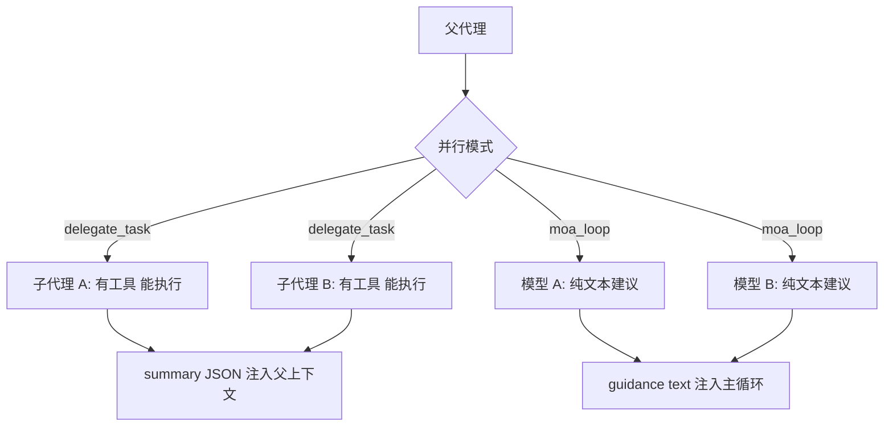
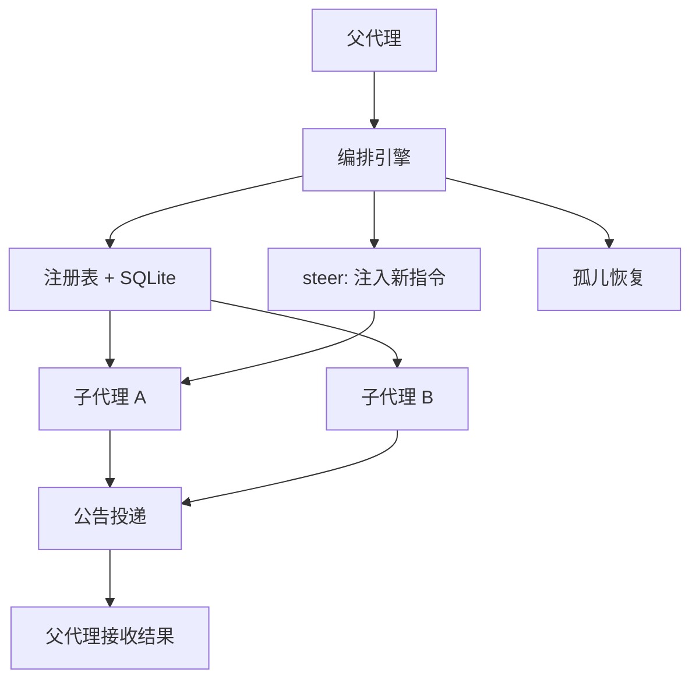
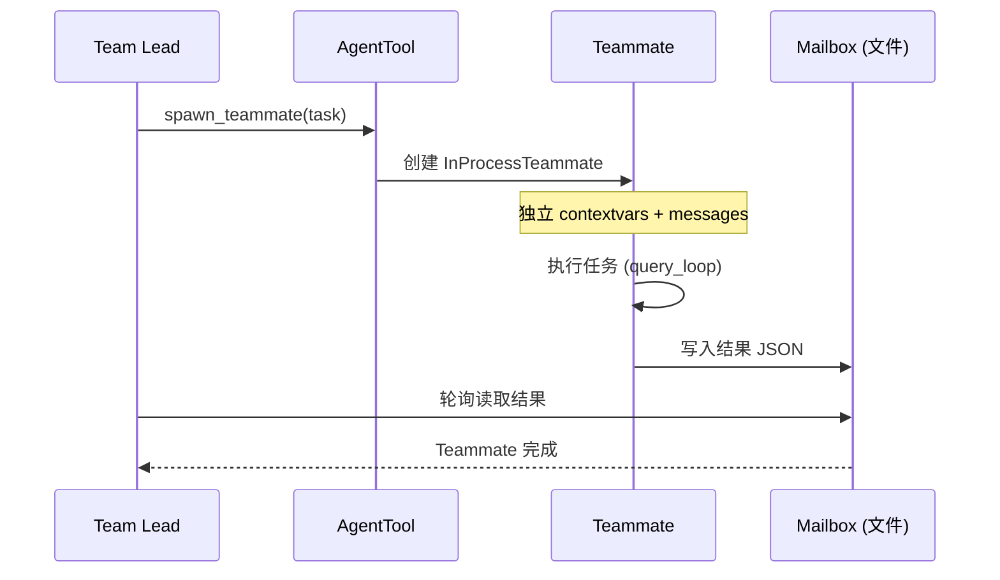
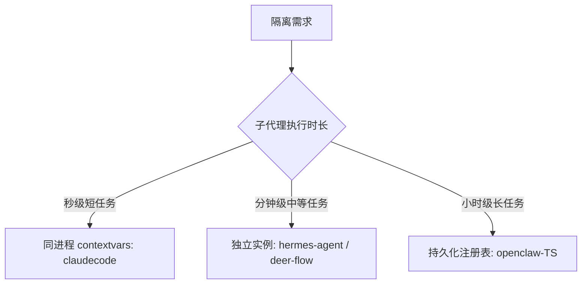

# 子代理/编排

## 读前思考

- 一个复杂任务需要拆分成子任务并行执行。子代理应该和父代理共享上下文（知道之前聊了什么）还是完全隔离（只看到任务描述）？共享有风险（子代理的操作可能污染父上下文），隔离有代价（子代理缺少背景信息可能做出错误决策）。
- 子代理能不能再生成自己的子代理？如果不限制嵌套深度，一个递归 bug 就能产生指数级的资源消耗。四个项目对嵌套深度的限制从"不允许"到"配置化"不等——这个选择背后假设了什么？

## 核心问题

子代理/编排解决的核心问题是：**如何让 Agent 安全地生成和管理多个并行执行的子 Agent，保证身份隔离、工具安全、结果可靠回传、资源不泄漏、嵌套不失控。**

| 维度 | deer-flow | hermes-agent | openclaw-TS | claudecode |
|------|-----------|--------------|-------------|------------|
| 编排模式 | SubagentExecutor 隔离执行 | delegate_task + MoA 双模式 | 完整编排引擎（注册表 + 持久化） | contextvars 同进程隔离 |
| 隔离策略 | 独立事件循环 + 上下文 | 独立 conversation/session/terminal | 注册表 + SQLite 持久化 | contextvars + 独立 messages |
| 并行机制 | asyncio.Task 并行 | ThreadPoolExecutor 扇出 | maxConcurrent 控制 | asyncio.Task + Team |
| 结果回传 | 加法式 stop_reason 状态合约 | summary JSON 注入父上下文 | 公告投递 + 重试 | TeammateMailbox 文件 JSON |
| 嵌套控制 | SubagentLimitMiddleware | 深度限制 | 深度限制 + 配置化 | AgentTool 排除防递归 |
| 独特能力 | 三层配置解析 | MoA 多模型咨询 | 转向（steer）运行中子代理 | Coordinator 行为注入 |

## 方案展示

### deer-flow：隔离事件循环 + 加法式状态合约

deer-flow 的每个子代理运行在独立的 asyncio.Task 中，有自己的事件循环和上下文。子代理看不到主代理或其他子代理的消息历史，只能通过任务描述获取信息。三层配置解析（全局默认 → agent 级覆盖 → 运行时参数）让不同子代理可以有不同的模型、工具集和 token 预算。

状态合约用加法式 stop_reason 表达：不新增状态枚举，而是通过组合（如 "tool_calls+error"）表达"部分完成 + 失败原因"。SubagentLimitMiddleware 在中间件链中限制并发子代理数量。

**为什么这么选**：隔离事件循环确保子代理的异常不会传播到主代理（一个子代理崩溃不影响其他）。加法式状态合约避免了状态枚举爆炸——N 种完成状态 × M 种失败原因不需要 N×M 个枚举值。代价是子代理完全看不到父上下文，对于需要背景信息的任务需要在任务描述中显式传递。

### hermes-agent：delegate_task + MoA 双模式

hermes-agent 有两种并行机制：delegate_task（子代理委派——子代理是 acting agent，有工具、能执行、独立完成任务）和 moa_loop（Mixture of Agents——多个模型是 advisory-only，纯文本分析，不能执行）。两者都用 ThreadPoolExecutor 并行扇出，但结果使用方式完全不同：delegate_task 的结果是"任务完成了，这是产出"，MoA 的结果是"多个模型的建议，主代理自己决策"。

子代理创建独立的 AIAgent 实例，继承 toolsets（取交集）和 credentials，但有独立的 conversation/session/terminal。per-task 超时防止子代理无限执行。

**为什么这么选**：delegate_task 适合"可独立完成的子任务"（如搜索代码、写文件），MoA 适合"需要多视角分析的决策"（如代码审查、方案评估）。分离两种模式避免了"用子代理做咨询"的过度开销（MoA 不需要工具、session、terminal）。代价是两套并行机制增加了维护成本。

### openclaw-TS：完整编排引擎 + 转向能力

openclaw TS 版有 12+ 文件组成的编排引擎：注册表管理子代理生命周期，SQLite 持久化确保进程重启后子代理状态不丢失，孤儿恢复机制处理父代理崩溃后的遗留子代理。maxConcurrent 控制并发数，深度限制防止嵌套失控。

独特能力是"转向"（steer）：向运行中的子代理注入新指令，改变其执行方向。结果通过公告投递（announcement）回传，支持重试。

Python 版只有基础的 spawn + 等待，无并发控制、无持久化、无转向。

**为什么这么选**：面向生产环境的多 channel 部署，子代理可能运行数分钟甚至数小时，进程重启不能丢失状态。转向能力让父代理在子代理执行过程中根据新信息调整方向（如"用户改了需求，停止当前方案"）。代价是 12+ 文件的复杂度，以及 SQLite 持久化引入的 I/O 开销。

### claudecode：contextvars 同进程隔离 + 文件邮箱

claudecode 用 contextvars 做同进程内的身份隔离（InProcessTeammate）——每个子代理在同一个事件循环中运行，但通过 contextvars 持有独立的身份和 messages 列表。工具安全通过排除 AgentTool 实现（子代理的 registry 不含 AgentTool，防止无限递归创建子代理）。

消息传递用文件系统 JSON（TeammateMailbox）：leader 和 teammate 通过读写共享目录下的 JSON 文件通信。Coordinator 行为通过 system prompt 注入定义（"你是团队领导，负责分配任务并汇总结果"）。

**为什么这么选**：同进程避免了 IPC 开销和进程管理复杂度，contextvars 让隔离在 Python asyncio 中自然实现。文件邮箱虽然慢（磁盘 I/O），但极其简单且可调试（直接 cat 文件就能看到消息）。排除 AgentTool 是最简单的防递归方案。代价是文件邮箱的延迟（毫秒级 vs 内存消息的微秒级），以及同进程中一个子代理的未捕获异常可能影响事件循环。

## 横向对比

四个项目在子代理编排上的核心岔路口是**"隔离程度与通信便利性的权衡"**：

| 岔路口 | deer-flow | hermes-agent | openclaw-TS | claudecode |
|--------|-----------|--------------|-------------|------------|
| 隔离级别 | 事件循环级 | 实例级（独立 AIAgent） | 进程级（注册表管理） | contextvars 级 |
| 通信方式 | 状态合约回传 | summary JSON | 公告投递 + 重试 | 文件邮箱 |
| 嵌套控制 | 中间件限制 | 深度限制 | 配置化深度 | AgentTool 排除 |
| 持久化 | 无 | 无 | SQLite | 无 |
| 运行时转向 | 无 | 无 | steer 注入 | 无 |

**子代理的 token 经济学**是这个模块存在的第一性理由，也是四个项目隔离设计的共同底层动机。一个探索性任务（"在整个代码库里找出所有认证相关的实现"）可能要读几十个文件、跑十几次搜索，中间产生海量的工具输出——如果这些全塞进主对话，主上下文瞬间被探索垃圾填满。子代理的价值在于：父代理只付出"任务描述"这一点输入 token 和"最终摘要"这一点输出 token，全部探索长尾都消耗在子代理自己的、用完即弃的上下文里。这就是为什么四个项目的子代理几乎都不共享父的消息历史——共享不仅有污染风险，更违背了"把长尾消耗隔离出去"的初衷。回传形式的分岔正是从这里长出来的：claudecode 和 hermes 回传自然语言摘要（子代理的最后输出全文或总结），deer-flow 回传结构化状态合约（状态 + 结果摘要 + 停止原因 + token 用量，还维护一个"委派账本"记录哪些任务已派出、结果如何，避免父代理重复委派），openclaw-TS 通过公告机制广播。回传自然语言便于父代理直接理解，回传结构化数据便于父代理程序化决策（比如根据停止原因判断该重试还是该换方案）——这个岔路口的判断标准是"父代理消费结果的方式是靠模型阅读还是靠代码判断"。

**子代理的压缩与预算继承**是一个容易被忽略但很考验设计的点。子代理会不会继承父的压缩配置？答案几乎一致是"不继承"——claudecode 的子代理干脆不开压缩（假设单个子任务的上下文够短），deer-flow 的子代理压缩链特意跳过记忆刷写（子代理的中间轮次不该进入用户长期记忆，见 06-memory 与 13-context-compaction）。并发预算则各有硬限制防资源失控：hermes 限制同时运行的子代理数量并默认只允许一层嵌套（父到子，孙代理默认拒绝），deer-flow 限制单次 run 能派出的子代理总数，claudecode 靠子代理的工具集里排除掉"再生成子代理"的工具来物理防递归。这些限制共同回答一个问题：递归委派的 bug 一旦发生就是指数级资源爆炸，必须有一道物理闸门。

**MoA vs 子代理委派**是 hermes-agent 独有的设计区分。其他项目的子代理都是"acting agent"（有工具、能执行），hermes-agent 额外提供了"advisory-only"的 MoA 模式（多模型纯文本分析）。这反映了一个洞察：不是所有并行都需要执行能力——"让三个模型同时分析这段代码的安全风险"不需要工具，只需要思考。

**持久化需求与执行时长正相关**。claudecode 的子代理执行通常几秒到几十秒（CLI 场景），不需要持久化。openclaw-TS 的子代理可能运行数小时（生产环境复杂任务），进程重启不能丢失状态，所以 SQLite 持久化 + 孤儿恢复是必要的。

## 面试要点

**1. 子代理完全隔离上下文（deer-flow/claudecode）和继承父上下文（hermes-agent 部分继承），在什么场景下各自更合适？**

参考答案方向：完全隔离适合"可独立描述的子任务"——任务描述本身包含所有必要信息（如"搜索项目中所有 TODO 并列出"），不需要知道之前聊了什么。继承上下文适合"需要背景信息的子任务"——如"继续我们刚才讨论的方案，实现第二步"，子代理需要知道"刚才讨论的方案"是什么。完全隔离的风险是任务描述遗漏关键背景导致子代理做出错误决策；继承的风险是子代理看到无关信息后被干扰（如父上下文中的另一个话题影响了子代理的判断）。

**2. openclaw-TS 的"转向"（steer）能力解决了什么问题？如果去掉它，用户体验会怎么退化？**

参考答案方向：转向解决"子代理执行过程中需求变更"的问题。没有转向时，用户改了需求后只能等子代理完成（可能几分钟后产出一个已不需要的结果），或者强制终止再重新创建（丢失已完成的工作）。有转向时，父代理可以向运行中的子代理注入"停止当前方案，改为 X"，子代理在下一个检查点读取新指令并调整方向。代价是子代理需要在执行过程中定期检查是否有新指令（轮询开销），且转向后的状态一致性难以保证（已完成的部分可能与新方向矛盾）。

**3. claudecode 用文件 JSON 做消息传递（TeammateMailbox），这个方案在什么规模下会成为瓶颈？更好的替代是什么？**

参考答案方向：文件 I/O 的延迟约 1-10ms（取决于磁盘类型），对于秒级任务（子代理执行 5 秒，通信 3 次）开销可忽略。瓶颈出现在：(a) 高频通信（子代理每秒需要向 leader 报告进度），文件 I/O 成为延迟主因；(b) 大量并发子代理（10+ 个 teammate 同时读写邮箱目录），文件系统锁竞争。替代方案：同进程内用 asyncio.Queue（微秒级延迟，但要求同一事件循环）；跨进程用 Unix domain socket 或 Redis pub/sub。claudecode 选择文件邮箱是因为它的子代理数量少（通常 2-3 个）、通信频率低（任务开始和结束各一次），文件方案的简单性和可调试性收益大于性能损失。

**4. 子代理机制的第一性价值是"隔离探索的 token 消耗"。如果一个任务本身不产生大量中间输出（比如只调一次工具就有答案），还值得用子代理吗？父代理该怎么消费子代理的结果？**

参考答案方向：不值得。子代理的成本是一整套独立上下文的启动开销（system prompt、工具 schema 都要重新计入子代理的输入 token）加一次结果回传的往返；只有当"被隔离掉的探索长尾" 远大于 "这套固定开销"时才划算。单次工具调用就能出答案的任务，父代理直接调工具更省——强行套子代理反而多付一份 system prompt 的 token。结果消费方式取决于回传形式：自然语言摘要适合父代理"读懂后继续推理"的场景，结构化合约（状态 + 停止原因 + 用量）适合父代理"程序化判断下一步"的场景（比如看到停止原因是"预算耗尽且有部分结果"，父代理可以决定复用部分结果还是加预算重试）。判断标准是"隔离收益 ÷ 启动开销"以及"父代理是靠模型阅读还是靠代码分支消费结果"。

