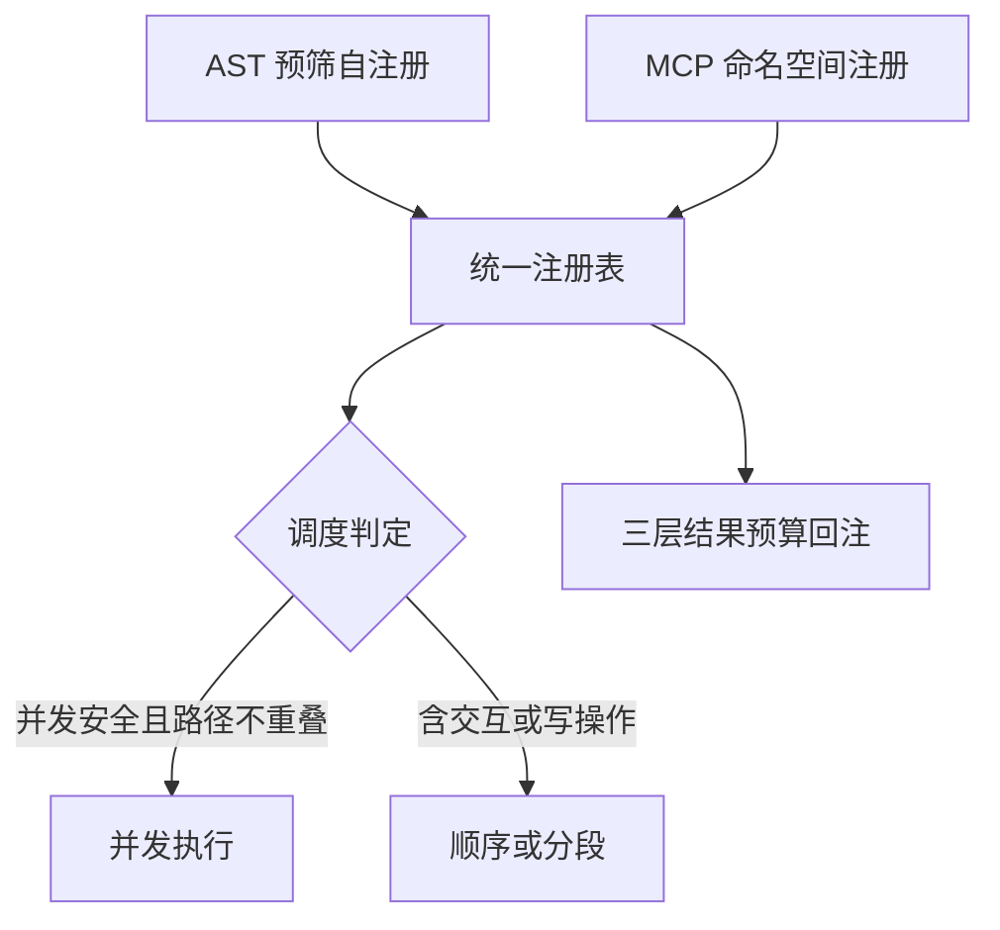
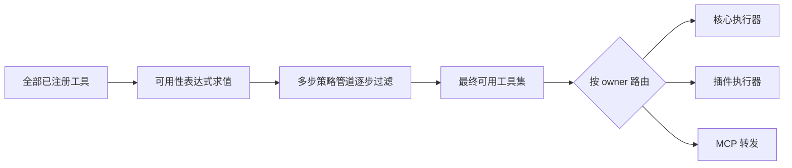
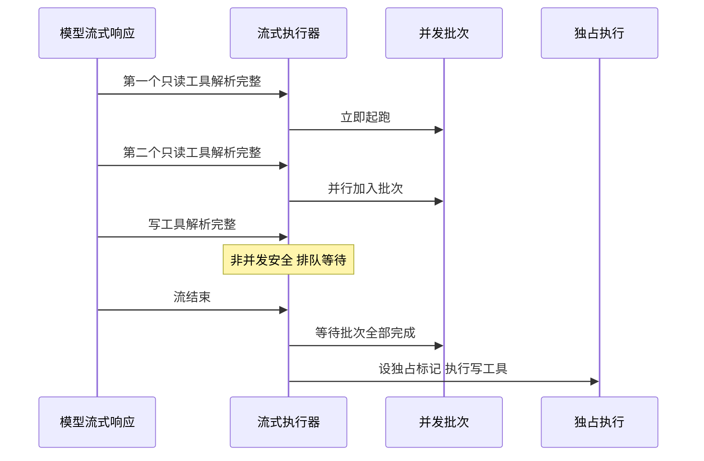
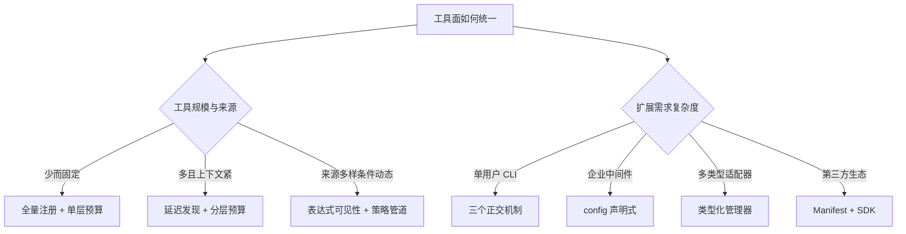

# 工具与扩展生态

## 读前思考

- 一个 Agent 的"工具面"其实由四个环节拼成：注册（工具怎么进入系统）、发现（模型怎么知道有这些工具）、执行（调用怎么被安全地跑完并把结果塞回窗口）、扩展（第三方怎么加新能力）。这四个环节的边界应该画在哪里？注册表要不要感知工具来自本地还是远程？执行层要不要感知工具是代码插件还是 Markdown 指令？
- 工具之外还有 MCP（标准化的远程工具协议）、技能（Markdown 写的程序性指令）、插件（带生命周期的代码模块）。它们和原生工具是共用一套注册与调度，还是各建一套？如果你来划分，哪几个环节必须统一，哪几个环节允许各走各的？

## 核心问题

**工具与扩展生态要回答的是：如何在注册、发现、执行、扩展四个环节上画出统一或分离的边界，让 LLM 在正确的时机看到正确的能力，并把执行结果与第三方扩展控制在上下文窗口和信任边界可承受的范围内。**

四个项目在"工具面怎么统一"上给出了从极简到完整生态的不同答案。安装与执行层面的安全机制（MCP 防护、技能扫描、插件扫描、Hooks 拦截）统一见 09-guardrails.md，本篇只讨论工具面的组织方式；技能内容何时进入提示词、占多少 token，见 05-context.md。

| 维度 | deer-flow | hermes-agent | openclaw | claudecode |
|------|-----------|--------------|----------|------------|
| 工具注册 | 多源聚合 + 优先级去重 | 自注册进统一注册表 | 全量注册（Python 版）/ 表达式声明（TS 版） | ABC + 注册表，运行时动态组装 |
| 模型可见性 | 延迟目录，搜索后提升 | 启动时全量可见 | 静态 Profile / 运行时求值 | 启动时全量可见 |
| MCP 角色 | 客户端，会话池 | 双向，后台事件循环 | TS 双向 + Bridge / Python 版无 | 客户端，仅 stdio |
| 技能触发权 | 用户 + 模型 | 用户 + Agent | 模型自主读取 | 仅用户 |
| 扩展的正式程度 | config 声明式中间件 | 类型化插件管理器 | Manifest + SDK 生态 | 三个正交极简机制，无插件系统 |

## 方案展示

### deer-flow：多源聚合 + 延迟发现 + 会话池

deer-flow 的工具面围绕"token 预算"组织：工具来自 config 声明、内置、MCP、ACP 四个源头，按优先级去重后，MCP 工具不直接绑定 schema，只暴露名称列表，模型需要时通过一次搜索换取完整 schema；高频工具可由路由中间件按关键词自动提升，省掉搜索往返。MCP 连接用 Owner Task 会话池管理，stdio 会话由专属异步任务持有全生命周期。技能激活后其 allowed-tools 声明以中间件过滤工具列表，这是依赖模型指令遵循的软约束而非硬隔离，对其防护能力的讨论留本篇下文。机制细节见 docs/deer-flow/07-tools.md。

**为什么这么选**：企业部署里 MCP 工具数量多而上下文窗口有限，把固定 schema 开销换成按需加载是明确的收益；代价是搜索往返带来的额外延迟，以及技能工具策略可被绕过的软边界。

### hermes-agent：统一注册表贯穿四个环节

hermes-agent 的答案是"一切进同一个注册表"：内置工具靠 AST 静态扫描预筛后自注册，MCP 工具以命名空间前缀注册进同一张表，Agent 循环对工具来源完全无感知。结果大小用三层预算（工具自截断、单条上限落盘、整轮总量兜底）兜住上下文。技能走渐进式披露：索引只含名称和短描述，激活靠斜杠命令或 Agent 主动查看，生命周期由后台 Curator 按使用遥测自动归档。插件则是四来源发现、五种类型的类型化管理。安装扫描机制见 09-guardrails.md。机制细节见 docs/hermes-agent/07-tools.md。

**为什么这么选**：个人全能助手意味着 100+ 异构工具和长期运行的连接，零侵入的统一注册表让新增任何来源都不改循环代码；代价是硬编码并发白名单的维护负担和跨线程调度的复杂度。

### openclaw：从静态 Profile 到动态策略管道

openclaw 的两种实现正好站在岔路口两侧。Python 版工具少，用静态 Profile 按消息来源一行选定工具面。TS 版工具来自核心、140+ 插件、MCP、通道，每个工具声明一组可用性条件表达式（认证状态、配置开关、插件启用状态），运行时求值决定可见性，执行前再过多步策略管道；MCP 双向支持，服务器端用 Bridge 收敛连接与事件管理，选择拉模式让外部客户端自己控制消费节奏。技能来自五个位置按优先级合并，frontmatter 声明激活条件。执行路由与沙箱过滤见 08-runtime.md，准入审批面见 09-guardrails.md。机制细节见 docs/openclaw/07-tools.md。

**为什么这么选**：静态分组在工具来源多样、可用条件动态时会组合爆炸，表达式求值把"每个工具何时可见"变成可声明、可审计的数据；代价是调试"工具该出现却没出现"需要追踪整条求值链。

### claudecode：一个 Registry 贯穿一切，扩展靠三个正交机制

claudecode 用抽象基类加注册表做定义与发现：工具集在运行时按角色动态组装（子代理排除递归工具、后台代理排除交互工具、MCP 工具连上即注册），主循环只按名字查表。执行用批次分组加流式提前：并发安全工具合批并行，非并发安全工具独占执行，流式返回过程中工具参数一解析完就提前起跑。MCP 用代理模式塞进同一个注册表，仅支持 stdio，无重连。扩展维度上它没有插件系统——Hooks、Skills、MCP 三个正交机制各解决一个维度，不构成统一的插件框架。机制细节见 docs/claudecode/07-tools.md。

**为什么这么选**：还原 Claude Code 内核的定位下，"能用且路径统一"比完备更重要——MCP 工具与本地工具复用 hooks、权限、并发限制的全部执行路径，零额外代码；代价是无重连、无安装扫描、无生命周期管理。

## 横向对比

四个来源合并后，工具面的分岔集中在五个环节上，每个环节的因果如下。

**注册与发现**：因为工具规模与来源多样性不同，所以在"可见性何时决定"上分岔为启动时静态（claudecode、openclaw Python 版）、启动时自检（hermes-agent 的可用性检查）与运行时动态（deer-flow 搜索提升、openclaw TS 表达式求值）。工具少时全量注册最简单；工具多而上下文紧时，延迟发现用一轮往返换 schema 空间；可用条件随运行时状态变化时，只有表达式求值能表达。

**执行编排**：因为对工具作者自律程度的假设不同，所以在结果预算上分岔为精细分层（hermes-agent 假设作者可能不截断，三层兜底）与单层硬限制（claudecode 假设内置作者自觉，只做最后防线）。并发语义同出一源：一条 API 硬规则要求每个工具调用必须有配对的结果消息，所以所有项目都采用"工具错误转成带错误标记的结果回填"而非抛异常中断循环——配对关系永不缺位，模型看到错误自行改路。

**MCP 接入**：因为部署生命周期不同，所以在连接管理投入上分岔为无管理（claudecode 短会话）、会话池淘汰重建（deer-flow）、后台循环加退避重连加永久失败驻留（hermes-agent）、Bridge 收敛（openclaw）。所有项目都把 MCP 工具注册进统一工具面，差别只在 deer-flow 额外套了一层延迟目录做 token 优化。连接断开后未注销的工具会变成"僵尸工具"——模型反复调用直到轮次预算耗尽，hermes-agent 的解法是断开即注销。

**技能**：因为技能来源的可信度不同，所以在触发权上分岔为仅用户（claudecode）、用户加模型（deer-flow、hermes-agent）、模型自主（openclaw）。信任程度越高，用户认知负担越低，误触发风险越高。生命周期管理是 hermes-agent 独有的深度设计——长期助手会积累大量技能，不管理就积累成无人维护的存量；其他项目的技能是"写了就在那里"的静态存在。

**插件**：因为扩展规模与分发需求不同，所以在正式程度上分岔为 shell/Markdown/JSON 三机制（claudecode）、config 声明式（deer-flow）、类型化管理器（hermes-agent）、Manifest 加 SDK（openclaw）。隔离手段与信任模型正相关，权限审批与扫描机制见 09-guardrails.md。

| 岔路口 | deer-flow | hermes-agent | openclaw | claudecode |
|--------|-----------|--------------|----------|------------|
| 可见性决定时机 | 运行时搜索提升 | 启动时自检 | 静态 Profile / 运行时表达式 | 启动时组装 |
| 结果预算 | 中间件处理 | 三层递进 | 智能截断 | 单层硬限制 |
| MCP 断线行为 | 池淘汰重建 | 退避重连 + 驻留自探测 | 超时重连 | 变僵尸需重启 |
| 技能触发权 | 用户 + 模型 | 用户 + Agent | 模型自主 | 仅用户 |
| 扩展正式程度 | 声明式注入 | 类型化插件 | SDK 生态 | 无插件系统 |

**allowed-tools 是软约束**。deer-flow 的技能激活后以 allowed-tools 并集过滤工具列表，官方定位是"尽力而为的行为限定，不是硬安全边界"：它能挡住"技能指示模型调用未授权工具"（模型根本看不到该工具），但挡不住模型通过被允许的工具（如文件读取）加载另一个技能的内容或外泄数据。真正的硬隔离需要执行环境级的控制，这超出了 prompt 级策略的能力，相关防护设计见 09-guardrails.md。这个讨论同样适用于其他项目的技能系统：凡是以指令约束行为的机制，防护上限都是模型的指令遵循能力。

## 面试要点

**1. 延迟工具发现多出的那一轮模型往返，在什么条件下值得？如果模型经常需要 5 个以上的工具呢？**

值得的条件是全量 schema 的 token 成本高于搜索往返成本乘以预期搜索次数。几十上百个工具全量绑定可能占去小窗口模型大半空间，而名称列表加几次搜索的成本小一个数量级。但如果一次任务频繁需要大量工具，搜索往返会累积成可观的延迟与 token，此时应做"热工具预加载"——高频工具直接绑定，低频走延迟发现，deer-flow 的关键词自动提升就是这个思路的雏形。判断标准是"工具总数 × 单个 schema 成本"与"搜索往返成本 × 预期搜索次数"的对比。

**2. 为什么所有项目都选择"工具错误返回结果"而不是"抛异常中断循环"？超长输出截断后模型想要完整内容怎么办？**

协议层面，每个工具调用必须有配对的结果消息，抛异常会导致配对缺失、下一次请求被 API 直接拒绝；产品层面，工具失败是 Agent 的常态，模型看到错误信息往往能自我修正，把错误喂回去比中断循环的恢复能力强。截断找回的做法是把截断做成可寻址的：超限结果落盘、内联只留预览和路径，模型需要完整内容时用文件读取工具回读；简单场景则只标注已截断，赌被截掉的部分不重要。判断标准是"截断内容被后续引用的概率"——搜索结果头部最相关，编译日志的错误常在尾部，后者必须保留回读通道。

**3. hermes-agent 的后台循环重连和 claudecode 的无重连需重启，体验差多少？什么场景下后者可接受？**

差在长时间运行中的瞬态故障恢复：网络抖动断开几秒，前者自动重连用户无感知，后者的工具变成僵尸，需要重启整个程序。后者可接受的场景是短会话、本地 stdio 子进程极稳定、CLI 重启成本低。统一注册表在服务器中途断开时的共同表现就是僵尸工具，改进方向是在注册表层增加生命周期钩子——连接失效时自动把工具标记为不可用并从 schema 列表移除。判断标准是"会话预期持续时间 × 服务器故障概率"，乘积很小时重连机制的复杂度不值得投入。

**4. 技能的渐进式披露（名称加短描述索引）和向量检索，哪个更适合技能发现？什么规模下应该切换？**

短索引的优势是零依赖、零延迟、确定性——模型看到的就是全部，不存在检索不到的问题；向量检索的优势是语义匹配更准，但需要嵌入模型和向量库，对本机 CLI 依赖太重。切换时机是索引本身占到上下文可观比例（数百个技能），或描述太短无法区分功能相似的技能。在此之前，索引方案的简单性收益大于检索的精确性收益。触发权的分配（仅用户还是模型自主）则是独立维度，取决于误触发风险与用户认知负担的权衡。判断标准是"技能数量 × 索引单价占窗口比例"与"描述区分度"两个变量的乘积。

**5. claudecode 用 Hooks、Skills、MCP 三个正交机制代替统一插件系统，为什么这不构成一个插件系统？什么信号出现时该补上？**

插件系统的定义性特征是统一的发现、版本、分发与权限声明，而 claudecode 的三个机制各自独立：配置分散在不同文件，互相之间没有协调，没有清单、没有版本、没有分发渠道。它们能成立是因为单用户 CLI 的扩展需求简单——拦截用 shell 够了，行为引导用 Markdown 够了，远程工具用 MCP 够了。迁移触发条件有三个：需要把"插件"分享给团队（分发）、升级后多个配置要同步更新（版本）、扩展需要声明自己要哪些权限（权限）。判断标准是"扩展是否跨维度组合 × 是否需要第三方分发"，两者都否时统一框架就是过早抽象。
