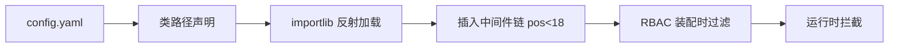
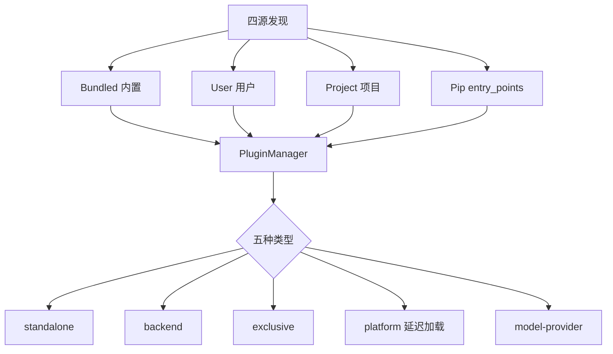
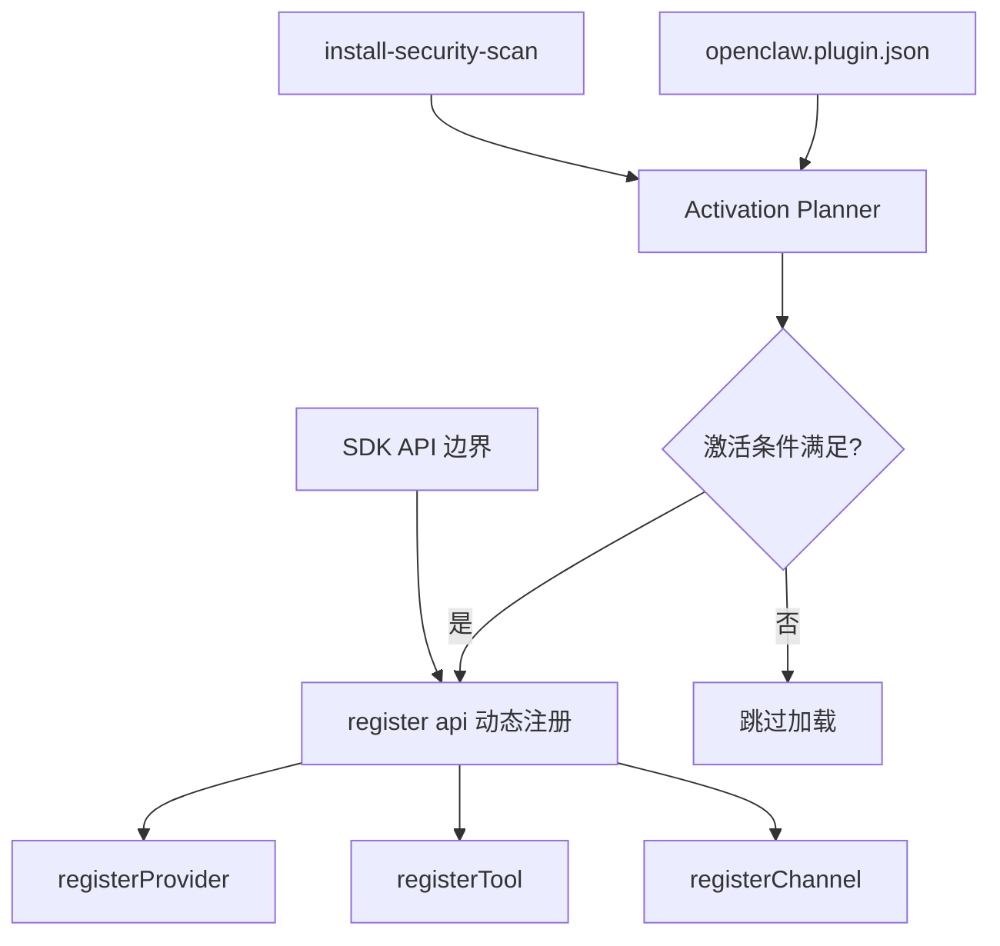
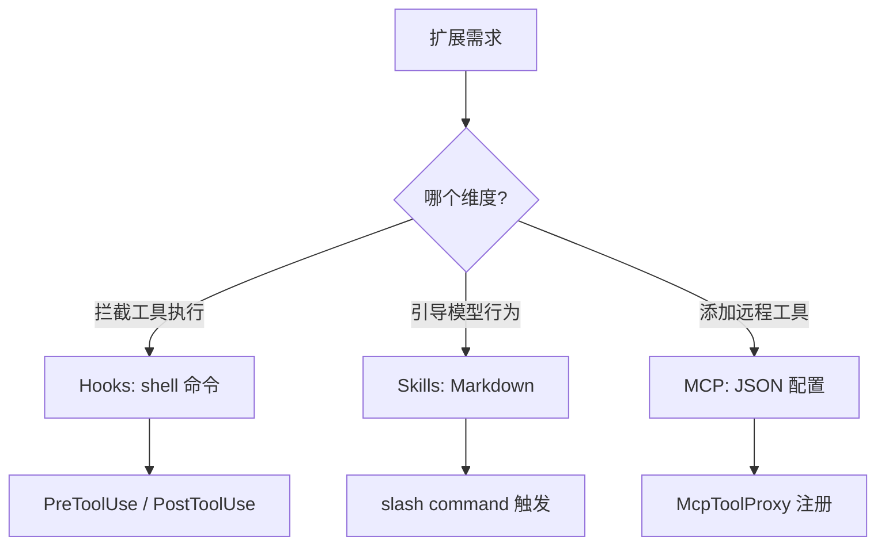
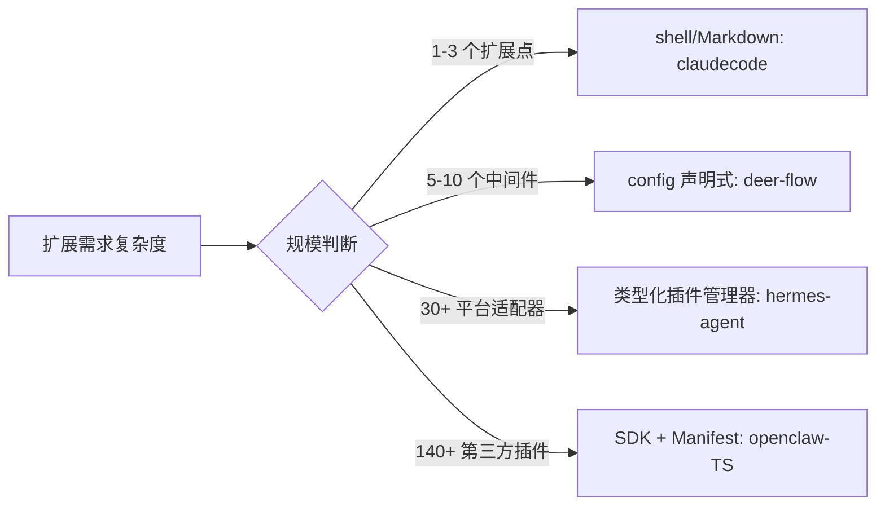

# 插件/扩展系统

## 读前思考

- 插件系统和工具系统都是"扩展 Agent 能力"的机制，但粒度和正式程度完全不同。工具是一个函数（输入→输出），插件是一个模块（可能包含多个工具、钩子、模型适配器、甚至 UI 组件）。你的系统需要多"正式"的插件机制？一个 shell 脚本钩子和一个带 manifest 的 SDK 插件，在什么规模下应该从前者迁移到后者？
- 第三方插件可能包含恶意代码。你怎么在"让插件有足够权限完成工作"和"不让插件搞坏系统"之间取得平衡？

## 核心问题

插件/扩展系统解决的核心问题是：**如何让第三方或用户在不修改核心代码的前提下扩展 Agent 的能力，同时管理好插件的发现、加载、隔离和生命周期。**

| 维度 | deer-flow | hermes-agent | openclaw-TS | claudecode |
|------|-----------|--------------|-------------|------------|
| 扩展模式 | config 声明式中间件注入 | 四源发现 + 五种类型化插件 | Manifest + SDK 注册式 | 三正交机制（Hooks/Skills/MCP） |
| 发现机制 | importlib 类路径反射 | entry_points + 目录扫描 | manifest 条件激活 | 配置文件声明 |
| 隔离策略 | fail_closed 可配失败模式 | 钩子异常隔离 + 沙箱限制 | 严格核心隔离（不能 import src/） | 进程级（shell 命令） |
| 安全 | RBAC per-role 策略 | Project 源沙箱限制 | install-security-scan 42.5KB | 退出码 2 阻止 |
| 代码规模 | 无独立插件目录 | 30+ 平台适配器 | 140+ extensions, 300+ SDK 模块 | ~500 行 |

## 方案展示

### deer-flow：config 声明式中间件注入

deer-flow 没有独立的插件市场或 SDK。扩展通过 config.yaml 声明式注入：load_configured_extension_middlewares() 用 importlib 加载类路径，将自定义中间件插入内置链位置 18 之前。护栏/授权双层执行（装配时 RBAC 过滤 + 运行时拦截），fail_closed 可配失败模式（缺失包/类立即报错 vs 静默跳过）。

**为什么这么选**：企业运维场景需要可审计的声明式注入——config.yaml 中可以清楚看到"加载了哪些扩展"，不需要扫描插件目录。fail_closed 确保缺失依赖时不静默降级（生产环境宁可报错也不能丢功能）。代价是扩展能力有限（只能注入中间件），不能添加新工具、新模型或新通道。

### hermes-agent：四源发现 + 五种类型化插件

hermes-agent 的插件从四个来源发现（Bundled/User/Project/Pip），分五种类型（standalone/backend/exclusive/platform/model-provider）。PluginManager 单例管理生命周期，entry_points 自动发现 pip 插件，平台插件延迟加载（首次使用才 import SDK）。四种工具执行钩子（pre/post/transform/middleware）让插件可以在工具执行的任何阶段介入。

Project 源有沙箱限制（不能注册 model-provider/exclusive 类型），钩子异常隔离（try/except 不传播到主流程）。

**为什么这么选**：30+ 平台适配器需要类型化管理（platform 类型有特殊的延迟加载需求——飞书 SDK 导入耗时 200ms，不能启动时全部加载）。pip 分发需要 entry_points 自动发现（用户 pip install 后插件自动可用）。Project 源沙箱限制防止项目级插件获取过高权限。代价是五种类型的学习曲线和 PluginManager 的复杂度。

### openclaw-TS：Manifest + SDK 完整生态

openclaw TS 版有完整的插件生态：openclaw.plugin.json 声明静态元数据（模型目录、端点、激活条件），index.ts 的 register(api) 做动态注册。Activation Planner 按 manifest 条件决定加载时机，sdk-alias.ts 64.4KB 做 tree-shaking 映射，install-security-scan.ts 42.5KB 安全扫描。严格核心隔离——插件不能 import 核心 src/，只能通过 SDK API 交互。

Python 版是预留空壳（registry.py/installer.py 未启用），4 个 provider 和 20 个工具硬编码。

**为什么这么选**：140+ 第三方插件需要严格隔离（不能直接访问核心代码）和 SDK 契约（provider-contract-api.ts 测试确保接口兼容）。Manifest 让 Activation Planner 在不加载代码的情况下决定是否激活（避免 140 个插件全部 import 的启动开销）。代价是 SDK 的学习曲线和 manifest 的维护成本。

### claudecode：三正交机制——无框架的扩展

claudecode 没有统一的插件框架，而是用三个正交机制各解决一个维度：Hooks（shell 命令做执行拦截，退出码 2 阻止）、Skills（Markdown 做行为引导）、MCP（JSON 配置做工具扩展）。每个机制保持极简——shell/Markdown/JSON，总计约 500 行代码。

PreToolUse/PostToolUse 两个时机，tool_name 过滤减少无效 fork，HOOK_TIMEOUT_S=10s 超时强杀。

**为什么这么选**：单用户 CLI 的扩展需求简单——拦截工具执行用 shell 脚本够了，行为引导用 Markdown 够了，远程工具用 MCP 够了。不需要 manifest、SDK、类型系统。三个机制各自独立、各自极简，学习成本几乎为零。代价是三个机制之间没有协调（一个"插件"可能需要同时写 Hook + Skill + MCP 配置），且没有版本管理和分发机制。

## 横向对比

核心岔路口是**扩展的"正式程度"**：

**隔离策略与信任模型正相关**。claudecode 的 Hooks 在独立进程中执行（天然隔离），但权限极大（shell 命令可以做任何事）。hermes-agent 的 Project 源有类型限制（不能注册高权限类型）。openclaw-TS 的插件不能 import 核心代码（编译期隔离）。deer-flow 的 fail_closed 确保缺失依赖时不静默降级。

## 面试要点

**1. claudecode 的"三正交机制"在什么规模下会不够用？迁移到统一插件框架的触发条件是什么？**

参考答案方向：当用户需要"一个扩展同时涉及多个维度"时——比如一个"代码审查插件"需要 Hook（拦截 git commit）+ Skill（审查规范）+ MCP（连接代码分析服务器）+ 工具（新增 review 命令）。三个机制之间没有协调，用户需要分别配置三处。迁移触发条件：(a) 需要分发机制（用户想分享"插件"给团队）；(b) 需要版本管理（插件升级后 Hook 和 Skill 要同步更新）；(c) 需要权限声明（插件声明自己需要哪些 Hook 时机和工具访问权）。

**2. openclaw-TS 的"严格核心隔离"（插件不能 import 核心 src/）和 hermes-agent 的"钩子异常隔离"（try/except 不传播），解决的是不同层面的什么问题？**

参考答案方向：openclaw 解决的是"编译期依赖隔离"——插件不能直接调用核心内部函数，防止核心重构时 140+ 插件全部 break，也防止插件绕过 API 直接操作内部状态。hermes 解决的是"运行时故障隔离"——插件钩子抛异常时不影响主流程，防止一个有 bug 的插件搞垮整个 Agent。两者互补：编译期隔离防止结构性耦合，运行时隔离防止故障传播。

**3. 如果让你给 deer-flow 加一个插件市场，最小可行方案是什么？需要解决哪些 claudecode 不需要解决的问题？**

参考答案方向：最小方案：(a) 定义 plugin.yaml manifest（名称、版本、入口类路径、依赖声明）；(b) 实现 discover_plugins() 扫描 ~/.deerflow/plugins/ 目录；(c) 在中间件链中增加 PluginMiddleware 做加载和生命周期管理。需要额外解决：版本兼容性（插件依赖的 deer-flow API 版本）、依赖冲突（两个插件依赖不同版本的同一个包）、安全审计（第三方代码需要扫描）、热重载（插件更新后不重启服务）。claudecode 不需要这些是因为它的扩展是 shell 脚本和 Markdown——没有依赖、没有版本、没有编译。

