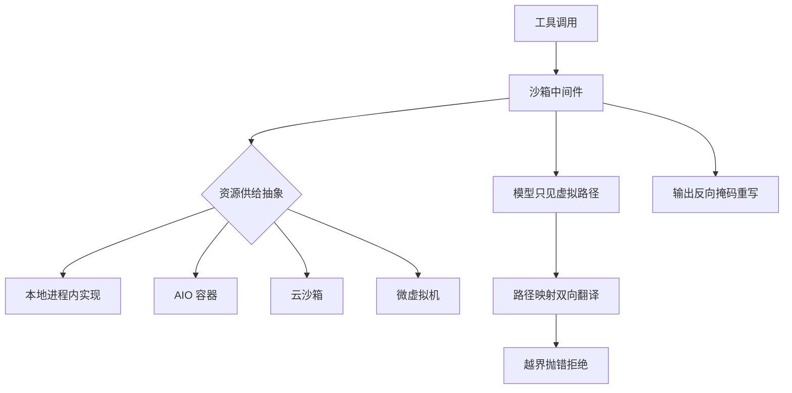
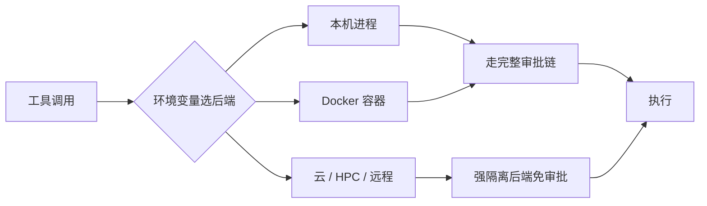
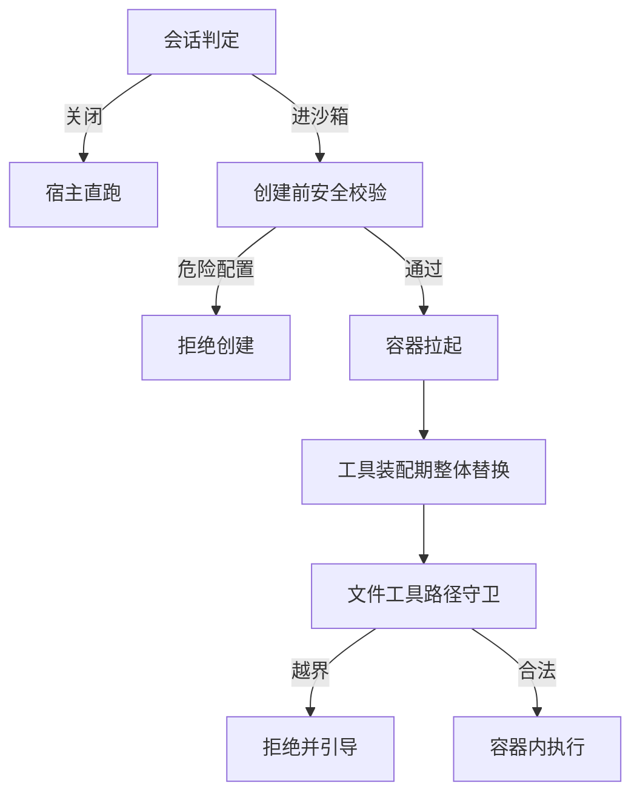
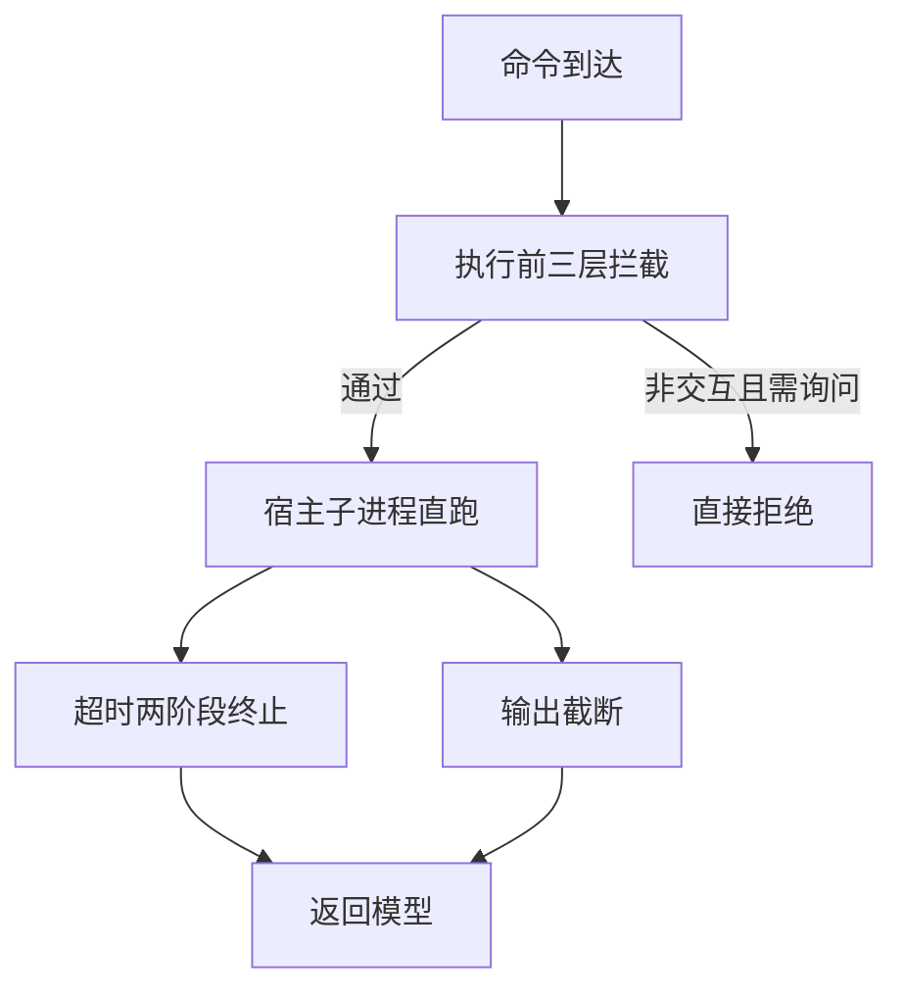
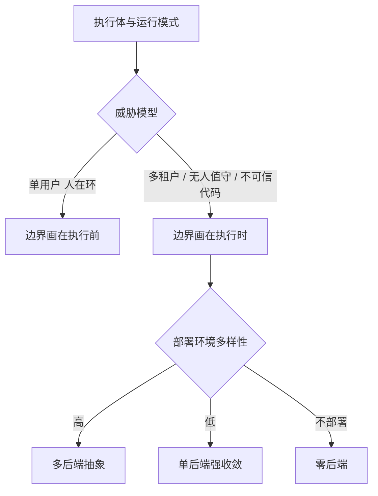

# 执行运行时与隔离

## 读前思考

- 一条命令通过了模型层的所有检查，接下来它在哪跑：在你自己的机器上直接跑，还是丢进容器、云沙箱、微虚拟机？这道"最后的环境选择"由什么决定——是技术成本，还是你对执行体（模型、插件、远端消息）的信任程度？信任程度不同，答案可以完全相反。
- 两个项目都用容器做隔离：一个提供 6 种执行后端随便切换，一个只有 1 种但默认值做得极硬（根文件系统只读、断网、剥光能力）。谁更安全？这个问题答完之后再想想：后端数量的意义到底是什么？

## 核心问题

**执行时隔离要回答的是：命令被放行之后，在哪个环境里跑——选什么后端、按什么规则路由、文件系统边界画在哪、输出路径如何脱敏。**

两条边界先行：执行前的权限、审批、Hooks 拦截属于执行前拦截，见 09-guardrails；工具如何注册、发现、调度属于工具系统，见 07-tools。本篇只讲两者之间的那段：调度表上的条目确定之后，条目执行时身处的环境。

| 维度 | deer-flow | hermes-agent | openclaw | claudecode |
|------|-----------|--------------|----------|------------|
| 隔离形态 | 双层抽象 + 中间件织入 | 环境工厂，后端由环境变量驱动 | Docker 沙箱 + 注册期管道替换（TS 版）；组件未接线（Python 版） | 无沙箱，宿主直跑 |
| 后端数量 | 4（本地 / AIO 容器 / E2B 云 / 微虚拟机） | 6（本机 / Docker / HPC / 云 / 工作区 / 远程） | 1（TS 版 Docker） | 0 |
| 默认姿态 | 本地零隔离可用，容器后端才真隔离 | 默认本机执行，容器可选 | 默认关闭，开启即激进硬化 | 宿主直跑 + 默认询问 |
| 工作区表示 | 虚拟路径 + 双向掩码 | 持久挂载 + 目录映射 | 容器路径 + 拒绝式守卫 | 用户真实路径 |

## 方案展示

### deer-flow：抽象层之上做生命周期工程

deer-flow 把执行环境拆成两层：一层是单个沙箱的操作契约（执行命令、读写文件、检索），一层是沙箱资源的供给（获取、复用、回收），一个中间件把获取与归还织进 Agent 循环，工具调用自动落在当前会话的沙箱里。四种后端——本地进程内、框架拉起的容器、云沙箱、微虚拟机——切换只改配置；模型与工具看到的路径永远是虚拟形态，真实路径由映射双向翻译，输出里的主机路径再被反向重写。最重的投入在生命周期：本地按线程缓存复用，容器侧有预热池、所有权租约、孤儿回收，把沙箱资源管理做成基础设施。

**为什么这么选**：多租户企业部署里用户之间不信任，服务化场景又没有人在回路，爆炸半径必须被操作系统约束——被注入的命令即使真的执行，影响也被圈在会话自己的沙箱内。两层抽象让四种后端独立演进、上层零感知；跨轮复用让多轮任务的安装状态与生成文件得以延续。**牺牲了什么**：本地后端是零隔离的进程内映射，安全边界不成立，要靠默认禁用宿主 shell 的门控兜底并诚实提示用户切换真隔离后端；资源常驻则靠 LRU 上限与空闲回收兜底。机制细节见 docs/deer-flow/08-runtime.md。

### hermes-agent：隔离强度决定治理强度

hermes-agent 的执行后端由环境变量选定：终端工具读一个环境变量，工厂据此构造六种后端之一（本机进程、Docker 容器、HPC 容器、云沙箱、云端工作区、远程主机），全部实现同一个执行契约，工具层与审批层都不感知后端差异。执行模型是每次调用新建，靠会话快照恢复环境状态，文件状态由持久挂载的工作目录保留。它与众不同的联动是：容器与云后端因为自带强隔离，直接跳过危险命令审批；本机与 Docker 后端才需要完整审批链——隔离足够强就不必再问人。

**为什么这么选**：个人助手要按场景切换隔离等级——本地开发图快、处理不信任代码切容器、企业环境上云。环境变量驱动让部署方一行配置切换等级，工具层代码零分支。**牺牲了什么**：六种后端能力不齐，审批逻辑与资源限制必须逐后端适配，隔离与治理的联动逻辑本身就是这种适配税；安全假设绑定在后端语义上——若后端被弱化配置（如容器开了网络），审批链是唯一防线。机制细节见 docs/hermes-agent/08-runtime.md。

### openclaw：默认关闭，开启即激进硬化

openclaw TS 版的沙箱是配置驱动、默认关闭：一个开关控制会话是否进容器（关闭 / 仅非主会话 / 全部），一旦进沙箱，容器默认值就是满配——根文件系统只读、默认断网、剥光全部 Linux 能力，可写区只能靠显式配置开洞；创建容器前还有一道校验，危险的主机路径挂载与宽松 seccomp 配置直接拒之门外。工具侧在装配阶段整体换成容器版本：沙箱会话的文件与执行工具直接替换为走容器通道的实现，路径越界做拒绝式拦截并引导模型改用约定目录。执行路由按调用方分岔：CLI 直跑、网关模式走审批、沙箱模式进容器。Python 版是反例：沙箱组件写了但未接入默认注册表，实际宿主直跑，靠输出脱敏与失败关闭的审批兜底。

**为什么这么选**：开放平台上第三方插件与外部消息都不可信，但沙箱有摩擦成本，所以默认关闭、需要时才开；一旦开启就拉满默认值，不做中间档，避免半隔离的虚假安全感。注册期替换让沙箱化会话拿到的工具集天然干净，没有运行时判断开销与遗漏。**牺牲了什么**：可写区必须显式开洞，兼容性配置成本高；路径守卫语义清晰，但模型必须写出合法路径，越界只能靠错误提示纠正；两种实现的分化意味着参考实现的隔离能力停留在组件层面。机制细节见 docs/openclaw/08-runtime.md。

### claudecode：零后端，信任用户

claudecode 是唯一没有执行时隔离的项目：命令直接在用户机器上以子进程方式执行，没有容器、没有内核围栏、没有路径掩码。它的安全投入全部在执行前——可编程钩子、白名单权限门、人工确认三层拦截负责决定放行与否，执行层只保留物理限额：超时两阶段终止、输出截断、只读命令并行。立场的关键证据在无人值守路径：非交互模式下询问直接转拒绝——没有人在环时宁可不做，也不降级为无隔离放行。

**为什么这么选**：单用户交互式开发工具里，用户本人就是信任锚点与最终审批者，沙箱要隔离的正是那个需要操作真实仓库的人——隔离带来的文件系统挂载、网络限制、容器启动延迟三重摩擦，直接伤害"在真实环境里干活"这个核心场景。所以用人在环审批替代隔离，用物理限额控制放行后的爆炸半径。**牺牲了什么**：命令一旦放行即拥有用户全部权限，无 OS 级兜底；提示词注入诱导的危险命令只隔一次人工确认；跳过检查模式等于裸奔。立场论证与风险细节见 docs/claudecode/08-runtime.md。

## 横向对比

三个岔路口，按重要性排列。

**岔路口 1（主线）：边界画在执行时还是执行前。** 因为 deer-flow、hermes-agent、openclaw 面对的执行体或运行模式（多租户用户、不可信代码、第三方插件、无人值守服务化）要求爆炸半径必须被操作系统约束，所以安全边界画在执行时——拦截漏了，恶意命令也只在沙箱里爆炸；因为 claudecode 是单用户人在环的交互工具，用户即审批者，所以边界全部画在执行前，执行层只剩物理限额。claudecode 的非交互拒绝恰好证明这是立场而非偷懒：没有人在环时它选择不做，而不是裸跑。这是理解全部后续分岔的根：威胁模型决定边界位置，边界位置决定后端投入。

**岔路口 2：后端数量与隔离深度的反比。** 因为对部署环境多样性的预期不同，所以在后端数量上分岔为六后端矩阵（hermes-agent）、四后端抽象（deer-flow）、单后端强收敛（openclaw）、零后端（claudecode）。后端越多，每个后端能做的硬化深度越受最小公分母约束：hermes-agent 要逐后端适配审批豁免与资源限制，openclaw 把全部精力砸进唯一后端，默认值才能做到只读根、断网、剥光能力、禁宽松 seccomp。抽象层数与隔离深度成反比，是这个岔路口的核心规律。

**岔路口 3（细节对照）：两个技术立场完全相反的样本。** seccomp 上，deer-flow 的容器后端为保容器内工具链可用（装依赖、跑调试）主动放开系统调用限制，openclaw 把同样的配置列入创建前禁止清单——同一技术，一个保可用性，一个保最小攻击面。路径治理上，deer-flow 是重写派：双向掩码让模型永远只见虚拟路径，输出里的主机路径也被反向重写；openclaw 是拒绝派：越界直接拒绝并引导模型换用约定的临时目录——重写派保体验（提示词不随后端变化），拒绝派保语义清晰（没有静默改写歧义）。

| 岔路口 | deer-flow | hermes-agent | openclaw | claudecode |
|--------|-----------|--------------|----------|------------|
| 边界位置 | 执行时隔离 | 执行时为主 + 审批联动 | 执行时隔离（默认关） | 纯执行前 |
| 硬化深度 | 四后端均摊 | 六后端受最小公分母约束 | 单后端最深 | 无（无后端） |
| 路径治理 | 双向掩码重写 | 挂载映射 | 拒绝式守卫 | 真实路径无掩码 |
| seccomp 立场 | 主动放开保工具链 | — | 明令禁止 | 无容器 |

## 面试要点

**1. 执行前拦截和执行时隔离哪个更安全？各自的盲区在哪？**

参考答案方向：两者各有盲区——拦截的盲区是规则覆盖不全，新危险模式不在名单里就放行；隔离的盲区是沙箱逃逸与数据外泄，容器内的恶意代码仍可能通过被允许的通道读取敏感信息并外传。完整防线必须叠加：拦截覆盖已知的危险模式，隔离把未知危险的破坏范围框在环境边界内，隔离内部也要保留命令级检查，防止沙箱内为所欲为。claudecode 不做沙箱不是因为它更安全，而是它的威胁模型里缺少"不可信执行体加无人值守"这两个条件。判断标准是"执行体的不可信度 × 人在环的可得性"：两者都高时隔离不可替代，都低时拦截足够。

**2. 为什么后端越多，每个后端反而越难硬化？多后端抽象和单后端强收敛各在什么条件下成立？**

参考答案方向：多后端的价值是部署方按场景切换隔离等级、上层零感知，代价是每个后端的能力差异（网络、配额、通信通道）都要在代码里显式适配，硬化深度被适配成本共同压低；单后端把全部投入集中到一层默认值，可以做到极硬，代价是部署环境必须兼容 Docker。成立条件：部署环境多样且切换频繁时多后端划算；威胁等级高而部署面单一时单后端强收敛更划算。判断标准是"部署环境多样性 × 单点硬化投入"。

**3. 同样面对容器，deer-flow 主动放开 seccomp、openclaw 明令禁止，怎么理解这种相反立场？**

参考答案方向：两者对"容器内内容"的假设不同——deer-flow 的容器跑的是自己的任务工具链，模型是受控的，放开限制是为了容器内可用性（装包、调试）；openclaw 假设容器内可能已有恶意代码（插件、外部内容），系统调用面越小越安全。立场相反不代表谁错了，而是可用性损失与攻击面收窄的权衡在不同威胁模型下取值不同。判断标准是"容器内内容的可信度 × 容器逃逸后的损害"：内容越不可信、逃逸损害越大，越该收窄系统调用面。
