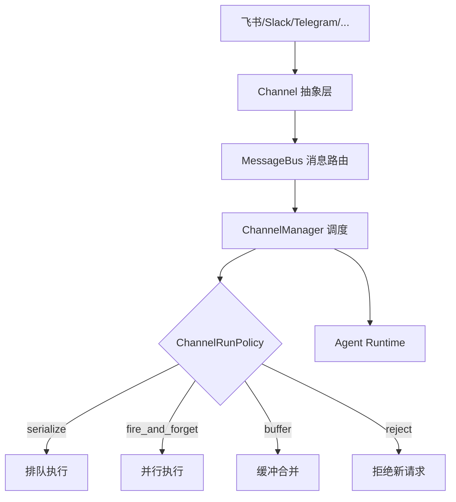
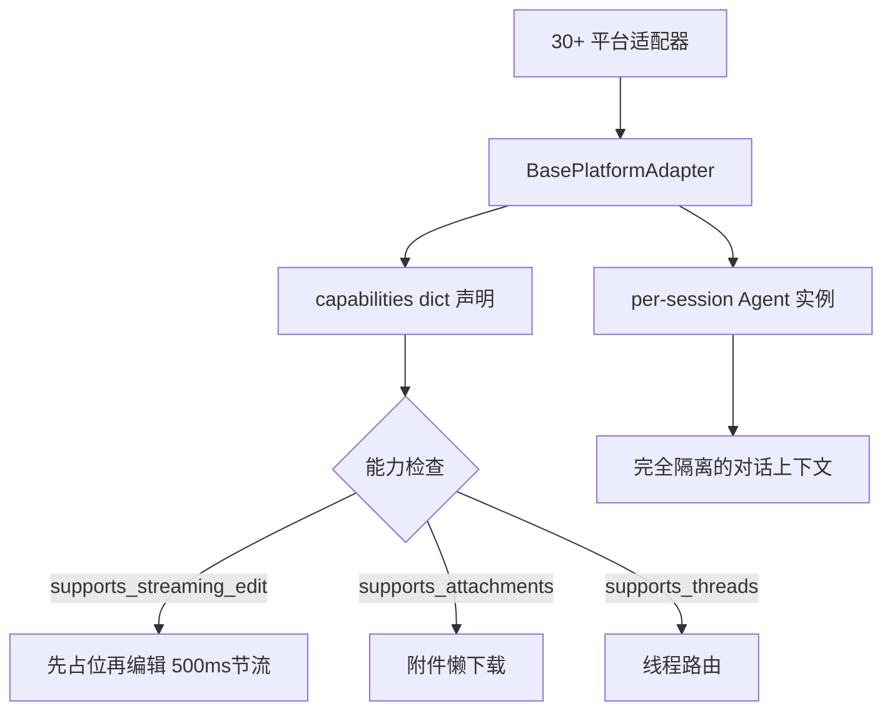
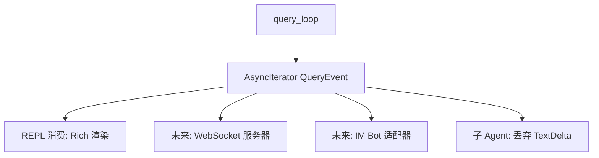
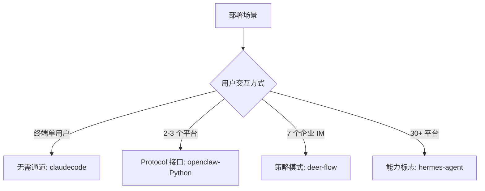

# 消息通道/IM 集成

## 读前思考

- 如果你的 Agent 只运行在终端里，你不需要"消息通道"。但当用户想通过飞书、Telegram、Slack 跟同一个 Agent 对话时，你怎么让 Agent 核心逻辑完全不感知消息来自哪个平台？平台差异（有的支持流式编辑、有的只支持一次性发送、有的有消息长度限制）应该在哪一层处理？
- 用户通过飞书快速连续发了三条消息，你的 Agent 应该怎么处理——并行执行三个请求，还是合并为一条，还是只处理最后一条？

## 核心问题

消息通道解决的核心问题是：**如何让 Agent 核心逻辑与消息传输平台完全解耦，同时正确处理各平台的差异（流式投递、消息长度、并发控制、认证方式）。**

| 维度 | deer-flow | hermes-agent | openclaw | claudecode |
|------|-----------|--------------|----------|------------|
| 平台数量 | 7 个 IM 平台 | 30+ 平台适配器 | Python 2 / TS 15+ | 无（终端 REPL） |
| 抽象模式 | Channel + MessageBus + ChannelManager | BasePlatformAdapter + 能力标志 | ChannelPlugin Protocol / transport-only | 事件协议天然支持 |
| 并发策略 | ChannelRunPolicy 四种策略 | per-session 完全隔离 | 消息防抖 500ms 合并 | 无 |
| 流式投递 | 按平台能力适配 | 流式编辑 + 500ms 节流 | 4 种模式（off/partial/block/progress） | Rich 终端逐字打印 |
| 连接方式 | 长连接/出站 WebSocket（无公网 IP） | 平台各自实现 | 飞书长连接 / WebChat WebSocket | 不适用 |

## 方案展示

### deer-flow：Channel 抽象 + RunPolicy 策略模式

deer-flow 用三层架构解耦通道：Channel 抽象定义平台接口，MessageBus 解耦消息路由，ChannelManager 统一调度。ChannelRunPolicy 策略模式控制并发行为（fire_and_forget/serialize/buffer/reject），所有渠道不需要公网 IP（long-polling/WebSocket 出站连接）。7 个 IM 平台映射到统一的 thread/run 模型，per-user session 配置。

**为什么这么选**：企业 IM 场景的核心约束是"无公网 IP"——大多数企业内网不允许暴露 webhook 端口，所以所有渠道必须走出站连接（long-polling/WebSocket）。RunPolicy 策略模式让每个渠道可以独立选择并发行为——飞书需要 serialize（同一用户消息必须按序处理），而通知类渠道可以 fire_and_forget。代价是 7 个 Channel 实现之间有一些重复逻辑（认证、重连），但每个平台的 SDK 差异太大，强行抽象反而增加复杂度。

### hermes-agent：能力标志 + 完全隔离

hermes-agent 用能力标志（capabilities dict）而非继承层次表达平台差异——每个适配器声明自己支持什么（流式编辑、附件、线程），上层根据标志选择投递策略。per-session Agent 实例完全隔离，流式编辑投递（先占位再编辑）+ 500ms 节流，消息去重（LRU by message_id），Session 30 分钟超时回收到磁盘。30+ 平台适配器在 gateway/platforms/ 目录下。

**为什么这么选**：30+ 平台的差异远超"接口方法"能表达的范围——Telegram 支持编辑已发送消息，SMS 不支持；飞书有卡片消息，iMessage 有 tapback。继承层次会导致"方法爆炸"（不支持的功能需要空实现）。能力标志让每个适配器只声明自己有什么，上层按标志选路径。per-session 完全隔离确保一个用户的对话不会泄漏到另一个用户。代价是上层代码充满 if capabilities.get(...) 的运行时分支，新增能力需要修改所有消费方。

### openclaw：transport-only 纯传输

openclaw 的核心哲学是"通道不拥有产品逻辑"——通道只做消息的收发和格式转换，所有业务逻辑归核心。Python 版支持飞书 + WebChat（9 级路由优先级决定 session 归属，WebSocket 长连接 varint 帧编码）。TS 版 15+ 通道适配器，流式投递 4 种模式，消息防抖 500ms 窗口合并，去重 600s TTL。通道之上的 gateway 服务层形态的横向对比见 comparisons/14-gateway.md。

**为什么这么选**：openclaw 有 15+ 通道，如果每个通道都包含产品逻辑（如"什么时候该压缩上下文""什么时候该触发记忆提取"），核心逻辑会被分散到 15 个地方，修改一个功能需要改 15 个文件。transport-only 让通道极薄（只做格式转换），核心极厚（所有决策在一处）。代价是某些平台特有的交互模式（如 Slack Block Kit 的按钮回调）难以用纯传输表达，需要 "typed presentation actions" 做中间层翻译。

### claudecode：无通道——事件协议的天然扩展性

claudecode 当前无 IM 集成，交互模式是终端 REPL + 管道模式。但 query_loop 的 AsyncIterator[QueryEvent] 事件协议天然支持多消费方——替换控制面（main.py REPL）为 WebSocket 服务器即可接入 IM，内核不需要任何修改。

**为什么这么选**：claudecode 是本地 CLI 工具，不需要多平台服务。但它的架构为未来扩展留了口——事件驱动的输出方式让"谁来消费事件"成为可替换的控制面问题，而非内核问题。代价是当前没有多用户支持（session/storage.py 非多用户设计），如果要接入 IM 需要额外实现 session 管理和认证。

## 横向对比

核心岔路口是**是否需要多平台并发服务**：

**流式投递策略**反映了平台差异的处理深度。claudecode 只需处理终端（Rich 逐字打印）。deer-flow 和 hermes-agent 需要处理"有的平台支持编辑已发送消息（飞书/Telegram），有的不支持（SMS/邮件）"。openclaw-TS 抽象为 4 种模式让每个通道选择适合的投递方式。

## 面试要点

**1. hermes-agent 的"能力标志"和 deer-flow 的"Channel 接口继承"，在平台数量从 7 增长到 30+ 时哪个先遇到瓶颈？**

参考答案方向：接口继承在 30+ 平台时遇到"方法爆炸"——如果接口定义了 send_streaming()，不支持流式的平台必须写空实现或抛 NotImplementedError。能力标志让每个适配器只声明自己支持什么，上层根据标志选择路径，不需要空实现。但能力标志的代价是运行时分支——上层代码充满 if capabilities.get("streaming_edit") 的判断，新增能力时需要修改所有消费方。

**2. openclaw 的"transport-only"哲学（通道不拥有产品逻辑）在什么情况下会被打破？**

参考答案方向：当平台特性与产品逻辑深度耦合时——如飞书的"卡片消息"需要 Agent 核心知道如何构造交互式卡片（按钮、表单），这不是纯传输能处理的。或者 iMessage 的"tapback 回应"需要 Agent 理解 emoji 语义并做出响应。openclaw 的解决方案是"typed presentation actions"——核心输出结构化的展示意图，通道负责翻译为平台特有格式。但如果平台特有的交互模式（如 Slack 的 Block Kit）无法用通用意图表达，就需要通道侧有产品逻辑。

**3. 用户快速连续发三条消息（"帮我查 X"→"算了不查了"→"帮我查 Y"），四个项目的处理策略分别是什么？**

参考答案方向：claudecode 不存在这个问题（终端输入是同步的）。deer-flow 用 ChannelRunPolicy 的 serialize 策略排队执行三条消息。hermes-agent 的 per-session 隔离 + 消息去重可能合并前两条（如果间隔 < 500ms）。openclaw-TS 的 Lifecycle Generation 机制最优雅——第三条消息的 generation 让前两条的 run 在执行前发现自己已过时，安全丢弃。

