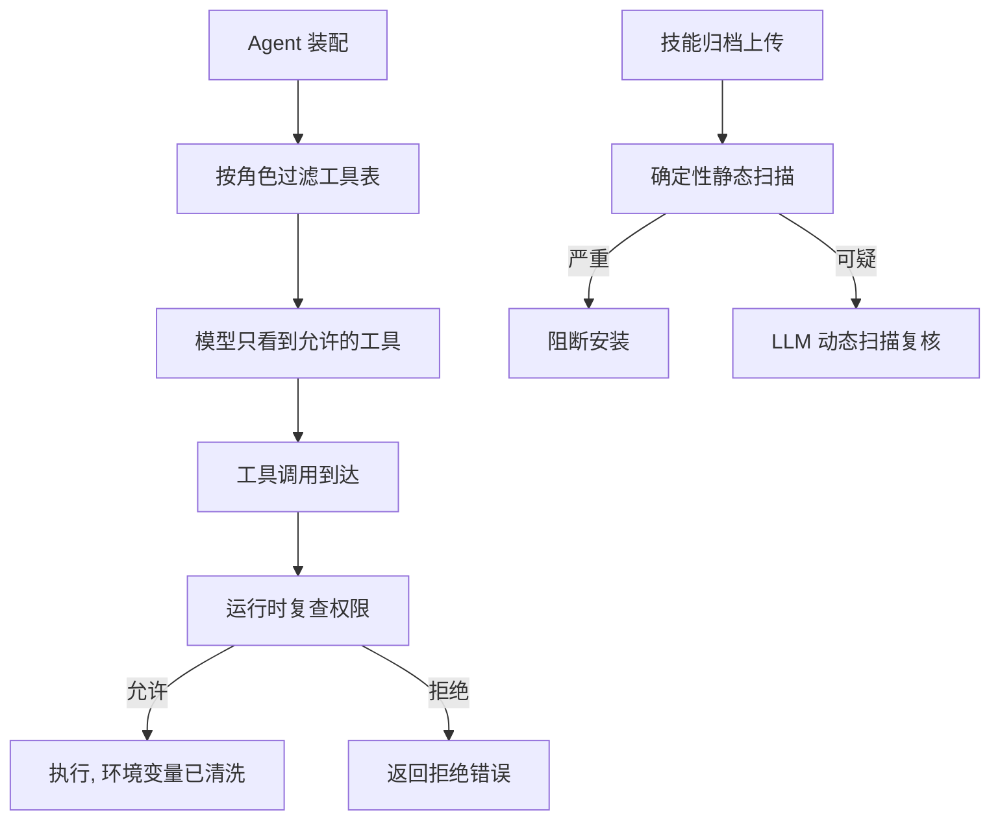
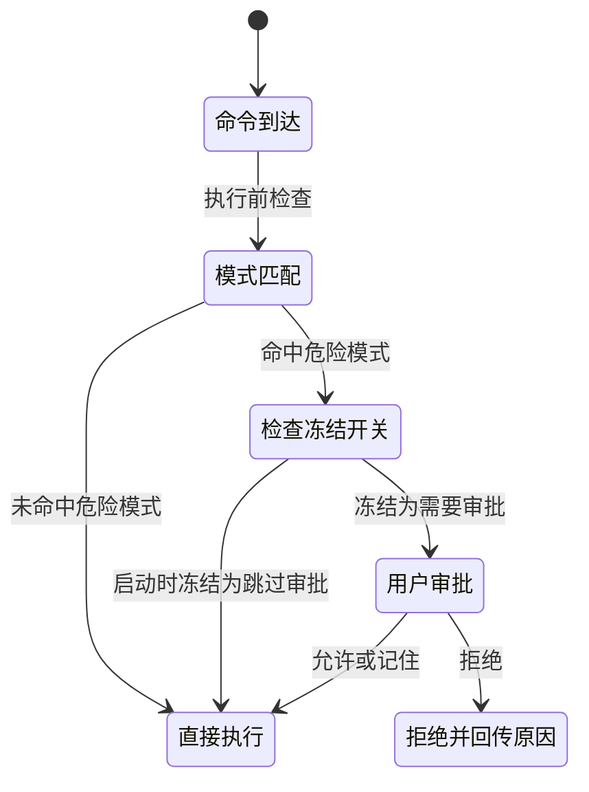
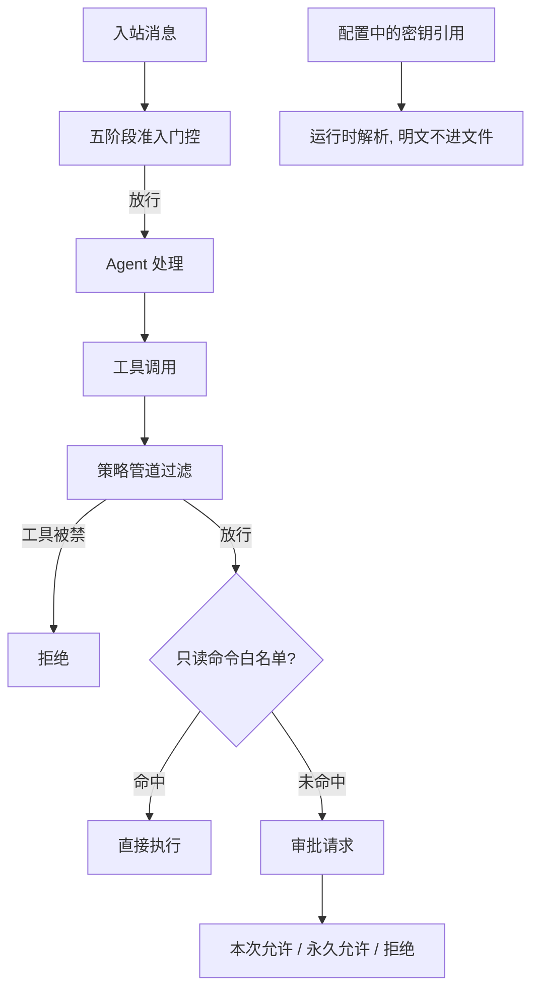
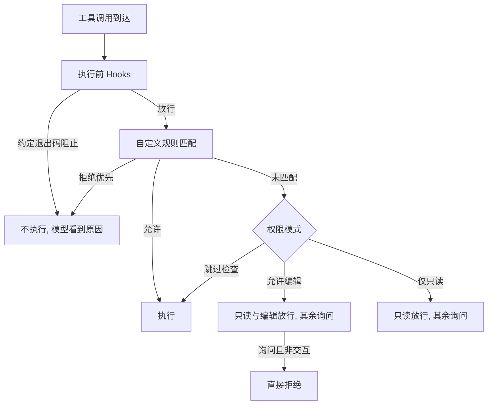
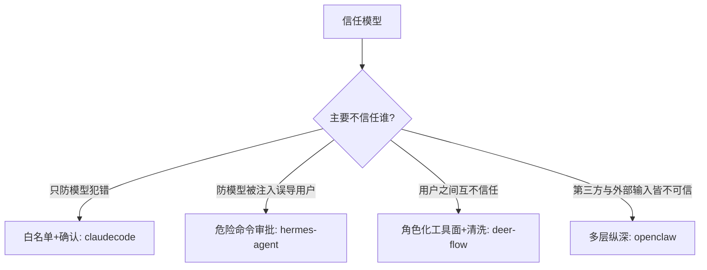

# 执行前拦截与信任治理

## 读前思考

- Agent 能执行 shell 命令、读写文件、访问网络。如果模型被 prompt injection 攻击（工具返回的内容中嵌入了恶意指令），一条危险命令从模型口中说出到真正执行，中间只有很短的窗口。在这个窗口里你能做什么——是检查命令本身危险不危险、检查发起命令的工具有没有资格、还是干脆停下来问人？
- 密钥管理面临一个矛盾：工具需要 API key 才能工作，但你不希望模型"看到"key 的值（否则可能在回复中泄露）。怎么让工具"能用但看不到"？

## 核心问题

执行前拦截与信任治理解决的核心问题是：**在 Agent 拥有强大执行能力的前提下，通过权限模型、审批机制、Hooks 拦截、密钥治理、凭证脱敏和安装时扫描，防止误操作、恶意注入和密钥泄露，同时不过度限制 Agent 的工作能力。**

先划两条边界。其一，连接级认证回答"你是谁"（谁能接入系统），归 01-gateway；本篇回答的是"你能不能做这件事"——每一个具体动作放行与否。其二，本篇只讲命令执行之前发生的事；命令被放行之后在哪个环境里跑（沙箱、容器、路径掩码）属于执行时隔离，机制见 08-runtime。

| 维度 | deer-flow | hermes-agent | openclaw | claudecode |
|------|-----------|--------------|----------|------------|
| 信任前提 | 多租户，用户间不信任 | 信任用户本人，不信任模型输出 | 开放平台，第三方与外部输入皆不可信 | 用户就是管理员，只防模型犯错 |
| 权限模型 | RBAC 按角色过滤工具面 | 危险命令黑名单审批 | 策略管道 + 五阶段准入门控 | 白名单 + 三级权限模式 |
| 人工介入 | 授权默认关闭，无逐次审批 | per-session 审批 + always 记忆 | allow-once / always / deny 三级确认 | 交互确认，非交互直接拒绝 |
| 密钥治理 | 环境变量双层黑名单清洗 | 多源密钥 + 作用域隔离 | 引用系统 + 写回保留引用 | 环境变量直接使用 |
| 安装时扫描 | 技能双重扫描 | MCP 四层防护 + 技能三级信任 | 插件与技能安装扫描 | 无 |

## 方案展示

### deer-flow：RBAC 双层执行 + 黑名单清洗 + 双重扫描

deer-flow 的拦截重点在"谁有什么工具面"而不是"每条命令问一次"。授权分两层执行：装配 Agent 时按角色把不允许的工具从模型可见的工具表里整体移除，运行时每次工具执行前再复查一次权限——第二层是为了堵住模型通过工具搜索等途径发现被隐藏工具后尝试调用的绕过路径。两层都支持失败关闭配置：授权提供方不可用或配置出错时拒绝所有请求，生产环境宁可全拒也不放行。

密钥方向走的是"少给"路线：子进程继承环境变量前先过一层通配模式加精确名称的双层黑名单，把疑似凭据的变量全部滤掉，只有用户显式授权的凭据可以覆盖回填。第三方技能安装前先过确定性静态扫描加 LLM 动态扫描的双重检查，严重发现直接阻断。容器级的执行时隔离（沙箱后端、输出路径掩码）是它的另一半防线，归属见 08-runtime。

**为什么这么选**：多租户企业部署里用户之间互不信任，但逐条命令审批在服务化场景没有人在回路，只能把决策前置到"角色决定工具面"。装配过滤省 token，运行时复查防绕过，两者构成纵深。代价是授权默认关闭、粒度只到工具级（无法按命令内容判定），且黑名单清洗会误伤名字恰好包含敏感词的合法变量。机制细节见 docs/deer-flow/09-guardrails.md。

### hermes-agent：危险命令审批 + YOLO 冻结 + 多源密钥

hermes-agent 的拦截核心是执行端的危险命令审批：命令执行前对一组危险模式做包含式匹配，命中就暂停并询问用户，用户可选本次允许、拒绝或本会话内同类命令永远允许。审批状态按会话隔离存储，多个会话并发时互不影响。旁路开关（YOLO 模式，环境变量 HERMES_YOLO 控制）在模块导入时读取一次并冻结——之后任何运行时代码修改环境变量都无法改变审批行为。

密钥管理走"多源统一 + 作用域收窄"：环境变量、.env 文件、系统钥匙串、OAuth 令牌存储经同一接口访问，MCP 子进程只能看到白名单内的环境变量，网关的不同会话看不到彼此的凭据。对不可信的外部输入还有配套：MCP 服务器启动前有恶意软件库预检、子进程环境变量白名单、工具描述注入扫描、结果凭证正则脱敏四层防护。

**为什么这么选**：个人助手场景下用户信任自己但不信任模型，输出端过滤又不可靠（危险命令有无数变体），所以把拦截放在执行端做"最后一道闸"。冻结开关保证安全关键配置启动时确定、运行时不可篡改。代价是模式匹配既有误报（清理构建目录也触发审批）又有漏报（换个解释器包装就不匹配），审批弹窗打断流程。机制细节见 docs/hermes-agent/09-guardrails.md。

### openclaw：策略管道 + 三级审批 + 引用制密钥 + 五阶段准入

openclaw 把拦截拆成多个独立层。动作级审批上，命令先比对只读命令白名单，命中自动通过，否则向用户发审批请求，用户选择本次允许、永久允许或拒绝，审批带超时防止 Agent 永远等待。密钥管理用引用制：配置里只写"去哪找密钥"（环境变量名、文件路径或取密命令），实际值在运行时解析，配置文件被模型读到也拿不到明文；密钥比较用恒定时间算法，日志与界面显示掩码形态。

消息入口还有与通道无关的五阶段准入门控：路由门、发送者门、命令门、事件门、激活门依次判定"这条消息能不能进、以什么身份进"，陌生人私聊走配对流程建立信任。第三方插件和技能在安装时过安全扫描，配置写回时把环境变量引用还原、绝不落盘明文。它的四层纵深里容器隔离那一层归 08-runtime，审计诊断工具归 10-observability。

**为什么这么选**：开放平台上第三方插件和外部消息都不可信，单层规则一旦被绕过就全面失守，所以每个威胁面对应一层独立判定。引用制直接回应"配置可能被模型读取"的泄露路径。代价是两百多个安全相关文件的维护成本、审批对自主性的打断，以及五阶段门控对简单部署而言过重。机制细节见 docs/openclaw/09-guardrails.md。

### claudecode：白名单 + 三级权限 + Hooks 补充

claudecode 没有执行时隔离，安全边界完全依赖执行前拦截，拦截分三层：用户配置的 Hooks 先看命令内容（shell 脚本以约定退出码表达阻止），然后权限系统做工具级门禁，最后交互模式下由用户确认。权限判定是白名单语义：只读工具集在所有模式放行，编辑工具集在"允许编辑"模式放行，其余一律询问——新增工具和远程 MCP 工具因为不在名单中默认需要确认，安全侧倒。三级模式（跳过检查 / 允许编辑 / 仅只读）控制严格程度，用户还可以用规则文件对具体命令模式做允许或拒绝的精细配置，拒绝规则优先。

非交互模式（管道输出、子 Agent、后台任务）下"询问"直接转为拒绝——没有人可以确认时宁可拒绝，这也使子 Agent 天然无法执行 shell 命令。

**为什么这么选**：本地 CLI 场景用户自己就是管理员，安全目标不是隔离用户而是给模型的误操作一次被人否决的机会。Hooks 补上了权限系统做不到的命令内容级判定。代价是拦截全靠规则与用户判断，一旦用户选了跳过检查且没配 Hooks，就没有任何兜底；"为什么不做沙箱"的立场说明见 08-runtime。机制细节见 docs/claudecode/09-guardrails.md。

## 横向对比

四个项目的核心岔路口是**信任模型**——不信任的对象不同，拦截的形态就不同：

因为面对的威胁面不同，安全投入与威胁模型严格正相关。claudecode 的威胁只有"模型误操作"，用户本人完全可信，白名单加确认就够了；hermes-agent 的威胁升级为"prompt injection 诱导执行危险命令"，需要执行端模式匹配加人工审批；deer-flow 是多租户企业，用户之间互不信任且没有人在回路，只能把权限前置到角色化的工具面，再配合环境变量清洗和技能扫描；openclaw 是开放平台，插件、技能、消息来源全都不可信，于是在准入、策略、审批、密钥每一处都设独立判定层。同一组机制（审批、扫描、脱敏）在四个项目里的浓度差异，本质是威胁模型浓度的差异。

拦截与隔离不是二选一：拦截负责挡住已知危险，隔离负责限制未知危险的爆炸半径，两者组合才是完整纵深。这一组合使用的讨论主写在 08-runtime。

## 面试要点

**1. openclaw 的引用制密钥（"能用但看不到"）是怎么实现的？如果模型通过工具组合间接获取密钥怎么办？**

参考答案方向：配置中不写密钥明文，只写引用（某个环境变量名、某个文件路径、某条取密命令），运行时才解析出实际值，工具输入参数里出现的只是引用标识，模型看到的始终只是"这里有个叫某某的引用"。但绕过路径真实存在：模型如果能执行 shell，可以用打印环境变量的命令看到值，或把密钥作为参数传给网络命令使其出现在进程命令行里，或执行取密引用后让结果进入工具输出。所以引用制只是第一层，完整防护需要组合：执行环境不注入明文密钥、限制可读环境的命令、对工具输出做凭证正则脱敏、必要时断网防外传。判断标准是"引用制解决静态泄露 × 动态泄露要靠执行面与输出面的配套"。

**2. hermes-agent 的 YOLO 旁路开关为什么要在导入时冻结？如果允许运行时切换会有什么安全风险？**

参考答案方向：冻结确保开关状态在进程启动时确定、之后不可更改。如果允许运行时读取，恶意技能或工具结果诱导模型执行一条设置环境变量的命令，就能在运行中打开旁路、让后续所有危险命令跳过审批。冻结之后，审批逻辑读取的是启动那一刻的值，运行时改环境变量无效。这是"最小权限 + 不可变性"的组合：安全关键配置在启动时确定，运行时不可篡改。残余风险是同进程内直接改写冻结变量的内存值，但那要求恶意代码已在解释器进程内运行，此时系统已被攻陷，属于另一个问题。判断标准是"配置的可变性 × 该配置的安全权重"——权重越高越该冻结。

**3. deer-flow 技能的允许工具声明是"行为隔离"还是"行为建议"？恶意技能被注入后它防得住什么、防不住什么？**

参考答案方向：是行为建议而非硬边界——官方文档明确这是尽力而为的行为范围约束。技能激活后，框架取所有激活技能声明的允许工具并集（allowed-tools）过滤模型可见的工具列表。它防得住：恶意技能指示模型执行 shell 命令，但 shell 工具不在允许集合里，模型根本看不到这个工具。它防不住：恶意技能通过被允许的读文件工具去读另一个技能的内容获取敏感信息，或者通过被允许的联网工具把数据外发，又或者激活记录被上下文驱逐策略移除后约束失效。真正的硬隔离需要执行环境级的控制，那超出提示词级策略的能力。判断标准是"策略作用在可见性 × 还是作用在执行环境"——前者是软约束，后者才是硬边界。
