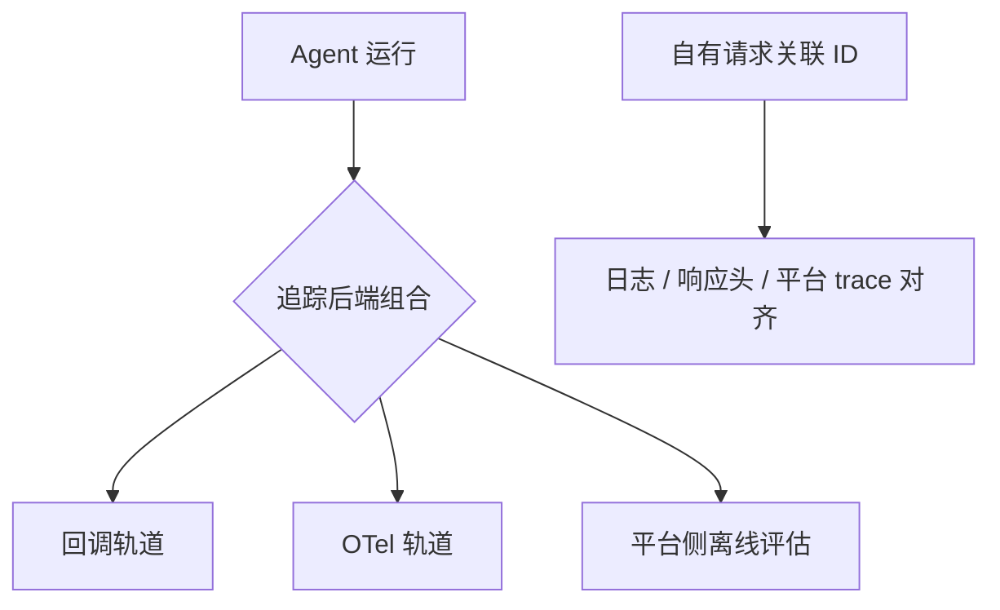
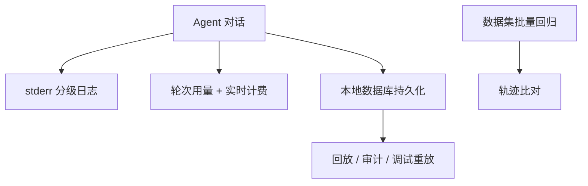
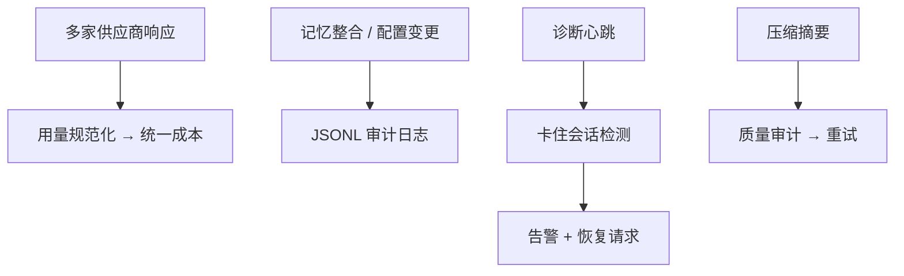
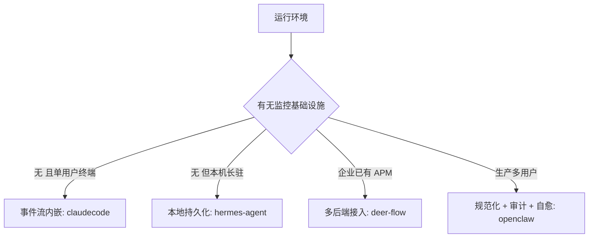

# 可观测性

## 读前思考

- 普通服务的错误大多是确定性的（代码缺陷 → 异常），Agent 的错误可能是"模型做了一个错误决策"。追踪一个"决策质量"问题，token 用量和延迟能告诉你什么，又不能告诉你什么？更进一步：系统有没有可能自己评估自己的输出质量，并在不达标时采取行动？
- 如果你的系统同时接入多家 LLM 供应商，每家返回的用量字段格式都不同（有的有缓存读取字段，有的没有；有的压根不返回用量），你怎么做统一的成本核算？

## 核心问题

可观测性解决的核心问题是：**让开发者与运维理解 Agent 的运行状态——token 用量、错误模式、决策路径、输出质量——同时不显著增加运行时开销，也不以泄露敏感信息为代价**。

需要划清的边界：会话持久化用于崩溃恢复、超时回收的用途属于状态管理主题（见各项目 04-state）；本篇只讨论同一份持久化数据的回放与审计用途。日志脱敏的具体手段属于安全护栏主题（见各项目 09-guardrails），本篇讨论"脱敏与观测的权衡"。

| 维度 | deer-flow | hermes-agent | openclaw | claudecode |
|------|-----------|--------------|----------|------------|
| 定位 | 接入企业已有 APM | 本机零依赖观测 | 生产级观测 + 自愈 | 零基础设施，终端即面板 |
| 形态 | 多追踪后端双轨 | 分级日志 + 本地数据库 | 事件广播 + 诊断遥测 | 事件流内嵌用量 |
| 评估立场 | 外包给追踪平台 | 离线批量回归 | 在线规则审计驱动行为 | 无 |

## 方案展示

### deer-flow：双轨追踪后端 + 自有请求关联 ID

deer-flow 把追踪做成"接入层"：LangSmith/Langfuse 走回调、Monocle 走 OTel，三种后端任意组合；另有一个独立于平台的请求关联 ID 打通 HTTP 头、日志与平台 trace，无凭据时静默降级不阻塞主流程。评估不内建，依赖追踪平台在上报的 trace 上做离线评分。机制细节见 docs/deer-flow/10-observability.md。



**为什么这么选**：企业客户的 APM 现状异构，框架适配已有设施比强制迁移现实；评估标准与企业业务强绑定，内建通用评分没人用，外包给平台后框架零维护。牺牲了双轨代码的维护成本和"无后端环境完全没有评估能力"。

### hermes-agent：本机零依赖 + 数据库回放

hermes-agent 假设运行在用户本机、没有任何监控基础设施：日志走 stderr 分级输出不干扰响应流，用量按轮次记录并实时计费（含缓存命中率），完整对话持久化到 SQLite（SessionDB）支持事后回放与审计——回放/审计用途归本篇，存储结构与崩溃恢复用途见 docs/hermes-agent/04-state.md。评估靠批量回归跑分：从数据集并行跑 Agent 产出轨迹，人工比对发现回归。机制细节见 docs/hermes-agent/10-observability.md。



**为什么这么选**：个人助手不能要求用户部署日志平台，一切观测手段必须开箱可用；SQLite 同时满足回放、SQL 聚合与并发读。牺牲了集中式查询能力（不能跨会话聚合分析），回归评估依赖离线数据集与人工比对。

### openclaw：多供应商规范化 + 审计 + 自愈

openclaw TS 版面对二十多家供应商的用量格式差异做统一规范化，再算成本桶；多处子系统用追加式 JSONL 做事件溯源审计（记忆整合、配置变更可追责可回滚）；诊断系统主动检测卡住会话并发出恢复请求；压缩摘要生成后有质量审计，不达标携带原因重试。Python 版是轻量对应物：事件广播到工作台 + 诊断报告，无规范化无自愈。机制细节见 docs/openclaw/10-observability.md。



**为什么这么选**：接入多家供应商的平台若无统一用量口径，成本报表就无法横向汇总；多用户生产环境不能等人工介入，静默失败（流式断开、工具死锁）必须主动发现；评估做成在线规则审计，是因为压缩每次都要跑、失败要能立刻修复。牺牲了诊断系统的复杂度，以及规则审计无法判断语义正确性。

### claudecode：事件流即观测

claudecode 没有独立观测模块：用量内嵌在轮次完成事件里，消费端顺手累加，/cost 命令读累加值；终端渲染就是面板；错误事件带可恢复标记决定呈现方式。全程约数百行分散代码。没有任何评估机制，统计随进程退出消失。机制细节见 docs/claudecode/10-observability.md。

```mermaid
graph LR
    A[主循环] --> B[轮次完成事件携带用量]
    B --> C[会话级累加器]
    C --> D[/cost 命令]
    A --> E[终端渲染即面板]
    A --> F[错误可恢复标记]
```

**为什么这么选**：CLI 用户坐在终端前，流式输出加错误提示已回答"系统在干什么"；观测数据依托既有事件协议，零埋点零依赖。牺牲了持久化、结构化查询、跨请求关联和一切评估能力。

## 横向对比

**岔路口一：基础设施假设决定观测形态。** 因为运行环境的监控设施不同，所以在"观测数据送往哪里"上分岔：claudecode 的用户就是终端前的自己，所以观测即渲染；hermes-agent 运行在本机，所以一切落本地文件；deer-flow 部署在企业里，所以对接已有 APM；openclaw 面向生产多用户，所以要自愈和可脱敏的支持包。

**岔路口二：成本敏感度决定用量追踪粒度。** 因为付费主体对成本的敏感度不同，所以在"追踪到多细"上分岔：claudecode 只累加总量（个人试用看个大概）；hermes-agent 到轮次加缓存命中率（个人付费要定位贵在哪轮）；deer-flow 按调用采集（企业要按用户/线程计费）；openclaw 做跨供应商规范化（平台要做统一会计）。

**岔路口三：谁需要事后追责决定审计形态。** 因为"出了事要查到谁/哪一步"的需求强度不同，所以在审计投入上分岔：claudecode 无审计（单用户自己负责）；hermes-agent 用数据库存完整对话（回放即审计）；openclaw 用追加式事件日志（记忆整合等有损操作必须可追责可回滚）；deer-flow 靠平台 trace 承载。

**岔路口四：评估发生在离线还是在线。** 因为评估结果要不要立即改变系统行为不同，所以在评估形态上分岔：只需事后分析就走离线（deer-flow 外包平台、hermes-agent 批量回归），需要在运行中纠偏就走在线规则审计（openclaw 压缩质量守卫与卡住检测），没有评估预算就不做（claudecode）。

| 岔路口 | deer-flow | hermes-agent | openclaw | claudecode |
|--------|-----------|--------------|----------|------------|
| 观测数据去向 | 企业 APM 后端 | 本机文件/数据库 | 事件总线 + 支持包 | 终端 |
| 用量追踪粒度 | 每次调用 | 轮次 + 缓存率 | 规范化 + 成本桶 | 会话总量 |
| 审计形态 | 平台 trace | 数据库回放 | JSONL 事件溯源 | 无 |
| 评估形态 | 离线外包 | 离线回归 | 在线规则审计 | 无 |
| 故障自愈 | 无 | 无 | 卡住检测 + 恢复请求 | 无 |



值得单独说的是脱敏：它是 openclaw 独有的深度投入，其他项目日志中可能含用户消息与 API key——本地使用可接受，多用户生产不可接受。脱敏损失观测信息，这笔账只有在"日志会被非当事人查看"时才必须付。

## 面试要点

**1. "事件流即观测"（claudecode 式）什么时候不够用？补上决策级追踪需要什么？**

参考答案方向：事件流回答"发生了什么"，回答不了"为什么"。决策级追踪需要当时的完整上下文（模型看到了什么）、推理内容与备选方案，且数据要跨进程存活——claudecode 的推理事件不落盘，hermes-agent 的深度 verbose 输出完整请求体、deer-flow 的平台 trace 分别覆盖了这条路径。判断标准是"要回答的问题在事实层还是决策层 × 数据需要存活多久"。

**2. 卡住会话自愈这类"系统自己诊断自己"的机制，阈值设计的核心矛盾是什么？**

参考答案方向：阈值短了误杀正常长操作（推理模型长思考、大工具执行），长了则真卡住的会话迟迟不被发现。缓解方向是按当前工作类型给不同宽限，而不是全局一个数。四项目里只有 openclaw 做了这一步，因为它是唯一"不能等人工介入"的生产形态。判断标准是"误判代价（中止正常工作）× 漏判代价（用户等待时长）× 是否有人工兜底"。

**3. 评估放离线（追踪平台打分、批量回归）还是在线（质量审计驱动重试），怎么选？**

参考答案方向：离线评估不打扰运行、可用复杂手段（LLM 裁判、人工标注），但发现问题滞后；在线评估能当场纠偏（摘要不合格就重试），但只能用便宜、确定性强的规则，否则每次运行都在为评估付费。deer-flow 和 hermes-agent 选离线，openclaw 在压缩这一高频有损操作上选在线，claudecode 不做。判断标准是"评估结果是否要改变当次运行 × 单次评估的成本与误判代价"。

**4. 多供应商用量规范化为什么必要？直接用各家原始格式会怎样？**

参考答案方向：各家字段名、口径、是否返回用量都不同，不规范化则成本代码要为每家写解析、新增供应商要改所有消费方；规范化后上层只读标准字段，新增供应商只加一个映射分支。代价是可能丢失供应商特有的计费维度。判断标准是"供应商数量 × 成本报表的消费方数量"——数量少时逐个解析反而简单。
