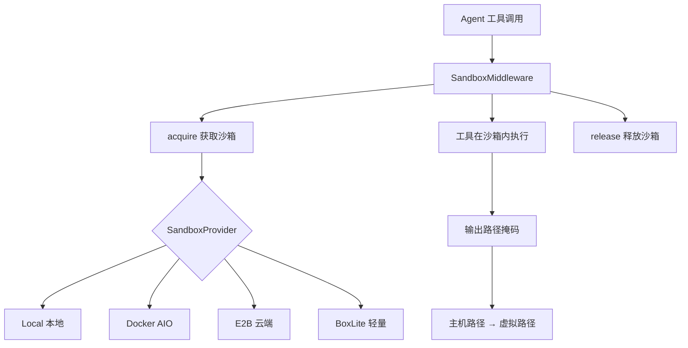
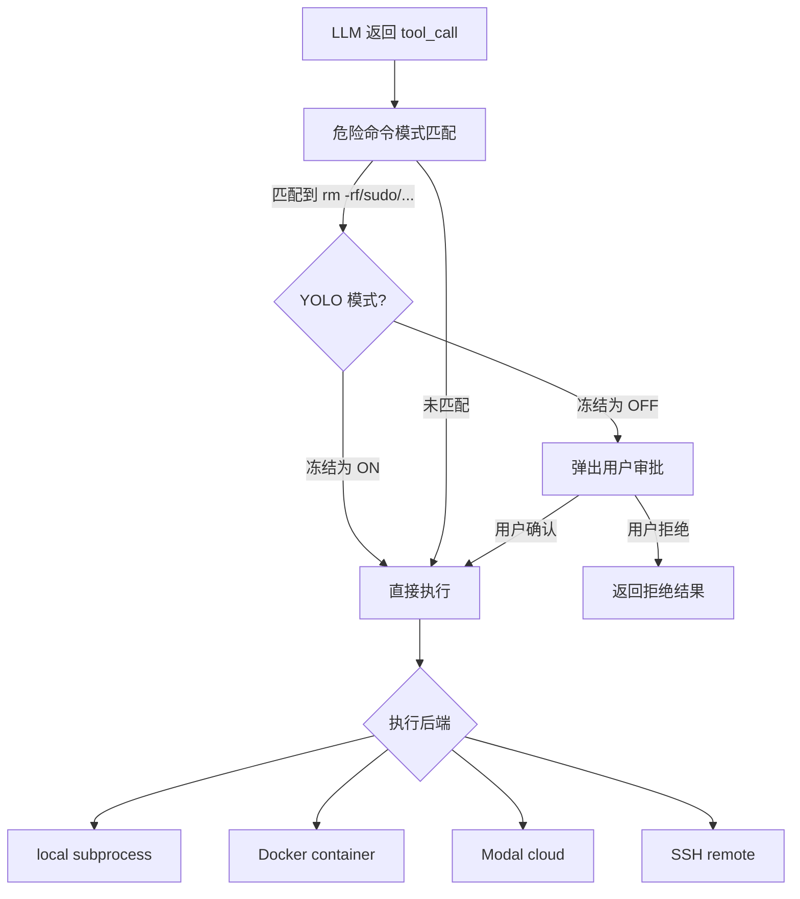
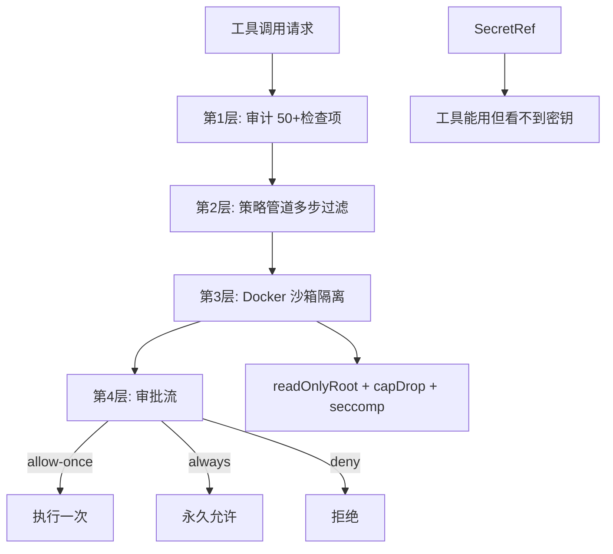
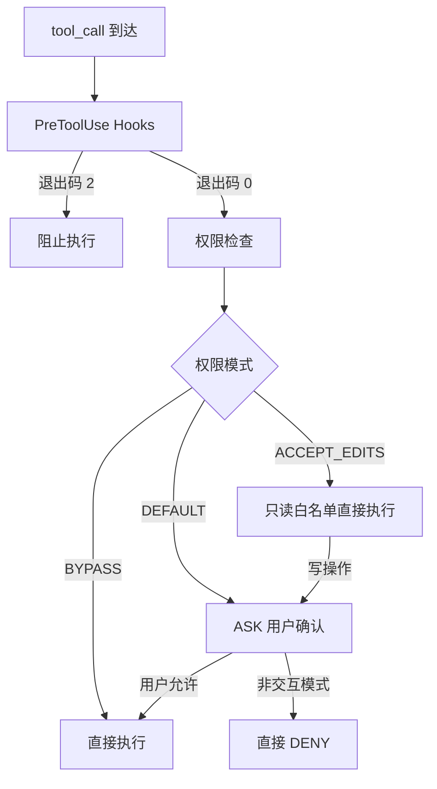
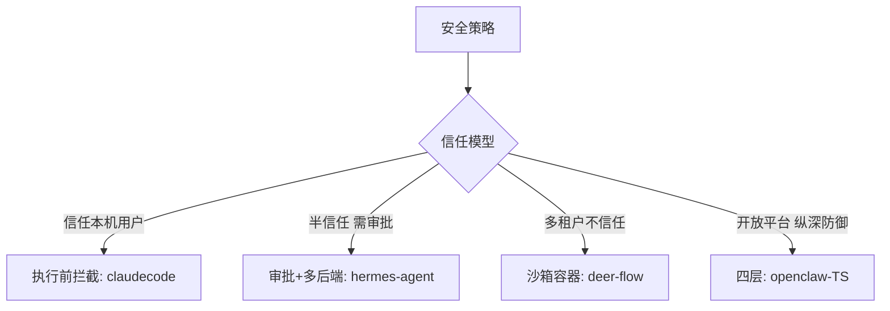

# 安全与沙箱

## 读前思考

- Agent 能执行 bash 命令、读写文件、访问网络。如果模型被 prompt injection 攻击（工具返回的内容中嵌入了恶意指令），你的安全边界画在哪里？是"执行前拦截"（检查命令是否危险）还是"执行时隔离"（在沙箱容器里跑，即使执行了也影响有限）？
- 密钥管理面临一个矛盾：工具需要 API key 才能工作，但你不希望模型"看到" key 的值（否则可能在回复中泄露）。怎么让工具"能用但看不到"？

## 核心问题

安全与沙箱解决的核心问题是：**如何在 Agent 拥有强大执行能力（shell、文件、网络）的前提下，防止误操作、恶意注入和密钥泄露，同时不过度限制 Agent 的工作能力。**

| 维度 | deer-flow | hermes-agent | openclaw-TS | claudecode |
|------|-----------|--------------|-------------|------------|
| 安全边界 | 执行时隔离（沙箱容器） | 执行前拦截（审批）+ 多后端 | 四层纵深防御 | 执行前拦截（权限 + Hooks） |
| 沙箱 | 4 种后端（Local/Docker/E2B/BoxLite） | 5 种执行后端 | Docker 容器隔离 | 无 |
| 密钥管理 | 环境变量黑名单清洗 | 多源 + 作用域隔离 | SecretRef 引用系统 | 环境变量 |
| 审批机制 | RBAC per-role | 危险命令模式匹配 | allow-once/always/deny | 三级权限模式 |
| 输出安全 | 路径掩码（主机→虚拟） | 凭证正则脱敏 | 日志脱敏 45.4KB | 无 |

## 方案展示

### deer-flow：沙箱容器 + 路径掩码

deer-flow 的安全核心是执行时隔离：SandboxMiddleware 驱动 acquire→use→release 生命周期，4 种后端（Local/Docker AIO/E2B/BoxLite）适配不同部署环境。环境变量双层黑名单清洗（通配模式 + 精确名称），输出路径掩码将主机真实路径替换为虚拟路径（/mnt/user-data/...），防止信息泄漏。LRU 缓存上限 256，double-check locking 线程安全单例。

**为什么这么选**：deer-flow 是多租户企业部署，用户之间不信任。即使模型被 prompt injection 攻击执行了 rm -rf，沙箱容器限制了爆炸半径——只影响当前用户的沙箱，不影响宿主机和其他用户。路径掩码防止模型通过工具输出推断主机目录结构。代价是沙箱的启动开销（Docker 容器创建需要秒级延迟），以及某些工具在沙箱内行为与本地不同（如网络访问受限）。

### hermes-agent：危险命令审批 + YOLO 冻结

hermes-agent 的安全核心是执行前拦截：approval.py 正则匹配危险命令（rm -rf、sudo、chmod 777），per-session ContextVar 隔离审批状态。YOLO 模式（HERMES_YOLO=1）在 import time 冻结——运行时 skill 无法通过 os.environ 注入绕过。多后端执行沙箱（local/Docker/Modal/SSH/Singularity），密钥多源管理（env/.env/keychain/OAuth）+ 作用域隔离。

**为什么这么选**：hermes 是个人助手，用户信任但模型可能被 prompt injection 误导。审批模式在"安全"和"流畅"之间取平衡——只拦截已知危险模式，其他命令直接执行。YOLO 冻结确保安全关键配置不可被运行时篡改。多后端让用户根据场景选择隔离级别（本地开发用 local，生产用 Docker）。代价是正则匹配覆盖不全（新的危险模式需要持续添加规则），且审批弹窗打断用户流程。

### openclaw-TS：四层纵深防御

openclaw TS 版实现四层纵深：审计（50+ 检查项结构化报告）→ 策略（多步过滤管道）→ 沙箱（Docker readOnlyRoot + capDrop + seccomp + 网络隔离）→ 审批（allow-once/always/deny）。SecretRef 引用系统让工具"能用但看不到"密钥值，secret-equal.ts 恒定时间比较防时序攻击，secret-mask.ts 日志掩码。sandbox/ 77 文件，secrets/ 129 文件。

**为什么这么选**：openclaw 是开放平台，第三方插件和外部输入都不可信。单层防御有突破风险（规则遍漏或沙箱逃逸），四层纵深确保任何单层失败都有下一层兆底。SecretRef 解决"工具需要密钥但模型不能看到"的矛盾。代价是 206 个安全相关文件的维护成本，以及审批流对用户体验的打断。

### claudecode：白名单 + 三级权限

claudecode 无代码执行沙箱，安全边界完全依赖执行前拦截。白名单 + 三级权限模式（BYPASS/ACCEPT_EDITS/DEFAULT），非交互模式 ASK 直接转 DENY（fail-fast）。三层拦截路径：Hooks（shell 命令退出码 2 阻止）→ 权限检查（frozenset 白名单匹配）→ 用户确认。子 Agent 不能执行 shell。

**为什么这么选**：claudecode 是本地 CLI，用户自己就是管理员。安全的目标不是"隔离用户"，而是"防止 LLM 误操作"——模型可能幻觉出一个 rm -rf 命令，权限系统确保用户有机会拒绝。非交互模式 fail-fast 是因为 CI/CD 场景中没有人可以确认，宁可拒绝也不能执行未知命令。代价是没有沙箱意味着一旦用户允许，命令可以做任何事——安全边界完全依赖用户的判断力。

## 横向对比

核心岔路口是**安全边界画在哪里**：

**安全投入与威胁模型正相关**。claudecode 的威胁是"LLM 误操作"（用户自己信任，只需防模型犯错），白名单 + 权限够用。hermes-agent 的威胁增加了"prompt injection 导致执行危险命令"，需要模式匹配审批。deer-flow 是多租户企业（用户之间不信任），需要容器隔离 + 路径掩码。openclaw-TS 是开放平台（第三方插件 + 外部输入都不可信），需要四层纵深。

## 面试要点

**1. "执行前拦截"（claudecode）和"执行时隔离"（deer-flow 沙箱），哪个更安全？各自的盲区是什么？**

参考答案方向：执行时隔离更安全——即使拦截遗漏了危险命令，沙箱容器限制了爆炸半径。执行前拦截的盲区是"规则覆盖不全"——新的危险命令模式（如 curl | sh）可能不在正则匹配中。执行时隔离的盲区是"沙箱逃逸"——容器漏洞可能让攻击者突破隔离。两者应该组合使用（纵深防御）：先拦截已知危险模式，再在沙箱中执行未知命令。claudecode 不做沙箱是因为它是本地 CLI——用户自己就是管理员，沙箱隔离的是谁？

**2. openclaw-TS 的 SecretRef（"能用但看不到"）是怎么实现的？如果模型通过工具组合（如 echo $SECRET > /tmp/leak && cat /tmp/leak）绕过怎么办？**

参考答案方向：SecretRef 将密钥值存在独立存储中，工具通过引用 ID 获取密钥（如 secret_ref: "openai_key"），工具的输入参数中只有引用 ID 而非明文。模型看不到密钥值，只看到"这里有一个叫 openai_key 的引用"。绕过问题：如果模型能执行 shell 命令，确实可以通过环境变量或文件系统间接获取密钥。openclaw 的缓解是沙箱中不注入明文密钥（只有工具进程内部通过 SDK 获取），加上 safe-bins 白名单限制可执行的命令。

**3. hermes-agent 的 YOLO 模式为什么要在 import time 冻结？如果允许运行时切换会有什么安全风险？**

参考答案方向：import time 冻结确保 YOLO 状态在进程启动时确定，之后不可更改。如果允许运行时切换，恶意 skill 可以通过 os.environ["HERMES_YOLO"] = "1" 在运行时启用 YOLO 模式，绕过所有危险命令审批。冻结后，即使 skill 修改了环境变量，审批逻辑读取的是冻结时的值。这是一个"最小权限 + 不可变性"的安全设计——安全关键的配置在启动时确定，运行时不可篡改。

