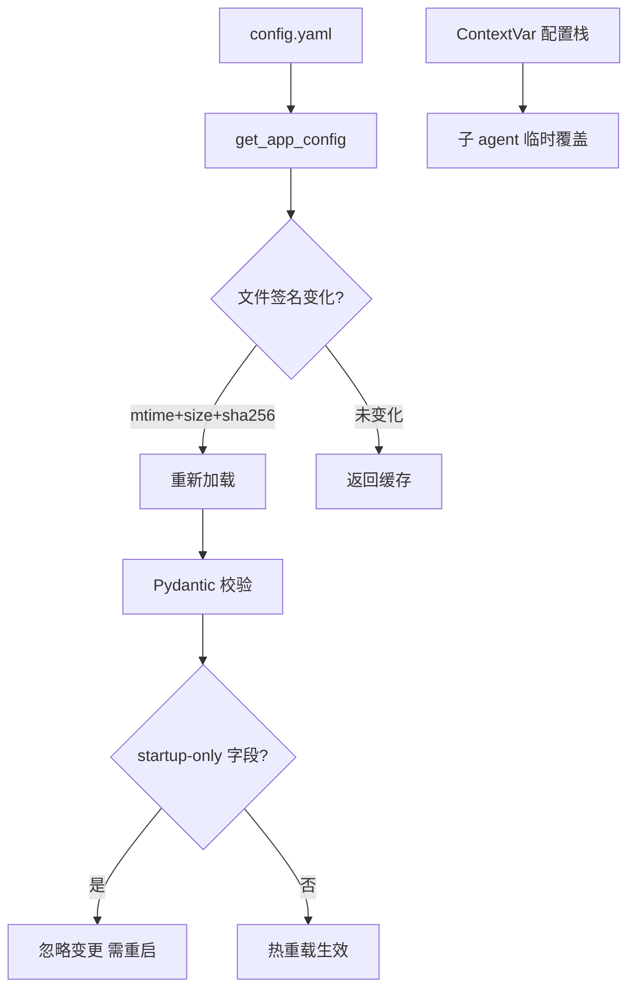
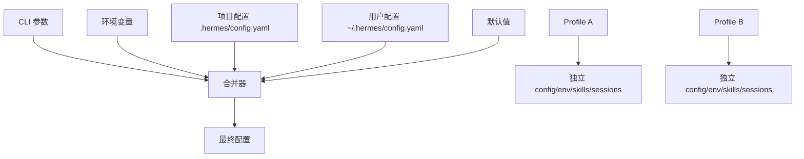
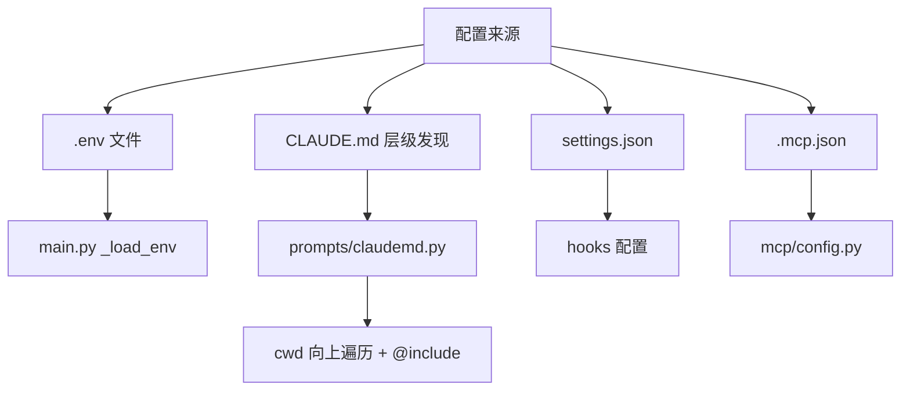
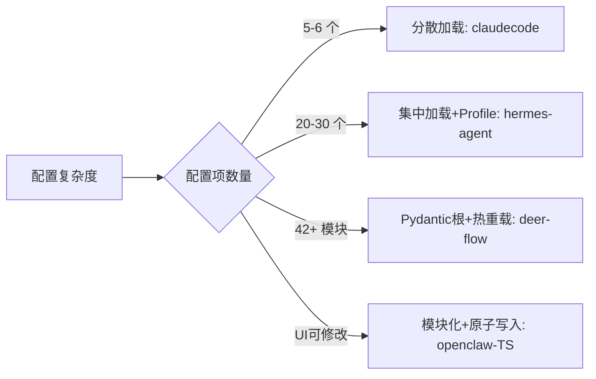

# 配置与环境管理

## 读前思考

- 一个 Agent 系统的配置可能来自 5 个层级（CLI 参数 > 环境变量 > 项目配置 > 用户配置 > 默认值）。当这些层级冲突时，优先级怎么定？如果用户在 UI 中改了配置，写回到哪一层？
- 配置热重载看似美好（改了配置文件不用重启），但某些配置（如数据库连接池大小、模型 provider）在运行时切换会导致状态不一致。你怎么划分"可热重载"和"必须重启"的边界？

## 核心问题

配置管理解决的核心问题是：**如何从多个来源合并配置、处理优先级冲突、支持热重载（在安全的前提下）、并让配置变更可追踪可回滚。**

| 维度 | deer-flow | hermes-agent | openclaw-TS | claudecode |
|------|-----------|--------------|-------------|------------|
| 配置集中度 | Pydantic 根节点集中管理 | 五层优先级链集中加载 | $include 模块化 + 所有权追踪 | 完全分散（各模块自行加载） |
| 热重载 | 文件签名三重检测 + startup-only 边界 | mtime 失效 + /config set | 原子写入 + clobber 快照 | 仅 /model 命令 |
| 多环境 | ContextVar 配置栈（子 agent 覆盖） | 多 Profile 完全隔离 | 多代理目录 | 无 |
| 安全 | $VAR 环境变量递归解析 | 敏感信息分离到 .env/keychain | 环境变量引用保留（写回时恢复 ${VAR}） | .env 硬编码 3 个 key |
| 代码规模 | AppConfig + reload_boundary.py | hermes_cli/config.py | io.ts 3082 行 + zod-schema 49.2KB | 无集中模块 |

## 方案展示

### deer-flow：热重载 + startup-only 边界

deer-flow 用 Pydantic 根节点集中管理 42+ 模块配置。get_app_config() 每次调用检查文件签名（mtime+size+sha256 三重检测），变化时重新加载。reload_boundary.py 显式注册 12 个 startup-only 字段（如 checkpointer mode），这些字段变更需要重启。ContextVar 配置栈支持子 agent/嵌入场景临时覆盖。$VAR 环境变量递归解析，缺失时 raise ValueError（fail-fast）。



**为什么这么选**：42+ 模块的配置如果每次修改都要重启服务，运维成本太高。热重载让大部分配置变更即时生效。但某些配置（如 checkpointer mode）运行时切换会导致状态不一致，必须显式标记为 startup-only。三重签名检测比纯 mtime 更可靠（避免同秒编辑、git checkout 恢复旧时间戳等盲区）。

### hermes-agent：五层优先级 + 多 Profile

hermes-agent 的配置按五层优先级合并（CLI > 环境变量 > 项目配置 > 用户配置 > 默认值）。多 Profile 完全隔离（独立 config/env/skills/sessions），敏感信息分离到 .env/keychain。JSON Schema 验证结构，配置版本检测 + 自动迁移脚本，hermes config diff/show 诊断命令。



**为什么这么选**：hermes 在多种场景下使用（CLI/gateway/cron），每个场景可能需要不同配置。多 Profile 让"工作"和"个人"完全隔离，不会互相干扰。五层优先级是 git 多级配置的同一设计思路——越具体的来源优先级越高。代价是配置诊断复杂度增加（用户不知道某个值从哪层来），hermes config diff/show 命令就是为了解决这个问题。

### openclaw-TS：$include 模块化 + 原子写入

openclaw TS 版的配置系统最复杂：$include 模块化让配置分散在多个文件中（写回时通过所有权追踪知道修改哪个文件），环境变量引用保留（写回时恢复 ${VAR} 防止明文密钥泄露到文件），原子写入（临时文件→rename）+ clobber 快照（last-known-good 恢复）。zod-schema.ts 49.2KB 运行时校验。

Python 版是实用主义（loader.py ~200 行，单文件 JSON5，extra="allow" 前向兼容）。

```mermaid
graph TB
    A[主配置文件] --> B[$include 解析]
    B --> C[模块 A.json]
    B --> D[模块 B.json]
    B --> E[模块 C.json]
    C --> F[所有权追踪]
    D --> F
    E --> F
    F --> G[UI 修改配置]
    G --> H[写回到对应模块文件]
    H --> I[原子写入 + 备份轮转]
    J[环境变量引用] --> K[写回时恢复 ${VAR}]
```

**为什么这么选**：openclaw 支持 UI 修改配置，需要知道"这个配置项在哪个文件里"才能写回正确位置。$include 模块化让不同功能团队的配置分离（模型配置、通道配置、插件配置各自独立）。环境变量引用保留是安全考量——配置文件可能被 git 提交，不能包含明文密钥。代价是 io.ts 3082 行的复杂度和配置调试难度。

### claudecode：分散加载——无集中配置

claudecode 没有统一的 Config 类，各模块自行加载：main.py 硬编码 3 个 key 的 .env 合并，prompts/claudemd.py 做 CLAUDE.md 层级发现（从 cwd 向上遍历 + @include 递归展开，max_depth=10 + seen 集合防循环），mcp/config.py 加载 MCP 配置。唯一支持"热重载"的是 /model 命令（运行时切换模型）。



**为什么这么选**：claudecode 只有 5-6 个配置项（API key、base_url、model、MCP 服务器、hooks、CLAUDE.md），不需要集中管理。CLAUDE.md 的层级发现（类似 .editorconfig）让项目级指令自然融入——clone 项目后自动获得团队规范。代价是用户不知道"所有配置在哪"，没有统一的配置文档和验证。

## 横向对比

核心岔路口是**配置的"集中度"和"动态度"**：



**热重载的边界划分**是 deer-flow 独有的设计关注。其他项目要么不支持热重载（claudecode），要么只支持部分配置的运行时修改（hermes 的 /config set 仅当前 session）。deer-flow 的 reload_boundary.py 显式声明"哪些配置不能热重载"，这比"全部不能"或"全部能"都更精确。

## 面试要点

**1. openclaw-TS 的"环境变量引用保留"（写回时恢复 ${VAR}）解决了什么问题？如果不做这个处理会怎样？**

参考答案方向：用户在 UI 中修改配置时，如果配置值中包含环境变量引用（如 api_key: ${OPENAI_KEY}），写回文件时必须保留 ${OPENAI_KEY} 而非替换为实际值。否则明文密钥会被写入配置文件（可能被 git 提交、被其他用户读取）。这个设计假设"配置文件可能被版本控制或共享"，是安全考量驱动的设计。

**2. deer-flow 的 startup-only 边界（12 个字段不热重载）是怎么确定的？如果划分错了会怎样？**

参考答案方向：划分标准是"运行时切换是否会导致状态不一致"。比如 checkpointer mode（sqlite/postgres）切换会导致已有 checkpoint 无法读取，model provider 切换会导致进行中的请求失败。如果错误地把 startup-only 字段标为可热重载，用户修改后系统可能在运行时崩溃。如果错误地把可热重载字段标为 startup-only，用户需要不必要的重启。deer-flow 用 reload_boundary.py 显式注册（而非自动推断），是因为这个判断需要领域知识，无法自动化。

**3. claudecode 的"无集中配置"在什么规模下会成为问题？如果配置项增长到 30 个会怎样？**

参考答案方向：30 个配置项分散在各模块中，用户不知道"所有配置在哪"——需要读源码才能发现有哪些可配置项。没有统一的验证（各模块自行解析，错误格式在不同时机报不同错误），没有统一的文档生成，没有"配置 diff"能力（不知道当前配置与默认值的差异）。迁移方向：引入一个 Config dataclass 做集中声明（类似 deer-flow 的 AppConfig），各模块从 Config 读取而非自行加载。

