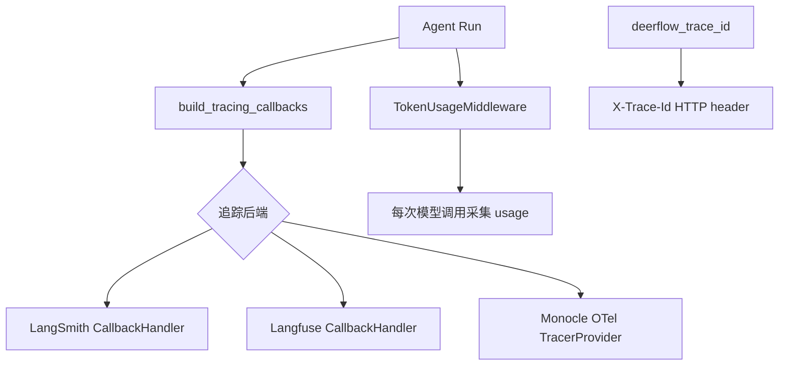
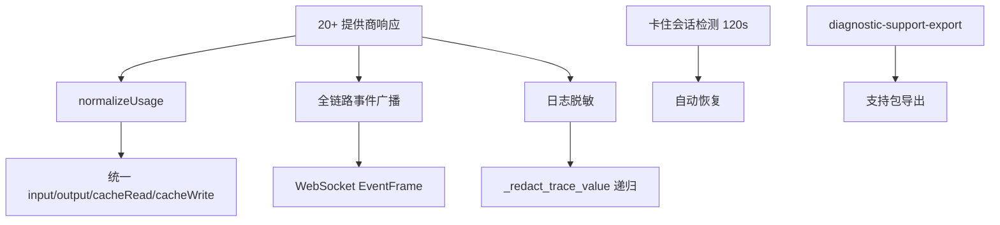
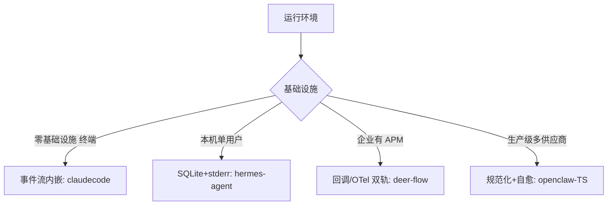

# 可观测性

## 读前思考

- Agent 系统的调试比普通服务难在哪里？普通服务的错误是确定性的（代码 bug → 异常），Agent 的错误可能是"模型做了错误的决策"——你怎么追踪一个"决策质量"问题？token 用量和延迟能告诉你什么，不能告诉你什么？
- 如果你的 Agent 同时使用 5 个不同的 LLM 提供商，每个提供商返回的 usage 格式都不同（有的有 cache_read_tokens，有的没有；有的按字符计费，有的按 token 计费），你怎么做统一的成本核算？

## 核心问题

可观测性解决的核心问题是：**如何让开发者和运维人员理解 Agent 的运行状态——包括 token 用量、延迟分布、错误模式、决策路径——同时不显著增加运行时开销。**

| 维度 | deer-flow | hermes-agent | openclaw-TS | claudecode |
|------|-----------|--------------|-------------|------------|
| 追踪方案 | 回调 vs OTel 双轨（LangSmith/Langfuse/Monocle） | 分级日志 + SessionDB | 全链路事件广播 + 诊断支持包 | 事件流内嵌 usage（零基础设施） |
| Token 追踪 | TokenUsageMiddleware 采集 | per-turn 追踪 + 实时计费 | 多供应商规范化（20+ 种格式） | TurnComplete 携带 Usage |
| 日志 | 结构化 JSON + trace_id 注入 | stderr 分级（不干扰 stdout） | 脱敏 45.4KB + 结构化 | Python logging（无结构化） |
| 调试支持 | deerflow_trace_id 请求关联 | -vv TRACE 输出完整 API body | 卡住会话自愈 + 支持包导出 | /cost 命令 |
| 代码规模 | tracing/ 目录 | hermes_logging + usage_pricing + stream_diag | diagnostic.ts 1381 行 + usage.ts 375 行 | ~200 行（分散） |

## 方案展示

### deer-flow：回调 vs OTel 双轨

deer-flow 支持两种追踪后端：LangSmith/Langfuse 用 CallbackHandler（per-run 构造回调），Monocle 用 OTel TracerProvider。deerflow_trace_id 作为独立请求关联 ID 通过 X-Trace-Id HTTP header 传播。TokenUsageMiddleware 在中间件链中采集每次模型调用的 token 用量。无凭据时静默降级（不阻塞主流程）。JsonTraceFormatter 结构化输出，TraceContextFilter 日志注入 trace_id。



**为什么这么选**：企业已有不同的 APM 基础设施（有的用 LangSmith，有的用 Langfuse，有的用 OTel 兼容的 Jaeger）。双轨设计让 deer-flow 接入已有基础设施，而非强制用户采用特定方案。无凭据时静默降级确保追踪配置错误不会阻塞主流程。代价是两套追踪代码的维护成本。

### hermes-agent：零依赖 + 实时计费

hermes-agent 的可观测性假设零外部基础设施：日志输出到 stderr（不干扰 stdout 响应流），per-turn Token 用量追踪 + usage_pricing.py 实时计费（/usage 命令查看费用），SessionDB（SQLite）完整对话持久化支持事后回放。stream_diag.py 做流式诊断（chunk 数/CF-Ray/首 token 延迟），cache_read_tokens 单独追踪（prompt cache 命中率）。-vv TRACE 级别输出完整 API body。

```mermaid
graph TB
    A[Agent 对话] --> B[stderr 分级日志]
    A --> C[usage_pricing 实时计费]
    A --> D[SessionDB SQLite 持久化]
    A --> E[stream_diag 流式诊断]
    C --> F[/usage 命令查看费用]
    D --> G[事后回放]
    E --> H[chunk数/CF-Ray/首token延迟]
    I[cache_read_tokens] --> J[prompt cache 命中率]
```

**为什么这么选**：个人助手运行在用户本机，不能假设有 Jaeger/Prometheus 等基础设施。stderr 输出不干扰 stdout 响应流（管道模式下 stdout 是数据通道）。SQLite 持久化让对话可回放（"上次那个任务你是怎么做的？"）。cache_read_tokens 单独追踪是因为 prompt cache 命中率直接影响成本。代价是没有集中式查询能力（不能跨 session 聚合分析）。

### openclaw-TS：多供应商规范化 + 自愈

openclaw TS 版面对 20+ 种 LLM 提供商的 usage 格式差异，用 normalizeUsage 统一为 {input, output, cacheRead, cacheWrite, reasoningTokens}。全链路事件广播（每阶段推 WebSocket EventFrame），日志脱敏（_redact_trace_value 递归脱敏，可观测性不以安全为代价）。卡住会话检测（120s 阈值）+ 自动恢复，diagnostic-support-export.ts 23.2KB 导出支持包。



**为什么这么选**：多供应商平台的成本核算必须规范化——OpenAI 返回 prompt_tokens，Anthropic 返回 input_tokens，Gemini 返回 promptTokenCount，不规范化就无法统一计费。日志脱敏是多用户生产环境的必须（运维人员可能查看日志，不能看到用户消息和 API key）。卡住会话自愈是因为生产环境不能等人工介入。代价是 1381 行 diagnostic.ts 的复杂度。

### claudecode：事件流即观测——零额外基础设施

claudecode 没有独立的可观测模块。TurnComplete 事件携带 Usage 对象（input_tokens/output_tokens/cache 统计），REPL 消费事件时累加 total_input/output_tokens，/cost 命令一行代码读取累加值。UI 即观测面板——Rich 终端渲染就是 dashboard。ErrorEvent.is_recoverable 区分致命/瞬时错误。总计约 200 行分散代码。

```mermaid
graph LR
    A[query_loop] --> B[TurnComplete 事件]
    B --> C[Usage: input/output/cache]
    C --> D[REPL 累加器]
    D --> E[/cost 命令]
    A --> F[TextDelta]
    F --> G[Rich 逐字渲染 = dashboard]
    A --> H[ErrorEvent]
    H --> I[is_recoverable 区分]
```

**为什么这么选**：CLI 工具的可观测性不需要集中式日志或追踪后端——终端就是 dashboard，用户直接看到流式输出和错误信息。事件流内嵌 usage 让 token 统计零额外开销（不需要中间件或回调）。代价是没有持久化（进程退出后统计丢失），没有结构化日志（不能做事后分析），没有 trace ID（不能关联多个请求）。

## 横向对比

核心岔路口是**可观测性的"基础设施假设"**：



**Token 用量追踪的精细度**与成本敏感度正相关。claudecode 只追踪总量（/cost 看个大概）。hermes-agent 追踪 per-turn + cache 命中率（个人助手需要控制成本）。deer-flow 通过中间件采集每次调用（企业需要按用户/线程计费）。openclaw-TS 做 20+ 种格式规范化（多供应商平台需要统一会计）。

**日志脱敏**是 openclaw-TS 独有的深度关注。其他项目的日志中可能包含 API key、用户消息等敏感信息（本地使用可接受），openclaw-TS 面向多用户生产环境，日志可能被运维人员查看，必须脱敏。

## 面试要点

**1. claudecode 的"事件流即观测"方案在什么场景下不够用？如果需要追踪"模型为什么做了这个决策"需要什么？**

参考答案方向：事件流只能告诉你"发生了什么"（调了哪个工具、用了多少 token），不能告诉你"为什么"（模型为什么选了工具 A 而非 B）。追踪决策需要：(a) 完整的 prompt 记录（模型看到了什么上下文）；(b) thinking/reasoning 内容（模型的推理过程）；(c) 工具选择的备选方案（模型是否考虑了其他工具）。hermes-agent 的 -vv TRACE 输出完整 API body 就是做这个的。deer-flow 的 LangSmith 集成可以记录完整的 prompt→response 链路。claudecode 的 ThinkingDelta 事件部分覆盖了 (b)，但没有持久化。

**2. openclaw-TS 的"卡住会话自愈"（120s 阈值）是怎么判断"卡住"的？误判的风险是什么？**

参考答案方向：判断标准是"120 秒内没有新的 API 响应 chunk 或工具执行进度"。误判风险：(a) 推理模型（如 o1）的首 token 延迟可能超过 120 秒（正常思考时间被误判为卡住）；(b) 大型工具执行（如编译一个项目）可能超过 120 秒（正常执行被误判）。缓解：deer-flow 用 stream_chunk_timeout=240s 适配推理模型，openclaw-TS 的 classifySessionAttention 分类会话状态（区分"等待模型"和"等待工具"）。

**3. 多供应商 Token 用量规范化（openclaw-TS 的 normalizeUsage）为什么是必要的？如果直接用各提供商的原始格式会怎样？**

参考答案方向：不同提供商的 usage 格式差异巨大：OpenAI 返回 prompt_tokens/completion_tokens，Anthropic 返回 input_tokens/output_tokens + cache_creation_input_tokens/cache_read_input_tokens，Gemini 返回 promptTokenCount/candidatesTokenCount，有些提供商根本不返回 usage。如果不规范化，成本核算代码需要为每个提供商写一套解析逻辑，新增提供商时需要修改所有消费方。normalizeUsage 统一为 {input, output, cacheRead, cacheWrite, reasoningTokens} 后，上层代码只需要读标准字段。代价是规范化可能丢失提供商特有信息（如 Anthropic 的 cache_creation 和 cache_read 的区分在规范化后可能被合并）。

