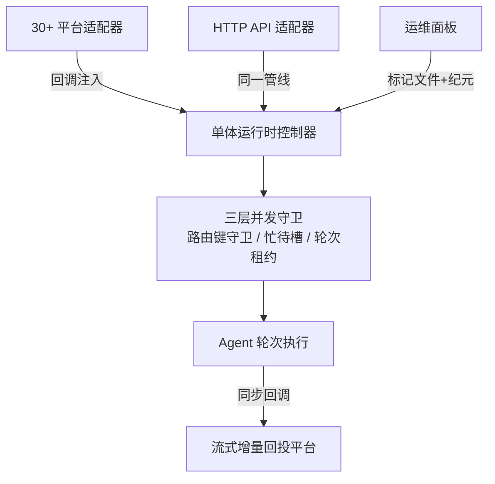
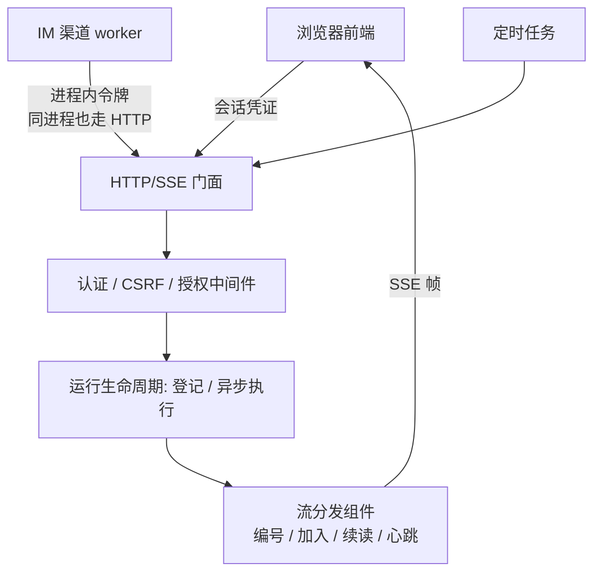
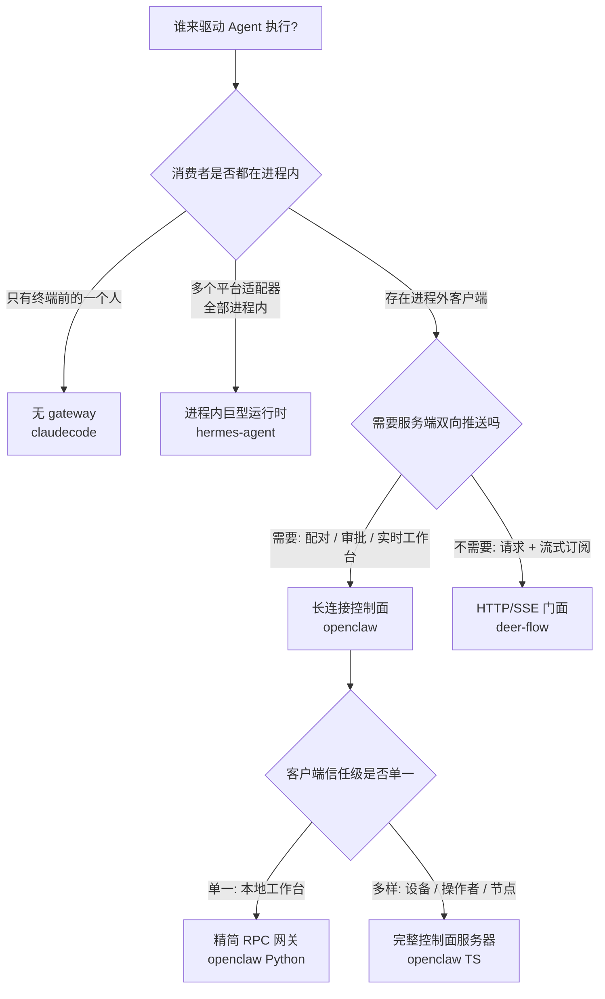

# Gateway/对外服务层

## 读前思考

- Agent 内核写好了，"让别人用上它"这一层该做多重？四个项目给出了从"完全没有 gateway"到"400+ 文件的控制面服务器"的四种答案。如果内核的能力完全相同，是什么约束决定了这一层的重量？
- 先做个预测：如果一个 Agent 只服务一个本地用户、同时挂 30 个聊天平台，它的对外服务层应该是一个独立的服务器进程，还是根本不需要独立存在？

## 核心问题

Gateway 解决的核心问题是：**以什么形态、什么协议、什么信任假设，把 Agent 的执行能力暴露给进程外的调用方，并把运行时产生的事件安全地送回去。** 内核决定"Agent 能做什么"，gateway 决定"谁能用、怎么接入、事件发给谁"。

五个形态的定位差异：

| 形态 | 项目 | 一句话定位 | 部署假设 |
|------|------|-----------|---------|
| 进程内巨型消息运行时 | hermes-agent | 不开任何对外协议端口，一个单体控制器在一个进程内管理 30+ 平台适配器的全部收发与执行 | 单实例个人助手，常驻、无外部控制面 |
| 长连接控制面服务器 | openclaw TS 版 | 连接接入、认证、RPC 方法面、事件广播全部收敛到一个 WebSocket 控制面 | 多客户端、多角色、多设备的个人助理 |
| 精简 RPC 网关 | openclaw Python 版 | 轻量 WebSocket 方法注册表 + 运行时契约导出，握手即信任 | 本地单工作台 |
| 唯一 HTTP/SSE 门面 | deer-flow | harness 运行时只有一个 HTTP 入口，连自家进程内渠道也必须走它 | 多用户、多调用方、可水平部署 |
| 无 gateway | claudecode | 纯终端 REPL 内核；但主循环以事件迭代器输出，控制面天然可替换 | 单用户、单终端 |

注意这五种形态不是"功能多少"的递进，而是对同一个问题在不同约束下的不同回答。下面按统一维度展开：服务形态、协议面、认证信任模型、事件扇出治理、与 Agent 核心的接口。

## 方案展示

### hermes-agent：进程内巨型消息运行时

hermes-agent 的回答最反直觉：**它没有对外协议，gateway 就是运行时本身**。约 2.4 万行的单体控制器通过 Mixin 组合与回调注入，把 30+ 平台适配器的装配、消息路由、会话并发控制全部吸收进一个对象——适配器只拿到几个函数引用，不需要知道网关内部结构；控制器只编排生命周期，不了解平台连接细节。并发正确性靠三层守卫保证：按路由键的入口守卫、面向交互体验的忙/待槽、以及按解析后会话 ID 的轮次租约（三层各自解决什么问题、为什么不能合并，详见 docs/hermes-agent/14-gateway.md）。

更特别的是它的生命周期立场：运行中的进程**没有任何外部控制通道**，排空重启这类运维指令只能通过标记文件送达，标记携带实例纪元以区分"重启机器"和"重启进程"；配套还有缩零休眠、关停取证、重启熔断一整套"无控制面也要可运维"的工程（机制细节详见 docs/hermes-agent/14-gateway.md）。甚至连 OpenAI 兼容的 HTTP API 也不是独立服务，而是被做成了"又一个平台适配器"，和聊天消息走完全相同的管线、受完全相同的并发保护。

**为什么这么选**：个人助手的所有调用方（30+ 平台 + HTTP API）都在同一个进程内，把新入口建模为"又一个平台"可以零成本复用路由、授权、忙时守卫；不开控制端口则把生命周期攻击面降到零。**牺牲了什么**：全部状态共享同一个事件循环和命名空间，无法多实例水平扩展；标记文件契约是单进程语义，多实例部署下整套生命周期工程需要重做；HTTP 的无状态语义要挤进面向聊天建模的事件结构，靠额外的会话头打补丁。

### openclaw TS 版：长连接控制面服务器

openclaw TS 版把 gateway 做成了一个真正的**中央控制面**：前端工作台、配对中的新设备、计算节点、IM 通道，全部通过同一种帧协议进出。协议是单一来源的：请求帧、响应帧、事件帧三种帧形在独立的协议包里定义一次，服务端校验、客户端类型、文档导出全部从同一份声明推导，握手确认帧一次下发方法清单、事件清单、状态快照和流控策略（协议结构与双实现如何对齐，详见 docs/openclaw/14-gateway.md）。

事件广播是它治理最重的一层：每种事件声明所需的访问级别，配对中的设备看不到任何会话内容；未声明的事件默认拒绝，把"新增事件忘写声明"的错误方向从信息泄露扭转为静默失联。慢消费者有明确的背压策略——可丢的高频事件直接跳过并推进序号，不可丢的事件直接断开让客户端重连后靠状态快照追齐。认证支持四种模式并只针对失败计数限流；审计面刻意只记元数据、schema 结构上就没有内容字段的位置（详见 docs/openclaw/14-gateway.md）。

**为什么这么选**：它的客户端角色天然多样——操作者、陌生设备、计算节点的信任级完全不同，且需要服务端**主动推送**（配对进度、审批请求、实时轨迹），HTTP 请求-响应表达不了这种双向性，长连接控制面是必然。**牺牲了什么**：协议包随主项目演进膨胀成所有客户端的公共依赖；事件-作用域守卫表本身成了必须持续维护的安全资产，声明错误的代价是泄露或失联。

### openclaw Python 版：精简 RPC 网关

Python 版是同一个问题的**轻量化回答**：基于 FastAPI 的 WebSocket 端点，约 20 个方法的注册表覆盖配置、会话、执行、通道状态；帧与方法参数用数据模型定义即契约，运行时开放 schema 端点把 JSON Schema 直接从当前校验模型导出——前端拿到的契约就是服务端正在执行的那一份，不存在文档过时。广播则是全量 fan-out：遍历所有连接逐个发送，没有作用域过滤也没有背压。

握手阶段校验协议版本区间后直接置为已认证，不做凭据核验——这是写明了的本地部署假设，不是遗漏：握手协议结构本身是完整的，省掉的只是凭据核验这一步，将来要补认证和过滤时协议层不必改动。另一处值得注意的设计是按消息来源选工具策略：远程通道入口只能拿到受限工具集，本地入口才有全量能力，被禁用工具的存在本身也对模型隐瞒（详见 docs/openclaw/14-gateway.md）。

**为什么这么选**：部署形态是开发者笔记本或内网单实例，能建连的默认都是可信方，作用域过滤要解决的那个问题在这里根本不存在，做了就是纯成本。**牺牲了什么**：假设边界很硬——端口一旦离开环回进入不可信网络，无凭据握手加全量广播意味着任何能建连的人都能看到所有会话内容。

### deer-flow：harness 的唯一 HTTP/SSE 门面

deer-flow 把 gateway 做成了**系统的边界定义**：浏览器前端、IM 渠道、定时任务全部走同一套 LangGraph 兼容的 HTTP API。最能说明立场的是自家渠道——渠道管理器和 gateway 在同一个进程里，本可以拿运行时引用直接调用，实际上却构造了一个指向自家 gateway 的 HTTP 客户端，带进程内令牌和 CSRF 配对，和外部集成方没有任何区别。事件侧由一个流分发组件隔开生产与消费：每个事件带单调编号，客户端可以中途加入一个正在进行的运行、断线后从最后编号续读，进程重启时为孤儿运行补发结束信号，不让任何连接永久挂起（执行流与边界分支详见 docs/deer-flow/14-gateway.md）。

配置走双轨：持有启动期单例的组件绑定启动快照、重启才生效；无状态字段按请求重新解析、改完立即生效。认证栈 fail-closed：全局中间件对所有非公共路径强制校验，首次启动要求运维手动创建管理员而不是自动建号，存量升级时把无属主的孤儿会话批量迁移到管理员名下。

**为什么这么选**：统一入口让认证、授权、追踪、CSRF 这些横切关注点只实现一次，任何新调用方自动继承；渠道复用官方 SDK，行为与外部集成方一致，消灭了"内部直调路径没测试"的盲区。**牺牲了什么**：每次渠道调用多一跳本地往返和两次序列化；耦合方向反转——渠道依赖 HTTP 服务可用，gateway 重启期间同进程的渠道也一起不可用；兼容协议继承了 LangGraph 平台的概念负担，部分资源只是占位实现。

### claudecode：无 gateway——进程形态决定的，不是缺失

诚实的结论：**claudecode 没有 gateway，也不需要有**。它是纯终端 REPL 内核，唯一的"调用方"就是坐在终端前的那一个人，交互是同步的——输入一条、执行完、再输入下一条，不存在并发会话、不存在多客户端、不存在需要推送的旁观者。在这个进程形态下，gateway 要解决的每个问题（谁能接入、事件发给谁、并发怎么隔离）都不存在，加一个服务层只会凭空引入认证、会话管理这些没有需求对象的复杂度。

但这不等于架构上没有留口。它的主循环（query_loop）以异步事件迭代器的形式输出执行过程，"谁来消费这些事件"从一开始就是控制面的问题而不是内核的问题——终端 REPL 只是当前挂载的那个消费者。如果将来要接入 WebSocket 服务面，替换的是消费者，内核一行不改（这个扩展性在 docs/claudecode/09-channels.md 中已有讨论）。**牺牲了什么**（或者说当前的边界）：没有多用户支持、没有认证、没有并发会话——这些不是欠账，是它的进程形态此刻不需要的东西。

## 横向对比

### 岔路口对比表

| 岔路口 | hermes-agent | openclaw TS 版 | openclaw Python 版 | deer-flow | claudecode |
|--------|-------------|---------------|-------------------|-----------|-----------|
| 事件扇出治理 | 同步回调桥：工作线程增量进阻塞队列，事件循环侧缓冲节流后回投原平台 | 按作用域守卫 + 慢消费者背压，未声明事件默认拒绝 | 全量 fan-out，无过滤无背压 | 按运行订阅：事件编号支持中途加入与断点续读 | 不存在扇出，终端直接消费迭代器 |
| 信任模型 | 配对码：低熔断值人工流程，短寿命 + 低尝试次数 | 四种认证模式 + 只针对失败的限流 + 仅元数据审计 | 握手直接信任（本地部署假设） | fail-closed 用户体系：会话凭证 + 属主隔离 + 首启建管 | 无认证（单终端用户即全部信任域） |
| gateway↔Agent 接口 | 直接对象引用 + 同步回调：Agent 在工作线程执行，增量同步回投 | 异步事件帧：运行时事件翻译成协议帧再广播 | 异步事件帧：运行时事件翻译后双路分发（广播 + 发起者回调） | 运行时引擎 + 资源模型：HTTP 连接与后台执行彻底解耦 | 事件迭代器：内核的原生输出即是接口 |
| 生命周期治理 | 标记文件 + 实例纪元、关停取证、重启熔断——无控制面也要可运维 | 通道账号作为被监管任务：并发限制、退避重启、断路器 | 从简：逐账号启动，单个失败不阻塞 | 关停排空窗口 + 启动期孤儿运行清点恢复 | 无（进程退出即终止） |

### 形态分岔：四个岔路口的因果

**岔路口一：服务形态。** 因为**部署形态与消费方数量**不同，所以在"执行能力要不要一个独立的服务面"上分岔为四种答案。claudecode 的消费者只有终端一人，服务面没有需求对象；hermes-agent 的 30+ 消费方全部以适配器形式活在进程内，"服务面"退化为进程内的路由与并发问题；openclaw 有进程外的异质客户端（设备、工作台、节点）需要持续连接，必须有一个真正的服务器；deer-flow 的调用方虽多但交互是"发起一次运行、订阅它的流"，HTTP/SSE 足以表达，不需要长连接协议。

**岔路口二：事件扇出治理。** 因为**客户端的信任级与数量**不同，所以在"运行时事件发给谁"上分岔。openclaw TS 版的连接里有陌生设备和只读旁观者，必须按作用域过滤并治理慢消费者；openclaw Python 版的连接全是自己人，全量 fan-out 是假设之内的正确选择；deer-flow 的事件流天然按运行隔离，订阅一个运行就只看到那个运行的事件，治理问题被资源模型消解了大半；hermes-agent 根本没有"广播给多个客户端"的需求，事件通过同步回调桥回投给发起消息的那个平台。

**岔路口三：信任模型。** 因为**单用户本地与多用户多租户**的约束不同，所以在"凭什么相信调用方"上分岔。claudecode 和 openclaw Python 版的信任域等于"能碰到这台机器的人"，认证是多余摩擦；hermes-agent 信任操作者本人，但 30+ 平台会送来陌生人，所以用配对码这种短寿命、低尝试次数的人工流程做首次接触授权；openclaw TS 版要为不同角色发不同权限，需要四种认证模式和仅元数据的审计面；deer-flow 面向多用户，必须有完整的用户体系、属主隔离和 fail-closed 中间件。

**岔路口四：gateway 与 Agent 核心的接口。** 因为**内核耦合度与复用诉求**不同，所以在"gateway 怎么驱动内核"上分岔。hermes-agent 的控制器与 Agent 同进程共生，直接持有对象引用、用同步回调拿增量，耦合最紧但零协议开销；openclaw 两版都把运行时事件翻译成协议帧再出网，内核与协议之间隔了一层翻译，换来双实现共用一种帧形状；deer-flow 把内核封装成"运行"资源，HTTP 连接断了执行还在跑，这是加入与续读语义成立的前提；claudecode 则根本没有这层接口问题——事件迭代器就是内核的自然输出，未来的任何控制面都只是它的一个消费者。

## 面试要点

**1. gateway 应该拥有产品逻辑，还是只做路由？**

正反考量：hermes-agent 的单体控制器拥有大量产品逻辑——忙时消息是中断、排队还是转向，授权确认如何唤醒阻塞中的轮次，这些交互语义全在 gateway 侧裁决，好处是 30+ 平台共享同一套行为、装配点只有一处，代价是全部复杂度挤在一个事件循环里无法拆分。openclaw 走相反方向：通道只做传输，gateway 主体是协议与治理（认证、限流、广播守卫），产品逻辑归核心引擎，好处是修改一个功能只改一处，代价是平台特有的交互意图需要额外的翻译层。deer-flow 居中：路由是薄壳，产品逻辑沉淀在服务层，但全部收在 gateway 进程内。判断标准：**取决于入口数量 × 治理关注点与业务语义的耦合度**——入口多且治理（认证、限流、审计）可以独立于业务表达时，gateway 应该薄；当交互语义本身就是路由的一部分（如同会话忙时处置），逻辑只能收敛在 gateway 里。

**2. 如果去掉多租户约束，deer-flow 的 gateway 会退化成什么？**

参考答案方向：认证中间件、属主校验、孤儿数据迁移这一整套会坍缩成一个固定的默认用户——项目自己也预留了禁用认证的开关作为这条退化路径的正式出口。但 gateway 不会退化成可有可无的壳：运行生命周期管理（异步执行、事件编号、断线续读、重启恢复）是"长时异步任务 + 流式输出"这个运行模式的固有需求，与用户数无关。有趣的参照系是另外两个项目：openclaw Python 版恰恰就是"去掉多租户、保留执行治理"的形态，hermes-agent 则证明了更激进的退化方向——连执行治理都可以内化进运行时、干脆不要独立服务面。判断标准：**认证层的复杂度取决于调用方身份多样性 × 资源属主隔离需求，运行层的复杂度取决于任务时长 × 连接不可靠程度**——两组约束独立变化，去掉一组另一组不变。

**3. 进程内巨型运行时在什么规模下必须拆成控制面服务器？**

正反考量：hermes-agent 的形态在"消费方全部进程内、单实例部署"时是高效的——零协议开销、零序列化、并发守卫就是几把进程内的锁。但有三个信号出现时，这个形态开始结构性失效：其一，出现第二信任级的消费者（外部设备、不可信网络上的客户端），进程内直调没有地方做认证裁决；其二，状态需要跨进程——hermes 的标记文件契约和轮次租约都是单进程语义，多实例部署下标记会互相干扰、租约看不见别的进程，必须升级为数据库级协调；其三，单事件循环成为吞吐瓶颈，30+ 平台的消息处理与 Agent 轮次互相争抢同一个循环。反过来也要承认：拆分不是免费的——openclaw TS 版的协议包膨胀、守卫表维护成本、帧翻译开销，都是控制面形态的固定成本。判断标准：**取决于客户端角色多样性 × 进程实例数量**——只要两者都还是"一"，进程内运行时就是更简单的正确答案；任何一个变成"多"，控制面就开始变得必要。
