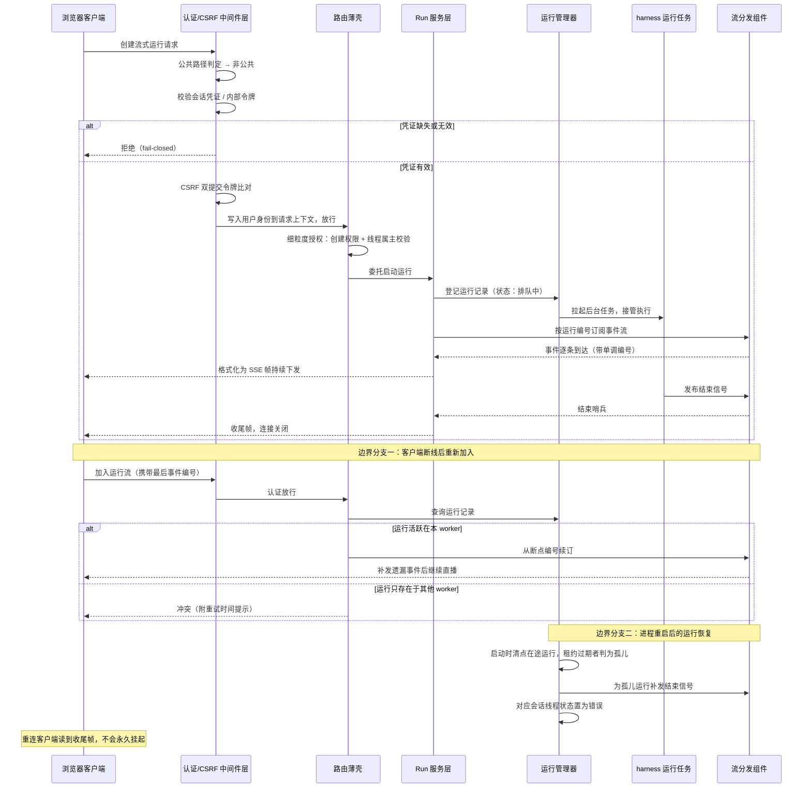

# 对外服务层与消息通道

## 读前思考

- 如果自家的 IM 渠道层和 Agent 运行时跑在同一个进程里，渠道要发起一次 Agent 执行，你是进程内直接调用，还是绕一圈走 HTTP 调自己？直调省一跳网络、省一次序列化，为什么 deer-flow 偏偏选择绕一圈？
- 运维希望改完配置文件不用重启就生效，但运行时引擎（数据库连接池、事件流管道）是启动时一次性装配的，热重载动不了它们。"常驻服务要稳定"和"配置要能改"这对矛盾你会怎么拆？

## 核心问题

本主题在 deer-flow 中的定义是：**作为 harness 运行时唯一的 HTTP/SSE 服务门面，把连接级认证、配置解析、运行生命周期管理和事件流分发统一收口，让浏览器、IM 渠道、定时任务这些完全不同的调用方走同一条路径驱动 Agent 执行，同时用 Channel 抽象把 7 个 IM 平台的消息映射进这条路径。**

deer-flow 的定位很特殊：它不是给 Agent 加一个"顺便暴露的 API"，而是把 API 网关本身当成系统的边界定义——连进程内部的渠道层也必须走同一个入口。应用工厂在构建时就完成中间件链和全部路由的注册，请求进来时只剩下一条固定路径可走。

| 维度 | deer-flow 的选择 |
|------|-----------------|
| 服务形态 | 唯一 HTTP/SSE 门面，LangGraph 兼容资源模型 |
| 连接级认证 | fail-closed 全局中间件 + CSRF 双提交 + 首启手动建管理员 |
| 事件扇出 | 流分发组件：事件编号、中途加入、断点续读、心跳 |
| 通道抽象 | Channel 接口 + 消息总线 + 渠道管理器三层，全部出站连接 |
| 并发策略 | 渠道运行策略四选一：并行 / 串行 / 缓冲合并 / 拒绝 |
| 配置治理 | 双轨：启动快照（startup-only 清单）+ 请求级签名热重载 |
| 生命周期治理 | 关停排空窗口 + 启动期孤儿运行清点恢复 |

动作级的权限审批（某个请求能不能做这件事）归 09-guardrails；会话归属确定后的状态隔离归 04-state。

## 方案展示

### 设计选择一：gateway 是唯一入口，连自家渠道也不例外

**设计选择**。所有想驱动 Agent 执行的调用方——浏览器前端、IM 渠道 worker、定时任务调度器——统一调用 gateway 的 LangGraph 兼容 HTTP API。最能说明问题的是 IM 渠道：渠道管理器和 gateway 运行在同一个进程里，本可以直接拿到运行时的引用发起执行，但实际上它构造了一个指向自家 gateway 的 HTTP 客户端（直接复用官方 LangGraph SDK），发起标准的运行创建请求，请求头里附带进程内内部认证令牌和 CSRF 的 cookie/header 配对。渠道层拿到响应后消费的也是标准 SSE 流，与外部集成方没有任何区别。

**为什么这么选**。统一入口的收益是系统性的：认证、授权、CSRF 防护、请求追踪、配置解析这些横切关注点只在一条路径上实现一次，任何新调用方自动继承全部治理能力。渠道层不需要跟着运行时内部接口的演化走——只要 HTTP 协议不变，运行时内部怎么重构都不影响渠道。渠道层复用官方 SDK 的行为与外部集成方完全一致，针对 API 的测试同时覆盖了渠道路径，不存在"内部直调路径没有测试"的盲区。进程内令牌也没有因为走内网就放弃安全：令牌在进程启动时生成、校验用常量时间比较防时序攻击，请求头里还携带渠道所属用户的身份标识，让文件路径、记忆、技能解析都落到正确的账号上；这个标识写入前会经过规范化，防止包含路径分隔符的原始渠道编号逃逸出用户目录。

**牺牲了什么**。每次渠道调用多一跳本地 HTTP 往返和两次序列化，对高频率小消息场景是纯开销。更隐蔽的代价是耦合方向反转——渠道层依赖 HTTP 服务可用，而它们明明在同一个进程里；gateway 启动失败或重启期间渠道也跟着不可用。进程内令牌的安全边界只在单进程内成立：无法区分同进程内的不同调用组件，多进程部署时必须通过环境变量显式共享同一个令牌，这本身是一个需要管理的部署细节。

### 设计选择二：Channel 三层架构 + 运行策略——消息通道接入

**设计选择**。每个 IM 平台实现 Channel 接口，负责三件事：从平台接收消息（长轮询/WebSocket/webhook）、把平台消息转换为统一的入站消息结构、把响应转换回平台格式。消息经消息总线发布后，由渠道管理器统一查找或创建会话线程、检查并发策略、再经 gateway 发起运行。并发行为是声明式的——每个渠道用运行策略（源码：ChannelRunPolicy）四选一：即发即忘（每条消息独立运行不等待）、串行（同一线程的运行排队执行）、缓冲（运行期间缓冲新消息、完成后合并为一次运行）、拒绝（有活跃运行时直接回复忙）。传输方式上有个统一立场：7 个平台全部不需要公网 IP——Telegram 走长轮询、Slack 走 Socket Mode、飞书走 WebSocket 长连接、钉钉走流式推送，因为大多数企业内网不允许暴露 webhook 端口，所有渠道必须走出站连接。用户绑定支持全局会话与按用户会话两种模式，绑定后每个用户的会话状态如何隔离见 04-state。

**为什么这么选**。出站连接把部署门槛降到最低——不需要域名、证书、防火墙入站规则。策略模式让每个渠道独立选择并发行为：对话类渠道要串行保证顺序，通知类渠道可以即发即忘。

**牺牲了什么**。7 个 Channel 实现之间有一些重复逻辑（认证、重连），但每个平台的 SDK 差异太大，强行抽象反而增加复杂度。出站传输的代价是断网重连需要额外处理（如微信的令牌持久化、飞书的连接恢复）。用户绑定基于平台提供的用户编号，平台编号可被伪造的风险（如机器人被拉进陌生群聊）被原样信任，没有额外身份验证。

### 设计选择三：双轨配置——热重载与 startup-only 边界

**设计选择**。配置分成两条轨道。引擎轨道：流分发组件、持久化引擎、检查点存储、渠道装配这些在应用生命周期钩子内一次性装配，绑定启动时读取的配置快照，改这些配置必须重启——它们持有活连接和单例资源，运行中热替换会让任务处于不一致状态。"哪些字段重启才生效"有一份权威清单（覆盖数据库、沙箱、渠道、调度器等 12 类），同时镜像在配置模型的字段描述里，IDE 悬停就能看到。请求轨道：配置文件刻意不缓存到应用状态上，每个请求进来时重新解析，按文件签名（修改时间 + 大小 + 内容哈希三重检测）判断是否重载，模型参数这类无状态配置改完下一次请求立即生效。配置来源按三层合并：主配置文件优先于扩展配置文件，扩展配置优先于字段默认值，环境变量引用在加载后递归解析、缺失即快速失败。多执行上下文（子代理、嵌入场景）的临时配置覆盖走上下文变量栈，属多实例状态隔离，见 04-state。

**为什么这么选**。双轨是对"全量热重载做不到、全量重启体验差"的务实折中：如果所有配置都用启动快照，改一个模型参数也要重启；如果所有配置都热重载，正在执行的运行可能一半用旧配置一半用新配置，事件存储甚至会出现"配置指向新后端、实例还绑着旧后端"的错配。按"是否持有启动期单例"切开边界后，请求级消费者拿到的永远是"最新配置 + 与之匹配的事件存储配置"的成对组合。三重签名防止了纯修改时间比较的所有已知盲区——同秒替换、版本库检出恢复旧时间戳、网络挂载时间不精确。

**牺牲了什么**。同一配置文件里的字段生效方式不一致，运维必须查清单才知道改某个字段要不要重启；清单与字段描述两处维护，存在不同步的可能。渠道这类字段重启才生效，意味着运行中无法热插拔新渠道。

### 设计选择四：fail-closed 连接级认证栈

**设计选择**。全局认证中间件对所有非公共路径强制校验，缺凭证或凭证无效直接拒绝；只有登录、健康检查、OAuth 回调、webhook 等少数路径列入白名单，webhook 用提供方签名自证身份，且对应的路由在没配置验签密钥时干脆不挂载，直接返回 404。浏览器请求校验会话凭证的签名、过期时间、用户存在性和令牌版本（改密后旧令牌即失效）；渠道请求命中进程内令牌分支并提取渠道属主身份。校验通过后用户对象写入请求状态，路由层的权限装饰器直接复用，不必二次解码。

**为什么这么选**。认证如果只在个别路由上检查，漏掉一个路由就是一个未鉴权入口——历史上确实出现过畸形凭证通过非隔离路由的问题，现在任何畸形凭证都在入口层被严格拒绝。首次启动时系统不自动创建管理员，而是要求运维访问专门的初始化页面建号，避免远程攻击者抢先初始化；存量部署从"无认证"升级到"有认证"时，启动期会把没有属主的孤儿会话批量迁移到管理员名下，保证升级不丢数据也不出现无主数据。

**牺牲了什么**。所有请求都多一次凭证解码和用户查询；公共路径白名单本身是一个需要维护的攻击面——每加一个公共路径都要评估它是否可能被滥用。连接进来之后每个动作的审批（属主校验之上的工具与操作权限）见 09-guardrails。

## 核心机制执行流：一次流式运行的全链路

以浏览器发起一次流式运行创建请求为例：

**认证拦截**。请求先过中间件层：命中公共路径白名单直接放行，否则检查凭证。浏览器请求严格校验会话凭证的四项属性，渠道请求命中进程内令牌分支并提取渠道属主身份写入用户上下文。校验通过后用户对象和授权上下文写入请求状态，并同步进请求级上下文变量——持久化层的属主过滤因此自动生效，不必每个仓储都显式传用户编号。

**CSRF 校验**。状态变更类请求接着过 CSRF 中间件：cookie 里的令牌必须与请求头里的令牌一致（双提交模式），跨站伪造请求带不出自定义头，因此被挡在门外。渠道 worker 自调用也要手工配对这对令牌，没有任何豁免。

**路由薄壳与授权**。路由函数本身只有几行——先过细粒度授权装饰器，校验"创建运行"权限且该线程确属当前用户（防止用户 A 猜出用户 B 的线程地址越权执行），然后取出启动时装配好的流分发组件和运行管理器单例，委托给服务层。

**服务层与运行管理器**。服务层落一条运行记录（初始状态排队中），交给运行管理器拉起后台任务。从这一刻起，Agent 执行与这条 HTTP 连接彻底解耦——连接断了运行还在跑，这是后面"加入"语义成立的前提。

**事件扇出与 SSE 消费**。消费协程按运行编号订阅流分发组件（带断线重连编号则从该编号续订）。harness 任务每产生一个事件就发布一次，消费协程格式化成 SSE 帧（事件名、载荷、单调编号）写入响应流。无事件时组件按固定间隔发出心跳哨兵保活；生产者发布结束信号后，消费协程收到结束哨兵，下发收尾帧并关闭连接。关闭前的清理分支按运行声明的断连策略执行——"取消"则中止后台任务，"继续"则任务照常跑。

**边界分支一：中途加入与断线重连**。客户端中途加入时先查运行记录确认存在且属于该线程，再判断运行是否活跃在当前 worker——多 worker 部署下事件流默认进程内，运行在另一个 worker 上执行时本 worker 无法提供流，返回冲突并提示重试时间；若流分发实现声明支持跨进程分发则直接放行。活跃场景下从客户端携带的最后事件编号续读，断线期间的事件被补发，然后无缝接续。

**边界分支二：重启恢复**。进程崩溃或重启时，在途运行的执行任务随进程消失，但运行记录还处于"执行中"。gateway 在启动装配阶段（对外服务之前）做一次孤儿清点：单 worker 模式下所有在途记录都被回收；多 worker 模式下只回收租约过期的。被回收的运行会被补发结束信号——重连的客户端读到干净的收尾帧而不是永远挂起的连接——对应的会话线程状态被置为错误。孤儿运行的状态清点、租约与置错语义本身归 04-state，这里只强调恢复发生在 gateway 启动期、在对外服务之前。

## 工程优化

**薄壳路由与厚服务层的分工**。路由文件里几乎所有端点都是几行的薄壳：授权装饰器、取单例、参数校验，然后委托给一千二百多行的服务层。SSE 帧格式化、消费协程、断线语义全部沉淀在服务层，路由只负责 HTTP 语义。这个分工让同一套运行启动逻辑被"流式、等待、后台"三个端点复用，渠道调用走 HTTP 进来后也落在同一份代码上——不存在两套逻辑漂移的空间。

**SSE 断线的两种语义**。运行可以声明客户端断开后"取消"或"继续"。取消语义下连接一断后台任务即中止，省算力；继续语义下任务与事件照常进行，客户端随时可以重新加入续读。心跳间隔内消费协程还会检查运行记录是否已被孤儿恢复流程接管——如果是，直接下发收尾帧退出，避免挂在一个不再有事件的流上。

**关停时的排空顺序**。顺序是刻意安排的：先停渠道服务和定时任务（切断新运行的来源），再给在途运行一个有限时间的排空窗口，窗口结束才释放检查点存储的连接池。排空协程做了双重防护——即使关停过程本身被第二次中断信号取消，排空任务也会被保护着跑完自己的时限，防止"运行任务还在写检查点、连接池已经关了"的资源竞争。在容器部署里，这些预算之和必须塞进平台的优雅终止窗口，否则强制终止会让排空保护失效。

**多 worker 的启动门禁**。多 worker 部署在启动时被强制检查三个前提：数据库必须是支持并发写的后端（文件型数据库的写锁撑不住多进程）、运行租约心跳必须开启、浏览器会话这类进程内资源必须禁用。任何一条不满足，进程直接拒绝启动并给出明确原因——缺了心跳，孤儿清点会把别的 worker 正在执行的健康运行全部误杀，每次滚动更新都会造成批量中断。把配置错误拦在启动期而不是运行期，错误信息清晰且损失为零。

**渠道侧的部署细节**。微信渠道持久化拉取游标和登录状态，容器部署时必须放在持久化卷上；飞书渠道对同一线程的快速连续消息队列化处理而不是立即回忙；渠道在容器内执行时网关地址要用容器服务名而非回环——都是出站优先与自调用这两个立场推导出的必然运维细节。

## 面试要点

**1. 如果去掉多用户约束，这个 gateway 会退化成什么？**

去掉多用户（只剩单用户、本地可信环境）后，认证中间件、属主校验、孤儿线程迁移、用户上下文传播这一整套都可以简化为一个固定的默认用户——项目本身也留了禁用认证的开关作为这条退化路径的正式出口。但 gateway 不会因此退化成一个可有可无的壳：运行生命周期管理（记录登记、异步执行、事件扇出、断线重连、重启恢复）和双轨配置与用户数无关，它们是"长时异步任务 + 流式输出"这个运行模式的固有需求。判断标准是：**认证层的复杂度取决于调用方身份多样性 × 资源属主隔离需求，而运行层的复杂度取决于任务时长 × 连接不可靠程度**——两组约束独立变化，去掉一组另一组不变。

**2. 渠道走 HTTP 自调用，在什么场景下值得换成进程内直调？**

直调的优势是省掉本地网络往返、序列化和 HTTP 可用性依赖；HTTP 自调用的优势是所有调用方共用一条经过认证、授权、追踪、CSRF 保护的路径，且渠道层与运行时内部接口解耦。换成直调值得考虑的场景是：调用频率极高且单次载荷小（本地回环的固定开销占比被放大），或者部署形态保证渠道与运行时生命周期完全一致、不需要独立重启。但只要存在多种调用方需要统一治理、运行时需要独立演进、或希望渠道层与外部集成方行为一致，HTTP 自调用就仍然更优。判断标准：**取决于调用频率 × 治理统一性需求**——低频调用下统一入口的边际成本几乎为零，高频且无外部调用方的场景才有动机为性能放弃统一入口。还可以追问一层代价：自调用让认证逻辑在"防外部攻击者"和"信任内部组件"之间出现了双轨（外部走会话凭证、内部走进程令牌），这个双轨本身需要显式管理。

**3. 双轨配置为什么不做成全量热重载？边界画在哪？**

全量热重载的障碍在于有状态组件：数据库连接池、事件流管道、检查点存储都是启动时一次性装配并持有活资源的，运行中替换它们意味着正在执行的任务可能一半用旧配置一半用新配置。边界划法是：**一个配置字段背后是否挂着启动期单例**——挂着的就是重启生效，并在配置模型的字段描述里标注；不挂的就走请求级热重载，且配置文件刻意不缓存，保证请求永远看到最新值。代价是同一文件里字段生效方式不一致，运维需要查清单。判断标准：**取决于组件是否持有活资源 × 运行中切换的一致性风险**——无状态字段热重载收益大风险小，有状态字段热重载收益小而风险大，所以按组件状态切分而不是按字段重要性切分，这是该设计可推广到其他系统的关键。
