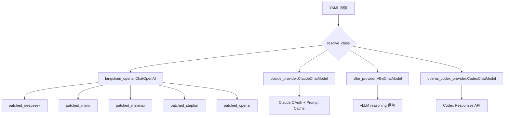
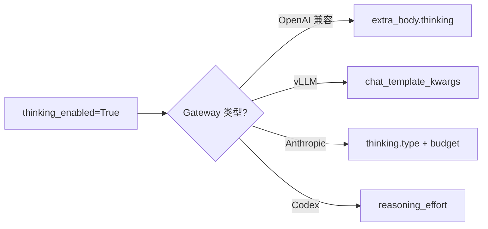
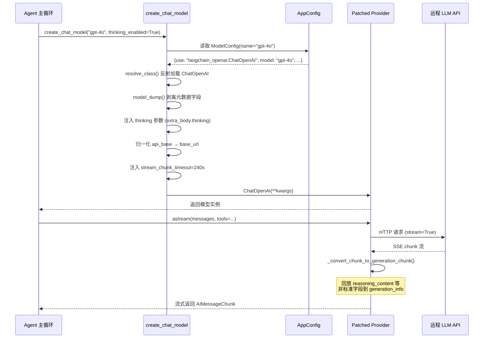

# LLM 接入层

## 读前思考

- 如果你要支持 10+ 个 LLM 提供商（OpenAI、Anthropic、DeepSeek、vLLM、Codex CLI……），每个 provider 都有非标准的字段和行为，你会怎么设计抽象层？是 fork 上游框架，还是在外面包一层？
- 推理模型（thinking model）正在成为主流，但每个 provider 对"思考过程"的字段定义完全不同——OpenAI 用 `reasoning`，Anthropic 用 `thinking`，vLLM 用非标准的 `reasoning` 字段。你的接入层怎么做到不丢失这些字段？

## 核心问题

LLM 接入层解决的核心问题是：**让上层 agent 系统用统一接口调用不同 provider 的模型，同时不丢失任何 provider 特有的能力**。

DeerFlow 基于 LangChain 的 `BaseChatModel` 构建，但没有简单地用 `ChatOpenAI` 一把梭——它通过 YAML 配置驱动 + 类路径反射的工厂模式，为每个 provider 写了 Patched 子类，专门处理上游框架会丢弃的非标准字段。

## 方案展示

### 设计选择一：Patched Provider 模式——不 fork，只 patch

DeerFlow 面对的核心矛盾是：LangChain 的 `ChatOpenAI` 在解析响应时会丢弃 provider 特有的字段。比如 DeepSeek 的 `reasoning_content`、Gemini 的 `thought_signature`、Claude 的 `thinking` 块——这些字段在多轮对话中对推理模型至关重要，但 LangChain 的通用解析器不认识它们。

如果你选择 fork LangChain，维护成本会随 provider 数量线性增长。DeerFlow 的选择是**子类 override**：每个 Patched Provider 只重写 `_get_request_payload`、`_convert_chunk_to_generation_chunk`、`_create_chat_result` 三个钩子方法，把被丢弃的字段"回放"到 `generation_info` 中。

共享的回放逻辑被抽取到 `assistant_payload_replay.py`，每个 Patched Provider 只需声明"我要恢复哪个字段"。这样做的好处是：当 LangChain 上游更新了解析逻辑，DeerFlow 可以直接删掉对应的 patch，不需要合并 fork。

### 设计选择二：Thinking 模式的多态处理

推理模型的启用/禁用看似简单（一个布尔开关），但每个 gateway 的实现路径完全不同：

| Gateway | 启用方式 | 禁用方式 |
|---------|---------|---------|
| OpenAI 兼容 | `extra_body.thinking.type: enabled` | `extra_body.thinking.type: disabled` |
| vLLM | `chat_template_kwargs.enable_thinking: true` | 同字段设 `false` |
| Anthropic 原生 | `thinking.type: enabled` + `budget_tokens` | `thinking.type: disabled` |
| Codex CLI | `reasoning_effort: high/medium/low` | `reasoning_effort: none` |

DeerFlow 的工厂函数 `create_chat_model` 统一处理这个分支逻辑，通过 `when_thinking_enabled` / `when_thinking_disabled` 配置块实现声明式定义。用户在 YAML 里写一次，工厂在创建模型时自动注入正确的参数结构。

这个设计的代价是：工厂函数变成了一个大的 if-else 分支，每新增一个 provider 类型都要在这里加一段。但考虑到 provider 数量增长缓慢（一年加几个），这个复杂度是可控的。

### 设计选择三：CLI 凭证链复用

Claude 和 Codex 两个 provider 实现了完整的 CLI 凭证加载链：环境变量 → 文件描述符 → `~/.claude/.credentials.json` / `~/.codex/auth.json`。这意味着如果用户已经在终端登录了 Claude Code 或 Codex CLI，DeerFlow 可以直接复用这个登录态，不需要用户再配一遍 API key。

凭证加载逻辑封装在 `credential_loader.py` 中，OAuth token 通过 `sk-ant-oat` 前缀自动检测，切换 `x-api-key` 为 `Authorization: Bearer` 认证方式。Claude Provider 还自动管理 Prompt Cache 的 4 个 breakpoint 预算，放在最后几个候选消息块上以最大化缓存命中率。

## 完整执行流：一次模型调用的全链路

每个阶段的关键动作：

1. **配置读取**：从 `AppConfig` 中按名称查找 `ModelConfig`，支持 `model_overrides` 覆盖（自定义 agent 可以单独设 temperature 等参数）
2. **类反射**：`resolve_class("langchain_openai:ChatOpenAI", BaseChatModel)` 通过 importlib 动态加载，支持任意第三方包
3. **元数据剥离**：`pricing`、`supports_thinking`、`display_name` 等 DeerFlow 自定义字段在传给 LangChain 之前必须排除，否则会触发 Pydantic 校验错误
4. **Thinking 注入**：根据 gateway 类型选择正确的参数结构，这是最容易出 bug 的地方——不同 provider 的 thinking 参数名和结构完全不同
5. **超时调整**：`stream_chunk_timeout` 默认 240s（LangChain 默认 120s），因为推理模型的首个 chunk 可能需要 90-150s
6. **流式回放**：Patched Provider 在 `_convert_chunk_to_generation_chunk` 中把非标准字段塞回 `generation_info`，确保多轮对话时这些字段不丢失

## 工程优化

**流式超时保护**：推理模型的首 token 延迟可能很长，`stream_chunk_timeout=240s` 是综合考虑了 o1、Claude thinking 等模型的实际观测值。如果超时，LangChain 会抛 `StreamTimeoutError`，DeerFlow 在上层捕获并返回友好的错误信息。

**配置拼写检查**：`_warn_unknown_model_settings` 在模型构建时检测配置中的拼写错误（比如 `maxx_tokens`），将运行时的不透明错误提前到启动时暴露。这个简单的检查能节省大量调试时间。

**`stream_usage=True` 默认注入**：确保所有 OpenAI 兼容 endpoint 都返回 token 用量信息，供 `TokenUsageMiddleware` 采集。很多第三方 endpoint 默认不返回 usage，这个默认值让 token 统计更完整。

**消息数不匹配的回放策略**：当 system message 被过滤等原因导致消息数与 payload 数不匹配时，`restore_assistant_payloads` 使用签名匹配 + 位置回退双策略，确保多轮对话的历史不会错乱。

## 面试要点

**1. 为什么不直接用 LangChain 的 provider 抽象，而要自己写 Patched Provider？**

LangChain 的通用解析器会丢弃 provider 特有的字段（如 `reasoning_content`、`thought_signature`），这些字段在推理模型的多轮对话中是必须的。选择子类 override 而非 fork，是因为 fork 的维护成本随 provider 数量线性增长，而 subclass 可以在 LangChain 更新时平滑跟进。代价是每个新 provider 都需要写一个 patch 文件，但这个工作量远小于维护一个完整的 fork。

**2. Thinking 模式的处理集中在工厂函数里，这是好的设计吗？**

从使用角度看，集中在工厂函数让配置变得简单——用户只需设一个布尔值。但从扩展性看，工厂函数变成了一个需要不断增长的 if-else 分支。如果 provider 数量增长到 20+ 个，可能需要把 thinking 参数映射抽象成 provider 注册表。当前 provider 数量（约 10 个）下，集中处理的复杂度是可控的。

**3. CLI 凭证复用的安全风险是什么？**

复用 `~/.claude/.credentials.json` 意味着 DeerFlow 进程可以访问用户在 Claude Code 中的所有权限。如果 DeerFlow 被部署在多用户服务器上，一个用户的 DeerFlow 实例可能读到另一个用户的 CLI 凭证。当前 DeerFlow 默认部署在本地可信环境，这个风险可接受；但如果要部署到共享环境，需要加 user-scoped 的凭证隔离。
