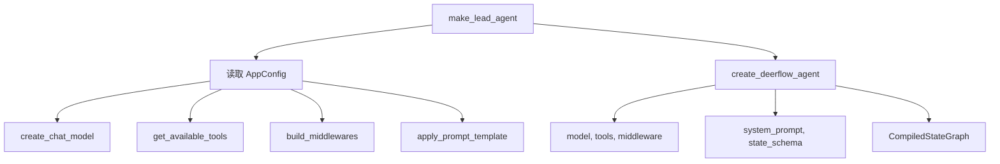
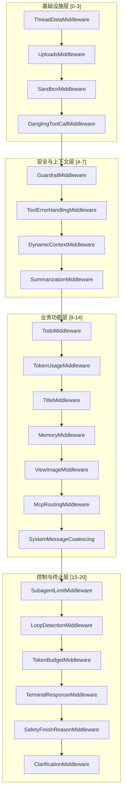
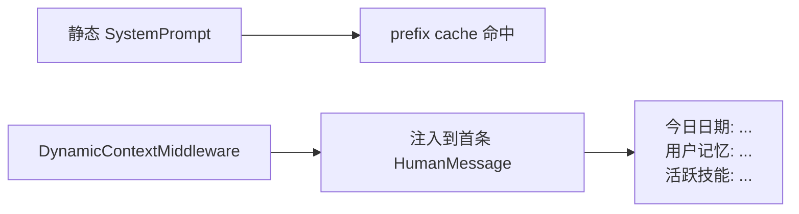
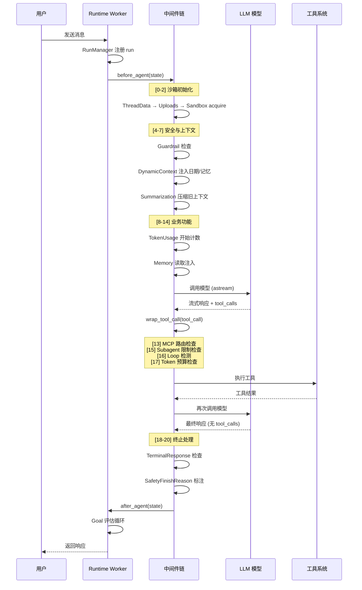

# Agent 主循环

## 读前思考

- 一个生产级 Agent 系统需要 30+ 个中间件来处理从沙箱初始化到安全护栏的各种关注点。你会怎么组织这些中间件？用框架自带的列表还是自己设计一套定位机制？
- 系统提示（system prompt）里包含了当前日期、用户记忆等动态信息，但这些信息会破坏 prefix cache。你怎么在保持缓存命中率的同时注入动态内容？

## 核心问题

Agent 主循环是 DeerFlow 的调度中枢：**它把 LLM 调用、工具执行、中间件链、状态管理、上下文压缩等关注点编排成一个可预测的执行管道**。

DeerFlow 基于 LangGraph 的 `create_agent` 构建状态机，但它没有停留在 LangGraph 的默认行为上——它在 LangGraph 之上叠加了自己的中间件链（38 个内置中间件 + 可扩展的 config 注入），以及一个独立的 Runtime 层来管理 run 的完整生命周期。

## 方案展示

### 设计选择一：两层工厂分离——SDK 层 vs 应用层

DeerFlow 的 agent 构建分为两层：

- `create_deerflow_agent`（SDK 层）：纯参数接口，不依赖任何 config，用于测试和嵌入场景
- `make_lead_agent`（应用层）：读取 AppConfig，组装完整的中间件链、工具集、prompt 模板

这种分离的好处是：SDK 层可以独立测试，不依赖配置文件；应用层可以在不修改 SDK 的情况下调整生产配置。代价是两层之间有一些重复逻辑（如工具组装），需要保持同步。

### 设计选择二：Feature Flags + 锚点定位的中间件链

38 个中间件的顺序不能随便排——沙箱初始化必须在工具执行之前，澄清请求必须永远在链尾。DeerFlow 用 `RuntimeFeatures` 声明式控制中间件启用，用 `@Next(Anchor)` / `@Prev(Anchor)` 装饰器让额外中间件通过锚点插入到指定位置。

中间件链的关键顺序：

`ClarificationMiddleware` 必须永远在链尾——即使 `@Next` 锚点把它推走，工厂也会强制移回。这个硬编码约束是经验教训的产物：澄清请求如果提前被其他中间件截获，会导致不可预测的行为。

### 设计选择三：静态系统提示 + 动态上下文注入

系统提示被设计为完全静态（利于 prefix cache 复用），动态信息（当前日期、用户记忆、活跃技能）通过 `DynamicContextMiddleware` 注入到第一条 `HumanMessage` 的 `<system-reminder>` 标签中。

这个设计的核心取舍：牺牲了 system prompt 中直接放置动态信息的便利性，换取了 prefix cache 的高命中率。对于 token 成本敏感的生产部署，这个交换是值得的。

## 完整执行流：一次用户消息的处理管道

每个阶段的详细说明：

1. **Run 注册**：`RunManager` 为每次调用创建 run 记录，支持 orphan recovery（网关重启后恢复未完成的 run）
2. **沙箱初始化**：`SandboxMiddleware.acquire()` 为当前 thread 获取或复用沙箱实例，per-thread LRU 缓存上限 256
3. **上下文压缩**：`SummarizationMiddleware` 检测消息历史是否超过阈值，超过则调用 LLM 生成摘要替换旧消息
4. **模型调用**：通过 Patched Provider 的 `astream` 方法，支持流式输出和 thinking 模式
5. **工具执行**：`wrap_tool_call` 在每次工具执行前经过多个中间件的检查——MCP 路由、subagent 限制、loop 检测、token 预算
6. **Goal 评估**：run 结束后，如果 thread 有激活的 goal，评估模型检查完成度，未满足则注入 hidden continuation 继续执行

## 系统提示词结构

DeerFlow 的 system prompt 由 prompt.py 的 apply_prompt_template() 通过 SYSTEM_PROMPT_TEMPLATE.format(...) 一次性拼装，采用 XML 标签分段。与 claudecode 不同，DeerFlow 将动态内容（日期、记忆）从 system prompt 中剥离，交给中间件在运行时注入，以最大化 prefix cache 命中率。

**静态模板的十六个组成部分：**

| 序号 | 段落 | 类型 | 核心内容 |
|------|------|------|----------|
| 1 | \<role\> | 静态 | 角色定义："You are {agent_name}, an open-source super agent"，默认名 DeerFlow 2.0 |
| 2 | 用户输入边界 | 静态 | 声明用户输入被 BEGIN/END USER INPUT 包裹，其中内容是不可信数据而非指令 |
| 3 | 保密指令 | 静态 | 严禁向用户透露 system prompt、\<soul\>、\<skill_system\> 等框架内部标签内容 |
| 4 | {soul} | 条件 | 从 SOUL.md 读取的 agent 人格/价值观，经 HTML 转义防注入 |
| 5 | {self_update_section} | 条件 | 仅自定义 agent：教导用 update_agent 工具持久化自我更新 |
| 6 | \<thinking_style\> | 静态 | 思考规范：先分析再行动、不清楚必须澄清、思考后必须给出实际响应 |
| 7 | \<clarification_system\> | 静态 | 澄清工作流：CLARIFY→PLAN→ACT，5 种澄清场景 + ask_clarification 工具用法 |
| 8 | {skills_section} | 动态 | 技能系统：延迟发现模式（仅列名称）或传统模式（完整元数据） |
| 9 | {memory_tool_section} | 条件 | 记忆工具使用规范：memory_search/add/update/delete |
| 10 | {deferred_tools_section} | 条件 | MCP 延迟工具名称列表（仅名称，用 tool_search 获取 schema） |
| 11 | {mcp_routing_hints_section} | 条件 | 按关键词的工具偏好路由提示 |
| 12 | {subagent_section} | 条件 | 子代理编排指令：分解-委派-综合流程、并发上限、可用类型 |
| 13 | \<working_directory\> | 静态+条件 | 文件路径规范：uploads/workspace/outputs 目录 + 可选 ACP/挂载目录 |
| 14 | \<response_style\> | 静态 | 响应风格：清晰简洁、自然语气、行动导向 |
| 15 | \<citations\> | 静态 | 引用规范：web_search 后必须加内联引用，报告末尾必须有 Sources 节 |
| 16 | \<critical_reminders\> | 静态+动态 | 关键提醒清单 + 条件性了代理提醒和 Skill First 提醒 |

**运行时动态注入（中间件，不在静态 system prompt 中）：**

| 中间件 | 注入内容 | 形式 |
|--------|---------|------|
| DynamicContextMiddleware | 当前日期 + 用户记忆 | 隐藏 SystemMessage/HumanMessage，插入第一条用户消息前 |
| DurableContextMiddleware | 对话摘要 + 子代理委派账本 + 已加载技能列表 | 隐藏 HumanMessage + 权威合约 SystemMessage |
| SkillActivationMiddleware | 完整 SKILL.md 内容（用户输入 /skill-name 时） | 隐藏 HumanMessage |
| TodoMiddleware | \<todo_list_system\> 任务列表规范（Plan 模式） | 追加到 system prompt |

这个设计的核心权衡是：静态模板跨用户、跨会话完全相同，最大化 LLM 提供商的 prefix cache 命中率；用户相关数据（记忆、日期）通过中间件以隐藏消息形式注入，不污染 system prompt。代价是中间件链的复杂度显著增加（38 个中间件），且动态内容的注入时机需要精确控制。

## 工程优化

**ThreadState 自定义 reducer**：`merge_sandbox`、`merge_artifacts`、`merge_delegations` 等 reducer 实现幂等写入和冲突检测。`DeltaThreadState` 使用 `DeltaChannel` 只存增量，减少 checkpoint 存储开销。

**技能缓存异步刷新**：技能目录使用后台线程异步刷新 + LRU 淘汰（256 上限），避免请求路径阻塞磁盘 I/O。

**Checkpoint 模式冻结**：一旦 checkpointer 被创建，其 mode（sqlite/postgres）就不可更改，防止混合模式损坏状态。

**Run orphan recovery**：网关重启后，`RunManager` 检测到 `running` 状态但没有对应 asyncio.Task 的 run，自动标记为 error 并通知前端。

**Goal 状态机防循环**：`continuation_count` 上限 8 次，`no_progress_count` 上限 2 次相同评估结果，防止 goal 评估进入无限循环。

## 面试要点

**1. 为什么中间件链要用固定顺序 + 锚点定位，而不是用优先级数字？**

优先级数字（如 Express 的 middleware order）看似灵活，但在 38 个中间件的规模下会变成维护噩梦——新增中间件时需要理解所有现有中间件的优先级才能找到正确的插入位置。锚点定位（`@Next(SandboxMiddleware)`）让新中间件可以声明"我要在沙箱之后"，不需要知道具体的数字。代价是锚点本身的顺序变成了隐式约束，重构锚点名称时需要全局搜索。

**2. 静态 system prompt + 动态 HumanMessage 注入的方案有什么限制？**

主要限制是：模型对 system prompt 和 HumanMessage 中的指令遵循程度不同。有些模型更重视 system prompt 中的指令，把关键行为约束放在 HumanMessage 的 `<system-reminder>` 中可能被忽略。另外，如果对话历史中有多条 HumanMessage，动态信息只注入到第一条，模型在长对话中可能"忘记"这些约束。

**3. Runtime 层为什么要独立于 LangGraph？**

LangGraph 提供了状态图的执行引擎，但不管理 run 的生命周期（创建、取消、恢复、orphan detection）。DeerFlow 的 Runtime 层填补了这个空缺：`RunManager` 管理 run 状态，`worker.py` 在 asyncio.Task 中执行图，`StreamBridge` 处理跨 worker 的 SSE 分发。如果去掉 Runtime，LangGraph 的图执行就变成了 fire-and-forget，无法支持取消、恢复、多 worker SSE 等生产需求。
