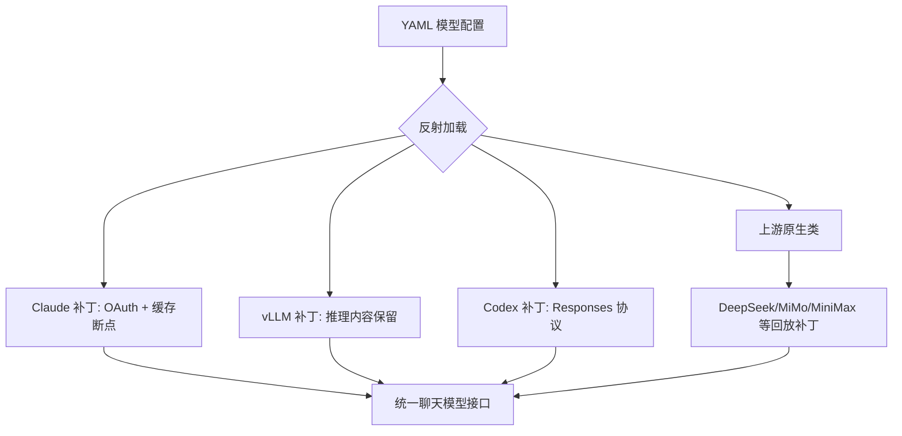
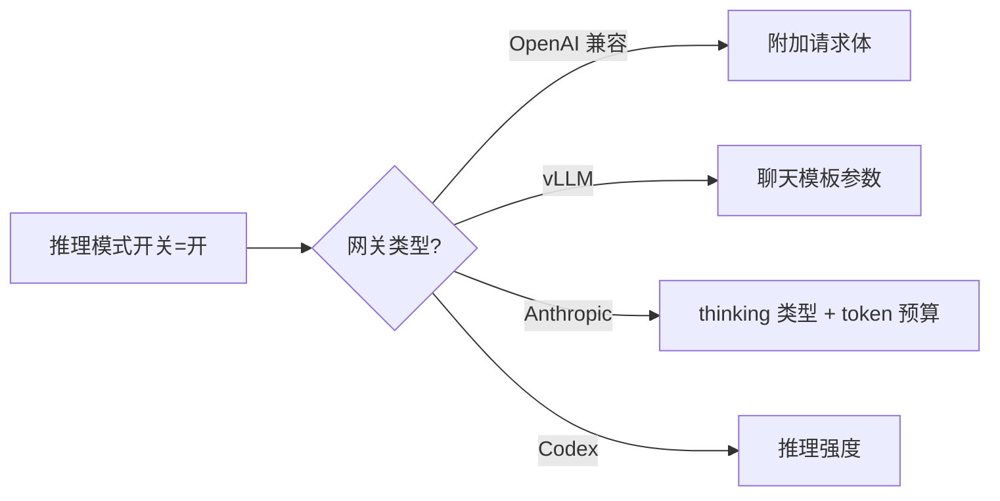
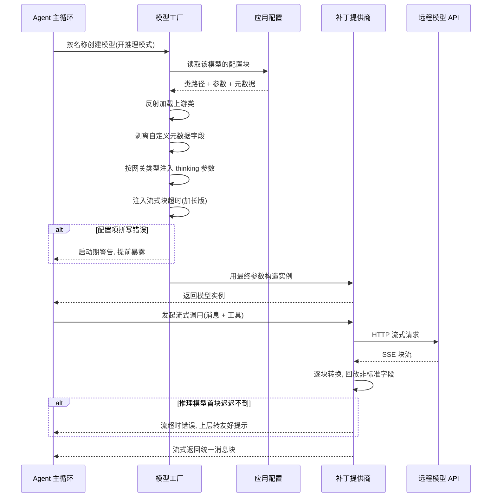

# 模型接入层

## 读前思考

- 如果你要支持十个左右的模型提供商（OpenAI、Anthropic、DeepSeek、vLLM、Codex……），每个都有非标准的字段和行为，而你的代码又构建在一个成熟的开源框架之上，你会怎么设计抽象层？是 fork 上游框架自己改，还是在外面包一层？
- 推理模型正在成为主流，但每个提供商对"思考过程"的字段定义完全不同——有的放在独立字段，有的做成内容块，有的藏在模板参数里。你的接入层怎么做到多轮对话中不丢失这些字段？

## 核心问题

模型接入层解决的核心问题是：**让上层 Agent 系统用统一接口调用不同提供商的模型，同时不丢失任何提供商特有的能力。**

deer-flow 基于 LangChain 的聊天模型基类构建，但没有直接用官方实现了事——它通过 YAML 配置驱动加类路径反射的工厂模式，为每个需要补丁的提供商写一个子类，专门处理上游框架会丢弃的非标准字段。

| 维度 | deer-flow 的选择 |
|------|-----------------|
| 协议基础 | LangChain 聊天模型接口，约 10 个提供商 |
| 抽象模式 | 补丁子类覆盖 + 配置驱动工厂（反射加载） |
| 非标准字段 | 解析后回放到统一消息属性 |
| Thinking 处理 | 工厂内按网关类型集中映射参数 |
| 错误恢复 | 委托 LangChain 内建重试，编排层另有检查点 |
| 结构化输出 | 辅助调用"先清洗再解析"，工具入参 Pydantic 校验 |
| 运行时切换 | 不支持，模型提供商属于启动时边界 |

## 方案展示

### 设计选择一：补丁子类模式——不 fork，只 patch

deer-flow 面对的核心矛盾是：LangChain 的通用解析器在解析响应时会丢弃提供商特有的字段——DeepSeek 的推理内容、Gemini 的思考签名、Claude 的 thinking 块。这些字段在推理模型的多轮对话中是必须的：思考内容要随历史回放给模型，否则下一轮推理质量会下降。

fork LangChain 的维护成本会随提供商数量线性增长。deer-flow 的选择是子类覆盖：每个补丁提供商只重写三个钩子方法——构建请求载荷、流式块转换、结果组装——把被丢弃的字段"回放"到统一的消息附加信息里（源码：各 patched_provider 模块）。共享的回放逻辑被抽取为一个公共模块，每个补丁子类只需声明"我要恢复哪个字段"。

**为什么这么选**：当 LangChain 上游修复了解析逻辑，deer-flow 可以直接删掉对应的补丁文件，不需要合并 fork。补丁的存在本身就是"上游欠了什么"的清单。

**牺牲了什么**：每个需要特殊字段的提供商都要写一个补丁文件；回放逻辑依赖上游钩子的稳定性，上游重构钩子签名时所有补丁要跟着改。

### 设计选择二：Thinking 模式的多态处理

推理模式的启用/禁用看似是一个布尔开关，但每个网关的实现路径完全不同：

| 网关类型 | 启用方式 | 禁用方式 |
|---------|---------|---------|
| OpenAI 兼容 | 附加请求体里声明 thinking 类型 | 同字段声明禁用 |
| vLLM | 聊天模板参数开启思考 | 同字段关闭 |
| Anthropic 原生 | thinking 类型 + token 预算 | thinking 类型禁用 |
| Codex | 推理强度分级 | 推理强度置空 |

deer-flow 的模型工厂统一处理这个分支逻辑，配置文件里用声明式的"启用时/禁用时"配置块写一次，工厂在创建模型时自动注入正确的参数结构（源码：create_chat_model）。

**为什么这么选**：用户只需要在配置里设一个布尔值，不需要知道每种网关的参数结构；映射规则集中在工厂一处，改一处全局生效。

**牺牲了什么**：工厂函数变成一个不断生长的 if-else 分支集合，每新增一种网关类型都要在这里加一段参数映射。当前提供商增长缓慢（一年加几个），这个复杂度可控。

### 设计选择三：CLI 凭证链复用

Claude 和 Codex 两个提供商实现了完整的 CLI 凭证加载链：环境变量 → 文件描述符 → 用户主目录下的 CLI 登录文件。如果用户已经在终端登录过 Claude Code 或 Codex CLI，deer-flow 可以直接复用这个登录态，不需要再配一遍 API key。OAuth token 通过特征前缀自动检测，认证头随之从 api-key 切换为 Bearer 形式（源码：credential_loader）。Claude 补丁还自动管理 prompt cache 的 4 个断点预算，把断点放在最后几个候选消息块上以最大化缓存命中率。

**为什么这么选**：本地开发场景下，用户大概率已经装了官方 CLI，复用登录态把"配置 deer-flow"的成本降到零。

**牺牲了什么**：凭证的作用域与安全治理不在本篇展开，见 [09-guardrails](./09-guardrails.md)。这里只说一句代价：复用意味着 deer-flow 进程继承了用户在官方 CLI 中的全部权限，部署到共享环境时需要额外的凭证隔离。

### 设计选择四：结构化输出的"先清洗再解析"（宽容解析）

deer-flow 没有使用提供商的 JSON 模式类能力，它的结构化需求集中在辅助调用上：目标评估（判断本轮是否达成目标）、后续问题建议、输入润色等。这些调用走统一的单轮 LLM 助手（系统指令 + 用户消息，一次调用拿文本），返回后的处理策略是"先清洗再解析"（源码：llm_text + goal 评估解析）：

1. 剥离模型输出的 thinking 标签块——完整闭合的直接删掉；如果模型在思考中途被截断（未闭合标签），从标签处截断文本，因为后面必然是没写完的废话；
2. 剥掉包裹 JSON 的 markdown 代码围栏；
3. 从第一个左花括号到最后一个右花括号之间提取候选 JSON，容忍模型在 JSON 前后输出多余文字；
4. 解析后逐字段校验：必填字段是否存在、布尔类型是否正确、文本字段是否超长，校验失败抛明确错误而不是静默通过。

工具侧的结构化则是另一条路：MCP 工具被包装为 LangChain 的结构化工具，返回形态是"文本 + 结构化产物"双轨——文本给模型看，结构化产物给界面渲染；工具入参在执行前经过 Pydantic schema 校验，参数不合法会被拦在调用之前。

**为什么这么选**：辅助调用跨越多个提供商（不同模型对 JSON 模式的支持程度不一），宽容解析是提供商无关的；清洗步骤针对的正是推理模型的典型毛病（输出夹带思考块、包代码围栏）。

**牺牲了什么**：解析失败只能在拿到响应后发现，无法像服务端 JSON schema 约束那样从生成阶段保证合法；逐字段校验规则是手写的，新增字段要同步改解析代码。

## 完整执行流：一次模型调用的全链路

每个阶段的关键动作：

1. **配置读取**：从应用配置中按名称查找模型配置块，支持每 agent 的覆盖项（自定义 agent 可以单独设温度等参数）。
2. **类反射**：按"包名:类名"动态加载，支持任意第三方包，加载时校验是否属于聊天模型基类。
3. **元数据剥离**：价格、是否支持 thinking、展示名等 deer-flow 自定义字段在传给 LangChain 之前必须排除，否则会触发 Pydantic 校验错误——这是边界情况之一：配置字段写错不会在运行时变成不透明错误，而是在构建期被配置拼写检查拦截。
4. **Thinking 注入**：根据网关类型选择正确的参数结构，这是最容易出 bug 的环节——不同提供商的参数名和结构完全不同。
5. **超时调整**：流式块超时默认拉长到四分钟（上游默认两分钟），因为推理模型的首个块可能需要一到两分半。超时后抛流超时错误，上层捕获并返回友好提示，这是第二条边界路径。
6. **流式回放**：补丁提供商在逐块转换时把非标准字段塞回消息附加信息，确保多轮对话时这些字段不丢失。

## 工程优化

**流式超时保护**。推理模型的首 token 延迟可能很长，加长版流式块超时是综合 o1、Claude thinking 等模型的实际观测值定的。超时后不是无声挂死，而是抛出专门的流超时异常，由上层转为可读错误。

**配置拼写检查**。模型构建时会检测配置中的未知字段名（比如把最大 token 数拼错），将运行时的不透明错误提前到启动时暴露。这个简单的检查能节省大量调试时间。

**用量回传默认开启**。工厂默认为所有 OpenAI 兼容端点注入"返回 token 用量"开关。很多第三方端点默认不回传用量，这个默认值让用量统计更完整，供用量采集中间件使用。用量数字如何参与压缩阈值见 [05-context](./05-context.md)。

**消息数不匹配的回放策略**。当系统消息被过滤等原因导致消息数与载荷数不匹配时，历史回放采用"内容签名匹配 + 位置回退"双策略，确保多轮对话的历史不会错乱。

## 面试要点

**1. 为什么不直接用 LangChain 的 provider 抽象，而要自己写补丁子类？**

LangChain 的通用解析器会丢弃提供商特有的字段（推理内容、思考签名），这些字段在推理模型的多轮对话中是必须的。选择子类覆盖而非 fork，是因为 fork 的维护成本随提供商数量线性增长，而子类可以在上游更新时平滑跟进、甚至整块删除已被上游修复的补丁。代价是每个新提供商需要写一个补丁文件，但这远小于维护完整 fork 的工作量。判断标准是"上游缺陷是局部的还是结构性的"——局部缺陷用子类钩子能兜住，结构性缺陷才值得 fork。

**2. Thinking 模式的处理集中在工厂函数里，这是好的设计吗？**

从使用角度看，集中处理让配置变得简单——用户只需设一个布尔值。从扩展性看，工厂函数变成不断增长的分支集合。如果提供商增长到二十个以上，可能需要把 thinking 参数映射抽成每个提供商自带的注册表。判断标准是"分支增长速度 × 分支间是否互相影响"：当前约十个提供商、分支互相独立，集中处理的复杂度可控。

**3. 为什么 deer-flow 的结构化输出用宽容解析而不是提供商的 JSON 模式？**

因为辅助调用（目标评估、建议、润色）可能跑在任意配置好的模型上，不同提供商对 JSON 模式的支持程度和参数形态不统一，宽容解析是提供商无关的，而且清洗步骤恰好处理了推理模型输出夹带思考块的典型问题。代价是结构合法性只能在响应后校验，不能从生成阶段保证。判断标准是"调用方是否锁定单一提供商 × 结构失败的代价"：锁定且失败代价高，值得用服务端约束；跨提供商且失败可兜底，宽容解析更划算。
