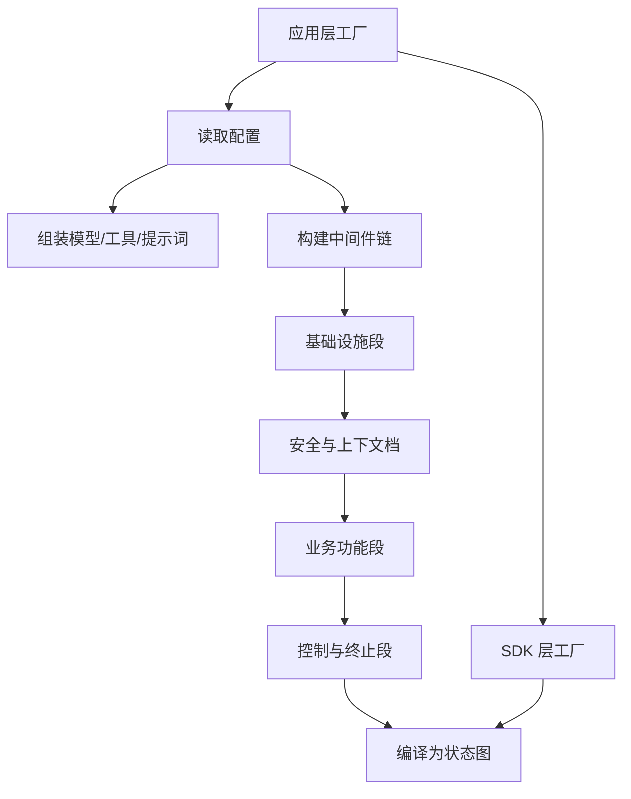
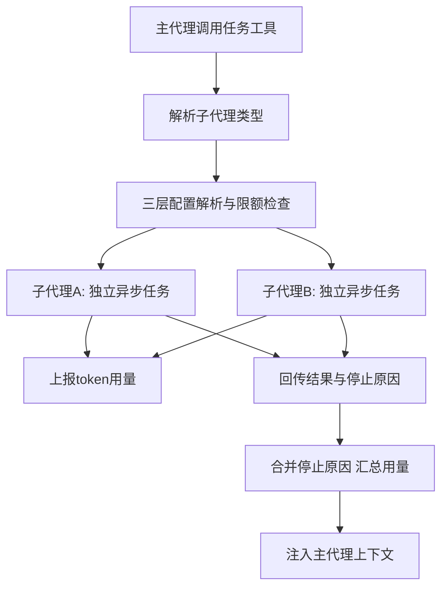
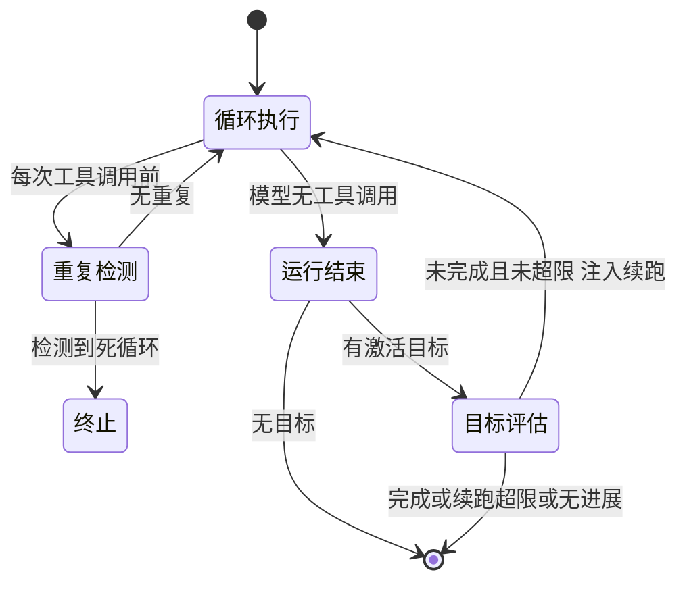
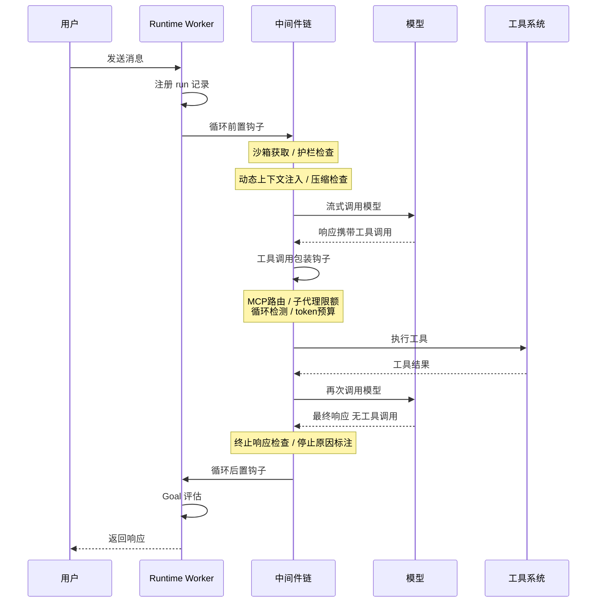

# 编排与主循环

## 读前思考

- 一个生产级 Agent 系统需要三十多个中间件处理从沙箱初始化到安全护栏的各种关注点，其中有些顺序约束是刚性的（沙箱必须在工具执行之前就位，澄清请求必须永远在链尾）。你会怎么组织这些中间件的顺序——用优先级数字，还是别的方式？
- 主代理把任务委派给多个并行的子代理后，它怎么知道每个子代理是"做完了"还是"没做完但失败了"？如果完成状态有好几种、失败原因也有好几种，你的状态合约要在不新增状态枚举的前提下表达"部分完成 + 失败原因"吗？

## 核心问题

编排与主循环解决的核心问题是：**把 LLM 调用、工具执行、中间件链、子代理委派编排成一条可预测的执行管道，并让循环知道何时终止、失败后如何恢复。**

deer-flow 在此问题上的定位是企业级编排框架：它基于 LangGraph 的状态图构建循环，但核心复杂度不在图本身，而在叠加其上的中间件链与独立的 Runtime 层（管理 run 的注册、取消与恢复）。子代理调度同样走"链上治理"路线——数量限额、结果合约都是链中的一环。

| 维度 | deer-flow 的选择 |
|------|-----------------|
| 循环结构 | 状态图 + 38 个中间件链，钩子点三处 |
| 构建分层 | SDK 层纯参数工厂 / 应用层读配置组装 |
| 终止判断 | 重复模式检测中间件 + Goal 评估状态机 |
| 错误恢复 | 分散在各中间件（工具错误处理、护栏、预算） |
| 子代理调度 | 隔离异步任务 + 三层配置解析 + 加法式状态合约 |
| 中断 | run 级中断事件 + 断连即取消 |

## 方案展示

### 设计选择一：两层工厂分离 + 锚点定位的中间件链

agent 的构建分为两层工厂：SDK 层工厂（源码：create_deerflow_agent）只接收纯参数、不依赖任何配置，供测试和嵌入场景使用；应用层工厂（源码：make_lead_agent）读取应用配置，组装模型、工具集、中间件链与提示词模板。两层分离让 SDK 层可以独立测试，应用层可以在不改动 SDK 的前提下调整生产配置；代价是两层之间有少量重复逻辑（如工具组装）需要保持同步。

38 个中间件的顺序由两套机制管理：启用与否通过功能开关声明式控制，插入位置通过相对锚点声明——新中间件不声明优先级数字，只声明"在沙箱中间件之后"或"在护栏中间件之前"。链分四个逻辑段：基础设施段（线程数据、上传、沙箱获取、悬空工具调用修复）、安全与上下文档（护栏、工具错误处理、动态上下文注入、压缩）、业务功能段（待办、token 计数、记忆、MCP 路由等）、控制与终止段（子代理限额、循环检测、token 预算、终止响应、澄清）。澄清中间件被硬编码为永远在链尾——即使锚点把它推走，工厂也强制移回，这是经验教训的产物：澄清请求若被其他中间件提前截获会导致不可预测的行为。

**为什么这么选**：三十多个关注点需要独立开发与测试，中间件链让每个关注点是一个独立文件；锚点定位让新中间件不需要理解全局顺序，只需声明相对位置。优先级数字在这个规模下会变成维护噩梦——新增中间件时要理解所有现有优先级才能找到插入点。**牺牲了什么**：执行路径极难追踪，一次工具调用经过十几个中间件的检查，调试需要理解整条链的顺序语义；锚点本身的顺序成为隐式约束，重构锚点名称需要全局搜索。动态上下文注入（把日期、记忆等动态信息注入首条用户消息而非系统提示，以保护前缀缓存）的完整机制见 05-context。

### 设计选择二：隔离事件循环执行 + 加法式状态合约

子代理调度通过任务工具发起：主代理在调用参数中指定子代理类型、模型、递归上限等，执行器从注册表解析类型后，把每个子代理放进独立的异步任务运行。每个子代理有自己的事件循环、上下文和工具集，看不到主代理或其他子代理的消息历史，只能通过任务描述获取信息。三层配置解析决定子代理行为：任务工具的调用参数优先于配置文件中的子代理段，配置又优先于全局默认值；单次 run 能派出的子代理总数有硬上限，超限则拒绝启动新子代理。

结果回传用加法式停止原因（源码字段：stop_reason）：不新增状态枚举，而是用组合表达复合状态——"正常完成""执行失败""达到最大轮次""预算耗尽"可以叠加（如"完成 + 轮次耗尽"）。前端和主代理只需检查是否包含"失败"，不需要理解新枚举。所有子代理完成后，执行器合并停止原因、汇总 token 用量并归因到发起委派的那一步，结构化结果注入主代理上下文。主代理侧还有一份委派账本（以隐藏消息形式随上下文注入）记录哪些任务已派出、结果如何，避免重复委派。

**为什么这么选**：隔离事件循环确保一个子代理崩溃不影响其他子代理和主代理；加法式合约避免了"N 种完成状态 × M 种失败原因"的枚举爆炸，且前后端兼容。**牺牲了什么**：子代理完全看不到父上下文，需要背景信息的任务必须在任务描述中显式传递；加法语义无法表达互斥状态（"成功但超时"与"失败但超时"后续可能需要不同处理，当前场景只关心是否失败所以够用）。

### 设计选择三：Goal 状态机与循环终止

循环终止有三道机制。其一，重复模式检测中间件在每次工具调用前检查是否陷入"同一工具、同样参数、同样结果"的死循环。其二，token 预算中间件检查累计消耗。其三，也是 deer-flow 独有的：run 结束后如果线程有激活的目标（Goal），由模型评估完成度——未满足则注入一条隐藏的续跑消息让循环继续执行，直到目标达成。Goal 状态机有两道防循环闸门：续跑次数有上限，连续两次评估结果相同（无进展）则停止，防止"评估→续跑→再评估"进入无限循环。

**为什么这么选**：企业场景的任务有明确的完成标准（"生成报告并交付"），仅靠"模型不再调用工具"判断终止会漏掉半成品；Goal 评估把完成度判断交给模型，续跑上限与无进展检测兜住无限循环。**牺牲了什么**：每次评估是一次额外的模型调用，成本随续跑次数线性增长；完成度判断本身依赖模型的评估质量。

## 完整执行流：一次用户消息的处理管道

以用户发来一条需要调用工具的消息为例：

**阶段一：run 注册与前置处理。** Runtime 层为每次调用创建 run 记录（支持网关重启后清点未完成的 run，孤儿 run 的恢复机制见 04-state）。前置钩子按链序执行：沙箱中间件为当前线程获取或复用沙箱实例，护栏中间件做执行前检查，动态上下文中间件注入日期与记忆，压缩中间件检查消息历史是否超阈值（压缩的保留策略与摘要形态见 05-context）。

**阶段二：模型调用与工具调度。** 通过提供商的流式接口调用模型。响应携带工具调用时，每次执行前都要穿过控制段中间件的检查——MCP 路由决定工具走本地还是远程、子代理限额检查委派数量、循环检测识别重复模式、token 预算拦截超支。工具执行生命周期本身（超时、结果裁剪）归 07-tools。

**阶段三：终止与 Goal 评估。** 模型给出无工具调用的最终响应后，终止响应中间件与停止原因标注中间件做最后检查，后置钩子收尾。若线程有激活目标，进入 Goal 评估循环：未完成且未超限则注入隐藏续跑消息继续执行。

**边界路径——子代理失败**：子代理的模型请求失败时报告为"失败"停止原因而非静默返回空结果，主代理据此决定重试或换策略；某个子代理崩溃不影响同批其他子代理。

**边界路径——澄清截获防护**：若模型发起澄清请求，链尾的澄清中间件保证它不被其他中间件拦截改写；任何锚点调整都无法改变这个位置（工厂强制移回）。

## 子代理提示词结构

子代理编排指令不是独立的提示词文件，而是主系统提示中的编排段落（仅启用子代理能力时注入），包含四部分：

| 部分 | 内容 |
|------|------|
| 分解-委派-综合流程 | 教导主代理把复杂任务拆成子任务、委派、再综合结果 |
| 并发上限 | 每轮最多派出的子代理数与单次 run 总量上限 |
| 多批次执行示例 | 展示分批委派（第一批研究 → 第二批实施） |
| 可用子代理类型 | 通用研究分析型、命令执行型（依赖沙箱）、自定义类型 |

子代理本身不使用独立的系统提示——它们继承主代理的模型配置，工具集由限额中间件约束。这个编排段落是编排层的自产内容：它定义的是"怎么委派"的行为协议，与上下文的组装时机（何时注入系统提示）是两回事，后者见 05-context。

## 工程优化

**Token 归因**：专门的收集器不仅汇总每个子代理的 token 用量，还把用量归因到发起委派的那一步，让主代理的统计完整包含子代理消耗；Web 界面的折叠卡片实时显示有效模型与累计 token。

**委派失败的显式语义**：子代理的模型请求失败报告为"失败"停止原因而非静默空结果；长时间运行的子代理启用压缩时会压缩旧历史并重新注入摘要（压缩链特意跳过记忆刷写——子代理的中间轮次不该进入用户长期记忆，见 06-memory）。

**技能目录共享**：子代理从与主代理相同的用户级目录解析技能，用户自定义技能对子代理可用但不暴露其他用户的版本（技能机制主体见 07-tools）。

**状态建模与恢复的归属**：循环对会话状态的读写（自定义 reducer 的幂等合并、增量检查点、检查点模式冻结、孤儿 run 恢复）由 04-state 主写，本篇只说明循环在 run 注册与 Goal 评估处消费这些状态。

## 面试要点

**1. 为什么中间件链用固定顺序 + 锚点定位，而不是优先级数字？**

参考答案方向：优先级数字看似灵活，但在三十多个中间件的规模下，新增中间件需要理解所有现有中间件的优先级才能找到插入位置，且两人同时插入相近优先级会产生隐式冲突。锚点定位让新中间件只声明相对位置（"在沙箱之后"），不关心全局编号。代价是锚点之间的顺序成为隐式约束，重命名锚点需要全局搜索；个别刚性约束（澄清必须在链尾）只能靠工厂硬编码兜底。判断标准是"顺序约束是全局的还是局部的"：局部依赖用锚点表达更稳定，全局分层才适合数字。

**2. 加法式停止原因相比状态枚举的劣势在哪？什么时候会不够用？**

参考答案方向：劣势是无法表达互斥状态——"成功但超时"和"失败但超时"在加法语义下结构相似，却可能需要不同的后续处理。当前够用是因为主代理的后续分支只关心"是否失败"，不关心成功子状态。一旦后续处理需要区分多种成功形态（如"部分结果可复用"与"结果完整"），加法式要么继续叠加标记变得难以解读，要么回到枚举。判断标准是"消费方分支数 × 状态组合数"：分支少就组合表达，分支多就枚举。

**3. Runtime 层为什么要独立于状态图执行引擎？**

参考答案方向：状态图引擎提供执行能力，但不管理 run 的生命周期——创建、取消、恢复、孤儿检测都不在它的职责内。Runtime 层填补这个空缺：注册 run 状态、在独立任务中执行图、跨工作进程分发流式事件。去掉 Runtime，图执行就是发射后不管，无法支持取消、恢复与多工作进程的生产需求。判断标准是"执行引擎是否覆盖调度的生命周期责任"：不覆盖就需要一个独立的调度层，这正是编排与执行分离的边界。
